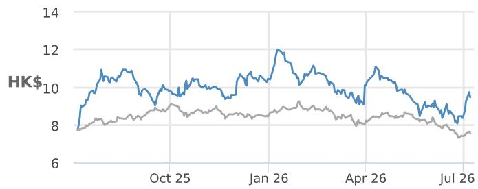
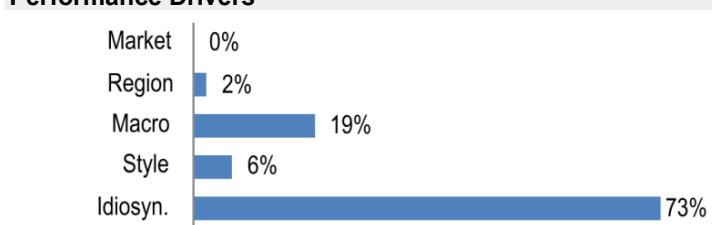
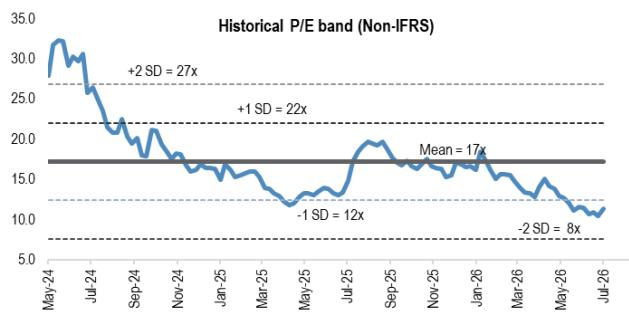
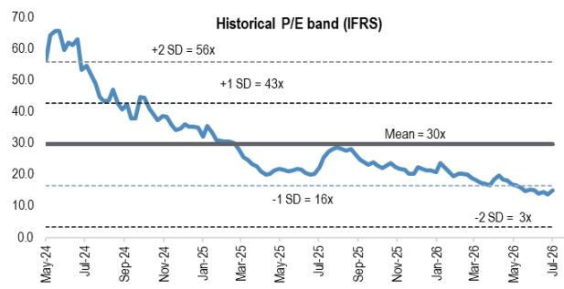

本材料无意向中国大陆读者分发，亦不构成在中国大陆境内提供证券投资咨询服务的要约。未经JPM书面同意，不得转载、出售或重新分发本材料或其任何部分。

## 极兔速递 - H

## 首次覆盖：公司报价已反映过度悲观预期，但增长与利润率拐点已现

我们首次覆盖极兔速递，给予增持评级。自2023年10月上市以来，公司报价表现相对平淡，这反映了中国国内行业价格竞争、初期亏损状态以及近期燃料价格波动等外部因素。市场也曾对公司在中国以外地区的模式可扩展性以及成熟东南亚市场的利润率可持续性提出疑问，同时认为新市场尚处于早期阶段，难以产生实质性影响。然而，公司业务现已转向盈利，实现了行业领先的业务量与利润率增长，并通过与顺丰控股的合作释放新的协同效应。尽管盈利拐点清晰可见，且拥有经过验证、可输出的商业模式，公司估值已回落至约10倍远期市盈率（非国际财务报告准则）。我们认为这种背离具有吸引力：极兔的可扩展平台、加速增长的新市场以及成本领先优势，并未在当前估值中得到充分体现，考虑到公司在2025至2028财年约50%的净利润复合年增长率（行业为15-20%），我们认为其相对行业平均水平的约20%溢价是合理的。

- 一个可扩展、平台中立的模式正在推动市场份额增长和利润率扩张，东南亚仍是核心利润引擎，但新市场正成为真正的增长杠杆。公司整合了所有主要电商和社交电商平台的业务量，支撑其在东南亚（2025财年）拥有34.4%的市场份额，并在新市场实现两位数的业务量增长。尽管读者担忧在成熟的东南亚市场回报表现可能下降，但极兔的成本领先优势以及向利润率更高的非平台业务多元化的能力，正在支撑利润率的韧性。与此同时，新市场（巴西、墨西哥、中东）已达到盈利拐点，业务量同比弹性较高，市场份额上升，表明中国/东南亚的成功模式正在全球范围内发挥作用。

- 盈利拐点正推动强劲的自由现金流，并明确承诺股东回报。极兔在自动化和网络建设方面的审慎投资，正转化为各区域强劲的经营杠杆和利润率扩张。随着资产基础趋于成熟，资本支出占收入的比例趋向于4-5%，支持自由现金流生成的阶梯式增长。管理层已启动股份回购，表明对公司业务的信心，并随着盈利能力和现金流的逐步改善，愿意向股东返还资本。

- 估值背离创造了介入机会，因为各区域盈利拐点已现，增长正在加速。极兔上市时估值较高（中期非国际财务报告准则一年远期市盈率为27倍），但由于行业逆风、宏观冲击以及市场对其模式可扩展性的质疑，估值已回落。目前约10倍的远期市盈率并未反映公司约50%的净利润复合年增长率（2025-2028财年）、平台多元化以及核心和新市场均可见的利润率改善。我们预计，随着市场根据持续的盈利表现、成本领先优势以及经过验证、可输出的商业模式对公司重新定价，股价约有37%的上行空间。

## 首次覆盖 增持

1519.HK, 1519 HK

价格（2026年7月7日）：9.47港元

目标价（2027年6月）：13.00港元

## 香港

基础设施、工业与运输

Karen Li, CFA AC
(852) 2800-8589
karen.yy.li@JPM.com
JPM证券（亚太）有限公司/ JPM经纪（香港）有限公司

Jenny Qiu, CFA
(852) 2800 8503
jenny.qiu@JPM.com
JPM证券（亚太）有限公司/ JPM经纪（香港）有限公司

Ranjan Sharma, CFA
(65) 6882-1303
ranjan.x.sharma@JPM.com
JPM证券新加坡私人有限公司

## Mufan Shi

Mufan Shi
(852) 2800-8502
mufan.shi@JPM.com
JPM证券（亚太）有限公司/ JPM经纪（香港）有限公司

## Neil Zhang

(852) 2800-8598
neil.zhang@JPM.com
JPM证券（亚太）有限公司/ JPM经纪（香港）有限公司

## Beatrice Lam

(852) 2800-8738
beatrice.lam@JPM.com
JPM证券（亚太）有限公司/ JPM经纪（香港）有限公司

风格敞口

<table><tr><td rowspan="2">量化因子</td><td rowspan="2">当前%排名</td><td colspan="4">历史%排名（1=最高）</td></tr><tr><td>6个月</td><td>1年</td><td>3年</td><td>5年</td></tr><tr><td>价值</td><td>49</td><td>66</td><td>80</td><td>87</td><td>93</td></tr><tr><td>成长</td><td>47</td><td>57</td><td>58</td><td>100</td><td></td></tr><tr><td>动量</td><td>30</td><td>27</td><td>70</td><td></td><td></td></tr><tr><td>质量</td><td>74</td><td>81</td><td>82</td><td></td><td></td></tr><tr><td>低波动</td><td>53</td><td>62</td><td>83</td><td></td><td></td></tr></table>

价格表现  

— 1519.HK 价格 (港元) 恒生指数 (基准调整)

<table><tr><td></td><td>年初至今</td><td>1个月</td><td>3个月</td><td>12个月</td></tr><tr><td>相对</td><td>-9.4%</td><td>5.0%</td><td>-8.0%</td><td>22.7%</td></tr><tr><td>相对</td><td>0.8%</td><td>10.7%</td><td>-0.7%</td><td>24.5%</td></tr></table>

公司数据

<table><tr><td>流通股数（百万）</td><td>8,740</td></tr><tr><td>52周价格区间（港元）</td><td>12.20-7.54</td></tr><tr><td>市值（百万美元）</td><td>10,553</td></tr><tr><td>汇率</td><td>7.84</td></tr><tr><td>自由流通比例（%）</td><td>77.2%</td></tr><tr><td>3个月日均成交量（百万股）</td><td>35.27</td></tr><tr><td>3个月日均成交额（百万美元）</td><td>41.3</td></tr><tr><td>波动率（90天）</td><td>45</td></tr><tr><td>指数</td><td>恒生指数</td></tr><tr><td>彭博分析师评级（买入 | 持有 | 卖出）</td><td>31|1|0</td></tr></table>

关键指标（财年截至12月）

<table><tr><td>百万美元</td><td>2025财年实际</td><td>2026财年预测</td><td>2027财年预测</td><td>2028财年预测</td></tr><tr><td colspan="5">财务估算</td></tr><tr><td>收入</td><td>12,158</td><td>15,339</td><td>17,709</td><td>20,853</td></tr><tr><td>调整后EBITDA</td><td>1,016</td><td>1,433</td><td>1,800</td><td>2,187</td></tr><tr><td>调整后EBIT</td><td>473</td><td>802</td><td>1,093</td><td>1,414</td></tr><tr><td>调整后净利润</td><td>425</td><td>723</td><td>1,086</td><td>1,501</td></tr><tr><td>调整后每股收益</td><td>0.05</td><td>0.08</td><td>0.12</td><td>0.17</td></tr><tr><td>彭博每股收益</td><td>0.04</td><td>0.07</td><td>0.09</td><td>0.12</td></tr><tr><td>经营活动现金流</td><td>1,081</td><td>1,199</td><td>1,652</td><td>2,120</td></tr><tr><td>公司自由现金流</td><td>491</td><td>401</td><td>802</td><td>1,286</td></tr><tr><td colspan="5">利润率与增长</td></tr><tr><td>收入同比增长（%）</td><td>18.5%</td><td>26.2%</td><td>15.4%</td><td>17.8%</td></tr><tr><td>EBITDA利润率</td><td>8.4%</td><td>9.3%</td><td>10.2%</td><td>10.5%</td></tr><tr><td>EBITDA同比增长（%）</td><td>49.3%</td><td>41.1%</td><td>25.5%</td><td>21.5%</td></tr><tr><td>EBIT利润率</td><td>3.9%</td><td>5.2%</td><td>6.2%</td><td>6.8%</td></tr><tr><td>净利润率</td><td>3.5%</td><td>4.7%</td><td>6.1%</td><td>7.2%</td></tr><tr><td>调整后每股收益增长</td><td>111.6%</td><td>69.9%</td><td>50.3%</td><td>38.2%</td></tr><tr><td colspan="5">比率</td></tr><tr><td>调整后税率</td><td>14.5%</td><td>14.5%</td><td>14.5%</td><td>14.5%</td></tr><tr><td>利息覆盖倍数</td><td>9.9</td><td>不适用</td><td>不适用</td><td>不适用</td></tr><tr><td>净债务/权益</td><td>0.3</td><td>0.2</td><td>0.0</td><td>不适用</td></tr><tr><td>净债务/EBITDA</td><td>0.9</td><td>0.5</td><td>0.1</td><td>不适用</td></tr><tr><td>已动用资本回报率</td><td>7.4%</td><td>9.4%</td><td>10.4%</td><td>12.0%</td></tr><tr><td>净资产回报表现</td><td>14.2%</td><td>18.2%</td><td>20.9%</td><td>24.3%</td></tr><tr><td colspan="5">估值</td></tr><tr><td>公司自由现金流回报表现</td><td>4.7%</td><td>3.8%</td><td>7.6%</td><td>12.2%</td></tr><tr><td>股息回报表现</td><td>0.0%</td><td>0.0%</td><td>0.0%</td><td>0.0%</td></tr><tr><td>企业价值/收入</td><td>0.9</td><td>0.7</td><td>0.6</td><td>0.5</td></tr><tr><td>企业价值/EBITDA</td><td>10.7</td><td>7.5</td><td>5.8</td><td>4.3</td></tr><tr><td>调整后市盈率</td><td>24.8</td><td>14.6</td><td>9.7</td><td>7.0</td></tr></table>

## 投资论点摘要与估值

极兔速递是一家领先的平台中立、技术驱动的第三方物流运营商——在东南亚市场占据领先地位，在中国市场是成长型参与者，并在高增长的新市场（巴西、墨西哥、中东）中成为新兴挑战者。公司的区域合伙人模式将本地化创业执行力与集中化技术相结合，实现了快速、轻资产的扩张，同时将中国制造的自动化和数字化管理系统输出到各个区域，支撑起结构性的成本优势。自2023年10月上市以来，公司报价表现相对平淡，这反映了中国国内行业价格竞争、初期亏损状态以及近期燃料价格波动等外部因素。市场也曾对公司在中国以外地区的模式可扩展性以及成熟东南亚市场的利润率可持续性提出疑问，同时认为新市场尚处于早期阶段，难以产生实质性影响。然而，公司业务现已转向盈利，实现了行业领先的业务量与利润率增长，并通过与顺丰控股的合作释放新的协同效应。给予极兔增持评级。

我们基于2027年6月市盈率的目标价13.0港元，是基于极兔2027财年非国际财务报告准则每股收益0.12美元、13倍目标市盈率（行业平均为11倍，数据来源：彭博，截至2026年7月7日）以及美元兑港元汇率7.8计算得出。

表现驱动因素  

<table><tr><td>因素</td><td>6个月相关性</td><td>1年相关性</td></tr><tr><td>市场：MSCI亚太（除日本）指数</td><td>0.21</td><td>0.07</td></tr><tr><td>区域：香港</td><td>0.18</td><td>0.14</td></tr><tr><td>宏观：</td><td></td><td></td></tr><tr><td>JPM全球市场情绪指数</td><td>0.36</td><td>0.33</td></tr><tr><td>Markit新兴市场综合PMI（季调后）</td><td>-0.40</td><td>-0.26</td></tr><tr><td>新兴经济体CPI（同比）</td><td>0.38</td><td>0.22</td></tr><tr><td>量化风格：</td><td></td><td></td></tr><tr><td>规模</td><td>-0.29</td><td>-0.28</td></tr><tr><td>质量</td><td>0.06</td><td>-0.20</td></tr><tr><td>动量</td><td>0.04</td><td>-0.13</td></tr></table>

## 港股通计划公告

根据港股通计划的规定，我们开始以中文向中国大陆转发关于极兔速递 - H的研究报告。本材料的读者应注意，鉴于本研究材料的中文译本由JPM证券（中国）有限公司延迟转发，JPM经纪（香港）有限公司可能不时以英文发布了更新的研究报告，等待该研究报告的中文译本根据适用法规要求最终定稿。

## 投资概要

我们首次覆盖极兔速递（1519 HK），给予增持评级，并基于市盈率法给出2027年6月目标价13港元，隐含约37%的上行空间。我们的目标价对应2027财年预测非国际财务报告准则市盈率13倍，较行业平均水平约11倍有约20%的溢价，这由极兔在2025至2028财年约50%的非国际财务报告准则净利润复合年增长率（行业：15-20%）所支撑。考虑到极兔在东南亚的领先规模、新市场的加速增长、经过验证的中国成本优势以及与顺丰控股合作带来的切实利益，当前约10倍的市盈率具有吸引力。我们预测2025至2028财年收入复合年增长率约为20%，净利润复合年增长率约为50%，净资产回报表现从2025年的14%上升至2028财年预测的24%。

自2023年10月在香港上市以来，极兔的报价表现显著落后，这反映了中国国内行业性价格竞争和初期亏损状态的叠加影响。虽然该报价在2025年因公司转向盈利并超越行业增长而有所回升，但近期由于宏观环境担忧（包括中东冲突、东南亚燃料短缺以及读者对区域消费影响的忧虑）再度出现调整，目前交易在约10倍远期市盈率。我们认为，这种背离为一家拥有根本性可扩展和可复制模式的企业创造了有吸引力的介入点。

极兔平台中立、技术驱动的方法在长期扩张中具有结构性优势。公司的区域合伙人模式将本地化创业执行力与集中化技术和流程标准相结合，实现了快速、轻资产的扩张和一贯的成本纪律。这一模式不仅在中国高度竞争的环境中得到验证，也已成功输出到东南亚和新市场，极兔在这些地区持续获得份额并降低单件成本。公司能够整合所有主要电商和社交电商平台的业务量——而非依赖于单一生态系统——确保极兔能够充分受益于电商渗透率提升、社交电商普及和全渠道零售的增长。业务并未遇到瓶颈：事实上，极兔的网络密度、自动化和数字化管理系统正在创造一个自我强化的飞轮效应，涵盖规模、成本领先和服务质量，这是资本较少或灵活性较差的竞争对手难以复制的。

近期与顺丰控股深化战略合作伙伴关系，有望释放显著的协同效应并加速极兔的全球布局。这并非简单的资本合作：该合作旨在实现运营整合，包括对关键物流基础设施（如自动化分拣中心和干线运输车辆）的联合投资。极兔将能够利用顺丰已建立的首公里、跨境和仓储能力，进一步优化其自身的最后一公里和本地化快递网络，尤其是在东南亚和其他高增长区域。该合作还带来了治理层面的协同，包括董事会代表和战略协调委员会，确保两家公司能够迅速适应国际物流领域的新机遇和挑战。在中国，该合作使极兔能够进入更高价值的服务层级和细分市场，而非在低利润、高业务量的领域进行正面竞争，并使公司能够受益于行业向高质量和可持续发展的转变。

极兔的商业模式旨在实现灵活性和韧性，而不仅仅是规模。区域合伙人结构使本地团队能够适应监管、文化和市场变化，而对自动化、自有车队和数字平台的持续投入则确保网络保持高效和响应迅速。这种适应性使极兔能够在2023年至2025年期间将新市场的业务量弹性较高，保持东南亚的领先地位，并在竞争格局和监管环境不断演变的情况下稳步提升在中国的盈利能力。公司跨区域复制自动化、数字化管理和加盟模式的能力，已带来行业领先的成本降低和利润率改善，支撑了多年的盈利拐点。

我们认为，当前报价并未反映极兔卓越的增长轨迹、利润率扩张以及在多个区域实现盈利性扩张的独特能力。近期的估值调整是周期性的，而非结构性的，并创造了一个以折扣价买入高增长、高净资产回报表现的物流领导者的机会。凭借经过验证、可输出的商业模式、与顺丰的强大新合作以及进一步获取市场份额的清晰路径，极兔已做好准备，在市场根据其基本面重新定价时，提供有吸引力的回报。

## 估值与报价回顾

## 估值与考量

我们采用市盈率法对极兔速递进行估值，得出2027年6月目标价13港元，较当前水平约有37%的上行空间。在我们13港元的目标价下，极兔对应2027财年预测非国际财务报告准则市盈率13倍、2027财年预测企业价值/EBITDA 8.9倍、2027财年预测市销率0.8倍，考虑到公司潜在的增长状况，这一估值并不高。0.4倍的2027财年预测市盈率相对增长率（PEG）相较于成熟的中国物流同行平均约0.8倍的水平具有优势，而极兔2025至2028财年约20%的收入复合年增长率和约50%的国际财务报告准则净利润复合年增长率则凸显了其卓越的增长定位。我们认为，当前估值为寻求投资高增长物流平台的读者提供了有吸引力的风险回报比。

自2023年10月上市以来，极兔的报价经历了剧烈波动——最初交易在中期非国际财务报告准则市盈率27倍，随后在2024年因行业价格战和亏损状态下跌61%，之后在2025年因盈利能力和业务量增长超越行业而反弹70%。近期受中东冲突和燃料担忧影响，年初至今下跌约7%，将报价推至约10倍2027财年预测市盈率，较其历史水平和同行均有大幅折让，尽管盈利前景更为强劲。

图1：极兔历史市盈率估值区间（非国际财务报告准则）  
  
来源：JPM预测，彭博金融信息。数据截至2026年7月7日。

图2：极兔历史市盈率估值区间（国际财务报告准则）  
  
来源：JPM预测，彭博金融信息。数据截至2026年7月7日。

表1：全球物流可比公司表

<table><tr><td rowspan="2"></td><td rowspan="2">彭博代码</td><td rowspan="2">JPM评级</td><td rowspan="2">最新价 本地货币</td><td rowspan="2">JPM目标价 本地货币</td><td rowspan="2">上行/下行</td><td rowspan="2">市值 百万美元</td><td rowspan="2">年初至今 报价表现</td><td colspan="2">市盈率（倍）</td><td colspan="2">每股收益增长</td><td>市盈率相对增长率</td><td colspan="2">企业价值/EBITDA</td><td colspan="2">净资产回报表现（%）</td><td colspan="2">市净率（倍）</td><td colspan="2">股息回报表现（%）</td></tr><tr><td>2026财年预测</td><td>2027财年预测</td><td>2026财年预测</td><td>2027财年预测</td><td>2027财年预测</td><td>2026财年预测</td><td>2027财年预测</td><td>2026财年预测</td><td>2027财年预测</td><td>2026财年预测</td><td>2027财年预测</td><td>2026财年预测</td><td>2027财年预测</td></tr><tr><td>顺丰控股 - A</td><td>002352 CH</td><td>增持</td><td>32.79</td><td>42.00</td><td>28%</td><td>25,001</td><td>-14%</td><td>13.9</td><td>12.6</td><td>22%</td><td>10%</td><td>1.2</td><td>6.1</td><td>5.7</td><td>11.5</td><td>11.4</td><td>1.5</td><td>1.4</td><td>3.0</td><td>3.2</td></tr><tr><td>顺丰控股 - H</td><td>6936 HK</td><td>增持</td><td>31.16</td><td>40.00</td><td>28%</td><td>25,001</td><td>-10%</td><td>11.2</td><td>10.2</td><td>10%</td><td>10%</td><td>1.0</td><td>4.9</td><td>4.4</td><td>11.5</td><td>11.4</td><td>1.2</td><td>1.1</td><td>3.6</td><td>3.9</td></tr><tr><td>中通快递 - 美国</td><td>ZTO US</td><td>增持</td><td>23.03</td><td>29.00</td><td>26%</td><td>17,731</td><td>10%</td><td>11.7</td><td>10.4</td><td>12%</td><td>13%</td><td>0.8</td><td>6.7</td><td>6.2</td><td>15.0</td><td>15.4</td><td>1.7</td><td>1.6</td><td>3.3</td><td>3.8</td></tr><tr><td>中通快递 - H</td><td>2057 HK</td><td>增持</td><td>181.50</td><td>225.00</td><td>24%</td><td>17,817</td><td>12%</td><td>11.8</td><td>10.4</td><td>19%</td><td>13%</td><td>0.8</td><td>6.7</td><td>6.2</td><td>15.0</td><td>15.4</td><td>1.7</td><td>1.6</td><td>3.3</td><td>3.7</td></tr><tr><td>京东物流</td><td>2618 HK</td><td>增持</td><td>12.26</td><td>20.00</td><td>63%</td><td>10,437</td><td>7%</td><td>9.6</td><td>8.4</td><td>22%</td><td>15%</td><td>0.6</td><td>3.2</td><td>3.0</td><td>16.3</td><td>16.7</td><td>1.1</td><td>0.9</td><td>0.0</td><td>0.0</td></tr><tr><td>圆通速递</td><td>600233 CH</td><td>未覆盖</td><td>17.12</td><td>不适用</td><td>不适用</td><td>8,624</td><td>4%</td><td>9.8</td><td>8.6</td><td>42%</td><td>13%</td><td>0.7</td><td>5.6</td><td>4.9</td><td>15.6</td><td>15.7</td><td>1.5</td><td>1.3</td><td>2.5</td><td>2.9</td></tr><tr><td>韵达股份</td><td>002120 CH</td><td>未覆盖</td><td>6.88</td><td>不适用</td><td>不适用</td><td>2,935</td><td>2%</td><td>10.0</td><td>9.0</td><td>43%</td><td>12%</td><td>0.7</td><td>4.0</td><td>3.7</td><td>8.8</td><td>9.3</td><td>0.9</td><td>0.8</td><td>4.0</td><td>4.6</td></tr><tr><td>申通快递</td><td>002468 CH</td><td>未覆盖</td><td>16.82</td><td>不适用</td><td>不适用</td><td>3,789</td><td>25%</td><td>12.5</td><td>10.8</td><td>55%</td><td>15%</td><td>0.7</td><td>6.5</td><td>5.8</td><td>16.9</td><td>16.5</td><td>2.0</td><td>1.7</td><td>1.0</td><td>1.3</td></tr><tr><td>中国外运</td><td>601598 CH</td><td>未覆盖</td><td>5.38</td><td>不适用</td><td>不适用</td><td>5,122</td><td>-1%</td><td>11.5</td><td>10.8</td><td>-7%</td><td>6%</td><td>1.7</td><td>7.4</td><td>6.9</td><td>7.9</td><td>9.0</td><td>0.9</td><td>0.9</td><td>5.1</td><td>5.4</td></tr><tr><td>华贸物流</td><td>603128 CH</td><td>未覆盖</td><td>5.24</td><td>不适用</td><td>不适用</td><td>1,009</td><td>-14%</td><td>15.3</td><td>13.2</td><td>5%</td><td>16%</td><td>0.8</td><td>11.2</td><td>10.1</td><td>7.2</td><td>8.4</td><td>1.1</td><td>1.1</td><td>3.9</td><td>4.4</td></tr><tr><td>极兔</td><td>1519 HK</td><td>增持</td><td>9.47</td><td>13</td><td>37%</td><td>11,668</td><td>-9%</td><td>16.5</td><td>11.2</td><td>106%</td><td>48%</td><td>0.2</td><td>7.7</td><td>6.1</td><td>16.3</td><td>18.5</td><td>2.2</td><td>1.9</td><td>0.0</td><td>0.0</td></tr><tr><td>满帮</td><td>YMM US</td><td>增持</td><td>8.67</td><td>10</td><td>15%</td><td>8,996</td><td>-9%</td><td>11.7</td><td>10.1</td><td>20%</td><td>16%</td><td>0.6</td><td>8.3</td><td>7.3</td><td>11.8</td><td>12.2</td><td>1.3</td><td>1.2</td><td>2.5</td><td>2.9</td></tr><tr><td>平均</td><td></td><td></td><td></td><td></td><td></td><td></td><td>-1%</td><td>12.1</td><td>10.5</td><td>29%</td><td>16%</td><td>0.8</td><td>6.5</td><td>5.9</td><td>12.8</td><td>13.3</td><td>1.4</td><td>1.3</td><td>2.7</td><td>3.0</td></tr><tr><td>联邦快递</td><td>FDX US</td><td>增持</td><td>309.93</td><td>370.42</td><td>20%</td><td>73,951</td><td>33%</td><td>15.6</td><td>14.9</td><td>10%</td><td>5%</td><td>2.9</td><td>9.5</td><td>9.4</td><td>15.6</td><td>15.2</td><td>2.4</td><td>2.2</td><td>1.9</td><td>1.9</td></tr><tr><td>联合包裹</td><td>UPS US</td><td>中性</td><td>110.02</td><td>118.00</td><td>7%</td><td>93,518</td><td>11%</td><td>15.5</td><td>13.8</td><td>3%</td><td>12%</td><td>1.1</td><td>9.4</td><td>8.8</td><td>36.8</td><td>41.3</td><td>5.7</td><td>5.4</td><td>6.0</td><td>5.9</td></tr><tr><td>德国邮政敦豪</td><td>DHL GR</td><td>增持</td><td>56.34</td><td>60.00</td><td>6%</td><td>74,069</td><td>21%</td><td>16.8</td><td>15.2</td><td>9%</td><td>10%</td><td>1.5</td><td>7.6</td><td>7.2</td><td>16.5</td><td>17.5</td><td>2.7</td><td>2.6</td><td>3.5</td><td>3.6</td></tr><tr><td>德迅集团</td><td>KNIN SW</td><td>减持</td><td>206.30</td><td>175.00</td><td>15%</td><td>30,896</td><td>20%</td><td>22.9</td><td>26.5</td><td>20%</td><td>-14%</td><td>-1.9</td><td>11.3</td><td>11.9</td><td>47.3</td><td>38.2</td><td>10.4</td><td>9.8</td><td>3.5</td><td>3.0</td></tr><tr><td> Expeditors International</td><td>EXPD US</td><td>减持</td><td>165.70</td><td>139.00</td><td>16%</td><td>21,672</td><td>11%</td><td>23.8</td><td>23.2</td><td>17%</td><td>3%</td><td>8.
