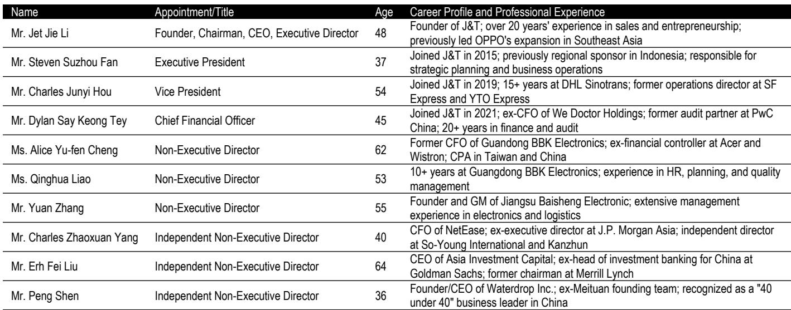
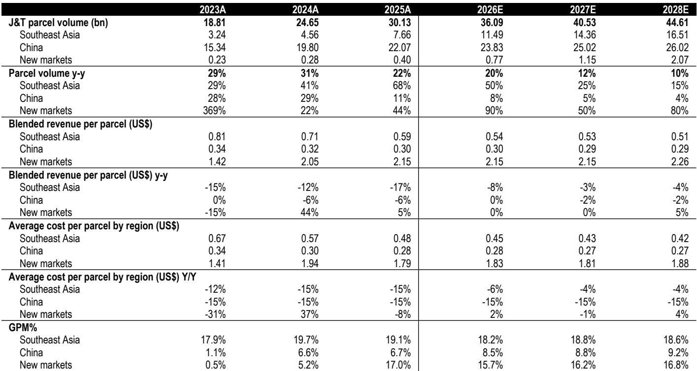
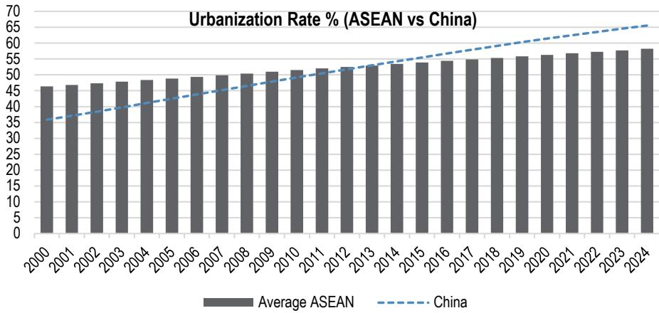

# J&T Express: The Market Has Missed the Inflection, and the Re-Rating Is Just Beginning

The market is pricing J&T Express as if its best days are behind it. The company's valuation reflects deep skepticism about the sustainability of its Southeast Asian margins, the scalability of its New Markets expansion, and its ability to navigate China's competitive landscape. This pessimism is understandable given the company's post-IPO trajectory: a steep decline from an initial valuation, followed by a sharp recovery in 2025, and then another leg down on macro concerns tied to the Middle East conflict and fuel price volatility. But the narrative that drove this de-rating is increasingly disconnected from the operating reality.

J&T has crossed a threshold that few observers have fully absorbed. The business has pivoted from a loss-making growth story to a profitable, cash-generating platform with industry-leading volume gains and margin expansion across every region it operates in. Southeast Asia remains the profit engine, but it is no longer the only story. New Markets—Brazil, Mexico, and the Middle East—have reached a profitability inflection, with volumes doubling year-over-year and market share rising. In China, the partnership with SF Holdings is unlocking operational synergies that go far beyond a simple capital tie-up. The company is now generating robust free cash flow, initiating share buybacks, and delivering a net profit growth rate that is roughly three times the sector average.

The central question for observers is not whether J&T can grow—it is growing. The question is whether the market will re-rate the company to reflect a business that is structurally advantaged, increasingly profitable, and still early in its global expansion. The answer, based on the evidence, is that the re-rating is overdue. At current valuation levels, the company is pricing in a margin compression and growth deceleration that the data does not support. This is the moment to look past the macro noise and focus on the operational inflection that is already underway.

## The Platform Model Is Not a Liability—It Is the Core Advantage

Observers have long worried that J&T's dependence on e-commerce platforms for volume makes it vulnerable to yield compression and platform disintermediation. This concern is understandable but misses the structural logic of the business. J&T is not a captive logistics provider for a single ecosystem. It is a platform operator that aggregates volumes across all major e-commerce and social commerce players. In Southeast Asia, this has allowed it to capture 34.4% market share without being tied to the fortunes of any one platform. In New Markets, the same approach is driving double-digit volume growth.

The strategic significance of platform neutrality is often underappreciated. In a world where e-commerce platforms are increasingly competing with each other—and increasingly building their own logistics capabilities—an aggregator has a distinct advantage. It can serve all platforms without conflict, achieve higher network density than any single-platform operator, and spread its fixed costs across a broader volume base. This density, in turn, drives down per-parcel costs, creating a self-reinforcing cycle: lower costs enable competitive pricing, which attracts more volume from more platforms, which further reduces costs.

This is not a theoretical advantage. J&T's cost leadership in Southeast Asia is well-documented, and the company is now exporting that cost discipline to New Markets. The regional sponsor model—which combines centralized technology and process standards with entrepreneurial local execution—allows the company to replicate its cost advantages across geographies without sacrificing adaptability. The result is that J&T is not just gaining share in New Markets; it is doing so profitably, and the margin trajectory is improving as volumes scale.

The real risk is not that J&T is too dependent on platforms. It is that its competitors are too dependent on single platforms, and that J&T's model will become even more valuable as the e-commerce landscape becomes more fragmented and multi-platform. The market has not fully priced this structural advantage, and the current valuation offers an interesting entry point for those who understand the economics of network density.

## Profitability Is Inflecting, and Free Cash Flow Is Becoming a Differentiator

The most important shift in the J&T story is the transition from growth-at-all-costs to profitable growth. The company's adjusted net income has gone from negligible to meaningful, and the trajectory is accelerating. The reported estimates show adjusted net income growing from $425 million in FY25 to $1.5 billion by FY28, a compound annual growth rate of approximately 50%. This is not a one-time adjustment or a temporary lift from cost-cutting. It is the result of sustained operating leverage as the network matures and automation investments begin to pay off.

The free cash flow story is equally compelling. J&T is moving from a phase of heavy capital expenditure—building out sorting centers, automation, and line-haul networks—to a phase where capex is trending toward 4-5% of revenue. This shift is structural, not cyclical. As the asset base matures, the company needs less incremental capital to support volume growth, and the cash flow generated by operations flows increasingly to the bottom line. Free cash flow is projected to rise from $491 million in FY25 to $1.3 billion by FY28, representing a free cash flow yield that becomes increasingly attractive as the de-rating deepens.

Management has signaled confidence in this trajectory by initiating share buybacks. This is a meaningful signal, particularly for a company that was, until recently, in a loss-making position. Buybacks are not a gimmick here; they are a rational allocation of capital for a business that is generating excess cash and trading at a discount to intrinsic value. The commitment to shareholder returns is likely to deepen as free cash flow grows, and the absence of a dividend today should not be read as a lack of intent—it is a function of the company being in the early stages of its cash flow inflection.

The profitability inflection also changes the risk profile of the company. When J&T was loss-making, any macro shock or competitive pressure raised existential questions. Now, with a growing earnings base, a strong balance sheet, and positive free cash flow, the company has a cushion that it did not have before. The market is still pricing the company as if it is the same loss-making growth story it was in 2023. It is not.

## The SF Holdings Partnership Is a Catalyst That the Market Has Not Fully Modeled

The strategic partnership with SF Holdings is the most underappreciated element of the J&T story. On the surface, it looks like a capital alliance between two logistics companies. In reality, it is an operational integration that unlocks synergies across network, technology, and market access.

SF Holdings brings first-mile, cross-border, and warehousing capabilities that complement J&T's last-mile and localized express delivery network. In China, where J&T has been competing in the low-margin, high-volume segment, the partnership allows it to access higher-value service tiers. This is not about taking market share from SF; it is about J&T moving up the value chain without having to build the capabilities from scratch. The joint investment in automated sorting centers and line-haul vehicles will accelerate the cost reduction trajectory in both China and Southeast Asia.

Internationally, the partnership is even more significant. SF Holdings has established cross-border logistics capabilities that J&T can leverage to expand its global reach without duplicating investment. For a company that is already gaining share in New Markets, access to SF's infrastructure and expertise is a force multiplier. The governance structure—board representation and a strategic coordination committee—ensures that both companies are aligned on priorities and can move quickly on new opportunities.

The market has not fully modeled the revenue and margin impact of this partnership. It is easy to dismiss as a vague "synergy" story, but the operational details are concrete. J&T is not just getting capital; it is getting access to a network that would take years and billions of dollars to replicate. The partnership is a strategic asset, and its value will become more apparent as the integration deepens over the next 12 to 24 months.

## What the Report Does Not Fully Answer: The Sustainability of New Markets Margins and the China Competitive Landscape

For all the positive evidence, there are two areas where the analysis leaves meaningful open questions. The first is the sustainability of margins in New Markets. The report shows that New Markets have reached a profitability inflection, with volumes doubling year-over-year. But the margin trajectory in these markets is still early, and the competitive dynamics are different from Southeast Asia. In Brazil, for example, the logistics market is dominated by a few large players with deep local knowledge. In the Middle East, the regulatory environment is fragmented. J&T's playbook has worked in China and Southeast Asia, but the New Markets are not carbon copies of those regions. The question is whether the company's cost advantages will persist as volumes scale and competitors respond.

The second open question is the intensity of the China competitive environment. The report acknowledges that sector price competition in China contributed to the post-IPO de-rating, and that J&T has been steadily improving profitability in China despite this headwind. But the China express delivery market is notoriously competitive, and the regulatory environment is shifting. The partnership with SF Holdings provides some insulation, but it does not eliminate the risk that renewed price competition could compress margins in China, which remains a significant part of the volume story.

These are not reasons to avoid the company. They are reasons to monitor the execution closely. J&T has demonstrated the ability to navigate competitive pressure and regulatory change across multiple markets. But the margin trajectory in New Markets and the China pricing environment are the two variables that could cause the earnings estimates to miss to the downside. Observers should watch quarterly volume and margin data in these segments as the key leading indicators.

## A Decision Framework: Three Questions to Determine Your Conviction

For those considering J&T at current levels, the decision comes down to three questions.

First, do you believe that the platform model is structurally advantaged, or do you see it as a source of vulnerability? If you believe that e-commerce platforms will increasingly internalize logistics, then J&T's model is at risk. But if you believe that the multi-platform trend will continue and that aggregators will benefit from network density, then J&T is well-positioned. The evidence supports the latter view, but the conviction must come from a judgment about the direction of the industry.

Second, do you believe that the profitability inflection is sustainable, or is it a one-time benefit from cost-cutting and volume recovery? The answer depends on whether you see the capex reduction as structural or cyclical. If automation and network maturity are driving a permanent reduction in capital intensity, then the free cash flow trajectory is real. If the capex reduction is simply a function of the current investment cycle winding down, then the inflection could be temporary. The report's estimates suggest a structural shift, but this is a point that observers should verify with their own analysis of the asset base.

Third, how much weight do you place on the SF Holdings partnership? If it is a minor operational collaboration, the upside is limited. If it is a transformative strategic alliance, the earnings trajectory could exceed current estimates. The early evidence points to the latter, but the integration is still in its early stages, and the full impact will not be visible for another 12 to 18 months.

These three questions frame the case. The current valuation offers a margin of safety if the answers are positive, and the downside is limited if the answers are negative, because the company is already pricing in significant pessimism. For those who see the inflection, the risk-reward is compelling.

## The Re-Rating Has Not Started, but the Fundamentals Are Aligned

J&T Express is a case study in what happens when a company outgrows its market narrative. The company is trading at a valuation that reflects a business generating strong net profit growth, expanding margins, and building a global logistics platform. The market is still anchored to the post-IPO de-rating story, but the operating reality has changed.

The re-rating will not happen overnight. It will require sustained earnings delivery, visible margin expansion, and growing free cash flow. But the fundamentals are aligned, and the catalyst is already in place. The SF Holdings partnership, the New Markets inflection, and the buyback program are all signals that the company is executing on its strategy.

For those who are willing to look past the macro noise and focus on the operational trajectory, the current level offers an interesting entry point. The company does not need to return to its IPO multiple to generate significant returns. A modest re-rating to a level that is still below the sector average on a growth-adjusted basis implies meaningful upside.

The market has missed the inflection. The question is whether you will, too.

---

*For informational purposes only. Portions may be generated, translated, summarized, or edited with AI assistance based on source materials and may contain omissions or errors. Please verify independently. This is not professional advice.*
