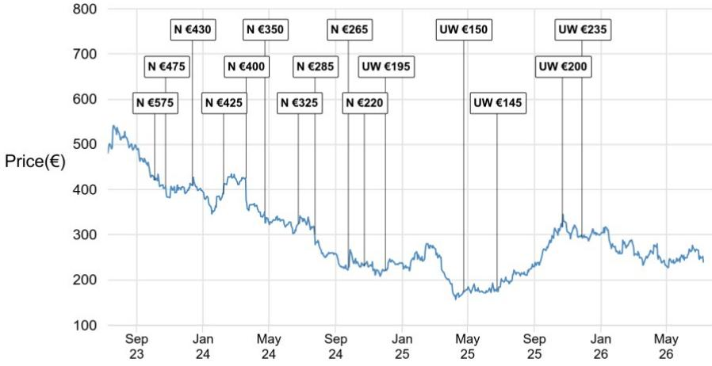
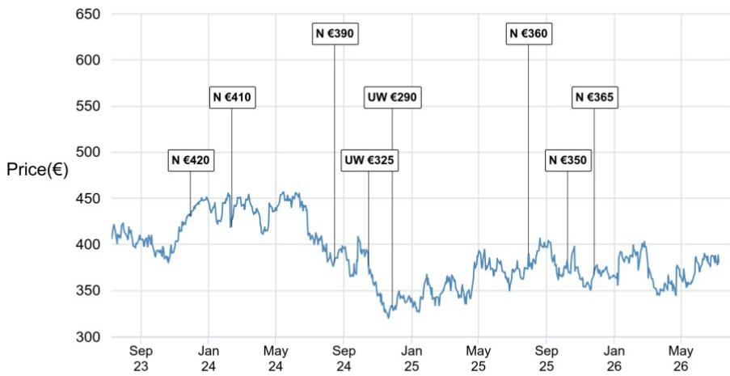
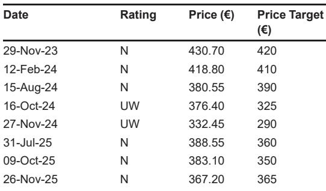

# L'Oreal's Gucci Accelerations: The Real Test Is Not Speed, But Execution of a Multi-Brand Luxury Beauty Engine

The strategic landscape of luxury beauty shifted decisively when L'Oreal announced it would take control of the Gucci fragrance and beauty license a full year ahead of schedule. On the surface, this appears to be a simple operational acceleration—a welcome development that brings forward the benefits of a landmark agreement. But the real story is more complex. The early activation of the Gucci license, effective July 1, 2027, is not merely a timeline adjustment. It is a high-stakes signal about the competitive dynamics within the global beauty industry, the relationship between luxury conglomerates and their licensed partners, and the scale of ambition at the world's largest beauty company. The question that matters now is not whether L'Oreal can absorb Gucci's beauty operations quickly, but whether it can successfully integrate Gucci alongside Bottega Veneta, Balenciaga, and the recently acquired Creed into a coherent, growth-generating luxury portfolio. The answer will determine whether this deal becomes a defining strategic coup or a cautionary tale about the limits of scale.

The environment for this acceleration is not uniformly favorable. The global beauty market is facing normalization in Europe and persistent uncertainty in North Asia, particularly in China's travel retail channel. L'Oreal's own mid-term growth outlook, pegged at 4 to 5 percent, is modest by historical standards and sits at odds with the premium valuation the company has traditionally commanded. Against this backdrop, the Gucci acceleration is a calculated bet that the structural advantages of owning a portfolio of high-end licenses will outweigh the near-term integration costs and the macro headwinds. The deal is expected to be accretive by 1 to 2 percent by 2028, but management has acknowledged it will be slightly dilutive in 2026 and 2027. Observers must therefore look beyond the headline of "faster" and ask what this acceleration means for the competitive moat, the margin profile, and the long-term strategic positioning of L'Oreal.

## The Early Termination of the Coty Agreement Creates a Window of Operational Complexity That L'Oreal Must Navigate Carefully

The most immediate consequence of bringing the Gucci license forward is the termination of Kering's existing agreement with Coty approximately one year early. This is not a simple handover. L'Oreal will pay transition costs amounting to roughly 70 percent of the early redemption costs, estimated at $400 million, with $250 million due in 2026 and up to $150 million in 2027. These costs, along with inventory considerations, are the price of speed. They represent a deliberate trade-off: paying a premium to accelerate the strategic timeline rather than waiting for the natural expiration of the Coty license in 2028.

The operational burden here is substantial. Transitioning a global fragrance and beauty business involves transferring supply chains, regulatory filings, distributor relationships, and marketing strategies across dozens of markets. Doing so a year earlier compresses the timeline for what is already a complex integration. L'Oreal must ensure continuity of supply for Gucci's existing product lines while simultaneously laying the groundwork for its own product development and go-to-market strategy. The risk of disruption, whether in inventory management, retailer relationships, or consumer perception, is non-trivial. The reward, however, is that L'Oreal gains earlier control over the strategic direction of one of the world's most valuable luxury fragrance franchises. For a company that prides itself on its operational excellence and its ability to scale brands globally, this is a challenge that plays to its strengths, but it is not without peril.

## The Portfolio Logic Extends Beyond Gucci: L'Oreal Is Building a Multi-Brand Luxury Beauty Platform That Mirrors the Structure of the Parent Luxury Groups

The Gucci license, while the most prominent piece of the transaction, is only one component of a larger strategic architecture. The October 2025 agreement between Kering and L'Oreal was not a single-brand deal. It included the outright sale of Kering Beaute, which houses the House of Creed, and the establishment of 50-year exclusive licenses for Bottega Veneta and Balenciaga. This is a portfolio play. L'Oreal is effectively acquiring the right to manage the beauty destinies of three of Kering's most iconic houses, alongside a heritage fragrance brand in Creed that has a loyal following and a strong position in the niche luxury segment.

The strategic logic here is clear. L'Oreal is assembling a luxury beauty portfolio that competes directly with the in-house beauty operations of conglomerates like LVMH, which owns Parfums Christian Dior, Guerlain, and Acqua di Parma, and with the licensed operations of other major players like Coty and Estee Lauder. By controlling multiple high-end licenses under a single roof, L'Oreal can leverage its R&D capabilities, its distribution network, and its marketing expertise across a broader base. It can also negotiate more effectively with retailers and invest in digital and omnichannel capabilities that benefit the entire portfolio. The question that remains open, however, is whether L'Oreal can maintain the distinct brand identities of Gucci, Bottega Veneta, and Balenciaga while operating them under a unified management structure. The history of luxury beauty is littered with examples where the pursuit of scale diluted brand equity. L'Oreal's ability to avoid this trap will be the defining test of its luxury strategy.

## The Financial Calculus Is Attractive in the Medium Term, but the Dilution in the Near Term Raises Questions About the Timing of Value Creation

The reported expectation that the transaction will be 1 to 2 percent accretive by 2028 is an important anchor for observers. It suggests that the deal, despite its upfront costs, will ultimately generate returns that exceed L'Oreal's cost of capital. The accretion is driven by the combination of royalty income from the licensed brands and the profit contribution from the direct ownership of Creed. However, the acknowledgment that the deal will be slightly dilutive in 2026 and 2027 is equally significant. It means that for the next two years, the benefits of the Gucci acceleration and the broader Kering transaction will be obscured by integration costs, transition expenses, and the ramp-up of operations.

This creates a tension for observers. The near-term dilution will weigh on earnings per share and may test the patience of a market that is already skeptical about L'Oreal's premium valuation. A discounted cash flow analysis, using a weighted average cost of capital of 8.5 percent and a long-term growth rate of 3.5 percent, implies that the market is already pricing in a return to mid-single-digit growth. Any deviation from this path, whether due to integration hiccups or macro headwinds, could lead to multiple compression. The early Gucci acceleration adds a layer of execution risk that was not present in the original timeline. Observers must decide whether the faster timeline increases the net present value of the deal or merely front-loads the risk.

## The Report Does Not Fully Address How L'Oreal Will Manage the Potential Conflict Between Licensed Brands and Its Own Prestige Portfolio

One of the most interesting strategic questions left unresolved by the report is how L'Oreal will manage the potential cannibalization or brand confusion between the newly licensed luxury brands and its own prestige portfolio, which includes labels like Lancome, Yves Saint Laurent Beaute, and Giorgio Armani Beauty. L'Oreal already operates a significant luxury beauty business under its Luxe division. Adding Gucci, Bottega Veneta, and Balenciaga to this mix creates a situation where multiple high-end brands are competing for the same consumer wallet, the same retail shelf space, and the same marketing budget.

The report does not provide a detailed framework for how L'Oreal intends to segment these brands, differentiate their positioning, or allocate resources among them. Will Gucci be positioned as a direct competitor to Yves Saint Laurent in the fragrance market? Will Bottega Veneta carve out a niche in the ultra-luxury segment, or will it overlap with the more established Armani franchise? These are not trivial questions. The success of a multi-brand luxury strategy depends on clear brand architecture and disciplined portfolio management. Without explicit guidance from management, observers are left to infer that L'Oreal's existing capabilities in brand management will be sufficient. That may be a reasonable assumption, but it is not a certainty. The lack of clarity on this point is a meaningful gap in the analytical picture.

## A Decision Framework for Observers: The Key Variables Are Integration Speed, Brand Equity Retention, and the Trajectory of the Global Beauty Market

For those trying to assess the implications of the Gucci acceleration and the broader Kering transaction, a structured decision framework is essential. Three variables will determine the outcome. The first is integration speed. L'Oreal must demonstrate that it can absorb the Gucci beauty business, along with Bottega Veneta, Balenciaga, and Creed, without operational disruption. The early termination of the Coty agreement increases the pressure on this front. Observers should monitor quarterly updates for signs of supply chain issues, retailer complaints, or product launch delays. Any material misstep would undermine the thesis that L'Oreal's scale is a competitive advantage.

The second variable is brand equity retention. The luxury beauty market is built on perception. A fragrance is not just a scent; it is a statement of identity. L'Oreal must ensure that the new licensed brands retain their cachet and do not become commoditized under its stewardship. This is particularly important for Gucci, which has a strong but evolving brand identity under Kering's ownership. If consumers perceive that the beauty products are being managed for volume rather than prestige, the long-term value of the license could erode.

The third variable is the trajectory of the global beauty market. The report notes that L'Oreal's mid-term growth outlook of 4 to 5 percent is modest and that the premium rating is at risk. The success of the Kering transaction is contingent on a stable or improving macro environment, particularly in North Asia and Europe. A prolonged adjustment in China's travel retail channel or a sharper-than-expected change in Western Europe would make it harder for L'Oreal to deliver the accretion that the deal promises. Observers should therefore view the Gucci acceleration not as an isolated event, but as a bet on the broader health of the luxury beauty market.

## The Full Report Contains the Original Charts and Detailed Financial Projections That Are Essential for a Complete Assessment

The analysis presented here is based on a parsing of the original research report, which contains a wealth of additional detail that cannot be fully captured in a single article. The original report includes the discounted cash flow valuation model, the price charts for both L'Oreal and Kering, and the detailed disclosures that provide context for the thesis. For those who want to form their own judgment about the implications of the Gucci acceleration and the broader Kering transaction, access to the full report is indispensable. The charts, in particular, offer a visual representation of the stock price trajectories and the valuation assumptions.

*For informational purposes only. Portions may be generated, translated, summarized, or edited with AI assistance based on source materials and may contain omissions or errors. Please verify independently. This is not professional advice.*
