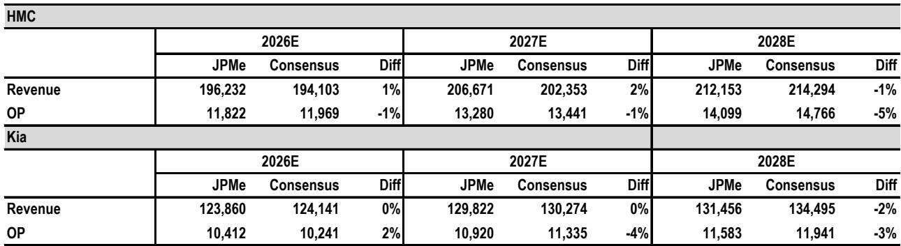
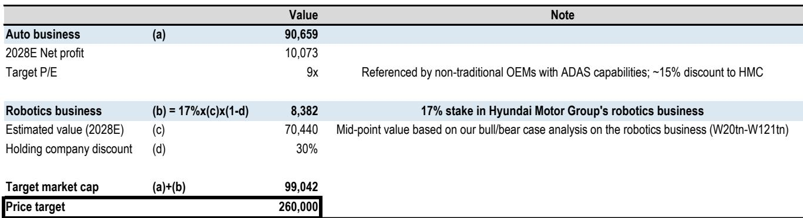
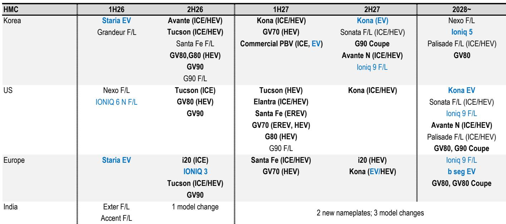

# JPM：铝铜塑料涨价冲击汽车利润，韩元贬值对冲效果有限

当市场还在争论现代汽车与起亚谁能在新车型周期中占据优势时，一份来自JPM的报告揭示了一个更本质的判断：这两家韩国汽车制造商在2026年第二季度的业绩分化，根源不在于销量本身，而在于成本结构对两家公司不同的传导机制。

现代汽车二季度全球零售销量99.9万辆，同比下降4%，而起亚则录得83.7万辆，同比增长6%。这一差异本身并不意外——现代正处在老旧车型周期的尾部，而起亚的产品线正值青壮年。但真正值得关注的，是两家公司在面对同样成本不确定性时的不同表现。

报告预计现代汽车二季度营业利润为2.9万亿韩元，低于市场预期的3.1万亿；起亚同为2.9万亿，基本符合预期。差异的关键在于产能利用率。现代汽车的产能利用率降至约85%，而起亚仍维持在接近满产的100%水平。在原材料成本全面上涨的背景下，更低的产能利用率意味着固定成本无法被充分摊薄，这是一个结构性劣势。

## 1. 成本通胀正在成为比销量更关键的变量

报告估算，铝、铜、塑料和DRAM等大宗商品的价格上涨，在二季度对现代汽车和起亚的营业利润分别造成约3500亿韩元和2500亿韩元的冲击。虽然韩元贬值为两家公司提供了约5000亿和4000亿韩元的汇兑对冲，但成本上涨的节奏在二季度明显加速，后续几个季度可能无法被完全吸收。

> **KC评论：** 这里需要读者关注的不是成本上涨的相对值，而是“成本传导机制”的差异。现代汽车由于销量下滑和产能利用率不足，成本不确定性被进一步放大；而起亚凭借销量增长，部分抵消了原材料上涨的影响。这说明在通胀环境下，产能利用率变成了一个放大器——好的公司被放大收益，弱的公司被放大亏损。

## 2. 机器人叙事是长线支撑，但短期催化剂仍待验证

读者对现代汽车集团机器人业务的兴趣正在升温，但报告指出，市场关注的焦点已经从“有没有价值”转向“什么能重新点燃情绪”。现代汽车集团计划在今年夏天开放机器人培训中心，并预计在年底前敲定机器人业务的详细研究计划和子公司角色分工。

从估值角度看，起亚基于2027年预期市盈率仅为6倍，股息率超过4%，在当前环境下具备明显的防御价值。但如果机器人叙事重新升温，市场注意力可能转向现代汽车，后者在机器人业务上的弹性更大。

## 3. 报告没有完全回答的问题：成本不确定性会持续多久

JPM下调了现代汽车2026至2028年的盈利预期6%至11%，起亚的调整幅度则在-4%至+2%之间。但一个关键问题尚未被充分讨论：如果原材料成本在2026年下半年没有明显回落，两家公司的盈利预期是否还有进一步下修空间？报告提到成本通胀在二季度加速，且“可能无法被后续季度的汇兑收益完全对冲”，这本身就是一个值得保持警惕的信号。

对于关注韩国汽车行业的读者，这份报告提供了一个清晰的观察框架：在通胀环境下，产能利用率比销量增速更能预测短期盈利。起亚凭借更高的产能利用率和更年轻的产品周期，在成本不确定性下展现了更强的韧性；而现代汽车虽然在下半年有密集的新车型投放，但成本端的改善可能需要更长时间才能体现在利润表上。

For informational purposes only. Portions may be generated,translated,summarized,or edited with AI assistance based on source materials and may contain omissions or errors. Please verify independently. This is not investment,legal,tax,accounting,or other professional advice.

For informational purposes only. Portions may be generated,translated,summarized,or edited with AI assistance based on source materials and may contain omissions or errors. Please verify independently. This is not investment,legal,tax,accounting,or other professional advice.

