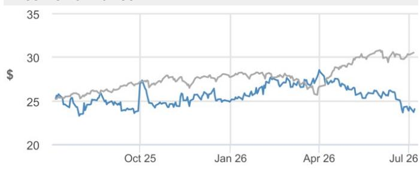
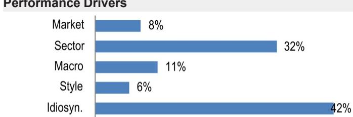
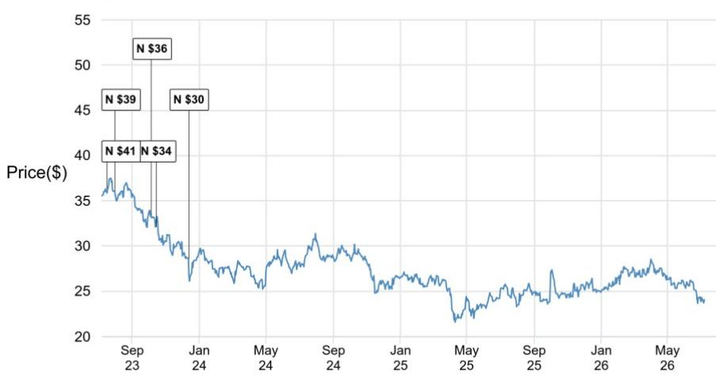

## Pfizer Inc.

## 关注研发管线进展，全年业绩指引存在上调空间

在辉瑞（PFE）第二季度财报（8月4日）发布前，我们对本季度的预测与市场预期基本一致，并认为全年业绩指引存在上调空间。本季度，我们预测销售额为146亿美元（比市场预期高1.3亿美元），每股收益为0.69美元（比市场预期高0.01美元）。全年来看，我们预估销售额为627亿美元（比市场预期高8.6亿美元），每股收益为3.05美元（比市场预期高0.09美元），略高于公司给出的业绩指引范围（595亿至625亿美元，每股收益2.80至3.00美元）。

更广泛地看，我们认为辉瑞当前报价处于合理区间（约为2027年预估每股收益的9倍），公司研发管线中的多项资产有望在未来提升其吸引力。然而，我们认为需要这些项目进一步的数据验证来改变市场看法。在此方面，大部分关键数据更新将在2027年及之后公布。因此，我们维持中性评级，并将2026年12月的目标报价从30美元下调至28美元，原因是近期Sigvotatug Vedotin在二线及以上非小细胞肺癌适应症的III期临床试验未达预期。

- 本季度，我们的预测与市场预期基本一致。总体而言，我们预测销售额为146亿美元（比市场预期高1.3亿美元），每股收益为0.69美元（比市场预期高0.01美元）。收入方面，这包括Padcev销售额7亿美元（比市场预期高7000万美元），Ibrance销售额11亿美元（比市场预期高9000万美元），Eliquis销售额21亿美元（同比增长3%，符合预期），以及Vyndaqel销售额17亿美元（符合预期）。

我们全年的预测也略高于公司指引，其中Eliquis的积极表现抵消了新冠相关业务的波动。在新冠业务方面，我们本季度的预测与市场预期基本一致，但全年预测低于公司的新冠业务指引（JPM预估约42亿美元，而公司指引合计约50亿美元），这反映了当前的处方趋势（Comirnaty同比下降27%，Paxlovid同比下降77%）。抵消新冠业务预测的是，我们预计Eliquis将有积极表现（全年比市场预期高2.7亿美元）。鉴于目前新冠和Eliquis业务均非公司核心关注点，市场对这些产品业绩超预期或未达预期的反应可能有限。总体而言，这使我们的预测略高于公司指引：销售额627亿美元（公司指引为595亿至625亿美元），每股收益3.05美元（公司指引为2.80至3.00美元）。

- 市场对辉瑞的情绪仍然不高，但我们认为需要研发管线的进展来改变对公司价值的看法。读者情绪目前较为平淡，普遍认为：1）鉴于当前估值，公司报价下行空间有限；2）但需要研发管线的进展才能推动公司报价重新定价。由于关键数据更新主要集中在2027年及以后，我们预计公司报价将在当前区间内波动。近期可关注的催化剂包括：1）berobenatide/GLP-1与amylin联合疗法的I/II期数据（2026年底）；2）公司三特异性抗体针对特应性皮炎的完整II期数据；3）Mevrometostat在前列腺癌术后治疗的III期数据（2026年7月数据截止日期）。

## 中性

辉瑞（PFE）
报价（2026年7月7日）：24.07美元

▼目标报价（2026年12月）：28.00美元
此前（2026年12月）：30.00美元

## 医药行业——大型及专业领域

分析师：Chris Schott, CFA AC
(1-212) 622-5676
christopher.t.schott@JPM.com

Ethan Brown
(1-212) 622-4928
ethan.brown@jpmchase.com

Hardik Parikh, CFA
(1 212) 622-2875
hardik.k.parikh@JPM.com

Taylor Hanley
(1-212) 622-0790
taylor.hanley@jpmchase.com

Ekaterina V Knyazkova, CFA
(1-212) 622-9576
ekaterina.v.knyazkova@jpmchase.com
JPM Securities LLC

## 关键变化（财年截至12月）

|  | 此前 | 当前 | 变化 |
|---|---|---|---|
| 收入 - 2026E（百万美元） | 61,955 | 62,661 | 1.1% |
| 收入 - 2027E（百万美元） | 57,075 | 57,991 | 1.6% |
| 调整后每股收益 - 2026E（美元） | 3.00 | 3.05 | 1.7% |
| 调整后每股收益 - 2027E（美元） | 2.57 | 2.62 | 2.2% |

|  | 2025A | 2026E | 2027E |
|---|---|---|---|
| 第一季度 | 0.92 | 0.75A |  |
| 第二季度 | 0.78 | 0.69 |  |
| 第三季度 | 0.87 | 0.91 |  |
| 第四季度 | 0.66 | 0.70 |  |
| 全年 | 3.22 | 3.05 | 2.62 |

风格暴露

| 量化因子 | 当前百分位排名 | 历史百分位排名（1=最高） |
|---|---|---|
|  |  | 6个月 | 1年 | 3年 | 5年 |
| 价值 | 17 | 14 | 17 | 17 | 16 |
| 成长 | 81 | 40 | 42 | 26 | 73 |
| 动量 | 59 | 60 | 51 | 83 | 65 |
| 质量 | 7 | 13 | 12 | 11 | 22 |
| 低波动 | 2 | 3 | 3 | 5 | 3 |
| ESG质量 | 26 | 89 | 60 | 22 | 92 |

价格表现

— PFE报价（美元） — S&P500（重新基准）

|  | 年初至今 | 1个月 | 3个月 | 12个月 |
|---|---|---|---|---|
| 相对 | -3.3% | -7.6% | -11.2% | -4.6% |
| 相对 | -13.4% | -9.6% | -25.1% | -25.6% |

公司数据

| 流通股数（百万） | 5,758 |
|---|---|
| 52周区间（美元） | 28.75-23.11 |
| 总市值（百万美元） | 138,595.10 |
| 汇率 | 1.00 |
| 自由流通比例（%） | 99.0% |
| 3个月日均成交量（百万股） | 39.95 |
| 3个月日均成交额（百万美元） | 1,030.9 |
| 波动率（90天） | 22 |
| 指数 | S&P 500 |
| 彭博分析师评级（买入|持有|卖出） | 10|18|2 |

关键指标（财年截至12月）

| 百万美元 | FY25A | FY26E | FY27E | FY28E |
|---|---|---|---|---|
| **财务预估** |  |  |  |  |
| 收入 | 62,579 | 62,661 | 57,991 | 52,095 |
| 调整后EBITDA | 23,687 | 24,039 | 21,190 | 18,083 |
| 调整后EBIT | 21,969 | 22,301 | 19,382 | 16,079 |
| 调整后净利润 | 18,406 | 17,525 | 15,061 | 12,368 |
| 调整后每股收益 | 3.22 | 3.05 | 2.62 | 2.16 |
| 彭博每股收益 | 3.13 | 2.97 | 2.85 | 2.42 |
| 经营活动现金流 | 11,705 | 18,376 | 17,915 | 15,533 |
| 公司自由现金流 | 9,076 | 15,876 | 13,915 | 11,533 |
| **利润率与增长** |  |  |  |  |
| 收入同比增长（%） | (1.6%) | 0.1% | (7.5%) | (10.2%) |
| EBITDA利润率 | 37.9% | 38.4% | 36.5% | 34.7% |
| EBITDA同比增长（%） | 0.7% | 1.5% | (11.9%) | (14.7%) |
| EBIT利润率 | 35.1% | 35.6% | 33.4% | 30.9% |
| 净利润率 | 29.4% | 28.0% | 26.0% | 23.7% |
| 调整后每股收益增长 | 3.7% | (5.2%) | (14.1%) | (17.9%) |
| **比率** |  |  |  |  |
| 调整后税率 | 12.8% | 15.5% | 15.0% | 15.0% |
| 利息覆盖倍数 | 11.4 | 11.7 | 9.6 | 8.7 |
| 净债务/权益 | 0.7 | 0.6 | 0.6 | 0.6 |
| 净债务/EBITDA | 2.7 | 2.3 | 2.5 | 2.8 |
| 已动用资本回报率 | 12.6% | 12.4% | 10.8% | 9.1% |
| 净资产回报表现 | 21.0% | 19.8% | 16.6% | 13.6% |
| **估值** |  |  |  |  |
| 公司自由现金流回报表现 | 6.6% | 11.5% | 10.1% | 8.4% |
| 股息率 | - | - | - | - |
| 企业价值/收入 | 3.2 | 3.1 | 3.3 | 3.6 |
| 企业价值/EBITDA | 8.5 | 8.0 | 8.9 | 10.4 |
| 调整后市盈率 | 7.5 | 7.9 | 9.2 | 11.2 |

## 投资主题与估值总结

## 投资主题

我们认为辉瑞当前报价处于合理区间（约为2027年预估每股收益的9倍），公司研发管线中的多项资产有望在未来提升其吸引力。然而，我们认为需要这些项目进一步的数据验证来改变市场看法。在此方面，虽然2026年有一些预期的数据读出，但大部分关键数据更新将在2027年及之后公布。因此，我们维持中性评级。

## 估值

我们基于现金流折现模型得出的2026年12月目标报价为28美元，假设终端增长率为0%，加权平均资本成本为8.5%。

业绩驱动因素

| 因素 | 6个月相关性 | 1年相关性 |
|---|---|---|
| 市场：MSCI美国 | 0.27 | 0.38 |
| 行业：医疗保健 | 0.65 | 0.62 |
| 子行业：制药、生物、生命科学 | 0.72 | 0.69 |
| 宏观： |  |  |
| 美国10年期国债回报表现 | -0.11 | -0.20 |
| 美元 | -0.29 | -0.17 |
| 信用利差 | -0.02 | -0.11 |
| 量化风格： |  |  |
| 股息率 | 0.42 | 0.49 |
| 成长 | -0.37 | -0.45 |
| 低波动 | 0.32 | 0.41 |

# 投资主题、估值与风险

辉瑞公司（中性；目标报价：28.00美元）

## 投资主题

我们认为辉瑞当前报价处于合理区间（约为2027年预估每股收益的9倍），公司研发管线中的多项资产有望在未来提升其吸引力。然而，我们认为需要这些项目进一步的数据验证来改变市场看法。在此方面，虽然2026年有一些预期的数据读出，但大部分关键数据更新将在2027年及之后公布。因此，我们维持中性评级。

## 估值

我们基于现金流折现模型得出的2026年12月目标报价为28美元，假设终端增长率为0%，加权平均资本成本为8.5%，这与我们对整个制药行业的假设一致。

## 评级与目标报价的风险

我们对辉瑞中性评级的风险包括：下行风险方面，1）未能维持运营利润率；2）研发管线可能受挫。上行风险方面，1）研发管线持续表现优异；2）新产品上市表现强于预期。

辉瑞公司：财务摘要

| 利润表 - 年度 | FY24A | FY25A | FY26E | FY27E | FY28E |
|---|---|---|---|---|---|
| 收入 | 63,627 | 62,579 | 62,661 | 57,991 | 52,095 |
| 销售成本 | (16,420) | (15,141) | (15,418) | (13,897) | (12,179) |
| 毛利润 | 47,207 | 47,438 | 47,243 | 44,094 | 39,916 |
| 销售、一般及行政费用 | (14,617) | (13,643) | (13,335) | (12,669) | (12,035) |
| 调整后EBITDA | 23,515 | 23,687 | 24,039 | 21,190 | 18,083 |
| 折旧与摊销 | (1,727) | (1,718) | (1,739) | (1,807) | (2,004) |
| 调整后EBIT | 21,788 | 21,969 | 22,301 | 19,382 | 16,079 |
| 净利息 | (2,555) | (2,078) | (2,063) | (2,213) | (2,077) |
| 调整后税前利润 | 20,757 | 21,141 | 20,781 | 17,770 | 14,602 |
| 税项 | (3,006) | (2,696) | (3,212) | (2,665) | (2,190) |
| 少数股东权益 | (35) | (39) | (43) | (43) | (43) |
| 调整后净利润 | 17,716 | 18,406 | 17,525 | 15,061 | 12,368 |
| 报告每股收益 | 3.11 | 3.22 | 3.05 | 2.62 | 2.16 |
| 调整后每股收益 | 3.11 | 3.22 | 3.05 | 2.62 | 2.16 |
| 每股股息 | - | - | - | - | - |
| 派息率 | - | - | - | - | - |
| 流通股数 | 5,701 | 5,713 | 5,738 | 5,738 | 5,738 |
| **资产负债表与现金流量表** | **FY24A** | **FY25A** | **FY26E** | **FY27E** | **FY28E** |
| 现金及现金等价物 | 1,043 | 1,142 | 5,799 | 9,845 | 5,408 |
| 应收账款 | 11,463 | 11,874 | 11,541 | 10,359 | 9,017 |
| 存货 | 10,851 | 10,654 | 10,278 | 9,264 | 8,119 |
| 其他流动资产 | 27,001 | 19,228 | 19,228 | 19,228 | 19,228 |
| 流动资产合计 | 50,358 | 42,898 | 46,846 | 48,696 | 41,772 |
| 物业、厂房及设备 | 18,393 | 19,317 | 20,078 | 22,271 | 24,267 |
| 长期投资 | - | - | - | - | - |
| 其他非流动资产 | 144,644 | 145,945 | 139,421 | 134,547 | 130,273 |
| 资产总计 | 213,395 | 208,160 | 206,346 | 205,515 | 196,312 |
| 短期借款 | 6,946 | 3,154 | 3,154 | 3,154 | 3,154 |
| 应付账款 | 5,633 | 5,240 | 5,353 | 4,825 | 4,229 |
| 其他短期负债 | 30,416 | 28,590 | 28,681 | 28,261 | 27,731 |
| 流动负债合计 | 42,995 | 36,984 | 37,189 | 36,240 | 35,113 |
| 长期债务 | 57,405 | 61,641 | 58,641 | 58,641 | 53,141 |
| 其他长期负债 | 24,498 | 22,760 | 20,160 | 19,160 | 18,160 |
| 负债合计 | 124,898 | 121,385 | 115,990 | 114,041 | 106,414 |
| 股东权益 | 88,497 | 86,775 | 90,356 | 91,473 | 89,898 |
| 少数股东权益 | - | - | - | - | - |
| 负债及权益总计 | 213,395 | 208,160 | 206,346 | 205,515 | 196,312 |
| 每股账面价值 | 15.52 | 15.19 | 15.75 | 15.94 | 15.67 |
| 同比增长 | (0.4%) | (2.1%) | 3.7% | 1.2% | (1.7%) |
| 净债务/（现金） | 63,308 | 63,653 | 55,996 | 51,950 | 50,887 |
| 经营活动现金流 | 12,743 | 11,705 | 18,376 | 17,915 | 15,533 |
| 其中：折旧与摊销 | 7,013 | 6,592 | 6,613 | 6,681 | 6,878 |
| 其中：营运资本变动 | (3,066) | (5,354) | 913 | 1,248 | 1,361 |
| 投资活动现金流 | 2,652 | (1,351) | (850) | (4,000) | (4,600) |
| 其中：资本支出 | (2,909) | (2,629) | (2,500) | (4,000) | (4,000) |
| 占销售额比例 | 4.6% | 4.2% | 4.0% | 6.9% | 7.7% |
| 融资活动现金流 | (17,140) | (10,303) | (12,869) | (9,869) | (15,369) |
| 其中：已付股息 | (9,512) | (9,771) | (9,869) | (9,869) | (9,869) |
| 其中：净债务发行/（偿还） | (7,159) | (74) | (3,000) | 0 | (5,500) |
| 现金净变动 | (1,811) | 92 | 4,657 | 4,046 | (4,436) |
| 调整后公司自由现金流 | 9,834 | 9,076 | 15,876 | 13,915 | 11,533 |
| 同比增长 | 105.2% | (7.7%) | 74.9% | (12.3%) | (17.1%) |

来源：公司报告及JPM预估。
注：金额单位为百万美元（每股数据除外）。财年截至12月。

| 利润表 - 季度 | 1Q26A | 2Q26E | 3Q26E | 4Q26E |
|---|---|---|---|---|
| 收入 | 14,451A | 14,559 | 16,158 | 17,492 |
| 销售成本 | (3,406)A | (3,438) | (3,736) | (4,837) |
| 毛利润 | 11,045A | 11,121 | 12,422 | 12,655 |
| 销售、一般及行政费用 | (2,915)A | (3,327) | (3,095) | (3,998) |
| 调整后EBITDA | 5,994A | 5,498 | 6,978 | 5,570 |
| 折旧与摊销 | (435)A | (435) | (435) | (435) |
| 调整后EBIT | 5,559A | 5,063 | 6,543 | 5,135 |
| 净利息 | (556)A | (502) | (502) | (502) |
| 调整后税前利润 | 5,171A | 4,686 | 6,166 | 4,758 |
| 税项 | (871)A | (703) | (925) | (714) |
| 少数股东权益 | (10)A | (17) | (8) | (8) |
| 调整后净利润 | 4,290A | 3,966 | 5,233 | 4,036 |
| 报告每股收益 | 0.75A | 0.69 | 0.91 | 0.70 |
| 调整后每股收益 | 0.75A | 0.69 | 0.91 | 0.70 |
| 每股股息 | - | - | - | - |
| 派息率 | - | - | - | - |
| 流通股数 | 5,731A | 5,740 | 5,740 | 5,740 |

| 比率分析 | FY24A | FY25A | FY26E | FY27E | FY28E |
|---|---|---|---|---|---|
| 毛利率 | 74.2% | 75.8% | 75.4% | 76.0% | 76.6% |
| EBITDA利润率 | 37.0% | 37.9% | 38.4% | 36.5% | 34.7% |
| EBIT利润率 | 34.2% | 35.1% | 35.6% | 33.4% | 30.9% |
| 净利润率 | 27.8% | 29.4% | 28.0% | 26.0% | 23.7% |
| 净资产回报表现 | 19.9% | 21.0% | 19.8% | 16.6% | 13.6% |
| 总资产回报表现 | 8.1% | 8.7% | 8.5% | 7.3% | 6.2% |
| 已动用资本回报率 | 11.9% | 12.6% | 12.4% | 10.8% | 9.1% |
| 销售、一般及行政费用/销售额 | 23.0% | 21.8% | 21.3% | 21.8% | 23.1% |
| 净债务/权益 | 0.7 | 0.7 | 0.6 | 0.6 | 0.6 |
| 市盈率（倍） | 7.7 | 7.5 | 7.9 | 9.2 | 11.2 |
| 市净率（倍） | 1.6 | 1.6 | 1.5 | 1.5 | 1.5 |
| 企业价值/EBITDA（倍） | 8.5 | 8.5 | 8.0 | 8.9 | 10.4 |
| 股息率 | - | - | - | - | - |
| 销售额/总资产（倍） | 0.3 | 0.3 | 0.3 | 0.3 | 0.3 |
| 利息覆盖倍数（倍） | 9.2 | 11.4 | 11.7 | 9.6 | 8.7 |
| 经营杠杆 | 1530.6% | (50.4%) | 1155.1% | 175.6% | 167.7% |
| 收入同比增长 | 8.8% | (1.6%) | 0.1% | (7.5%) | (10.2%) |
| EBITDA同比增长 | 116.5% | 0.7% | 1.5% | (11.9%) | (14.7%) |
| 税率 | 14.5% | 12.8% | 15.5% | 15.0% | 15.0% |
| 调整后净利润同比增长 | 68.7% | 3.9% | (4.8%) | (14.1%) | (17.9%) |
| 每股收益同比增长 | 69.5% | 3.7% | (5.2%) | (14.1%) | (17.9%) |
| 每股股息同比增长 | - | - | - | - | - |

分析师认证：本报告封面标注“AC”的研究分析师（或当多位研究分析师主要负责本报告时，封面或文件内标注“AC”的研究分析师就其在本研究中涵盖的每个证券或发行人分别认证）：(1) 本报告中表达的所有观点准确反映了研究分析师对任何及所有主题证券或发行人的个人观点；(2) 研究分析师的薪酬中没有任何部分过去、现在或将来直接或间接与本报告中研究分析师提出的具体推荐或观点相关。对于封面列出的所有韩国研究分析师（如适用），他们还根据KOFIA要求认证，研究分析师的分析是善意进行的，观点反映了研究分析师自己的意见，没有受到不当影响或干预。

除非另有说明，本报告中列出的所有作者均为独立撰写研究报告的研究分析师。在欧洲，行业专家（销售与交易）可能作为联系人出现在本报告中，但并非报告作者或研究部门成员。

## 重要披露

• 做市商/流动性提供者：JPM是辉瑞公司或相关实体金融工具的做市商和/或流动性提供者。

- 经理或联合经理：在过去12个月内，JPM曾担任辉瑞公司或相关实体证券或金融工具（如指令2014/65/EU所定义）公开发行的经理或联合经理。

- 分析师持仓：股票或信用覆盖团队的分析师、可能发布交易建议的非基本面分析师或其各自家庭成员对辉瑞公司或相关实体的债务或权益证券拥有经济利益。

- 客户：JPM目前拥有，或在过去12个月内曾拥有以下实体作为客户：辉瑞公司或相关实体。

- 客户/投资银行：JPM目前拥有，或在过去12个月内曾拥有以下实体作为投资银行客户：辉瑞公司或相关实体。

- 客户/非投资银行、证券相关：JPM目前拥有，或在过去12个月内曾拥有以下实体作为客户，且提供的服务为非投资银行、证券相关服务：辉瑞公司或相关实体。

- 客户/非证券相关：JPM目前拥有，或在过去12个月内曾拥有以下实体作为客户，且提供的服务为非证券相关服务：辉瑞公司或相关实体。

- 已收投资银行报酬：JPM在过去12个月内已从辉瑞公司或相关实体获得投资银行服务报酬。

- 潜在投资银行报酬：JPM预计在未来三个月内将从辉瑞公司或相关实体获得或寻求获得投资银行服务报酬。

• 非投资银行报酬已收：JPM在过去12个月内已从辉瑞公司或相关实体获得投资银行以外的产品或服务报酬。

- 债务持仓：JPM可能持有辉瑞公司或相关实体的债务证券（如有）。

公司特定披露：JPM确实并寻求与其研究报告所覆盖的公司开展业务。因此，读者应注意，该公司可能存在利益冲突，可能影响本报告的客观性。读者应将本报告仅视为其决策的单一因素。重要披露，包括价格图表和信用意见历史表（如适用），可通过访问https://www.jpmm.com/research/disclosures、致电1-800-477-0406或发送电子邮件至research.disclosure.inquiries@JPM.com获取，适用于汇编报告及所有JPM覆盖的公司及某些未覆盖的公司。

辉瑞公司（PFE, PFE US）价格图表

| 日期 | 评级 | 价格（美元） | 目标价格（美元） |
|---|---|---|---|
| 2023年7月17日 | N | 36.32 | 41 |
| 2023年8月1日 | N | 36.06 | 39 |
| 2023年10月6日 | N | 33.47 | 36 |
| 2023年10月15日 | N | 32.11 | 34 |
| 2023年12月13日 | N | 28.58 | 30 |

来源：彭博财经和JPM；价格数据已根据股票分割和股息进行调整。首次覆盖日期为1997年10月8日。所有股价均为前一交易日收盘价。
图表显示了JPM对该股票的持续覆盖；当前分析师可能并非在整个期间内覆盖该股票。JPM评级或名称：OW = 增持，N = 中性，UW = 减持，NR = 未评级

## 股票研究评级、名称和分析师覆盖范围说明：

JPM使用以下评级系统：增持（在本报告所示目标价格期间内，我们预计该股票的表现将优于研究分析师或其团队覆盖范围内股票的平均总回报）；中性（在本报告所示目标价格期间内，我们预计该股票的表现将与研究分析师或其团队覆盖范围内股票的平均总回报一致）；减持（在本报告所示目标价格期间内，我们预计该股票的表现将逊于研究分析师或其团队覆盖范围内股票的平均总回报）。NR为未评级。在此情况下，JPM已移除该股票的评级及（如适用）目标价格，原因包括缺乏足够的基本面依据，或出于法律、监管或政策原因。先前的评级及（如适用）目标价格不再应被依赖。NR名称并非推荐或评级。部分覆盖的股票有评级但无目标价格；在此情况下，我们预计该股票的表现将优于/一致/逊于研究分析师或其团队覆盖范围内股票在相关区域相应期间的平均总回报。在我们的亚洲（除澳大利亚和印度外）及英国中小盘股票研究中，每只股票的预期总回报是与基准国家市场指数的预期总回报进行比较，而非与研究分析师的覆盖范围进行比较。如果本报告的重要披露部分未显示，认证研究分析师的覆盖范围可在JPM网站https://www.JPMmarkets.com上找到。

覆盖范围：Schott, Christopher：艾伯维（ABBV）、安进公司（AMGN）、Amneal Pharmaceuticals, Inc.（AMRX）、百健（BIIB）、百时美施贵宝公司（BMY）、Elanco Animal Health Inc.（ELAN）、礼来公司（LLY）、吉利德科学（GILD）、Idexx（IDXX）、强生（JNJ）、默克公司（MRK）、Organon（OGN）、Perrigo公司（PRGO）、辉瑞公司（PFE）、再生元制药（REGN）、Royalty Pharma（RPRX）、梯瓦制药（TEVA）、Viatris Inc（VTRS）、硕腾（ZTS）

JPM股票研究评级分布，截至2026年7月4日

|  | 增持（买入） | 中性（持有） | 减持（卖出） |
|---|---|---|---|
| JPM全球股票研究覆盖* | 53% | 36% | 12% |
| 投行客户** | 83% | 80% | 73% |
| JPM证券股票研究覆盖* | 51% | 37% | 12% |
| 投行客户** | 95% | 92% | 87% |

*请注意，由于四舍五入，百分比可能未加总至100%。
**在过去12个月内，JPM已提供投资银行服务的“买入”、“持有”和“卖出”类别中各主题公司的百分比。

就FINRA评级分布规则而言，我们的增持评级属于报告评级类别；我们的中性评级属于持有评级类别；我们的减持评级属于报告评级类别。请注意，标有NR的股票未包含在上述表格中。此信息截至最近一个日历季度末。

股票估值与风险：有关覆盖公司或目标价格的估值方法和风险，请参阅最新的公司特定研究报告，访问http://www.JPMmarkets.com，联系主要分析师或您的JPM代表，或发送电子邮件至research.disclosure.inquiries@JPM.com。有关所用专有模型的实质性信息，请参阅公司特定研究报告中的财务摘要和公司概况表，这些文件可在我们的客户网站http://www.JPMmarkets.com的公司页面上下载。本报告还阐述了所使用的基本假设。

## 投资推荐历史：

过去12个月内JPM投资推荐的传播历史可通过http://www.JPMmarkets.com的研究与评论页面访问，您也可以按分析师姓名、行业或金融工具进行搜索。

分析师薪酬：负责编写本报告的研究分析师的薪酬基于多种因素，包括研究的质量和准确性、客户反馈、竞争因素以及公司整体收入。

## 其他披露

JPM是JPM公司及其全球子公司和关联公司投资银行业务的营销名称。

英国MiFID FICC研究解绑豁免：英国客户应参考英国MiFID研究解绑豁免，了解JPM实施FICC研究豁免的详细信息以及相关FICC研究分类的指导。

除非相关法律特别允许，所有提供给客户的研究材料均同时在我们的客户网站JPM Markets上提供。并非所有研究内容都会重新分发、通过电子邮件发送或提供给第三方聚合商。如需获取特定股票的所有研究材料，请联系您的销售代表。

本研究材料中提及中国、香港、台湾和澳门的任何长格式名称分别为中国大陆、香港特别行政区（中国）、台湾（中国）和澳门特别行政区（中国）。

JPM可能不时撰写关于受美国、欧盟、英国或其他相关司法管辖区政府当局实施或管理的经济或金融制裁所针对的发行人或证券（受制裁证券）的文章。本报告中的任何内容均无意被解读为鼓励、促进、推动或以其他方式批准对这类受制裁证券的投资或交易。客户在做出投资决策时应了解自身的法律和合规义务。

本研究报告中讨论的任何数字或加密资产均受快速变化的监管环境影响。有关加密资产（包括比特币和以太坊）的相关监管建议，请参阅https://www.JPM.com/disclosures/cryptoasset-disclosure。

本研究报告的作者可能未获许可在您的司法管辖区从事受监管活动，如果未获许可，则不会声称自己能够这样做。

交易所交易基金（ETF）：JPM证券有限责任公司（“JPMS”）是几乎所有美国上市ETF的授权参与者。如果本报告中提及任何ETF，JPMS可能因分销这些ETF股份而赚取佣金和基于交易的报酬，并可能因提供其他交易相关服务（例如向ETF股份的空头卖家提供证券借贷）而赚取费用。JPMS还可能为ETF本身提供服务，包括担任ETF的经纪商或交易商。此外，JPMS的关联公司可能为ETF提供服务，包括信托、托管、管理、借贷、指数计算和/或维护及其他服务。

期权和期货相关研究：如果本文包含的信息涉及期权或期货相关研究，则该信息仅提供给已收到适当期权或期货风险披露文件的人士。请联系您的JPM代表或访问https://www.theocc.com/components/docs/riskstoc.pdf获取期权清算公司的标准化期权的特征和风险副本，或访问https://www.finra.org/sites/default/files/202
