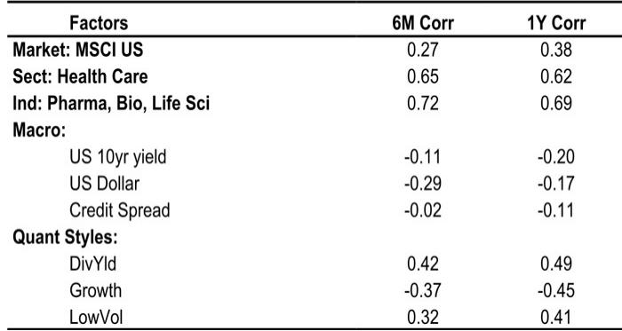
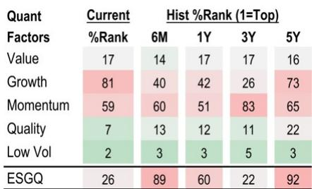
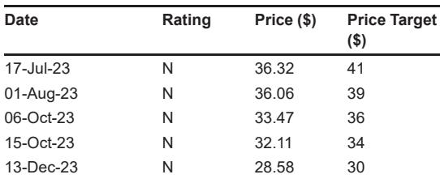

# 辉瑞的价值观察：管线催化剂的日程表需要市场不具备的耐心

股票投资中最危险的短语是“这次不一样”。但对于辉瑞来说，更相关的短语可能是“明年是催化剂”。一份全球投行报告在2026年第二季度财报前对这家制药巨头的分析描绘了一幅清晰的图景：辉瑞的报价约为2027年预期利润的9倍，这一估值表面上看起来很有吸引力。然而，该股票目前处于中性状态，当前的低倍数与管线中最重大的风险消除事件发生在2027年及以后之间存在着张力。

这不是一个关于公司陷入困境的故事。这是一个关于时机、信念以及股票当前价值与市场愿意为未来预期支付的价格之间令人不安的差距的故事。该报告预测2026年收入为627亿美元，略高于公司自身595亿至625亿美元的指引区间；调整后每股收益为3.05美元，也高于2.80至3.00美元的指引。这些超预期是真实的。但市场并未给予回报。这是任何考虑该标的的人面临的核心战略问题：如果近期执行稳健且股票便宜，市场在等待什么它尚未看到的东西？

答案在于管线、关键产品的竞争格局，以及一个令人不安的现实——最重要的数据解读仍在数年之后。对于认真的研究者来说，问题不在于辉瑞是否被低估。而在于价值重估的路径是否足够清晰、足够短，以证明等待的机会成本是合理的。

## 近期盈利超预期是真实的，但与股票叙事无关

该报告对2026年第二季度的预测显示销售额为146亿美元，比市场共识高出1.3亿美元；每股收益为0.69美元，比市场预期高出一美分。全年来看，分析师预计收入为627亿美元，比共识高出8.6亿美元；每股收益为3.05美元，比平均预期高出0.09美元。表面上看，这看起来像是一家执行良好、足以超越内部目标和外部预期的公司。

但超预期的构成揭示了市场为何不为所动。上行空间主要来自Eliquis，这是辉瑞与百时美施贵宝共同销售的抗凝血剂。报告模型显示Eliquis本季度为21亿美元，与上年持平，全年比共识高出2.7亿美元。与此同时，新冠产品线持续下滑。报告预测Comirnaty和Paxlovid全年合计销售额约为42亿美元，远低于辉瑞自身约50亿美元的指引。Comirnaty处方量同比下降27%；Paxlovid处方量明显回落77%。

这里的关键洞察是，Eliquis和新冠产品都不是研究主题的核心。Eliquis将在2028年面临仿制药竞争，报告的财务预测已反映这一悬崖——收入从2026年的627亿美元下降到2028年的521亿美元。新冠产品结构性下滑且不可预测。市场不会因为Eliquis超出几亿美元而重新评估辉瑞。那是噪音，而非信号。

市场需要的是证据，证明管线能够替代明显正在流失的收入。而这一证据尚不可得。

## 管线具有吸引力，但其最重要的验证点还很遥远

该报告指出了几个可能“随着时间的推移”使故事更有吸引力的资产。但关键短语是“随着时间的推移”。近期的催化剂日程表很薄弱。berobenatide与GLP-1/amylin激动剂联合疗法的1/2期数据解读预计在2026年底。一种三特异性抗体在特应性皮炎中的完整2期数据也在预期之中。而mevrometostat在前列腺癌（阿比特龙后线治疗）中的3期数据预计在2026年7月左右。

这些都是有意义的事件，但它们并非那种能推动机构重新评估的二元、高确信度催化剂。报告明确指出“大多数主要数据更新将在2027年及以后”。对于一只以2026年预期利润7.9倍和2027年预期利润9.2倍交易的股票来说，这一时间线造成了根本性的错配。价值研究者通常在看到近期盈利增长或能揭示隐藏价值的近期催化剂时才会介入。辉瑞两者都不提供。盈利预计从2025年的3.22美元下降到2026年的3.05美元和2027年的2.62美元。该股票在远期基础上是便宜的，但远期本身在相对意义上正在变得更便宜。

这就是价值观察的本质。倍数压缩不是因为市场非理性，而是因为盈利基础正在侵蚀，替代收入尚未得到验证。报告直接承认了这一动态：“研究者普遍认为，鉴于当前估值，股票下行空间有限，但相信管线进展对于股票重新评估是必要的。”换句话说，该股票足够便宜，可能不会进一步大幅下跌，但如果没有明确的催化剂，它也不够便宜到足以吸引介入。

## 收入悬崖可见，利润率故事仅提供适度抵消

该报告的财务预测讲述了一个清晰的故事。收入在2026年达到627亿美元的峰值，然后下降到2027年的580亿美元和2028年的521亿美元。这意味着在短短两年内从峰值到谷底下降了17%。EBITDA利润率预计在2026年为38.4%，2027年降至36.5%，2028年降至34.7%。同期净利润从175亿美元降至124亿美元，下降29%。

利润率故事并非完全负面。毛利率实际上预计会适度改善，从2026年的75.4%上升到2028年的76.6%，因为利润率更高的新产品取代了利润率较低的成熟药物。但当收入下降时，经营杠杆反向作用。销售及管理费用占销售额的比例上升，EBITDA的相对美元下降比收入下降更陡峭，因为固定成本无法像收入蒸发那样迅速削减。

该报告的现金流折现估值假设终端增长率为0%，加权平均资本成本为8.5%。这是一个保守的框架，但目标价已从30美元下调，反映了sigvotatug vedotin在二线非小细胞肺癌中的近期3期失败。管线挫折对估值有实际影响，即使股票已经很便宜。

对于认真的研究者来说，关键问题是安全边际是否足够宽，以吸收进一步的管线失望。报告的观点表明答案是否定的。下行空间有限，但上行空间依赖于既不确定又遥远的事件。

## 报告未回答的问题：期权价值问题

该报告在数字方面很详尽，但留下了几个关键问题未解决。最重要的是如何评估管线的期权价值。报告提到了几个有潜力的资产，包括GLP-1联合疗法、三特异性抗体和mevrometostat。但它没有为这些项目提供概率调整后的收入估计。它没有模拟一个或多个资产成为重磅药物的乐观情景。它也没有解决这样一种可能性：如果即使只有一个项目大规模成功，辉瑞的管线价值可能远高于当前股价所暗示的水平。

第二个未解决的问题是关于资本配置。报告显示，辉瑞在2025年产生了91亿美元的企业自由现金流，预计2026年将产生159亿美元。净债务与EBITDA之比为2.3倍，处于可控水平。管理层将如何使用这些现金？是用于业务拓展、股票回购还是债务偿还？报告的财务报表显示2026年净债务偿还30亿美元，2028年偿还55亿美元，但没有模拟股票回购。如果管理层在这些低迷水平上积极回购股票，每股盈利轨迹可能会显著改善。报告没有探讨这一情景。

第三个未解决的问题是关于辉瑞管线资产的竞争格局。GLP-1市场已经拥挤，有诺和诺德、礼来和一系列小型生物技术公司。三特异性抗体领域尚处于早期但竞争日益激烈。Mevrometostat针对的机制在前列腺癌中结果喜忧参半。报告没有提供详细的竞争分析，使研究者能够评估这些项目相对于同行的成功概率。

这些不是对报告的批评。它们是一位分析师工作的自然边界。但它们也是严肃的研究者在做出决定前必须独立回答的问题。报告提供了坚实的基础。其余的是判断。

## 考虑辉瑞的研究者决策框架

对于试图决定是否关注或研究辉瑞的研究者，报告的分析可以提炼为一个三部分框架。

首先，评估底部。该股票的交易价格约为2026年利润的7.9倍和2027年利润的9.2倍。基于每股0.42美元的季度股息和24.07美元的股价，当前股息率约为6.5%。资产负债表为投资级，净债务与EBITDA之比为2.3倍，利息覆盖率为11.7倍。只要管线不发生进一步重大失败，下行空间似乎有限。但底部并非零。另一次3期失败，尤其是在高期望的项目中，可能将股价推至20美元以下。

其次，评估上行空间。对于一只盈利下降且催化剂日程表不确定的股票来说，9倍的利润倍数并不构成令人信服的回报。如果管线在2026年底或2027年提供积极数据，倍数可能扩大。但报告的DCF已经假设终端增长率为0%，这是保守的。更乐观的情景可能证明35至40美元的股价是合理的，但这需要多个管线成功以及市场目前尚未定价的重新评估。

第三，评估时间跨度。这是最重要的变量。如果研究者有三到五年的时间跨度，并相信辉瑞的管线项目中至少有一个会大规模成功，当前估值提供了显著的安全边际。9倍的2027年利润倍数低于主要制药公司的历史平均水平，并且没有反映管线的任何价值。如果研究者有六到十二个月的时间跨度，该股票可能会保持区间震荡，直到催化剂日程表变得更加具体。

报告的观点对大多数研究者来说是合适的。该股票不是做空标的，但如果没有对管线的清晰看法，它也不是一个令人信服的做多标的。等待可能实现也可能不实现的催化剂的机会成本是真实的。

加入社区阅读完整报告并查看原始图表。

*仅供参考。部分内容可能基于源材料通过AI辅助生成、翻译、总结或编辑，可能包含遗漏或错误。请独立核实。这不是专业建议。*

仅供参考。部分内容可能基于源材料通过AI辅助生成、翻译、总结或编辑，可能包含遗漏或错误。请独立核实。这不是专业建议。

