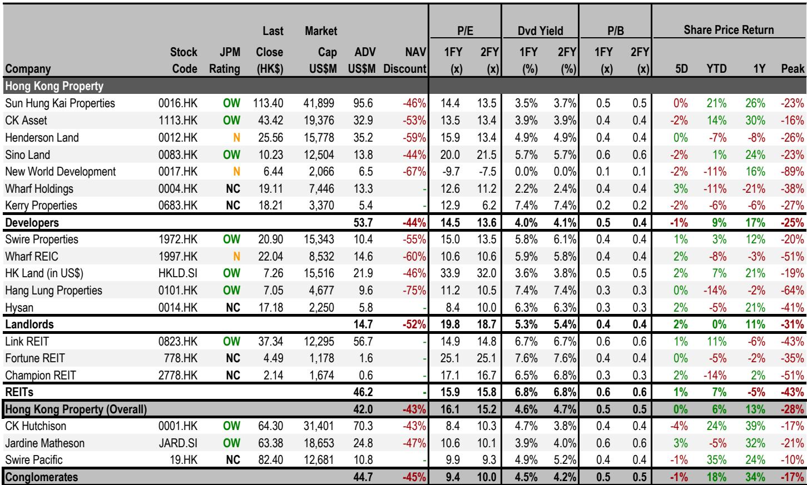
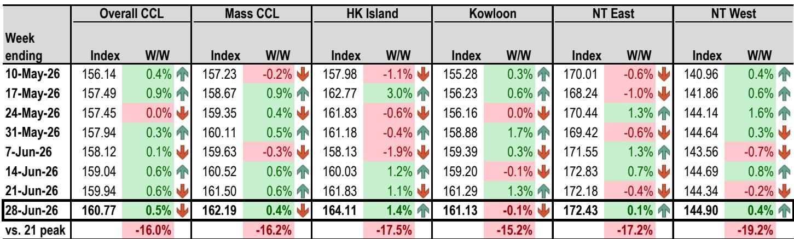
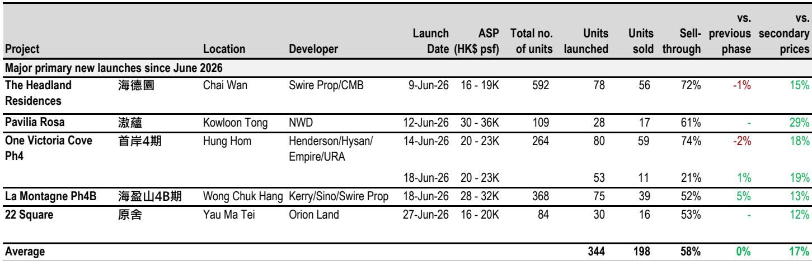

# 中国房地产市场趋于稳定，但复苏基础仍需观察

围绕中国房地产市场的讨论，已从危机应对转向谨慎乐观。某全球投资银行地产监测的最新周度数据，为市场正在筑底提供了新的证据。但这种稳定的性质，值得比表面数字更审慎的解读。复苏是真实的，但它范围有限、依赖政策，并且存在可能导致下半年趋势逆转的风险。

十大城市周度实时二手房成交面积同比增长14%，一线城市增长15%。上海以20%的增幅领先。一线城市二手房挂牌量继续下行，环比下降0.4%，目前较3月峰值低3.5%。在售库存的下降，是价格稳定的最重要结构性支撑。同时，一线城市中原经理指数从52升至55，上海录得最大周度环比涨幅，从48升至52。这些并非微不足道的变化，表明市场参与者的心态正从恐惧转向谨慎期待。

然而，数据中也包含警示信号，值得任何认真观察者留意。新房成交登记环比增长27%，但这主要受月末集中备案效应驱动，这是中国房地产数据中一个众所周知的扰动因素。此前表现亮眼的香港市场，正显示出动能减弱的迹象。上半年房价已上涨12%，达到了全年目标。报告明确预计下半年价格涨幅将放缓至5%以下。中原经纪人指数从67.3回落至64.5，估价指数从84.3降至81.6。市场情绪依然积极，但趋势方向明显在减速。

这不是一个强劲反弹的市场。这是一个在较低活动水平上寻找新平衡的市场。对于观察者而言，问题是这种平衡是可持续的，还是只是下一轮调整前的短暂停顿。

## 二手房挂牌量下降是房价最被低估的积极信号

整份报告中最重要的数据点，不是销售数字或信心指数，而是一线城市二手房挂牌量的持续下降。二手房挂牌量稳步下降，较3月峰值回落3.5%。深圳周度环比下降2.2%，上海下降0.4%。这之所以重要，是因为库存是二手房市场定价能力的主要驱动因素。

当挂牌量增速快于成交量时，价格面临压力。当挂牌量收缩而成交量保持稳定或上升时，局面变得对卖方有利。这正是中国一线城市正在发生的情况。可售房源供应正在收缩，而需求虽未激增，但保持稳定。这种组合为价格稳定创造了有利背景。

但这种动态并非普遍存在。二线和三线城市并未出现同样的库存压缩。报告关于十城挂牌量的数据显示，整体数字周度环比持平，意味着改善完全集中在一线城市。这是一个在多个周期中反复出现的模式：一线城市率先企稳，然后复苏逐渐传导至低线城市。问题是，考虑到人口下降和中小城市供应过剩等结构性因素，这次传导是否会实现。

对于观察者而言，启示是明确的。如果关注中国房地产市场，聚焦一线城市的开发商和业主是相对稳妥的选择。数据支持优先关注优质地段的优质资产。复苏叙事是真实的，但这是一线城市的故事，而非全国性的故事。

## 香港市场已消化全年涨幅，下半年存在预期调整风险

香港住宅市场是今年大中华区房地产故事中的领跑者。上半年房价上涨12%，已达到报告设定的10-15%的全年目标。这是一轮显著的上涨，但也为下半年创造了困难局面。

报告明确预测下半年价格涨幅将放缓至5%以下。领先指标支持这一观点。衡量经纪人情绪的指数已有所回落。估价指数也已下降。前35个屋苑的二手房成交总量仅为35套，同比下降54%。成交量在价格保持时出现萎缩。

价格与成交量之间的这种背离，是一个经典的警示信号。在成交量稀薄的情况下上涨的市场，一旦情绪转变，容易发生剧烈逆转。新房市场也显示出疲态。新项目平均去化率为58%，尚可但不出色。新房相对于二手房的折价已收窄至约17%，意味着新房的价格优势正在缩小。

报告的信用观点增加了另一层谨慎。JACI中国高收益地产指数上周仅上涨0.16%，使年初至今的回报率达到5.5%。这是积极但温和的表现，表明债券市场并未定价强劲复苏。信用团队的首选标的是有选择性的，聚焦于特定公司而非整个行业。

对于上半年已参与香港房地产行情的观察者，审慎的做法是考虑部分获利了结或转向更具防御性的头寸。容易获得的阶段已经过去。下半年将需要精选标的和耐心。

## 报告留下的未解问题值得持续关注

一份严谨的研究报告不会假装拥有所有答案。最好的报告会识别自身分析的局限性，并为读者留下真正的分析性问题。这份报告即使含蓄地做到了这一点。

最突出的未解问题是，一线城市二手房挂牌量的改善是否可持续。挂牌量的下降可能源于真实需求的消化，也可能源于卖方因不愿在当前价格出售而撤回房源。报告没有区分这两种解释，而差异至关重要。如果卖方因不愿接受更低价格而撤回挂牌，那么库存下降是市场功能失调而非健康的信号。一个卖方不愿交易的市场，并非找到了出清价格的市场。

第二个未解问题是政策的作用。报告提到万科任命了一位具有深圳市政府背景的新总裁，但没有探讨政府干预房地产行业的更广泛影响。当前的稳定有多少是真正的市场复苏，又有多少是政策驱动的支持？如果政策支持被撤回或证明不足，复苏可能停滞。

第三个问题涉及信用市场。报告的信用部分简短，聚焦于具体的债券推荐。但它没有解决该行业仍然存在的系统性风险。开发商的资产负债表依然承压。销售的复苏并未转化为盈利能力的复苏。许多开发商以微薄利润出售房屋，仅仅是为了产生现金流。这不是可持续上涨的配方。

这些不是报告的缺陷，而是周度数据监测的自然局限。报告旨在追踪高频信号，而非回答结构性问题。但认真的观察者需要自己提出这些问题。

## 观察房地产复苏的三部分决策框架

对于机构观察者和严肃的配置者而言，这份报告的周度数据可以转化为一个简单但有效的决策框架。该框架包含三个部分：地域、资产类别和时间跨度。

第一，地域。复苏是一线城市的故事。如果关注中国房地产，应聚焦于北京、上海、广州和深圳。二线城市信号混杂。三四线城市仍面临结构性挑战。报告关于60城新房销售的数据显示，三四线城市仍显著低于历史均值。一线城市与其他城市之间的差距正在扩大，而非缩小。

第二，资产类别。在一线市场内，较强的信号来自二手房挂牌量和实时成交。新房销售受月末效应和开发商激励措施干扰。信用市场显示选择性机会，但仍有风险。对于权益类观察者，报告中的首选标的是资产负债表强劲且聚焦一线城市的开发商。对于信用类观察者，应关注期限较短、回报表现尚可且再融资风险可控的债券。

第三，时间跨度。上半年由情绪复苏驱动。下半年将由基本面驱动。香港市场已消化其上涨空间。内地市场仍有空间，但节奏将放缓。对于长期观察者，当前环境提供了在合理估值水平上建立优质头寸的机会。对于战术交易者，轻松获利的窗口正在关闭。

这个框架不能替代详细的尽职调查，但它提供了一个解读周度数据流的视角。每周，随着新数据出炉，观察者应自问：一线城市的故事是否依然完整？领先指标是否仍指向正确方向？市场是否在告诉我一些新信息？

## 完整报告包含使这些趋势可视化的图表

本文讨论的数据来自一份周度地产监测报告，其中包含关于成交、挂牌、价格和情绪指标的详细表格和图表。图表对于理解趋势至关重要，因为它们显示了随时间变化的轨迹，而不仅仅是最近一周的数字。

冰山十城实时二手房日度成交图表显示了每日成交模式，揭示了周度均值可能掩盖的波动性。一线城市二手房挂牌量图表显示了从3月峰值的逐步下降，这是数据中最重要的结构性趋势。中原报价指数和经理指数图表提供了官方数据无法比拟的前瞻性视角。

这些图表并非装饰性的。它们是分析工具，使观察者能够在表面数字变得明显之前看到模式。报告还包含按城市层级划分的新房和二手房成交详细表格，允许进行汇总数字无法提供的精细分析。

加入社区阅读完整报告并查看原始图表。数据每周更新，图表是实时追踪复苏演变的最有效方式。

*仅供参考。部分内容可能基于源材料通过AI辅助生成、翻译、总结或编辑，可能存在遗漏或错误。请独立核实。这不构成专业建议。*

仅供参考。部分内容可能基于源材料通过AI辅助生成、翻译、总结或编辑，可能存在遗漏或错误。请独立核实。这不构成专业建议。

