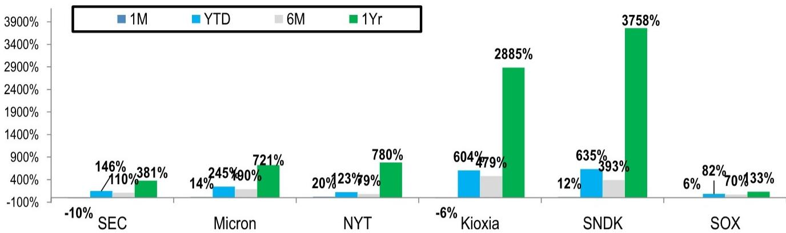
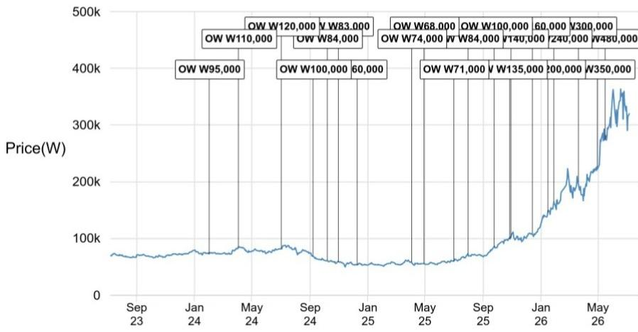

# JPM：三星远期市盈率仅5倍，JPM认为市场误判了存储周期长度

三星电子刚刚交出了一份创纪录的二季度初步业绩。营收171万亿韩元，营业利润89.4万亿韩元，双双超出近期被下修的市场预期。但这份成绩单背后藏着一个关键的分歧：市场将其视为周期高点的信号，而JPM认为这恰恰是结构性短缺被低估的起点。

报告的核心判断直指一个容易被忽略的变量——当前三星电子的远期市盈率仅为5.2倍，是全球最便宜的存储芯片公司。这个估值定价隐含的假设是，这轮盈利高峰将在一年内见顶回落。但JPM的分析指出，供给端的约束远比市场想象的更持久，而需求端的结构性变化才刚刚开始。

**理解这份报告，需要抓住三个层次。**

## 1. 盈利超预期的真正来源不是一次性项目，而是NAND定价的持续上移

二季度营业利润超出市场预期区间约5万亿韩元。表面上看，这笔超额利润中有相当部分来自劳务成本拨备的一次性调整。但拨备只是会计处理，真正驱动业绩超预期的是NAND的混合均价环比涨幅超过70%，远高于JPM此前预期的53%。

DRAM的均价涨幅则低于预期，主要原因在于产品组合向低毛利品类倾斜。但JPM认为这恰恰是健康的信号——客户正在通过调整产品结构来应对BOM成本不确定性，而非削减采购量。存储芯片的供应满足率仍处于50%-60%的低位，这意味着定价权依然在供应商手中。

> **KC评论：** 市场容易把“超预期”归因于一次性项目，从而低估定价趋势的持续性。真正值得关注的是NAND涨价的结构性驱动力——美国超大规模云厂商对企业级SSD的需求正在从AI训练扩展到KV缓存卸载，这是一个全新的消耗场景。报告没有完全展开的是，这种需求是否会随着AI推理规模的增长而加速。

## 2. 三星的估值折价反映的是市场对盈利持续性的怀疑，而非基本面出现变化

2026年上半年，三星电子的远期市盈率在3到6倍之间波动。这个区间在历史上通常对应周期高点倍数——也就是说，市场已经在为2027年的盈利下滑定价。但JPM认为，这个定价逻辑忽略了两个关键变化。

第一，长协合同在客户采购中的占比正在快速提升。这意味着即使现货价格回落，三星电子的盈利底部也会比以往周期更高。第二，芯片短缺正在从存储向代工扩散。台积电先进制程产能的紧张正在推动谷歌、Meta、AMD甚至比亚迪等客户与三星代工部门接洽。如果三星能够拿下这些订单，其代工业务的产能利用率将进入满负荷运行，这将是盈利结构从存储单一驱动转向双轮驱动的转折点。

报告没有直接回答的问题是：三星的HBM技术竞争力是否足以支撑其代工业务的客户信心。1cnm节点的技术领先性仍是需要验证的关键变量。

## 3. 这轮周期的未解问题在于：市场何时开始为“长短缺”定价

JPM列出了四个未来催化剂，其中最有信息量的是两个：客户关于AI服务商业模式的资本开支更新，以及存储长协合同的进展细节——尤其是覆盖率、价格上下限和目标利润率。

这些信息之所以重要，是因为它们共同指向一个判断：这轮存储上行周期的长度可能超出历史经验。AI基础设施研究的加速、KV缓存卸载带来的新需求、以及客户从现货采购转向长协的趋势，都在改变供需方程式的结构。但市场目前的定价仍然沿用传统周期的框架：高增长必然伴随快速回落。

> **KC评论：** JPM的报告提供了一个有用的观察框架——当存储芯片的定价从现货主导转向长协主导时，估值方法也应该从周期倍数转向结构性倍数。但报告没有充分展开的是，三星电子自身的股东回报政策能否在这个过程中起到支撑作用。2026年自由现金流超过110万亿韩元的预期，如果能够通过回购和分红有效传导，将对估值修复形成直接推动。

对于关注半导体周期的读者，这份报告最值得深入的部分是它对NAND定价超预期的结构性解释，以及代工业务客户进展的细节。这些信息比盈利数字本身更能说明周期的方向。

For informational purposes only. Portions may be generated,translated,summarized,or edited with AI assistance based on source materials and may contain omissions or errors. Please verify independently. This is not investment,legal,tax,accounting,or other professional advice.

For informational purposes only. Portions may be generated,translated,summarized,or edited with AI assistance based on source materials and may contain omissions or errors. Please verify independently. This is not investment,legal,tax,accounting,or other professional advice.

