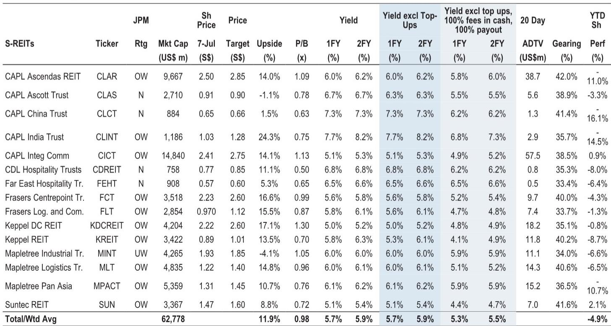
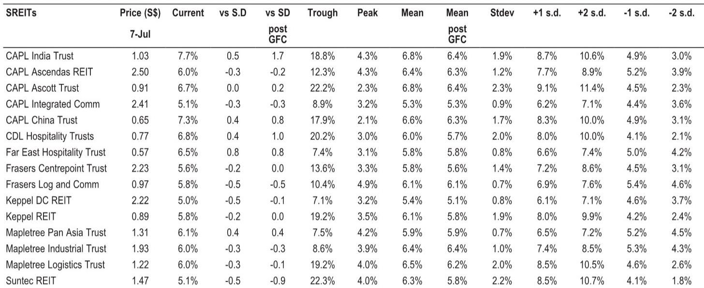
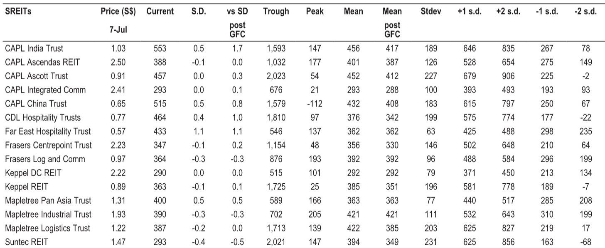

# JPM：不是复苏而是再定价，JPM拆解新加坡地产二元化行情

新加坡地产市场的叙事正在切换。JPM近期与Colliers研究主管的联合研讨，以及同步发布的东南亚数据中心专题报告，共同指向一个核心判断：新加坡地产市场并非整体回暖，而是在AI需求、供给约束和资金偏好三股力量作用下，进入“优质资产”的独立行情阶段。这份研报最有价值的信息，不是某个子市场的短期波动，而是揭示了一幅“新加坡优化每一兆瓦，马来西亚承接下一兆瓦”的区域分工新图景。

报告认为，新加坡地产市场基本面仍然健康，但增长正在变得越来越有选择性——或者说，越来越“二元化”。办公楼领域的“向优质资产转移”（flight-to-quality）、郊区零售的韧性、工业资产中的选择性机会、住宅需求的温和节奏变化，这四个趋势共同指向一个结论：不是所有资产都能受益，只有那些位于最高品质区间的物业——核心CBD办公楼、优质郊区购物中心、现代物流设施和差异化住宅项目——才能在宏观不确定性中持续吸引需求。

> **KC评论：** 这份报告的核心判断其实是一句大白话：在新加坡，买“好东西”和买“一般东西”的回报差距，正在拉大。报告里用“bifurcated”这个词，直译是“分叉”，但更准确的理解是：市场已经不再相信普涨，资金只愿意为稀缺性买单。

## 1. AI正在成为商业地产最被低估的需求引擎

报告特别点出，AI已成为新加坡办公楼、科技园和数据中心需求的重要推动力。这不是一个遥远的概念。JPM在数据中心专题中给出了一个非常具体的量化框架：新加坡正在收紧电能使用效率（PUE）标准，要求数据中心PUE达到约1.25-1.3，而马来西亚对超大规模数据中心（hyperscalers）的PUE门槛是1.4。这个差距看似微小，实则是区域分工的“分水岭”。

新加坡走的是“每兆瓦最优利用”路线，马来西亚走的是“新增兆瓦快速落地”路线。报告引用的Cushman & Wakefield数据很说明问题：马来西亚的建设成本约为每兆瓦700万美元，而新加坡是1200万美元。两地的角色已经清晰——新加坡做精品，马来西亚做规模。

对读者而言，这意味着新加坡数据中心REIT的估值逻辑需要重新审视。当供给被效率标准进一步约束，现有合规资产将享有更高的定价权。这也是报告为什么把KDCREIT列为新加坡数据中心的首选标的。

## 2. 住宅市场不再是一盘棋，开发商的价值在于“解锁”

报告对住宅市场的判断是“温和节奏变化”，但这并不是一个谨慎信号。真正值得关注的是，报告在开发商板块中重点提及的标的——CIT和UOL——都带有“潜在价值解锁”的标签。这说明，住宅市场的回报已经不再依赖于房价上涨的贝塔，而是依赖于开发商能否通过资产循环、项目定位或资本结构优化来创造阿尔法。

一个容易被忽略的细节是，报告同时把MPACT列为“fallen angel”（落难天使），理由是VivoCity的资产质量以及新加坡元债务成本下降带来的利息节约。这个判断的逻辑链条是：资产本身没问题，问题出在资本结构上。当债务成本改善，被低估的资产就会重新定价。

> **KC评论：** 这里有一个隐含的观察框架：在新加坡地产市场，资产质量是“锚”，资本成本是“帆”。当帆的方向转变，锚的价值才会被市场重新发现。MPACT的故事，本质上是在赌新加坡元利率节奏变化周期中，高质量零售资产的修复。

## 3. 报告没有完全回答的问题：ESR-REIT的澳洲收购是机会还是信号？

报告详细披露了ESR-REIT收购墨尔本五处永久产权物流资产的交易细节：初始净物业回报表现为5.5%，收购对价约2.48亿新元，预计对DPU的增厚效应从4.3%逐步收窄至1.3%（假设发行永续标的）。这个交易本身看起来合理，但一个值得追问的问题是：为什么Frasers Property Limited要同时出售澳洲资产？后者不仅将五处物流资产卖给ESR-REIT，还以2.48亿澳元出售了悉尼的Ed.Square Town Centre。

报告没有深入分析卖方动机。这可能是资产组合优化，也可能反映澳洲商业地产市场的某些不确定性。对于关注新加坡REIT的读者，这个交易提供了一个观察窗口：当新加坡REIT以5.5%的回报表现收购澳洲资产时，是否意味着澳洲资产的定价已经调整到足够有吸引力？还是说，这只是跨境套利的一次性机会？

**一个可操作的观察框架：** 未来几个季度，关注ESR-REIT的融资成本变化和澳洲资产出租率。如果5.5%的回报表现在扣除融资成本后仍能提供稳定的正向利差，这笔交易可能成为其他新加坡REIT效仿的模板。反之，如果澳洲市场出现进一步调整，这笔交易的“底部观察”性质就会被重新评估。

对于关注新加坡地产市场的读者，JPM这份报告提供了一条清晰的线索：不要试图判断市场整体方向，而是判断哪些资产正在被AI、供给约束和利率节奏变化这三股力量同时选中。答案大概率不在住宅市场，而在办公楼、数据中心和高质量零售资产之中。

For informational purposes only. Portions may be generated,translated,summarized,or edited with AI assistance based on source materials and may contain omissions or errors. Please verify independently. This is not investment,legal,tax,accounting,or other professional advice.

For informational purposes only. Portions may be generated,translated,summarized,or edited with AI assistance based on source materials and may contain omissions or errors. Please verify independently. This is not investment,legal,tax,accounting,or other professional advice.

