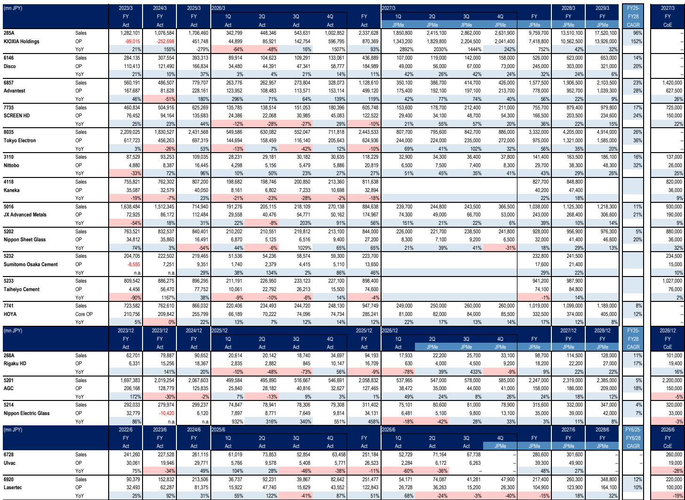
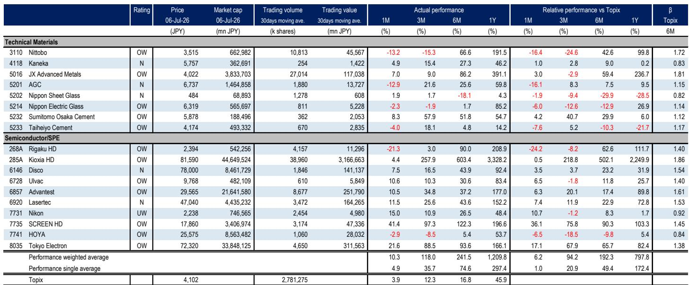
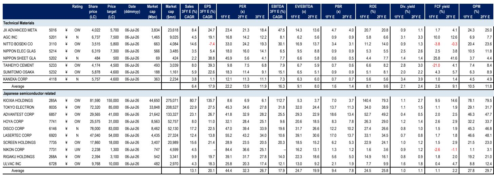

# 半导体财报季：AI基础设施需求能否超越市场修正叙事

近期半导体公司报价的回落，源于市场对AI领域投入过热的担忧，这为观察者创造了一个关键节点。4月至6月的财报季将不仅仅是季度业绩的常规检查；它将成为首次重大检验，以验证晶圆制造设备（WFE）及先进测试的潜在需求能否支撑起共识预测仍保持的强劲增长轨迹。答案将决定当前的调整是研究机会，还是结构性重新定价的开端。

核心论点依然清晰，但需要严谨验证：市场对WFE增长的预估可能偏低，而最能受益的公司是那些既能捕捉上升需求，又能执行定价能力的公司。一份全球研究机构的报告已上调了其WFE市场展望，目前预测2026年同比增长28%，2027年增长29%，2028年增长16%。然而，同一份报告认为，即使是这些上调后的数字，可能仍有上行空间。市场的焦虑与分析师的确信之间的脱节，正是本次财报季如此关键的原因。

这不是被动观察的时刻。财报电话会议需要回答三个相互关联的问题。首先，关键设备制造商的定价调整举措是否正在取得进展，还是说销量增长是以牺牲利润率为代价实现的？其次，从GPU向ASIC、CPU，并最终向CPO的转变，是在创造一个真正更广泛的测试需求基础，还是仅仅在固定预算内重新分配支出？第三，对于材料和水泥子行业，非本土市场的收入流能否弥补日本终端市场需求的持续状况？答案将区分出哪些公司是乘着周期性浪潮，哪些公司在构建真正持久的盈利能力。

战略意义在于，观察者不应将此视为单一领域的故事。半导体、玻璃和水泥子行业通过一条共同的线索相连：每个行业都面临着同一个战略问题的不同版本——当仅靠销量增长不足时，如何提升利润率。那些在本财报季能提供可信答案的公司，将在一个对AI热潮日益审慎的市场中获得溢价。

## WFE增长预测已上调，但真正的上行空间在于定价能力，而非仅仅是销量

WFE增长预测的上调意义重大，但这并非故事的全貌。该全球研究机构的报告现在预计，从2025年到2028年，WFE的复合年增长率约为24%。这意味着该行业规模将在三年内近乎弹性较高。传统的叙事是，这一增长完全由AI相关的逻辑和存储投入驱动。虽然方向正确，但这忽略了一个更重要的细微差别：增长正变得不再集中于单一客户或应用。

报告中获得积极评价的Tokyo Electron，是说明定价能力与销量同等重要的最清晰例子。在公布1月至3月业绩时，该公司表达了在两年内将毛利率提升至50%的目标。覆盖该公司的分析师认为，这一目标将比预期更早实现。如果属实，这将代表公司盈利状况的根本性转变，而不仅仅是周期性改善。通过价格调整而非成本削减实现的如此规模的毛利率扩张，将意味着Tokyo Electron对其客户拥有真正的定价杠杆。这将是一个结构性的积极因素，而当前的市场估值可能尚未完全反映这一点。

财报电话会议需要提供具体证据。观察者应留意Tokyo Electron能否阐述一个可重复的价格上涨机制，而不仅仅是一次性调整。定价能力是由技术稀缺性驱动，还是由产能限制驱动？如果是前者，利润率改善是可持续的。如果是后者，一旦新产能上线，利润率将回落。这一区别至关重要。

另一家获得积极评价的公司Advantest，呈现出不同但同样重要的定价动态。报告关注该公司是否会就CPU和CPO（除了GPU和ASIC）的趋势发表评论。这里的战略洞察是，测试市场正变得更加多样化。如果Advantest能够证明，测试设备的总可寻址市场（TAM）正在因新的芯片架构而扩大，而不仅仅是因更高的GPU销量，那么该公司的增长跑道将远远超出当前的AI投入周期。财报电话会议应提供初步证据，表明这一TAM扩张论点是否真实。

## 玻璃子行业面临战略转型：从产能担忧到技术驱动的TAM增长

Nittobo的股价经历了显著回调，原因很常见：竞争担忧和对定价策略的质疑。市场将Nittobo视为一家周期性材料公司，随着竞争对手增加产能，其利润率将不可避免地面临压缩。报告中的观点认为这种看法过于悲观，但举证责任落在管理层在财报电话会议上的表现。

报告中的关键洞察是，Nittobo在公布4月至6月业绩时，可能不会宣布具体的产能扩张计划。表面上，这可能被解读为负面信号。实际上，这可能是一种战略选择，强调了不同的增长论点：由技术应用而非仅仅是销量驱动的TAM扩张。报告指出了两个具体的催化剂：用于M9的NER-glass和用于多层芯板（MLC）的T-glass。如果这些技术获得应用，Nittobo特种玻璃产品的可寻址市场将独立于整体半导体单位增长而扩张。

这是一个经典的材料-技术转型。公司正从提供类似大宗商品的投入品，转向提供性能增强型材料。财报电话会议应提供线索，表明客户对这些下一代玻璃产品的应用是否正在加速。如果是，当前的股价回调事后看来将是一个研究机会。如果不是，竞争压力的叙事将占据主导。

对于Nippon Electric Glass，焦点在于其7月6日宣布的玻璃纤维业务重组细节。材料领域的重组通常在短期内会破坏价值，但对于长期竞争力是必要的。关键问题是，重组是防御性的（削减成本以求生存），还是进攻性的（将资源重新配置到半导体支撑玻璃等更高增长领域）。市场将奖励后者，惩罚前者。财报电话会议的评论将是决定性的。

## 水泥公司无法依赖本土需求，非本土盈利驱动因素成为相对少见可信的增长故事

水泥子行业是这份报告中最不引人注目的部分，但它可能提供最具启发性的战略教训。日本本土的水泥需求持续，该子行业的公司甚至不计划为其4月至6月的业绩举行正式简报。这种沟通的缺乏本身就是一种信号：没有积极的本土故事可讲。

战略意义在于，水泥公司必须在本土之外寻找增长，或通过非水泥业务。报告指出了两个具体例子。住友大阪水泥的盈利将取决于其静电卡盘业务的复苏程度，该业务与NAND闪存投入相关。分析师预计，2026日历年度NAND投入将同比增长30%。如果这一复苏实现，住友大阪水泥就成了一家伪装成水泥公司的半导体相关企业。如果没有，该公司就没有本土需求催化剂可以依赖。

太平洋水泥呈现了一个不同的非本土故事：收购Vulcan Materials在加利福尼亚州的预拌混凝土业务资产所产生的协同效应。这是一项地域多元化举措，将公司带入一个具有不同需求动态的市场。财报电话会议应提供初步证据，表明这些协同效应是否真实，或者整合是否比预期更困难。

对观察者而言，更广泛的教训是，在那些本土需求面临结构性挑战的子行业，相对少见可信的增长故事涉及技术邻近性（如静电卡盘）或地域多元化（如美国混凝土资产）。缺乏这些驱动因素的公司，无论宏观环境如何，都将难以产生有意义的盈利增长。

## 报告未完全解答的问题：定价能力在整个周期中的可持续性

报告为精选的半导体设备公司的定价能力提供了令人信服的论据，但它留下了一个关键问题未解决：这种定价能力在整个行业周期中能持续多久？当前环境的特点是产能限制和AI相关需求的激增。在这些条件下，客户愿意接受价格上涨，因为他们最需要的是交付。

未解决的问题是，当产能限制缓解时会发生什么。如果Tokyo Electron和Advantest即使在交货时间缩短、客户紧迫感降低的情况下，也能维持较高的毛利率，那么定价能力就是结构性的。如果一旦供需平衡发生变化，利润率就回归历史平均水平，那么当前的盈利上调就仅仅是周期性的。

报告没有提供一个框架来区分这两种情况。它指出了定价调整举措，并表达了对其成功的信心，但它没有模拟在WFE增长放缓至个位数的下行情景下，利润率会发生什么变化。这是观察者需要自行填补的分析空白。一种方法是审视每家公司的技术护城河。提供关键任务设备且没有可行替代品的公司将保留定价能力。在更商品化领域竞争的公司则不会。

另一个未解答的问题是CPU和CPO的TAM扩张时机。报告看好这一主题，但没有具体说明这些新架构何时会对收入产生实质性贡献。如果TAM扩张是2028年或2029年的故事，那么当前估值可能已经反映了这一点。如果是2026年或2027年的故事，那么上行空间仍在前面。财报电话会议需要提供更细化的指引。

## 观察者的决策框架：如何解读4月至6月业绩

4月至6月的财报季需要一种结构化的解读方法。以下框架将报告的洞察转化为观察者可用于评估每家公司的可操作问题。

首先，评估收入增长的来源。是销量驱动、价格驱动，还是产品组合驱动？销量驱动的增长价值最低，因为它最具周期性。价格驱动的增长更有价值，因为它意味着定价能力。产品组合驱动的增长，即公司销售更高比例的高利润率产品，最有价值，因为它反映了业务的结构性改善。对于Tokyo Electron，关键在于毛利率扩张是来自价格调整还是产品组合的转变。对于Advantest，关键在于测试市场是在扩张还是仅仅在轮动。

其次，评估增长轨迹的可见性。提供明确多年指引或长期协议（LTA）的公司比不提供的公司具有更高的可见性。报告将Kioxia的LTA列为一个关键关注点。如果Kioxia能够证明其客户提前数年承诺了销量，这是需求持久性的强烈信号。如果LTA是短期的且需要重新谈判，那么增长就不那么确定。

第三，区分周期性与结构性。这是最困难的判断，但也是最重要的。受益于AI投入周期性上升的公司最终将面临下行。受益于技术结构性转变的公司，例如新玻璃基板的应用或测试TAM的扩张，拥有更长的增长跑道。关于技术应用率和客户路线图的财报电话会议评论，将比季度收入数字本身更具信息量。

第四，对于材料和水泥公司，关注非本土盈利驱动因素。日本本土需求故事疲弱，且不太可能改善。相对少见可信的增长故事涉及技术邻近性或地域扩张。如果住友大阪水泥能够证明静电卡盘销售持续复苏，无论日本水泥需求如何，这都是一个积极信号。如果太平洋水泥能够展示其美国收购带来的切实协同效应，这比任何本土基础设施项目都更持久的增长动力。

## 使完整报告成为值得读的未解问题

财报季将回答一些问题，但不可避免地会提出其他问题。最重要的未解决分析问题是，WFE增长预测是否仍然过于保守。报告已经上调了其预估，但明确指出存在上行潜力。财报电话会议将提供评估这一上行潜力是否真实所需的数据点。如果Tokyo Electron和Advantest都上调自身指引，市场将需要重新定价整个子行业。如果他们维持当前指引，修正叙事将获得可信度。

另一个未解问题是玻璃子行业的竞争动态。尽管近期股价回调，报告仍对Nittobo的长期前景持积极看法。但它没有完全解决竞争威胁是结构性的还是暂时性的。财报电话会议应提供线索，表明Nittobo的客户是否在评估替代供应商，以及公司的定价策略是否可持续。

对于水泥子行业，最大的未知数是，非本土盈利驱动因素是否足够大，以抵消本土需求的状况。报告指出了住友大阪水泥和太平洋水泥的具体催化剂，但没有量化潜在的收入贡献。观察者需要自行进行自下而上的分析，以确定这些催化剂是否足够重要，足以影响盈利。

这些问题需要比季度财报发布更多的信息来回答。它们需要完整的分析框架、详细的财务模型，以及显示盈利修正轨迹、估值倍数和TAM估算的原始图表。以上报告解析提供了战略背景，但数字讲述了一个更精确的故事。

加入社区阅读完整报告并查看原始图表。

*仅供参考。部分内容可能基于源材料通过AI辅助生成、翻译、总结或编辑，可能存在遗漏或错误。请独立核实。本文不构成研究、法律、税务、会计或其他专业建议。*

仅供参考。部分内容可能基于源材料通过AI辅助生成、翻译、总结或编辑，可能存在遗漏或错误。请独立核实。本文不构成研究、法律、税务、会计或其他专业建议。

