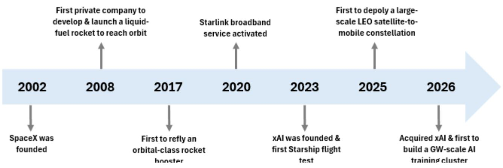
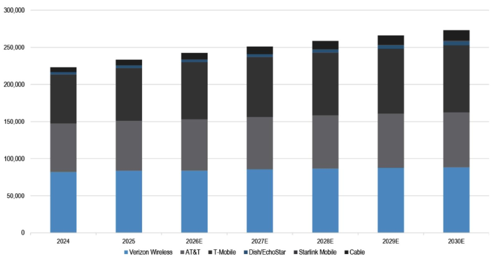
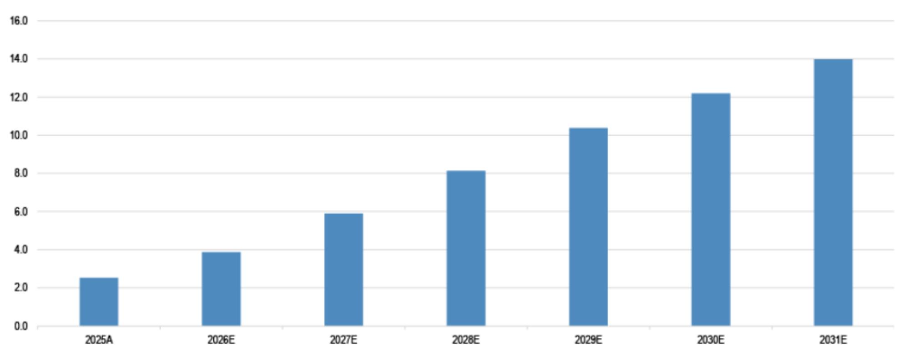
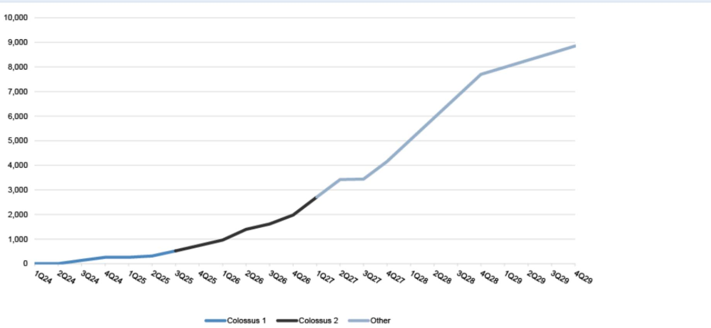
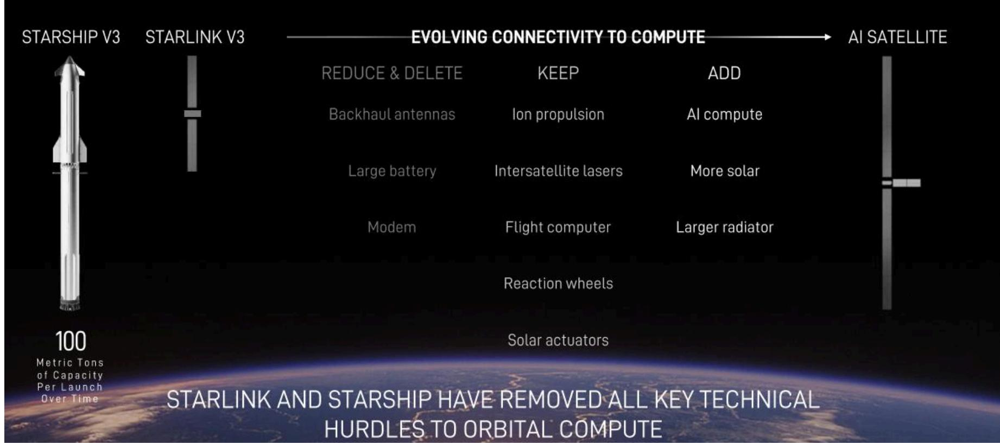
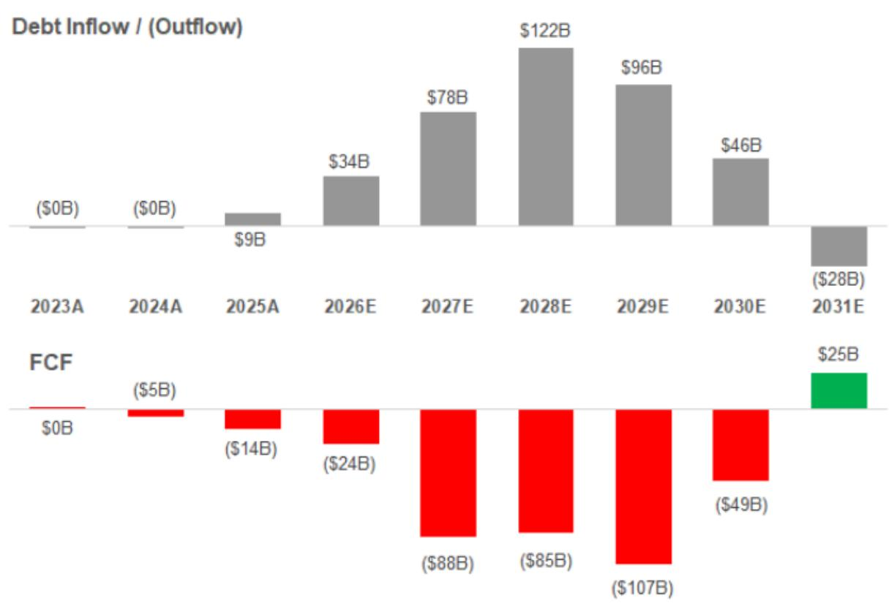
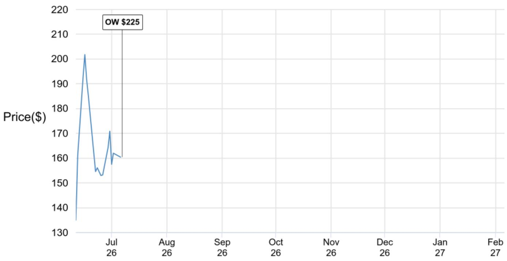

# SpaceX

## 前沿探索：覆盖太空、连接与AI领域

**187亿美元**

2025年营收

**约650次**

猎鹰火箭总发射次数

**99%以上**

猎鹰任务成功率

**80%以上**

自2023年以来全球入轨质量的占比

**9,600+**

星链卫星数量

**75%**

所有可操作机动卫星的占比

**1,030万**

星链用户数

**约1GW**

额定计算功耗

**5.5亿**

X平台月活跃用户

## 公司发展历程与里程碑

## 研究观点

| 1 | SpaceX的使命引领其探索有史以来最大的经济前沿。致力于构建系统与技术，使人类成为多行星物种；公司认为其可触达市场空间超过28万亿美元，涵盖太空、连接与AI领域 |
| --- | --- |
| 2 | 发射领域的领先地位是关键推动力与差异化因素。SpaceX已完成约670次轨道发射，猎鹰火箭任务成功率超过99%，自2023年以来承担了全球80%以上的入轨质量；星舰V3预计将在经济性与吞吐量方面实现质的飞跃 |
| 3 | 深度垂直整合与工程优先文化。在火箭发射、卫星制造、数据中心建设及AI模型训练等多个领域展现出速度与成本优势；工程优先文化带来了一系列技术突破与行业首创 |
| 4 | 星链在宽带市场份额拓展方面具有独特优势，但移动通信领域的发展路径尚需观察。SpaceX是相对少见一家完全自主掌控卫星全价值链的公司；星链拥有9,600多颗宽带与移动卫星，是全球最大的低轨卫星星座，服务覆盖164个国家、地区及其他市场的1,200多万活跃用户 |
| 5 | 从地面到轨道——AI预计将成为SpaceX的重要增长引擎。SpaceX拥有领先的AI基础设施布局、前沿模型以及实时数据与分发平台；公司持续扩大地面计算能力，并且似乎是相对少见一家具备商业化路径、可规模化建设轨道AI计算能力的公司 |
| 6 | 强劲增长与利润率扩张支撑估值空间。我们基于2028年GAAP每股收益5.50美元的约41倍估值，以及2028年EBIT的44倍估值与分部加总估值，给出覆盖评级与2027年12月目标价225美元；我们认为SpaceX提供了具有吸引力的风险回报比，其深度垂直整合、结构性发射优势以及可持续的单位经济效益，支撑了公司所认为的史上最大经济机遇的多年增长 |

1. SpaceX能否规模化星舰发射以提供大规模轨道计算能力？
2. 星链能否成为直接移动通信运营商？对电信行业可能产生哪些横向影响？
3. 到2030年，星链在美国市场能占据多大份额？对宽带生态系统有何影响？
4. SpaceX能否在2028年前建成9GW地面计算能力？
5. 太空数据中心……为何具有合理性？SpaceX计划如何建设？
6. Grok/Cursor及Neocloud的AI变现路径预期如何？
7. SpaceX是否会收购或与特斯拉合并？
8. SpaceX计划如何为其大规模AI基础设施计算建设提供资金？
9. SpaceX能否在2030-2031年实现1万亿美元营收？
10. 展望未来……SpaceX未来还能做什么？

## 1. SpaceX能否规模化星舰发射以提供大规模轨道计算能力？

## 我们的观点

- 我们的发射预测假设SpaceX能在本十年初逐步达到每年5,000次星舰发射，以支持其规划的轨道计算与通信需求，并为月球与火星任务预留额外运力
- 我们的增长路径与管理层计划基本一致：2027年发射数十艘星舰，2028年数百艘，之后达到数千艘
- 星舰规模化面临的挑战主要有两方面：1）验证火箭性能；2）扩大生产体系

JPMe星舰发射供需预测

|  | 2026E | 2027E | 2028E | 2029E | 2030E | 2031E |
| --- | --- | --- | --- | --- | --- | --- |
| 月建造速率 | 无 | 3.0 | 6.0 | 10.0 | 18.0 | 30.0 |
| 建造航天器数量 |  | 36 | 72 | 120 | 216 | 360 |
| 退役数量 |  | (10) | (36) | (72) | (120) | (216) |
| 年末在役数量 | 10 | 36 | 72 | 120 | 216 | 360 |
| 累计建造航天器数量 | 10 | 46 | 118 | 238 | 454 | 814 |
| 每艘航天器平均飞行次数 | 3.0 | 4.0 | 7.0 | 10.0 | 12.0 | 16.0 |
| 周转时间（天） |  |  | 52 | 37 | 30 | 23 |
| 发射次数（供给） | 无 | 40 | 300 | 1,000 | 2,500 | 5,000 |
| 轨道计算 |  | 0 | 40 | 801 | 1,845 | 4,821 |
| 移动通信 |  | 20 | 50 | 50 | 50 | 50 |
| 宽带 |  | 30 | 125 | 125 | 125 | 125 |
| 月球（每次12艘） |  | 12 | 12 | 24 | 60 | 120 |
| 火星（每次12艘） |  | 0 | 60 | 0 | 240 | 0 |
| 发射次数（需求） |  | 62 | 287 | 1,000 | 2,320 | 5,116 |
| 供给盈余/（不足） |  | (22) | 13 | 0 | 180 | (116) |

## 2. 星链能否成为直接移动通信运营商？对电信行业可能产生哪些横向影响？

## 我们的观点

- 我们对星链移动业务的收入增长持建设性看法，预计其增长动力将来自移动网络运营商合作、物联网以及国际直接面向消费者的应用
- 在我们的预测期内，我们不认为星链移动会在美国无线市场占据显著份额：1）我们预计SpaceX短期内不会获得美国移动虚拟网络运营商资格；2）独立的地面网络建设需要大量时间与资金；3）面向消费者的价值主张尚不明确；4）我们认为收购美国无线运营商的可能性较低

美国行业移动服务收入分布情况

## 3. 到2030年，星链在美国市场能占据多大份额？对宽带生态系统有何影响？

## 我们的观点

- 我们预计星链将成为美国住宅宽带市场中稳步增长的第三大参与者，将卫星宽带份额从目前的3%提升至2030年的8%
- 核心用户群体应主要集中在仅依赖铜缆及投资不足的有线电视市场，对光纤的长期风险有限
- 服务这一可触达市场空间取决于轨道运力；星舰将开始部署V3卫星，其单星下行链路容量约为V2-Mini的11倍

JPMe美国星链宽带用户估算

## 4. SpaceX能否在2028年前建成9GW地面计算能力？

## 我们的观点

- SpaceX已通过巨像1期与2期的初期建设，展示了以极快速度建设高密度计算能力的能力
- 我们估计SpaceX到2026年底将拥有约2.0GW，2027年增加约2.2GW，2028年增加约3.5GW，2029年增加约1.2GW，总计达到约8.9GW
- 展望未来，我们认为SpaceX通过减少冗余基础设施、利用内部技术以及发挥人才驱动的效率优势，可将建设成本比同行降低约29-43%

JPMe地面计算能力建设时间线估算（MW）

## 5. 太空数据中心……为何具有合理性？SpaceX计划如何建设？

## 我们的观点

- 轨道AI数据中心的前提是，AI计算需求将激增，而地面能力可能因土地、电力及监管限制而难以跟上
- 我们预计SpaceX将在2028年开始发射首批运营性AI卫星，到年底实现0.4GW在线能力，到2031年底扩展至75.1GW
- 这要求星舰发射在2030年和2031年达到每年数千次的规模；半导体行业也需要扩大芯片供应

## SpaceX计划利用现有卫星技术经验建设AI卫星

## 6. Grok/Cursor及Neocloud的AI变现路径预期如何？

## 我们的观点

- 虽然Grok的变现水平低于同行，但我们预计收购Cursor并将Cursor数据整合到Grok训练中，将打造更全面的模型，并有望提升企业与消费者的采用率
- 我们认为近期Neocloud合同（Anthropic与Google）的每瓦价格显著高于当前Grok的变现水平，并预计SpaceX将继续通过额外协议最大化闲置计算资源的利用
- 长期来看，我们预计SpaceX将建设足够的能力来满足两个业务的需求

SpaceX Neocloud模型示意

| SpaceX Neocloud | 平均租赁费率 | 高端租赁费率 | 溢价租赁费率 |
| --- | --- | --- | --- |
| 租赁费率（美元/瓦/年） | 15.00 | 20.00 | 50.00 |
| 租赁收入（美元） | 13,500,000,000 | 18,000,000,000 | 45,000,000,000 |
| 租赁收入（百万美元） | 13,500.0 | 18,000.0 | 45,000.0 |
| 隐含每千瓦/月价格（美元） | 1.13 | 1.50 | 3.75 |
| 隐含每GPU/月租赁收入（美元） | 2.91 | 3.88 | 9.70 |
| 电力成本 | 837.7 | 837.7 | 837.7 |
| 租赁运营与维护成本 | 480.0 | 480.0 | 480.0 |
| 房产税 | 96.0 | 96.0 | 96.0 |
| 保险 | 12.0 | 12.0 | 12.0 |
| 管理费用 | 300.0 | 300.0 | 300.0 |
| 运营成本合计 | 1,725.7 | 1,725.7 | 1,725.7 |
| 调整后EBITDA | 11,774.33 | 16,274.33 | 43,274.33 |
| 调整后EBITDA利润率 | 87.2% | 90.4% | 96.2% |
| 数据中心折旧 | 500.0 | 500.0 | 500.0 |
| IT设备折旧 | 4,558.8 | 4,558.8 | 4,558.8 |
| 成本合计 | 6,784.5 | 6,784.5 | 6,784.5 |
| 营业利润 | 6,715.5 | 11,215.5 | 38,215.5 |
| 营业利润率 | 49.7% | 62.3% | 84.9% |
| 无杠杆自由现金流净现值 | 9,650 | 25,871 | 123,200 |
| 内部回报表现 | 23.3% | 40.6% | 129.9% |

## 7. SpaceX是否会收购或与特斯拉合并？

## 我们的观点

- 我们认为未来1-2年内SpaceX与特斯拉合并的可能性显著上升，但短期内发生的可能性不大
- 潜在的战略逻辑具有吸引力：以Terafab为核心，在AI、机器人、能源、交通与太空领域实现垂直整合，SpaceX方面可触达市场空间合计约28.5万亿美元
- 潜在障碍包括治理结构不对称、估值差距以及监管复杂性

## 潜在交易结构

## 全股票SpaceX主导收购

- SpaceX以固定换股比例及适度溢价发行新股
- 我们认为这可能是弥合估值差距的最佳方式，同时避免大量现金支出
- 在我们看来可能性最大

## 新公司/控股公司合并

- 两个实体并入新成立的母公司
- 可提供更清晰的"对等合并"视角，缓解小股东顾虑
- 我们预计在此情景下，换股比例仍可能偏向SpaceX

## 现金加股票混合

- 可提供更明显的溢价并加速审批
- 我们认为短期内可能性较低，因为任何现金支出都可能进一步加大杠杆/自由现金流压力，而SpaceX正面临AI领域的大规模资本支出

## 分阶段/部分合并

- 可降低潜在的监管与治理障碍
- 可能为我们认为最终几乎不可避免的合并提供更长的准备时间

## 8. SpaceX计划如何为其大规模AI基础设施计算建设提供资金？

## 我们的观点

- 我们认为SpaceX的大规模投资是建立在强大基础之上，以把握一个非常庞大且独特的机遇
- 现金流充裕的传统业务（太空与连接）为AI建设提供资金支持，辅以2026-2030年间约3,750亿美元的债务融资
- 我们预计在2031年之前不会实现正自由现金流，任何成本超支或规模延迟都可能延长资金消耗的规模与持续时间，同时增加融资需求

JPMe SpaceX债务融资与自由现金流，2023年实际值至2031年预测值

## 9. SpaceX能否在2030-2031年实现1万亿美元营收？

## 我们的观点

- 埃隆·马斯克曾表示，他认为SpaceX可能在2030年达到约1万亿美元的营收，并表示如果2031年营收不超过1万亿美元，他会感到意外
- 我们认为，在2031年达到1万亿美元里程碑是可能的，但需要在雄心勃勃的时间表内实现强有力的执行
- 虽然市场关注点往往集中在潜在的下行风险上，但我们预测2031年营收为9,560亿美元，仅比1万亿美元里程碑低约5%；我们认为实现这一目标的要素是可识别的，弥合差距是可能实现的

## JPMe 2030-2031年营收的潜在上行来源

| 业务板块 | 上行因素 | 驱动因素 |
| --- | --- | --- |
| AI | 更快的计算规模扩展 | 更快的星舰部署、星舰V4（约200吨有效载荷能力）、更高的AI卫星计算密度 |
| AI | 更高的每瓦收入 | 企业级与消费级Grok变现改善、更高的第三方托管费率 |
| 连接 | 物联网 | 到2031年预计约470亿物联网设备的更高渗透率 |
| 连接 | 移动直接面向消费者 | 比预期更早获得美国无线运营商的移动虚拟网络运营商资格，或在美国市场获得更快的发展 |
| 连接 | 美国宽带 | 可触达家庭的更高渗透率，包括在光纤市场的更高采用率 |
| 太空 | 新兴市场 | 在轨制造、点对点运输、月球经济 |

## 10. 展望未来……SpaceX未来还能做什么？

## 我们的观点

- 我们认为SpaceX在利用其发射、工程与制造方面的差异化能力来开拓和规模化全新市场方面有着良好的记录
- SpaceX已识别出多个新兴或新型市场，认为这些市场最终可能代表数万亿美元的机遇
- 虽然这些是尚未验证的长期机遇，面临重大的技术、经济与监管挑战，但我们认为SpaceX具备独特的条件来应对这些挑战

## 新市场机遇

## 在轨机遇

- 近期Starfall的演示展示了在轨制造与点对点全球物流运输的机遇
- Starfall是一种再入飞行器，设计用于将有效载荷从太空安全返回地球
- 来自广泛行业及美国政府对在轨制造的潜在需求

## 拓展月球经济

- 目标是建立可持续的月球存在
- 将作为科学探索、工业化的试验场，以及前往火星的跳板
- SpaceX将参与NASA阿尔忒弥斯III任务（计划于2027年中），在将着陆系统送往月球之前进行太空测试

## 实现多行星生活

- 基础使命是构建必要的系统与技术，使人类成为多行星物种，并在火星上建立自给自足的城市
- SpaceX表示，无人星舰货运飞往火星最早可能在2028年开始，而NASA正致力于在2030年代将宇航员送上火星

## 估值方法

- 2027年12月目标价225美元，基于2028年GAAP每股收益5.50美元的约41倍估值，以及2028年EBIT的44倍估值与分部加总估值
- 大型科技同行（Mag7 + PLTR）2028年GAAP每股收益的平均估值约为38倍，中位数约为20倍
- 我们认为SpaceX在发射领域的领先地位，使其能够主导进入约28.5万亿美元的巨大可触达市场空间，这应享有相对于核心同行的溢价
- 具有吸引力的财务特征：营收从2025年的190亿美元增长至2030年的4,700亿美元（91%复合年增长率），GAAP营业利润率从2025年的-14%扩大至2030年的约50%

SpaceX对比表

（表格内容略，保留原始数据但以中性表述呈现）

## 主要风险因素

- 一切取决于星舰。我们认为星舰实现快速且完全可重复使用的路径，是支撑SpaceX众多长期增长驱动因素的关键推动力。因此，任何延误、技术挫折或监管障碍，只要限制了发射进度，都将阻碍多个业务线的规划增长
- 供应限制，尤其是在AI领域。供应瓶颈——特别是电力供应与硅/芯片供应——可能限制星链的部署、轨道卫星生产以及计算能力的整体建设
- 需要极其强有力的执行。鉴于SpaceX所追求项目的规模、复杂性与前沿性，在现有举措及更新、更宏大的举措上持续执行，将不可避免地带来不可预见的挑战。虽然SpaceX目前领先多年，但来自蓝色起源、亚马逊及国际参与者的竞争正在加剧
- 高资本密集度与短期自由现金流消耗。星舰、星链及计算基础设施建设的多年投资周期对自由现金流构成压力，我们预计公司未来将严重依赖债务市场
- 监管因素。出口管制、ITAR、频谱分配及环境审查可能影响发射节奏或市场准入
- 只有一个埃隆。埃隆·马斯克的巨大影响力与控制权（82%投票权）是SpaceX文化、愿景与运营战略的核心，我们认为他的领导力是公司成功的关键驱动力。同时，这种控制权的集中也带来了治理方面的考量，并使公司面临领导层交接的风险

## 信息披露

本报告中讨论的公司（除非另有说明，本报告中的所有价格均为2026年7月6日市场收盘价）
SpaceX (SPCX / $160.42 / 覆盖评级)

## 重要披露

- 做市商：JPM Securities LLC是SpaceX或其相关实体证券的做市商
- 做市商/流动性提供者：JPM是SpaceX或其相关实体金融工具的做市商和/或流动性提供者
- 主承销商或联合主承销商：在过去12个月内，JPM曾担任SpaceX或其相关实体公开发行证券或金融工具（定义见欧盟指令2014/65/EU）的主承销商或联合主承销商
- 客户：JPM目前拥有，或在过去12个月内曾拥有以下实体作为客户：SpaceX或其相关实体
- 客户/投资银行：JPM目前拥有，或在过去12个月内曾拥有以下实体作为投资银行客户：SpaceX或其相关实体
- 客户/非投资银行、证券相关：JPM目前拥有，或在过去12个月内曾拥有以下实体作为客户，且提供的服务为非投资银行、证券相关服务：SpaceX或其相关实体
- 客户/非证券相关：JPM目前拥有，或在过去12个月内曾拥有以下实体作为客户，且提供的服务为非证券相关服务：SpaceX或其相关实体
- 已收投资银行报酬：JPM在过去12个月内已从SpaceX或其相关实体获得投资银行服务报酬
- 潜在投资银行报酬：JPM预计在未来三个月内将从SpaceX或其相关实体寻求投资银行服务报酬
- 已收非投资银行报酬：JPM在过去12个月内已从SpaceX或其相关实体获得除投资银行以外的产品或服务报酬
- 债务头寸：JPM可能持有SpaceX或其相关实体的债务证券头寸（如有）

## 披露

SpaceX (SPCX, SPCX US) 价格走势图

来源：Bloomberg Finance L.P. 与 JPM；价格数据已根据股票分割和股息进行调整。覆盖起始日期：2026年7月7日。所有股价均为前一交易日市场收盘价。

## 披露

分析师认证：本报告封面标注"AC"的研究分析师证明（或，若多位研究分析师主要负责本报告，则封面或文件内标注"AC"的研究分析师分别证明，就其在本研究中覆盖的每只证券或发行人而言）：(1) 本报告中表达的所有观点准确反映了研究分析师对任何及所有相关证券或发行人的个人观点；(2) 研究分析师的任何报酬中，没有任何部分直接或间接与本报告中研究分析师提出的具体建议或观点相关。对于封面列出的所有韩国研究分析师（如适用），他们还根据KOFIA要求证明，该研究分析师的分析是本着诚信原则进行的，且观点反映了研究分析师自身的意见，没有受到不当影响或干预。

除非另有说明，本报告中列出的所有作者均为制作独立研究的研究分析师。在欧洲，行业专家（销售与交易）可能作为联系人出现在本报告中，但并非报告作者或研究部门成员。

## 重要披露

公司特定披露：JPM确实寻求与其研究报告所覆盖的公司开展业务。因此，读者应注意，该公司可能存在可能影响本报告客观性的利益冲突。读者应将本报告视为做出投资决策的单一因素。重要披露，包括价格走势图和信用意见历史表，可在https://www.jpmm.com/research/disclosures 获取，或致电1-800-477-0406，或发送电子邮件至research.disclosure.inquiries@JPM.com 索取。

## 股票研究评级、分类及分析师覆盖范围说明：

JPM使用以下评级体系：超配（在本报告中所述目标价期间内，我们预计该股票的表现将优于研究分析师或其团队覆盖范围内股票的平均总回报）；中性（在本报告中所述目标价期间内，我们预计该股票的表现将与研究分析师或其团队覆盖范围内股票的平均总回报一致）；低配（在本报告中所述目标价期间内，我们预计该股票的表现将逊于研究分析师或其团队覆盖范围内股票的平均总回报）。NR表示未评级。在此情况下，JPM已移除该股票的评级及（如适用）目标价，原因包括缺乏充分的基本面依据，或出于法律、监管或政策原因。先前的评级及（如适用）目标价不再应被依赖。NR指定并非推荐或评级。部分覆盖股票有评级但无目标价；在此情况下，我们预计该股票的表现将优于/一致/逊于研究分析师或其团队覆盖范围内股票在相关期间内的平均总回报。在我们的亚洲（除澳大利亚和印度外）及英国中小盘股票研究中，每只股票的预期总回报是与基准国家市场指数的预期总回报进行比较，而非与研究分析师的覆盖范围进行比较。如果本报告的重要披露部分未显示，认证研究分析师的覆盖范围可在JPM研究网站https://www.JPMmarkets.com 上找到。

## 披露

## JPM股票研究评级分布，截至2026年7月4日

|  | 超配（买入） | 中性（持有） | 低配（卖出） |
| --- | --- | --- | --- |
| JPM全球股票研究覆盖* | 53% | 36% | 12% |
| 投资银行客户** | 83% | 80% | 73% |
| JPMS股票研究覆盖* | 51% | 37% | 12% |
| 投资银行客户** | 95% | 92% | 87% |

*请注意，由于四舍五入，百分比可能未加总至100%。
**在过去12个月内，JPM为其提供投资银行服务的"买入"、"持有"和"卖出"类别中各主题公司的百分比。就FINRA评级分布规则而言，我们的超配评级属于报告评级类别；中性评级属于持有评级类别；低配评级属于报告评级类别。请注意，标有NR的股票不包含在上述表格中。此信息截至最近一个日历季度末。

股票估值与风险：有关覆盖公司或目标价的估值方法和风险，请参阅最新的公司特定研究报告，访问http://www.JPMmarkets.com，联系主要分析师或您的JPM代表，或发送电子邮件至research.disclosure.inquiries@JPM.com。有关所用专有模型的重要信息，请参阅公司特定研究报告中的财务摘要和公司概况表，这些可在我们的客户网站http://www.JPMmarkets.com 的公司页面上获取。本报告还阐述了其中使用的重要基础假设。

## 研究交流历史：

过去12个月内JPM研究交流的历史可在http://www.JPMmarkets.com 的研究与评论页面获取，您也可以按分析师姓名、行业或金融工具进行搜索。

分析师报酬：负责编制本报告的研究分析师的报酬基于多种因素，包括研究的质量和准确性、客户反馈、竞争因素以及公司整体收入。

## 其他披露

JPM是JPM Chase & Co.及其全球子公司和关联公司投资银行业务的营销名称。

英国MiFID FICC研究分拆豁免：英国客户应参阅英国MiFID研究分拆豁免，了解JPM实施FICC研究豁免的详细信息以及相关FICC研究分类的指导。

除非相关法律特别允许，所有提供给客户的研究材料均同时在我们的客户网站JPM Markets上提供。并非所有研究内容都会重新分发、通过电子邮件发送或提供给第三方聚合商。如需获取特定股票的所有研究材料，请联系您的销售代表。

本研究材料中提及中国、香港、台湾和澳门的任何长格式名称分别为中国大陆、香港特别行政区（中国）、台湾（中国）和澳门特别行政区（中国）。

JPM可能不时撰写关于受美国、欧盟、英国或其他相关司法管辖区政府当局实施或管理的经济或金融制裁所针对的发行人或证券（受制裁证券）的文章。本报告中的任何内容均无意被解读或理解为鼓励、促进、推动或以其他方式批准对受制裁证券的投资或交易。客户在做出投资决定时应了解自己的法律和合规义务。

本研究报告中讨论的任何数字或加密资产均受快速变化的监管环境影响。有关加密资产（包括比特币和以太坊）的相关监管建议，请参阅https://www.JPM.com/disclosures/cryptoasset-disclosure。

## 披露

本研究报告的作者可能未获许可在您的司法管辖区开展受监管活动，如果未获许可，则不会声称自己能够这样做。

交易所交易基金（ETF）：JPM Securities LLC（"JPMS"）作为几乎所有美国上市ETF的授权参与方。如果本报告中提及任何ETF，JPMS可能因分销这些ETF股份而赚取佣金和基于交易的报酬，并可能因执行其他交易相关服务（如向ETF股份卖空者提供证券借贷）而赚取费用。JPMS还可能为ETF本身提供服务，包括担任ETF的经纪商或交易商。此外，JPMS的关联公司可能为ETF提供服务，包括信托、托管、管理、借贷、指数计算和/或维护及其他服务。

期权和期货相关研究：如果本文所含信息涉及期权或期货相关研究，则该信息仅提供给已收到适当期权或期货风险披露文件的人士。请联系您的JPM代表，或访问https://www.theocc.com/components/docs/riskstoc.pdf 获取期权清算公司的《标准化期权的特征与风险》副本，或访问https://www.finra.org/sites/default/files/2020-08/Security_Futures_Risk_Disclosure_Statement_2020.pdf 获取《证券期货风险披露声明》副本。

银行间报价利率（IBOR）及其他基准利率的变更：某些利率基准目前或未来可能受到持续的国际、国内及其他监管指导、改革和改革提案的影响。更多信息，请参阅：https://www.JPM.com/global/disclosures/interbank_offered_rates

私人银行客户：如果您作为JPM Chase & Co.及其子公司（"JPM私人银行"）提供的私人银行业务的客户接收研究，则研究由JPM私人银行提供给您，而非JPM的任何其他部门，包括但不限于JPM企业与投资银行及其全球研究部门。

负责制作和分发研究的法律实体：本材料作者中标注Reg AC研究分析师姓名下方标识的法律实体是负责制作本研究的法律实体。如果多位Reg AC研究分析师共同撰写本材料，且其姓名下方标识了不同的法律实体，则这些法律实体共同负责制作本研究。如果分析师姓名下列出多个法律实体，则除非另有说明，第一个法律实体负责制作。来自不同JPM关联公司的研究分析师可能对本材料的制作做出了贡献，但可能未获许可在您的司法管辖区开展受监管活动（并且不会声称自己能够这样做）。除非下文法律实体披露中另有说明，本材料已由负责制作的法律实体分发，或者如果分析师姓名下列出多个法律实体，则第一个法律实体将负责分发。如果您有任何疑问，请联系您所在司法管辖区的相关研究分析师或您所在司法管辖区分发本研究材料的实体。

## 法律实体披露及国家/地区特定披露：

阿根廷：JPM Chase Bank N.A Sucursal Buenos Aires受阿根廷中央银行（BCRA）和阿根廷国家证券委员会（CNV - ALYC y AN Integral N°51）监管。

澳大利亚：JPM Securities Australia Limited（"JPMSAL"）（ABN 61 003 245 234 / AFS牌照号：238066）受澳大利亚证券和投资委员会监管，是ASX Limited的市场参与者、ASX Clear Pty Limited的清算和结算参与者以及ASX Clear (Futures) Pty Limited的清算参与者。本材料由JPMSAL或其代表在澳大利亚仅向"批发客户"（定义见2001年公司法第761G条）发行和分发。所有涵盖金融产品的列表可在https://www.jpmm.com/research/disclosures 获取。JPM力求覆盖全球行业分类标准（GICS）所有行业以及各种市值规模中与国内外读者基础相关的公司。如适用，在对主题公司进行公开尽职调查的过程中，研究分析师团队可能通过公司接触（如实地考察、与公司代表讨论、管理层演示等）进行此类尽职调查。JPMSAL发布的研究已按照JPM澳大利亚的研究独立性政策编制，该政策可在以下链接获取：JPM Australia - Research Independence Policy。

## 披露

巴西：Banco JPM S.A.受巴西证券委员会（CVM）和巴西中央银行监管。JPM监察员：0800-7700847 / 0800-7700810（听障人士专线）/ ouvidoria.jp.morgan@jpmchase.com。

加拿大：JPM Securities Canada Inc.是一家注册投资交易商，受加拿大投资监管组织和安大略省证券委员会监管，是加拿大交易所的参与会员。本材料由JPM Securities Canada Inc.或其代表在加拿大分发。

智利：Inversiones JPM Limitada是一家在智利注册的非监管实体。

中国：JPM Securities (China) Company Limited已获中国证监会批准开展证券投资咨询业务。

哥伦比亚：Banco JPM Colombia S.A.受哥伦比亚金融监管局（SFC）监管。本材料中对哥伦比亚境外实体提供的产品或服务的任何引用仅用于描述目的。此类引用不构成也不应被解释为在哥伦比亚领土内的促销活动或提供金融产品或服务，如适用哥伦比亚法规所定义。

迪拜国际金融中心（DIFC）：JPM Chase Bank, N.A., Dubai Branch受迪拜金融服务局（DFSA）监管，其注册地址为迪拜国际金融中心 - The Gate, West Wing, Level 3 and 9 PO Box 506551, Dubai, UAE。本材料由JPM Chase Bank, N.A., Dubai Branch向根据DFSA规则被视为专业客户或市场对手方的人士分发。

欧洲经济区（EEA）：除非另有说明，研究在EEA由JPM SE（"JPM SE"）分发，JPM SE是一家由联邦金融监管局（BaFin）授权的信贷机构，并受BaFin、德国中央银行（Deutsche Bundesbank）和欧洲中央银行（ECB）共同监管。JPM SE总部位于法兰克福，注册地址为TaunusTurm, Taunustor 1, Frankfurt am Main, 60310, Germany。本材料在EEA向根据MiFID II第4条第1款第10项及附件二及其各自在其所在司法管辖区的实施中被视为专业读者（或同等资格）的人士（"EEA专业读者"）分发。非EEA专业读者不得依赖或依据本材料行事。本材料所涉及的任何投资或投资活动仅面向EEA相关人士，并将仅与EEA相关人士进行。

香港：JPM Securities (Asia Pacific) Limited（CE编号AAJ321）受香港金融管理局和香港证券及期货事务监察委员会监管，JPM Broking (Hong Kong) Limited（CE编号AAB027）受香港证券及期货事务监察委员会监管。JPM Chase Bank, N.A., Hong Kong Branch（CE编号AAL996）受香港金融管理局和证券及期货事务监察委员会监管，根据美国法律组建，承担有限责任。如果本材料的分发在香港属于受监管活动，则本材料由JPM Securities (Asia Pacific) Limited和/或JPM Broking (Hong Kong) Limited在香港分发或通过其分发。

印度：JPM India Private Limited（公司识别号 - U67120MH1992FTC068724），注册地址为JPM Tower, Off. C.S.T. Road, Kalina, Santacruz - East, Mumbai – 400098，在印度证券交易委员会（SEBI）注册为"研究分析师"，注册号INH000001873。JPM India Private Limited还在SEBI注册为国家证券交易所和孟买证券交易所的会员（SEBI注册号 – INZ000239730）以及商人银行家（SEBI注册号 - MB/INM000002970）。电话：91-22-6157 3000，传真：91-22-6157 3990，网站：http://www.jpmipl.com。JPM Chase Bank, N.A. - Mumbai Branch由印度储备银行（RBI）授权（牌照号53/牌照号BY.4/94；SEBI - IN/CUS/014/ CDSL : IN-DP-CDSL-444-2008/ IN-DP-NSDL-285-2008/ INBI00000984/ INE231311239）作为印度的持牌商业银行，这是其主要牌照，允许其在印度开展银行业务以及印度银行分行允许从事的其他活动。对于非本地研究材料，本材料不由JPM India Private Limited在印度分发。合规官：Ashutosh Sharma；ashutosh.j.sharma@jpmchase.com；+912261575002。申诉官：Ramprasadh K，jpmipl.research.feedback@JPM.com；+912261573000。SEBI的注册和NISM的认证不以任何方式保证中介机构的业绩或向读者提供任何回报保证。请访问条款和条件及最重要的条款和条件（MITC）。年度合规审计报告可在http://www.jpmipl.com/#research 获取。

印度尼西亚：PT JPM Sekuritas Indonesia是印度尼西亚证券交易所的会员，并在金融服务管理局（OJK）注册和监管。

韩国：JPM Securities (Far East) Limited, Seoul Branch是韩国交易所（KRX）的会员。JPM Chase Bank, N.A., Seoul Branch获准作为外国银行（JPM Chase Bank, N.A.）在韩国的分行运营。两个实体均受金融委员会（FSC）和金融监督院（FSS）监管。对于非宏观研究材料，该材料由JPM Securities (Far East) Limited, Seoul Branch在韩国分发或通过其分发。

日本：JPM Securities Japan Co., Ltd.和JPM Chase Bank, N.A., Tokyo Branch受日本金融厅监管。

马来西亚：本材料由JPM Securities (Malaysia) Sdn Bhd（18146-X）在马来西亚发行和分发，该公司是马来西亚证券交易所的参与组织，并持有马来西亚证券委员会颁发的资本市场服务牌照。

墨西哥：JPM Casa de Bolsa, S.A. de C.V.和JPM Grupo Financiero是墨西哥证券交易所的会员，并获国家银行和证券委员会授权作为经纪交易商。

## 披露

新西兰：本材料由JPMSAL在新西兰仅向"批发客户"（定义见2013年金融市场行为法）发行和分发。
