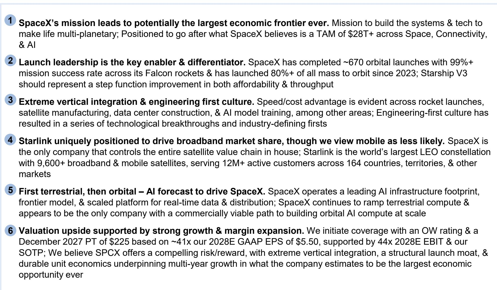
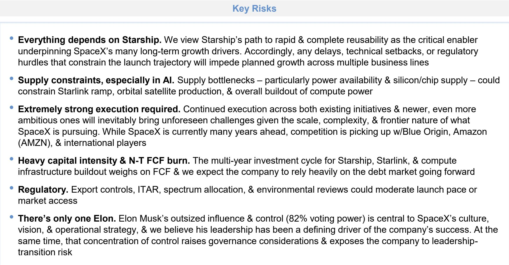

# SpaceX Is Not Just a Launch Company — It Is Building the Infrastructure for the Next Economic Era

The conventional framing of SpaceX as a rocket company misses the point entirely. Rockets are a means, not the end. What SpaceX is actually building is a vertically integrated infrastructure platform that spans launch, satellite communications, terrestrial AI compute, and orbital data centers. The company's mission statement — making life multiplanetary — has long been dismissed as visionary rhetoric. But the architecture behind that vision is becoming concrete, and it points to a potential revenue trajectory that rivals the largest enterprises in history.

A global research institution report initiating coverage examines this argument. The report projects revenue scaling from $18.7 billion in 2025 to approximately $470 billion by 2030, representing a 91% compound annual growth rate. Operating income margins are expected to expand from negative 14% to roughly 50% over the same period. These numbers are not extrapolations of current trends. They are predicated on a series of deliberate, capital-intensive strategic bets that the report examines in detail.

The central thesis is that SpaceX occupies a unique position at the intersection of three massive addressable markets: space access, global connectivity, and artificial intelligence infrastructure. The company estimates its total addressable market at over $28 trillion. Whether that figure is precise matters less than the directional truth it captures. SpaceX is not competing for share in a static industry. It is attempting to create and capture entirely new categories of economic activity.

What follows is a structured examination of the key strategic arguments in the report, the unresolved questions that will determine whether the thesis holds, and a decision framework for observers trying to assess SpaceX's trajectory.

## The Launch Monopoly Is the Foundation, but the Real Value Is in Vertical Integration

SpaceX has completed approximately 650 orbital launches with a mission success rate above 99%. Since 2023, it has launched over 80% of all mass to orbit globally. This is not merely a market share statistic. It is a structural moat. No other entity — government or private — has demonstrated the ability to match SpaceX's combination of launch frequency, reliability, and cost efficiency.

The report emphasizes that extreme vertical integration is the mechanism behind this advantage. SpaceX designs and manufactures its own engines, avionics, fairings, and even its own launch pad infrastructure. This approach compresses development timelines, reduces dependency on external suppliers, and allows rapid iteration. The Falcon 9 rocket, now a workhorse, has been continuously upgraded through dozens of incremental improvements that would be impossible under a traditional aerospace contracting model.

But the report's most important insight is that launch leadership is not the endgame. It is the enabler. The Starship system, currently in development, represents a step-function improvement in both payload capacity and cost per kilogram to orbit. The report's launch forecast assumes SpaceX can gradually reach 5,000 annual Starship launches early next decade. That number sounds extraordinary, but it is consistent with management's stated intention to launch tens of Starships in 2027, hundreds in 2028, and thousands beyond.

The strategic implication is clear. If Starship achieves its design targets, SpaceX will have effectively eliminated the cost barrier to orbital access. That changes the economics of everything built on top of that capability — from satellite constellations to orbital manufacturing to space-based compute.

## Starlink Is the Proof of Concept for Platform Economics, Not Just a Broadband Business

Starlink has already deployed over 9,600 satellites, making it the largest low-Earth orbit constellation in existence. It serves more than 12 million active customers across 164 countries. The report projects that Starlink will emerge as a steady third share-taker in U.S. residential broadband, lifting satellite share from approximately 3% today to 8% by 2030.

The core cohort for Starlink broadband is concentrated in copper-only and underinvested cable markets, with limited long-term risk to fiber. This is a sensible and disciplined addressable market strategy. But the report also identifies a more ambitious vector: mobile connectivity. While the report does not expect Starlink Mobile to take meaningful U.S. wireless share over the forecast period, it acknowledges that the potential lateral impacts across the telecom sector are significant.

The reason is structural. SpaceX is the only company that controls the entire satellite value chain in house — satellite design, manufacturing, launch, ground infrastructure, and user terminals. This vertical integration allows Starlink to iterate rapidly on hardware and software, reduce cost per subscriber, and deploy capacity where demand is highest. No telecom incumbent can replicate this model without building a comparable space capability, which would take years and tens of billions of dollars.

The report raises a critical open question: Could Starlink become a direct mobile operator, and what would that mean for the telecom sector? The answer depends on whether SpaceX secures a U.S. mobile virtual network operator agreement, which the report views as unlikely in the near term. But the strategic logic is compelling. If Starlink can offer direct-to-device connectivity at scale, it could bypass traditional carriers entirely for certain use cases, particularly in rural and remote areas.

## The AI Infrastructure Buildout Is the Most Ambitious — and Most Unproven — Part of the Thesis

The report's most striking projections concern SpaceX's AI infrastructure ambitions. The company is building terrestrial compute capacity at a pace that the report describes as unprecedented. Initial phases of the Colossus data center cluster demonstrate the ability to bring high-density compute online in months, not years.

The report estimates that SpaceX will end 2026 with approximately 2.0 gigawatts of terrestrial compute capacity, then add roughly 2.2 gigawatts in 2027, 3.5 gigawatts in 2028, and 1.2 gigawatts in 2029, reaching approximately 8.9 gigawatts. To put that in context, 8.9 gigawatts is comparable to the total compute capacity of several large hyperscale cloud providers combined.

The cost advantage is equally striking. The report believes SpaceX can achieve a build cost approximately 29 to 43 percent lower than peers by reducing redundant infrastructure, utilizing internal technologies, and capitalizing on talent-driven efficiencies. If these estimates hold, SpaceX could offer AI compute at a price point that competitors cannot match, fundamentally altering the economics of model training and inference.

But the truly audacious part of the plan is orbital AI compute. The report expects SpaceX to begin launching its first operational AI satellites in 2028, with 0.4 gigawatts online by the end of the year, scaling to 75.1 gigawatts by the end of 2031. This requires Starship launches to scale to the thousands on an annual basis, and the semiconductor industry will need to scale up chip supply accordingly.

The premise for orbital AI data centers is that demand for AI compute will surge while terrestrial capacity may struggle to keep pace due to land, power, and regulatory constraints. Space offers abundant solar energy, unlimited cooling, and no land-use restrictions. The question is whether the physics and economics of orbital compute can be made to work at scale. The report is constructive but careful to note that this remains an unproven concept.

## What the Report Does Not Fully Answer: The Financing Gap and the Tesla Question

Two critical uncertainties run through the report without being fully resolved.

The first is financing. The report models approximately $375 billion of debt proceeds over 2026 to 2030 to fund the AI infrastructure buildout. It does not model positive free cash flow until 2031. Any cost overruns or scale delays could extend the magnitude and duration of the cash burn while also increasing capital raise requirements. The report acknowledges that SpaceX's cash-generative legacy businesses — launch and Starlink — help fund the AI build, but the scale of the investment is unprecedented for a private company.

The second uncertainty is the potential combination with Tesla. The report sees the possibility of a SpaceX-Tesla combination rising materially over the next one to two years, though it does not believe it is likely imminent. The strategic logic appears compelling: vertical integration across AI, robotics, energy, transportation, and space, anchored by a combined total addressable market narrative. But potential impediments include governance asymmetry, valuation gap, and regulatory complexity.

The report outlines several potential deal structures, including an all-stock SpaceX-led acquisition, a new holding company roll-up, a cash-and-stock hybrid, and a phased partial combination. Each structure has trade-offs, and the report does not express a clear preference beyond noting that an all-stock deal likely best reconciles the valuation gap. The question of whether a combination happens — and on what terms — will have profound implications for both companies' capital structures and strategic trajectories.

## A Decision Framework for Evaluating SpaceX's Trajectory

For observers trying to assess whether SpaceX can deliver on its ambitious projections, the report provides a useful analytical structure. The key variables can be organized into three categories: execution risk, market risk, and financing risk.

Execution risk centers on Starship. Can SpaceX scale production from a handful of prototypes to thousands of operational vehicles per year? Can it achieve the turnaround times and flight rates assumed in the model? The report's launch forecast is aggressive but internally consistent. The real test will come in 2027 and 2028, when the ramp must accelerate from tens of launches to hundreds.

Market risk centers on AI demand. The entire revenue thesis depends on the assumption that AI compute demand will continue to grow at exponential rates. If demand plateaus or shifts to more efficient architectures, the massive capital deployed into compute capacity could become stranded. The report's neocloud model assumes rental rates that generate adjusted EBITDA margins above 87 percent. Those margins are achievable only if demand remains strong and supply remains constrained.

Financing risk centers on the capital markets. SpaceX is private, which gives it flexibility but also limits its access to public equity markets. The modeled debt proceeds of $375 billion require a functioning credit market that is willing to lend against future cash flows from unproven businesses. If credit conditions tighten or if SpaceX's revenue growth disappoints, the financing gap could become a binding constraint.

The report applies a valuation framework based on a multiple of projected 2030 revenue, arriving at an estimated value per share of $5.50. That multiple is above the average for mega-cap peers but below the median. The premium is justified, in the report's view, by SpaceX's category leadership in launch and its dominant access to a very large estimated total addressable market. Whether that premium holds depends on the company's ability to execute across all three risk categories simultaneously.

## The Unanswered Questions That Define the Opportunity

The report leaves several meaningful open questions that will determine whether SpaceX becomes the most valuable company in history or a cautionary tale about overreach.

Can Starship scale to 5,000 launches per year early next decade? The engineering challenges are immense, and the production scaling challenge is arguably harder than the technical one. SpaceX has demonstrated an ability to manufacture at scale with Falcon 9 and Starlink, but Starship is an order of magnitude more complex.

Can Starlink take meaningful U.S. broadband market share without triggering a regulatory or competitive response? The report's projection of 8 percent market share by 2030 is achievable, but it assumes that incumbent providers do not respond aggressively. If cable and fiber operators accelerate their own capacity investments, Starlink's addressable market could shrink.

Can SpaceX build 9 gigawatts of terrestrial compute by 2028? The pace of construction required is unprecedented. Power grid interconnection alone could become a bottleneck. The report acknowledges this risk but does not fully model the potential for delays.

Can orbital AI compute work economically? The physics of heat dissipation, radiation hardening, and satellite replacement cycles are not fully understood at the scale required. The report's projection of 75 gigawatts of orbital compute by 2031 is the most speculative number in the entire analysis.

Will a SpaceX-Tesla combination happen? The strategic logic is clear, but the governance, valuation, and regulatory hurdles are significant. The report's view that a combination is "all but inevitable" over the long term is a strong call that deserves scrutiny.

These questions are not weaknesses in the report. They are the natural result of analyzing a company that is attempting something genuinely unprecedented. The report provides a rigorous framework for thinking about the answers, but the answers themselves will only emerge through execution.

*For informational purposes only. Portions may be generated, translated, summarized, or edited with AI assistance based on source materials and may contain omissions or errors. Please verify independently. This is not professional advice.*

For informational purposes only. Portions may be generated, translated, summarized, or edited with AI assistance based on source materials and may contain omissions or errors. Please verify independently. This is not professional advice.

