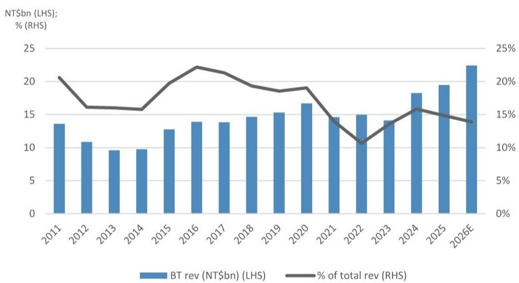

# 行业观察

## 台湾载板

## 退出BT基板成为趋势

- BT产能向ABF转换正在进行。行业供应链调研显示，多家亚洲供应商正计划或正在减少其BT业务，通过将部分用于消费电子及存储相关芯片的BT生产设备转移至ABF载板生产。受人工智能及尺寸迁移驱动，ABF核心层需求快速上升，近期日本及奥地利载板厂商的公告也印证了这一点。BT产能的转换为ABF提供了及时的产能补充。我们认为，转换结果对载板厂商的营收及利润率均将产生积极影响（ABF利润率显著更高）。我们预计，部分载板厂商可能在三年内完全退出BT业务。

- 影响。我们预计，由于采购环节可能仍需重新调整，领先手机SoC/OEM厂商的BT载板供应将出现一定程度的短期波动。BT报价在2025年中之后曾连续1-2个季度上涨，我们认为这主要是受供应紧张推动（存储需求上升叠加供应增长有限）。虽然我们尚未看到另一轮大规模涨价，但也不排除这种可能性。与此同时，我们预计部分溢出订单将流向台湾二线载板厂商，以及韩国和中国大陆的一些较小厂商。

图1：欣兴电子BT营收及占比

来源：JPM estimates, Company data.

## 技术

Jerry Tsai AC
(886-2) 2725-9867
jerry.tsai@JPM.com
JPM Securities (Taiwan) Limited

Josie Yu
(886-2) 2725-9877
josie.yu@JPM.com
JPM Securities (Taiwan) Limited

Gokul Hariharan
(852) 2800-8564
gokul.hariharan@JPM.com
JPM Securities (Asia Pacific) Limited/ JPM Broking (Hong Kong) Limited

本报告讨论的公司（除非另有说明，本报告所有报价均为2026年7月7日收盘价）
欣兴电子(3037.TW/NT\$840.00/OW)

分析师认证：封面标注“AC”的研究分析师（或，当多位研究分析师对本报告负主要责任时，封面或文件内标注“AC”的研究分析师分别就其在本研究中涵盖的每个证券或发行人认证）：(1) 本报告中表达的所有观点准确反映了研究分析师对任何及所有标的证券或发行人的个人观点；(2) 研究分析师薪酬的任何部分过去、现在或将来均未直接或间接与本报告中研究分析师提出的具体建议或观点相关。对于封面列出的所有韩国研究分析师（如适用），他们同时根据KOFIA要求认证，其分析是善意进行的，且观点反映了研究分析师自身的意见，未受到不当影响或干预。

除非另有说明，本报告中列出的所有作者均为制作独立研究的研究分析师。在欧洲，行业专家（销售与交易）可能作为联系人出现在本报告中，但并非报告作者或研究部门成员。

## 重要披露

公司特定披露：JPM确实并寻求与其研究报告所覆盖的公司开展业务。因此，读者应注意，该公司可能存在利益冲突，可能影响本报告的客观性。读者应将本报告视为其做出投资决策的单一因素。重要披露信息，包括价格图表和信用意见历史表（如适用），可通过访问https://www.jpmm.com/research/disclosures、致电1-800-477-0406或发送邮件至research.disclosure.inquiries@JPM.com获取，适用于汇编报告及所有JPM覆盖的公司及某些未覆盖的公司。

## 股票研究评级、指定及分析师覆盖范围说明：

JPM采用以下评级体系：超配（在本报告所示目标价期间内，我们预期该股票将跑赢研究分析师或其团队覆盖范围内股票的平均总回报）；中性（在本报告所示目标价期间内，我们预期该股票将与研究分析师或其团队覆盖范围内股票的平均总回报表现一致）；低配（在本报告所示目标价期间内，我们预期该股票将跑输研究分析师或其团队覆盖范围内股票的平均总回报）。NR为未评级。在此情况下，JPM已移除该股票的评级及（如适用）目标价，原因包括缺乏足够的基本面依据，或出于法律、监管或政策原因。先前的评级及（如适用）目标价不应再被依赖。NR指定并非推荐或评级。部分覆盖股票有评级但无目标价；在此情况下，我们预期该股票将跑赢/表现一致/跑输研究分析师或其团队覆盖范围内股票在相关区域相应期间的平均总回报。在我们的亚洲（除澳大利亚和印度）及英国中小盘股票研究中，每只股票的预期总回报是与基准国家市场指数的预期总回报进行比较，而非与研究分析师覆盖范围进行比较。如果本报告的重要披露部分未显示，认证研究分析师覆盖范围可在JPM研究网站https://www.JPMmarkets.com上找到。

覆盖范围：Tsai, Jerry：群光电能(6412.TW)、致茂电子(2360.TW)、中华精测(6510.TWO)、元太科技(8069.TWO)、台光电子(2383.TW)、台郡科技(6269.TW)、瑞仪光电(6176.TW)、建准电机(2421.TW)、台表科(6278.TW)、健鼎科技(3044.TW)、欣兴电子(3037.TW)、稳懋半导体(3105.TWO)、国巨(2327.TW)

## JPM股票研究评级分布，截至2026年7月4日

<table><tr><td></td><td>超配（买入）</td><td>中性（持有）</td><td>低配（卖出）</td></tr><tr><td>JPM全球股票研究覆盖*</td><td>53%</td><td>36%</td><td>12%</td></tr><tr><td>投行客户**</td><td>83%</td><td>80%</td><td>73%</td></tr><tr><td>JPMS股票研究覆盖*</td><td>51%</td><td>37%</td><td>12%</td></tr><tr><td>投行客户**</td><td>95%</td><td>92%</td><td>87%</td></tr></table>

\*请注意，由于四舍五入，百分比可能未加总至100%。
\*\*在过去12个月内JPM提供投资银行服务的“买入”、“持有”和“卖出”类别中各标的公司的百分比。

仅就FINRA评级分布规则而言，我们的超配评级属于报告评级类别；中性评级属于持有评级类别；低配评级属于报告评级类别。请注意，标有NR的股票未包含在上述表格中。此信息截至最近一个日历季度末。

股票估值与风险：有关覆盖公司或目标价的估值方法和风险，请参阅最新的公司特定研究报告，网址为http://www.JPMmarkets.com，联系首席分析师或您的JPM代表，或发送邮件至research.disclosure.inquiries@JPM.com。有关专有模型使用的实质性信息，请参阅公司特定研究报告中的财务摘要和公司概况表，这些文件可在我们客户网站的公司页面上下载，网址为http://www.JPMmarkets.com。本报告还阐述了其中使用的基本假设。

## 研究交流历史：

过去12个月内JPM研究交流的历史可通过http://www.JPMmarkets.com的研究与评论页面访问，您也可以按分析师姓名、行业或金融工具进行搜索。

分析师薪酬：负责编写本报告的研究分析师的薪酬基于多种因素，包括研究的质量和准确性、客户反馈、竞争因素以及公司整体收入。

非美国分析师注册：除非另有说明，本报告封面列出的非美国分析师是非美国JPM证券有限责任公司关联公司的员工，可能未根据FINRA规则注册为研究分析师，可能不是JPM证券有限责任公司的关联人士，并且可能不受FINRA规则2241或2242关于与覆盖公司沟通、公开露面以及交易研究分析师账户持有证券的限制。

## 其他披露

JPM是JPM Chase & Co.及其全球子公司和关联公司投资银行业务的营销名称。

UK MIFID FICC研究分拆豁免：英国客户应参考UK MIFID Research Unbundling exemption，了解JPM实施FICC研究豁免的详细信息以及相关FICC研究分类的指导。

除非相关法律特别允许，所有提供给客户的研究材料均同时在我们的客户网站JPM Markets上提供。并非所有研究内容都会重新分发、通过电子邮件发送或提供给第三方聚合商。如需特定股票的所有研究材料，请联系您的销售代表。

本研究材料中对中国的任何长格式名称指代；香港；台湾；澳门分别为中国大陆；中国香港特别行政区；中国台湾；中国澳门特别行政区。

JPM可能不时撰写关于受美国、欧盟、英国或其他相关司法管辖区政府当局实施或管理的经济或金融制裁所针对的发行人或证券（受制裁证券）的文章。本报告中的任何内容均无意被解读为鼓励、促进、推动或以其他方式批准对受制裁证券的投资或交易。客户在做出投资决策时应了解自身的法律和合规义务。

本研究报告中讨论的任何数字或加密资产均受快速变化的监管环境影响。有关加密资产（包括比特币和以太坊）的相关监管建议，请参阅https://www.JPM.com/disclosures/cryptoasset-disclosure。

本研究报告的作者可能未获许可在您的司法管辖区开展受监管活动，如果未获许可，则不会声称能够这样做。

交易所交易基金（ETF）：JPM证券有限责任公司（“JPMS”）作为几乎所有美国上市ETF的授权参与者。如果本报告中提及任何ETF，JPMS可能因分销这些ETF份额而赚取佣金和基于交易的补偿，并可能因执行其他交易相关服务（例如向ETF份额卖空者提供证券借贷）而赚取费用。JPMS还可能为ETF本身提供服务，包括担任ETF的经纪商或交易商。此外，JPMS的关联公司可能为ETF提供服务，包括信托、托管、管理、借贷、指数计算和/或维护及其他服务。

期权和期货相关研究：如果本文所含信息涉及期权或期货相关研究，则该信息仅提供给已收到适当期权或期货风险披露文件的人士。请联系您的JPM代表或访问https://www.theocc.com/components/docs/riskstoc.pdf获取期权清算公司标准化期权的特征和风险副本，或访问https://www.finra.org/sites/default/files/2020-08/Security\_Futures\_Risk\_Disclosure\_Statement\_2020.pdf获取证券期货风险披露声明副本。

银行间拆借利率（IBOR）及其他基准利率的变更：某些利率基准正在或可能在未来受到持续的国际、国家及其他监管指导、改革和改革建议的影响。更多信息，请查阅：https://www.JPM.com/global/disclosures/interbank\_offered\_rates

私人银行客户：如果您作为JPM Chase & Co.及其子公司（“JPM私人银行”）提供的私人银行业务的客户接收研究，则研究由JPM私人银行提供给您，而非JPM的任何其他部门，包括但不限于JPM企业与投资银行及其全球研究部门。

负责制作和分发研究的法律实体：编写本材料的Reg AC研究分析师姓名下方标识的法律实体是负责制作本研究的法律实体。如果多位Reg AC研究分析师编写了本材料，且其姓名下方标识了不同的法律实体，则这些法律实体共同负责制作本研究。如果分析师姓名下列出了多个法律实体，则除非另有说明，第一个法律实体负责制作。来自不同JPM关联公司的研究分析师可能对本材料的制作做出了贡献，但可能未获许可在您的司法管辖区开展受监管活动（并且不会声称能够这样做）。除非下文法律实体披露中另有说明，本材料已由负责制作的法律实体分发，或者如果分析师姓名下列出了多个法律实体，则第一个法律实体负责分发。如果您有任何疑问，请联系您所在司法管辖区的相关研究分析师或分发本研究材料的您所在司法管辖区的实体。

## 法律实体披露及国家/地区特定披露：

阿根廷：JPM Chase Bank N.A Sucursal Buenos Aires受阿根廷中央银行（BCRA）和阿根廷国家证券委员会（CNV - ALYC y AN Integral N°51）监管。

澳大利亚：JPM Securities Australia Limited（“JPMSAL”）（ABN 61 003 245 234/AFS Licence No: 238066）受澳大利亚证券和投资委员会监管，是ASX Limited的市场参与者、ASX Clear Pty Limited的清算和结算参与者以及ASX Clear (Futures) Pty Limited的清算参与者。本材料由JPMSAL或代表其在澳大利亚仅向“批发客户”（定义见2001年公司法第761G条）发行和分发。所有覆盖的金融产品列表可通过访问https://www.jpmm.com/research/disclosures获取。JPM力求覆盖对国内外读者具有相关性的所有全球行业分类标准（GICS）行业以及各种市值的公司。如适用，在对标的公司进行公开尽职调查过程中，研究分析师团队有时可能通过公司访问、与公司代表讨论、管理层演示等方式进行此类尽职调查。JPMSAL发布的研究已按照JPM澳大利亚研究独立性政策编制，该政策可在以下链接找到：JPM Australia - Research Independence Policy。

巴西：Banco JPM S.A.受巴西证券委员会（CVM）和巴西中央银行监管。JPM监察员：0800-7700847 / 0800-7700810（听力障碍者）/ ouvidoria.jp.morgan@jpmchase.com。

加拿大：JPM Securities Canada Inc.是一家注册投资交易商，受加拿大投资监管组织和安大略省证券委员会监管，是加拿大交易所的参与会员。本材料由JPM Securities Canada Inc.或代表其在加拿大分发。

智利：Inversiones JPM Limitada是一家在智利注册的未受监管实体。

中国：JPM Securities (China) Company Limited已获中国证监会批准开展证券投资咨询业务。

哥伦比亚：Banco JPM Colombia S.A.受哥伦比亚金融监管局（SFC）监管。本材料中对哥伦比亚境外实体提供的产品或服务的任何引用仅用于描述目的。此类引用不构成也不应被解释为在哥伦比亚领土内的促销活动或金融产品或服务的提供，如适用哥伦比亚法规所定义。

迪拜国际金融中心（DIFC）：JPM Chase Bank, N.A., Dubai Branch受迪拜金融服务管理局（DFSA）监管，其注册地址为Dubai International Financial Centre - The Gate, West Wing, Level 3 and 9 PO Box 506551, Dubai, UAE。本材料已由JPM Chase Bank, N.A., Dubai Branch分发给根据DFSA规则被视为专业客户或市场对手方的人士。

欧洲经济区（EEA）：除非另有说明，研究由JPM SE（“JPM SE”）在EEA分发，JPM SE是一家由联邦金融监管局（BaFin）授权为信贷机构的公司，并受BaFin、德国中央银行（Deutsche Bundesbank）和欧洲中央银行（ECB）共同监管。JPM SE总部位于法兰克福，注册地址为TaunusTurm, Taunustor 1, Frankfurt am Main, 60310, Germany。本材料已在EEA分发给根据MiFID II第4条第1款第10项及附件II及其在各自母国的实施被视为专业读者（或同等）的人士（“EEA专业读者”）。非EEA专业读者不得依据或依赖本材料。本材料相关的任何投资或投资活动仅适用于EEA相关人士，且将仅与EEA相关人士进行。

香港：JPM Securities (Asia Pacific) Limited（CE编号AAJ321）受香港金融管理局和香港证券及期货事务监察委员会监管，JPM Broking (Hong Kong) Limited（CE编号AAB027）受香港证券及期货事务监察委员会监管。JPM Chase Bank, N.A., Hong Kong Branch（CE编号AAL996）受香港金融管理局和香港证券及期货事务监察委员会监管，根据美国法律组织，承担有限责任。如果本材料的分发在香港属于受监管活动，则本材料由JPM Securities (Asia Pacific) Limited和/或JPM Broking (Hong Kong) Limited在香港分发。

印度：JPM India Private Limited（公司识别号 - U67120MH1992FTC068724），注册办事处位于JPM Tower, Off. C.S.T. Road, Kalina, Santacruz - East, Mumbai – 400098，在印度证券交易委员会（SEBI）注册为“研究分析师”，注册号INH000001873。JPM India Private Limited还在SEBI注册为印度国家证券交易所和孟买证券交易所的会员（SEBI注册号 – INZ000239730）以及商人银行家（SEBI注册号 - MB/INM000002970）。电话：91-22-6157 3000，传真：91-22-6157 3990，网站：http://www.jpmipl.com。JPM Chase Bank, N.A. - Mumbai Branch由印度储备银行（RBI）授权（许可证号53/许可证号BY.4/94；SEBI - IN/CUS/014/ CDSL : IN-DP-CDSL-444-2008/ IN-DP-NSDL-285-2008/ INBI00000984/ INE231311239）作为印度的指定商业银行，这是其主要许可证，允许其在印度开展银行业务以及印度银行分行允许从事的其他活动。对于非本地研究材料，本材料不由JPM India Private Limited在印度分发。合规官：Ashutosh Sharma；ashutosh.j.sharma@jpmchase.com；+912261575002。申诉官：Ramprasadh K，jpmipl.research.feedback@JPM.com；+912261573000。SEBI的注册和NISM的认证绝不保证中介机构的业绩或向读者提供任何回报保证。请访问条款和条件以及最重要的条款和条件（MITC）。年度合规审计报告可在http://www.jpmipl.com/#research获取。

印度尼西亚：PT JPM Sekuritas Indonesia是印度尼西亚证券交易所的会员，并在金融服务管理局（OJK）注册和监管。

韩国：JPM Securities (Far East) Limited, Seoul Branch是韩国交易所（KRX）的会员。JPM Chase Bank, N.A., Seoul Branch在韩国注册为外国银行分行（JPM Chase Bank, N.A.）。两个实体均受金融服务委员会（FSC）和金融监督院（FSS）监管。对于非宏观研究材料，该材料由JPM Securities (Far East) Limited, Seoul Branch在韩国分发。

日本：JPM Securities Japan Co., Ltd.和JPM Chase Bank, N.A., Tokyo Branch受日本金融厅监管。

马来西亚：本材料由JPM Securities (Malaysia) Sdn Bhd（18146-X）在马来西亚发行和分发，该公司是马来西亚证券交易所的参与组织，并持有马来西亚证券委员会颁发的资本市场服务许可证。

墨西哥：JPM Casa de Bolsa, S.A. de C.V., JPM Grupo Financiero是墨西哥证券交易所（Bolsa Mexicana de Valores）和机构证券交易所（Bolsa Institucional de Valores）的会员，并获国家银行和证券委员会（Comisión Nacional Bancaria y de Valores）授权作为经纪交易商。

新西兰：本材料由JPMSAL在新西兰仅向“批发客户”（定义见2013年金融市场行为法）发行和分发。JPMSAL根据2008年金融服务提供商（注册和争议解决）法注册为金融服务提供商。

菲律宾：JPM Securities Philippines Inc.是菲律宾证券交易所的交易参与者，也是菲律宾证券清算公司和证券读者保护基金的会员。它受证券交易委员会监管。

新加坡：本材料由JPM Securities Singapore Private Limited（JPMSS）[MDDI (P) 057/08/2025及公司注册号：199405335R]和/或JPM Chase Bank, N.A., Singapore branch（JPMCB Singapore）在新加坡发行和分发，两者均受新加坡金融管理局监管。JPMSS是新加坡交易所证券交易有限公司的会员。本材料仅向符合证券及期货法（第289章）第4A条定义的认可读者、专家读者和机构读者在新加坡发行和分发。本材料无意向任何零售读者或不符合第4A条定义的“认可读者”、“专家读者”或“机构读者”类别的任何其他读者发行或分发。新加坡的本材料接收者应就本材料引起或与之相关的任何事宜联系JPMSS或JPMCB Singapore。

南非：JPM Equities South Africa Proprietary Limited和JPM Chase Bank, N.A., Johannesburg Branch是约翰内斯堡证券交易所的会员，并受金融部门行为监管局（FSCA）监管。

台湾：JPM Securities (Taiwan) Limited是台湾证券交易所（公司型）的参与者，并受台湾证券期货局监管。与股权证券相关的材料由JPM Securities (Taiwan) Limited在台湾发行和分发，受许可证范围及台湾适用法律法规的约束。如果JPM Securities (Taiwan) Limited制作关于未在台湾证券交易所或台北交易所上市的证券（“非台湾上市证券”）的研究材料，这些材料不应构成台湾适用法规意义上的证券推荐，并且为免生疑问，JPM Securities (Taiwan) Limited不担任非台湾上市证券的经纪商。根据《证券商受托买卖有价证券对客户推介买卖有价证券作业规范》第7-1条第2款（经修订或补充）和/或其他适用法律法规，请注意，本材料的接收者不得从事与本材料相关的可能产生利益冲突的任何活动，除非本材料中的“重要披露”另有披露。

泰国：本材料由JPM Securities (Thailand) Ltd.在泰国发行和分发，该公司是泰国证券交易所的会员，并受财政部和证券交易委员会监管。注册地址为548 One City Center Building, 50th Floor, Ploenchit Road, Lymphini, Pathum Wan, Bangkok 10330。

英国：研究由JPM Securities plc（“JPMS plc”）在英国制作，该公司是伦敦证券交易所的会员，并受审慎监管局授权及受金融行为监管局和审慎监管局监管；或由JPM Markets Limited（“JPMML Ltd”）制作，该公司受金融行为监管局授权和监管。除非另有说明，本材料由JPMS plc在英国分发，且仅针对英国境内的：(a) 属于2005年金融服务和市场法（金融促销）令第19(5)条范围内具有投资相关事务专业经验的人士；(b) 该法令第49条所述的人士（高净值公司、非法人协会或合伙企业、高价值信托的受托人等）；或(c) 可以合法接收此通讯的任何其他人；所有此类人士均称为“英国相关人士”。非英国相关人士不得依据或依赖本材料。本材料相关的任何投资或投资活动仅适用于英国相关人士，且将仅与英国相关人士进行。JPM EMEA关于预防和避免与研究制作相关的利益冲突政策的描述可在以下链接找到：JPM EMEA - Research Independence Policy。

美国：JPM Securities LLC（“JPMS”）是纽约证券交易所、FINRA、SIPC和NFA的会员。JPM Chase Bank, N.A.是FDIC的会员。非美国关联公司发布的材料由JPMS在美国分发，JPMS对其内容承担责任。

一般信息：可根据要求提供更多信息。本材料中的信息来自被认为可靠的来源。尽管已采取一切合理措施确风险自担材料中陈述的事实准确且其中包含的预测、意见和预期公平合理，但JPM Chase & Co.或其关联公司和/或子公司（统称“JPM”）不对所提供材料的完整性或准确性作出任何陈述或保证，但有关JPM和研究分析师与作为材料主题的发行人相关的披露除外。因此，不应依赖本材料所含信息的准确性、公平性或完整性。由于计算、调整、翻译成不同语言和/或当地监管限制（如适用），本材料中可能存在某些数据差异和/或内容有限。这些差异不应影响可能在本材料中讨论的标的公司的整体投资分析、观点和/或建议。人工智能工具可能已用于本材料的准备，包括协助数据分析、模式识别和内容起草。JPM对因使用本材料或其内容而产生的任何损失不承担任何责任，JPM或其各自的董事、高级职员或员工均不对本内容负责，但相关司法管辖区的相关监管机构或该监管制度可能施加的责任和义务除外。本材料中包含的意见、预测或预测仅代表JPM截至材料日期的当前意见或判断，因此如有更改，恕不另行通知。可能会根据公司特定发展或公告、市场状况或任何其他公开信息对公司/行业进行定期更新。无法保证未来的结果或事件与任何此类意见、预测或预测一致，这些仅代表一种可能的结果。此外，此类意见、预测或预测受某些未经验证的风险、不确定性和假设的影响，未来的实际结果或事件可能存在重大差异。本材料中提及的任何投资的价值或收入可能会波动和/或受汇率变化的影响。除非另有说明，所有定价均为所讨论证券的市场收盘价指示性价格。过往表现并不预示未来结果。因此，读者收回的金额可能低于初始投资。本材料不构成购买或出售任何金融工具的要约或招揽。本文中的意见和推荐未考虑个别客户的情况、目标或需求，不构成对特定客户推荐特定证券、金融工具或策略。本材料可能包含对结构性证券、期权、期货和其他衍生品的看法。这些是复杂的工具，可能涉及高风险，仅适合能够理解并承担相关风险的成熟读者。本材料的接收者必须就本文提及的任何证券或金融工具做出自己的独立决定，并应寻求其认为必要的独立财务、法律、税务或其他顾问的建议。JPM可能基于研究分析师的观点和研究进行自营交易，也可能以与本材料观点不一致的方式为其自身账户或客户账户进行交易，JPM没有义务确保此类其他沟通引起本材料任何接收者的注意。JPM内部的其他人员，包括策略师、销售人员和其他研究分析师，可能持有与本材料观点不一致的观点。未参与本材料准备的JPM员工可能持有本材料中提及的证券（或此类证券的衍生品）并可能以与本材料讨论的方式不同的方式进行交易。本材料并非在任何司法管辖区对任何发行人、其产品或服务或其证券的广告或营销。

保密与安全通知：此传输可能包含根据适用法律享有特权、保密、法律特权且/或免于披露的信息。如果您不是预期的接收者，特此通知您，严禁披露、复制、分发或使用本文所含信息（包括任何依赖）。尽管此传输及任何附件被认为不含任何可能影响接收和打开它的任何计算机系统的病毒或其他缺陷，但接收者有责任确保其无病毒，JPM Chase & Co.及其子公司和关联公司（如适用）不对因使用而产生的任何损失或损害承担任何责任。如果您错误地收到此传输，请立即联系发件人并销毁材料的全部内容，无论是电子版还是硬拷贝版。此消息受电子监控：https://www.JPM.com/disclosures/email

MSCI：本文中的某些信息（“信息”）经MSCI Inc.、其关联公司和信息提供商（“MSCI”）许可复制 ©2026。未经适当许可，不得复制或传播该信息。MSCI对信息不作任何明示或暗示的保证（包括适销性或适用性），并在法律允许的范围内免除所有责任。任何信息均不构成研究交流，但MSCI ESG Research的任何适用信息除外。另请参阅msci.com/disclaimer

Sustainalytics：本文中包含的某些信息、数据、分析和意见经Sustainalytics许可复制，并且：(1) 包含Sustainalytics的专有信息；(2) 除非特别授权，不得复制或重新分发；(3) 不构成研究交流或对任何产品或项目的认可；(4) 仅出于信息目的提供；(5) 不保证完整、准确或及时。Sustainalytics不对任何交易决策、损害或其他与之相关的损失负责。数据的使用受限于https://www.sustainalytics.com/legal-disclaimers上提供的条件。©2026 Sustainalytics。保留所有权利。

完成于2026年7月8日 香港时间上午6:32
