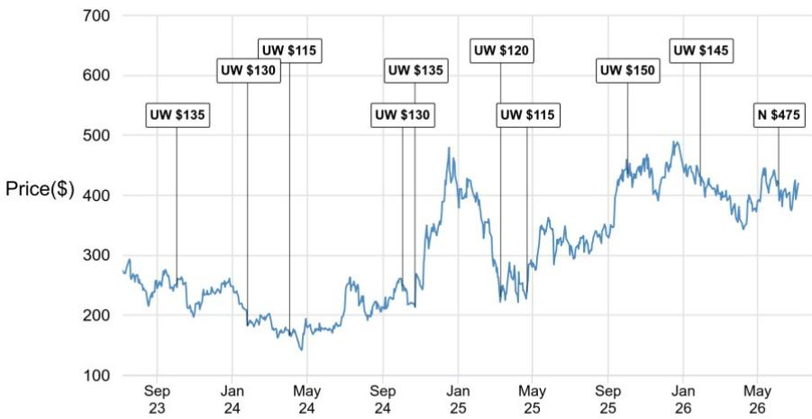
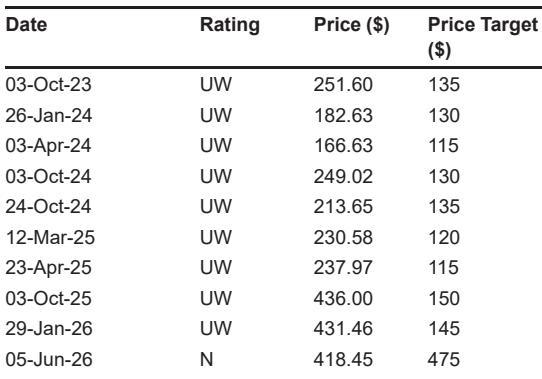

# SpaceX与Tesla的战略整合：路径与挑战

## 从运营协同到潜在整合：一个正在形成的商业逻辑

SpaceX与Tesla在同一个企业架构下整合的可能性，并非空想。这是多年来运营深度融合、工程人才共享以及由Elon Musk领导力所锚定的统一战略愿景的自然结果。一份全球研究机构的报告，在SpaceX创纪录的首次公开募股后不久发布，以罕见的清晰度阐述了这一逻辑：两家实体已共享人工智能基础设施、制造能力，以及一个合计约28.5万亿美元的可触达市场叙事。商业联系是具体的——SpaceX已采购Tesla的Megapack电池和Cybertruck，而Tesla向xAI投资了20亿美元，xAI现已成为SpaceX的一部分。战略逻辑如此连贯，以至于问题不再是整合是否会发生，而是何时、以何种条件发生。

然而，报告也明确指出，通往整合的道路上布满了不可忽视的障碍。最严峻的是监管层面。SpaceX与美国政府的深厚联系——NASA和五角大楼是关键客户——引发了国家安全敏感性，这将招致反垄断和外资审查机构的密切关注。Tesla在中国拥有庞大且盈利的制造基地，这增加了另一层复杂性。Starlink在中国未获批准，而SpaceX的国防合同可能被北京视为直接的国家安全威胁。报告指出，Tesla历来在其现有结构内管理其中国业务，但与一家与美国国防利益如此紧密交织的公司整合，将从根本上改变这一格局。

治理结构的不对称同样令人生畏。Musk控制着SpaceX约85%的投票权，但在Tesla仅控制约20%。这种差异使任何交易结构复杂化，引发了对Tesla少数股东潜在稀释和治理问题的担忧。此外，SpaceX的市值现已超过Tesla——约2.2万亿美元对1.4万亿美元——这意味着任何整合都可能被构建为SpaceX主导的收购，而非对等合并。这种认知很重要，尤其是在Tesla基本面显示出好转迹象的背景下，其2026年第二季度交付量强劲，FSD审批和Robotaxi部署也在加速。

报告识别了四种潜在交易结构，从SpaceX主导的全股票收购到分阶段的部分整合。每种结构在估值、监管风险和股东批准方面都有权衡。总体信息很明确：战略整合的理由是压倒性的，但执行将由三个变量决定——SpaceX收购货币的价值、监管环境以及Musk在Tesla的投票权。理解这些动态的观察者将能更好地预判这一可能成为十年来最具影响力的企业整合的时机和条款。

## 运营与战略整合已比多数人意识到的更为深入

SpaceX-Tesla整合的论点并非基于假设的协同效应。它基于多年来已模糊两家公司界限的具体运营整合。它们共享工程人才，人员在不同项目间流动。它们共享人工智能基础设施，最显著的是位于德克萨斯州的Terafab芯片设施，这是一项550亿至1190亿美元的投资，对两家公司在人工智能领域的雄心都至关重要。最重要的是，它们共享Elon Musk的领导力和工程哲学，将硬件、软件和能源视为相互连接的系统，而非独立的业务。

商业联系同样切实可见。SpaceX已为其能源存储需求采购了Tesla Megapack电池，并为其地面运营采购了Cybertruck。Tesla对xAI的20亿美元投资（xAI现属SpaceX）进一步巩固了财务上的相互依存。在报告看来，共同的人工智能雄心是潜在的战略粘合剂。SpaceX将其2026年第一季度101亿美元资本支出的76%分配给了人工智能，而Tesla计划在2026年投入约250亿美元的资本支出，聚焦于人工智能、机器人和芯片。这些并非平行的投资；它们是旨在同一技术前沿的汇聚性投资。

报告强调了SpaceX总裁Gwynne Shotwell的一个有启示性的信号，她最近承认了潜在的协同效应，并未排除未来整合的可能性，指出这“可能会让Elon的生活更轻松一些”。这不是一家将整合视为干扰的公司的语言。这是一家将整合视为自然下一步的公司的语言。Musk自身的整合记录——从PayPal到Tesla，再到SolarCity和xAI——表明他将企业边界视为可根据战略逻辑需要重新绘制的临时结构。

其影响是显著的。如果两家公司在关键领域已经像一个事实上的企业集团一样运作，那么正式整合将主要服务于调整激励、简化治理并释放资本配置效率。报告的分析表明，整合的运营理由如此强大，以至于相对少见真正的问题是结构性和监管性的。

## 监管审查是最被低估的障碍，尤其是在中国

报告最有价值的贡献之一，可能是其对监管环境的清晰评估。虽然公众讨论多聚焦于整合的战略逻辑，但报告将监管障碍标记为一个可能延迟或重塑任何交易的门槛问题。SpaceX与NASA和五角大楼的政府合同引发了国家安全敏感性，这将招致美国外国投资委员会（CFIUS）乃至国防部的审查。任何给予外国实体（即使是美国上市公司）接触SpaceX技术或合同的整合，都将面临严格审查。

中国维度更为复杂。Tesla在中国运营着大型、全资拥有的制造基地，这一地位使其能够作为非中国原始设备制造商在该国监管环境中运作。这一地位一直是显著的竞争优势，使Tesla无需本地合资伙伴即可为全球最大汽车市场生产车辆。与SpaceX的整合将从根本上改变这一格局。Starlink在中国未获批准，而SpaceX的国防联系几乎肯定会被北京视为国家安全关切。报告指出，这些动态“相互矛盾”，很难看出如何能在不做出重大让步的情况下调和它们。

报告未充分探讨一个重要的二阶影响：整合可能迫使Tesla在其中国业务与SpaceX交易之间做出选择。这不是一个假设性的权衡。如果中国监管机构要求Tesla剥离其中国业务作为批准整合的条件，交易的经济性将发生巨大变化。Tesla在中国的制造基地是产量和盈利能力的主要来源，失去它将从根本上改变公司的增长轨迹。报告暗示了这种紧张关系，但未量化潜在成本，将其作为一个开放性问题供观察者关注。

监管挑战并非不可克服。报告指出，Tesla历来在其现有结构内管理其中国业务，并且可能存在一条通过审批的最终路径。但时间表和条款仍不确定，任何需要多司法管辖区批准的交易都将不可避免地面临延迟和可能影响最终结构的条件。

## 治理不对称与估值动态将塑造交易结构

SpaceX与Tesla之间的治理不对称是一个不可忽视的结构性障碍。Musk控制着SpaceX约85%的投票权，但在Tesla仅控制约20%。这种差异在任何整合谈判中都造成了根本性的紧张关系。一方面，Musk对SpaceX的压倒性控制使他能够推动有利于SpaceX股东的交易条款。另一方面，Tesla的少数股东——他们没有同等集中的投票权——可能会抵制任何稀释其经济利益或使Tesla从属于SpaceX的交易。

报告识别了四种潜在交易结构，每种对治理和估值都有不同影响。在报告看来，最可能的是SpaceX主导的全股票收购Tesla，SpaceX以固定转换比率和适度溢价发行新股。这种结构将调和两家公司之间的估值差距，同时避免可能给SpaceX的杠杆和自由现金流带来压力的大额现金支出。报告指出，SpaceX创纪录的IPO（以1.77万亿美元估值筹集约850亿美元）提供了高价值的收购货币，使全股票交易成为可能。

替代结构各有不同的权衡。NewCo/HoldCo合并，即两家实体并入新成立的母公司，可能提供更清晰的“对等合并”形象，并缓解少数股东担忧。但报告警告称，鉴于SpaceX更大的市值，交换比率仍可能偏向SpaceX。现金加股票混合结构可以提供更明显的溢价并加速批准，但短期内被认为不太可能，因为任何现金支出都会进一步给SpaceX在人工智能重资本支出下的杠杆带来压力。分阶段或部分整合可以降低监管和治理障碍的风险，并为报告认为几乎不可避免的整合提供更长的跑道。

报告未充分解决一个关键问题：在谈判期间Tesla的股价会发生什么？如果市场以低于最终转换比率的折扣定价整合，Tesla股票可能会以反映预期条款的“交易溢价”交易。但如果监管延迟或治理争议造成不确定性，溢价可能崩溃，使Tesla股东面临下行风险。这是一个观察者应密切关注动态，因为它可能根据任何公告的时机同时创造机会和风险。

## 观察者的决策框架：三个需关注的变量

对于试图理解潜在SpaceX-Tesla整合的观察者，报告提出了一个简单但有力的决策框架，聚焦于三个变量：SpaceX收购货币的价值、监管环境以及Musk在Tesla的投票权。每个变量都可以使用可观察的数据点进行监测，任何一个变量的变化都可能预示着交易概率或条款的变化。

第一个变量是SpaceX收购货币的价值。SpaceX的股价，在其创纪录的IPO后现已公开交易，将决定公司拥有多少收购能力。更高的SpaceX股价使全股票交易对Tesla股东更具吸引力，因为它意味着更大的溢价。较低的股价可能迫使SpaceX考虑替代结构，如现金加股票混合或分阶段整合。观察者应追踪SpaceX相对于Tesla的股价，因为两者之间的比率将是任何转换公式的关键输入。

第二个变量是监管环境。报告将中国识别为一个特定障碍，但监管环境更为广泛。美国国家安全审查、反垄断审查以及其他市场的外资限制都将发挥作用。观察者应监测监管文件、政治发展以及美中两国关键官员的声明。任何表明监管机构对交易持开放态度——或相反，认为其不可行——的信号都将直接影响整合的可能性。

第三个变量是Musk在Tesla的投票权。报告指出，Musk通过行使2018年奖励将其Tesla投票权提升至约20%，这显著增加了他的控制权。但20%仍远低于他在SpaceX控制的85%。Musk在Tesla投票权的任何进一步增加——无论是通过股票回购、额外奖励还是购买——都将减少治理不对称，使交易更易执行。相反，如果Musk的投票权下降，治理障碍将变得更加显著。

这个框架并非详尽无遗，但它提供了一种结构化方式来评估新出现的信息。追踪这三个变量的观察者将能更好地预判任何交易公告的时机和条款。

## 报告未完全回答的问题：整合风险与文化冲突

尽管分析严谨，报告仍留下几个有意义的问题未解答。最重要的是任何整合后都会出现的整合风险。合并两家文化、薪酬结构和运营节奏不同的公司从来都不容易，即使战略逻辑很强。SpaceX是一家国防承包商和太空探索公司，拥有快速迭代和高风险工程的文化。Tesla是一家汽车和能源公司，拥有自身独特的文化，由多年的生产挑战、监管斗争和散户读者行动主义塑造。在单一领导结构下合并这两种文化可能会产生报告未充分探讨的摩擦。

报告也未涉及对人才保留的潜在影响。两家公司争夺同一批人工智能和工程人才，整合可能造成关于职业路径、薪酬和报告结构的不确定性。如果关键工程师或高管选择离开而非应对整合，合并后的实体可能会失去部分使战略理由如此引人注目的核心人才。

最后，报告未充分探讨对Tesla少数股东的影响。如果交易被构建为SpaceX主导的收购，Tesla股东可能面临稀释、投票权减少以及优先考虑SpaceX优先事项而非Tesla的企业战略转变。报告承认了这一担忧，但未提供对不同股东群体潜在结果的详细分析。这是一个观察者应通过自身分析来填补的空白。

这些未解答的问题并未削弱报告的论点。它们只是突显了交易的复杂性以及在情况演变中进行仔细监测的必要性。

---

*仅供参考。部分内容可能基于源材料通过AI辅助生成、翻译、总结或编辑，可能存在遗漏或错误。请独立核实。这不构成任何专业建议。*

仅供参考。部分内容可能基于源材料通过AI辅助生成、翻译、总结或编辑，可能存在遗漏或错误。请独立核实。这不构成任何专业建议。

