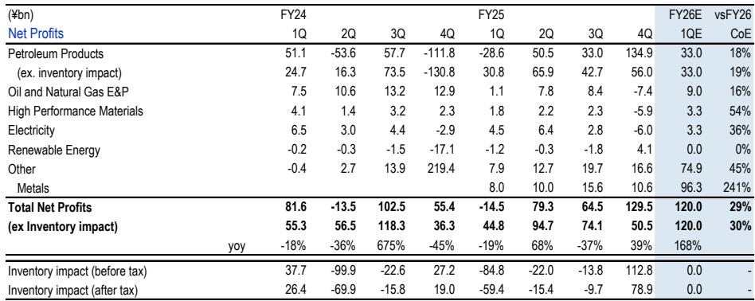
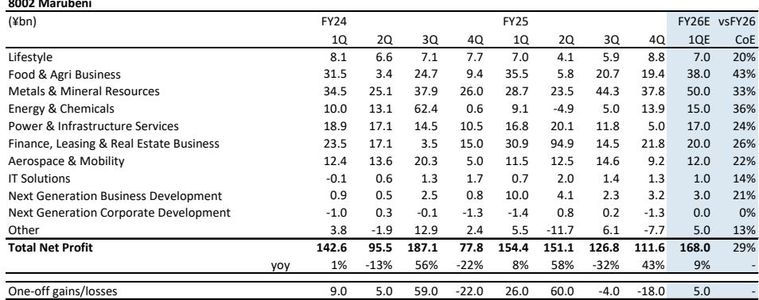
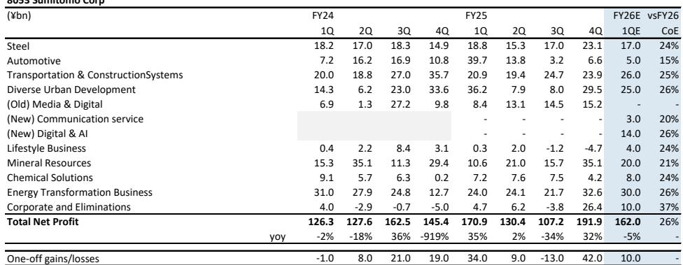

# JPM：资源价格高位已成明牌，日本商社真正催化剂是回购计划

日本综合商社和能源板块即将进入一季度财报季。JPM最新报告给出的判断很直接：利润本身不再是报价的推动力。资源价格高位带来的业绩同比改善已是明牌，市场真正在等的，是各家商社能否拿出真金白银的回购计划。

这份覆盖七大商社、三家炼油商和INPEX的季度展望，核心信号只有一个——当资源价格从高点回落，市场对日本商社的定价逻辑正在从“赚了多少”转向“愿意分多少”。

**资源价格推高利润，但市场已经计价**

报告测算，2026财年一季度（4-6月），七大商社的净利润进度大概率在23%-30%之间。三井物产有望达到30%，丸红和三菱商事均为29%，伊藤忠和丰田通商27%，住友商事26%，双日因季节性因素只有22%。这样的进度放在历史数据中属于偏强水平。

背后推手是资源价格的大幅上涨。布伦特原油一季度均价97美元/桶，同比上涨45%；LME铜价13355美元/吨，同比涨幅超过40%；焦煤238.8美元/吨，同比也接近30%。但报告特别提醒，商社的能源项目收益存在三个月时滞，一季度财报实际反映的是1-3月的资源业务表现。换句话说，这份利润的“含金量”已经被市场提前消化。

> **KC评论：** 利润进度亮眼，但报告真正想说的是“这已经是过去时”。资源价格见顶后，市场对商社的下一步预期需要新的变量来支撑。完整报告中对各家商社的利润结构拆解和资源价格敏感性分析，比利润数字本身更有参考价值。

**回购才是真正的催化剂**

报告对商社板块的研究评级是“中性”。原因在于，既然利润走强已被充分预期，能带来额外弹性的只剩下资本政策——尤其是回购。

三菱商事和三井物产在年初没有公布2026财年的回购计划，市场最关注的就是一季报时是否会追加。JPM预期三菱商事不会宣布，但三井物产有可能公布至少2000亿日元的回购。伊藤忠方面，公司此前计划全年回购3000亿日元以上，报告预计一季度会宣布约200亿日元的回购。丸红在财年初已经实施了450亿日元的回购，分析师认为下一轮可能要到二季度财报时才会出现。

炼油商板块的情况则更为复杂。中东局势导致阿布扎比油田停产和国内油品采购成本上升，ENEOS、出光兴产和Cosmo能源一季度利润预计都会承压。报告认为这些公司在一季报时不太可能调整全年指引或追加回购，市场需要关注的是管理层能否在二季度把替代原油的采购成本转嫁到产品价格上。

> **KC评论：** 商社和炼油商的分化很有意思。前者利润好但市场不买单，后者利润差但市场在等转机。报告没有直接比较，但把这两组公司放在一起看，能更清楚理解日本资源板块当前的估值逻辑——市场对资本政策的敏感度已经高于对利润本身的敏感度。

**INPEX：利润指引的上限还是下限**

INPEX是报告中相对少见获得“观点偏积极”评级的标的。二季度净利润预计1210亿日元，同比增长24%。Ichthys LNG业务的罢工在6月迅速结束，对产量影响有限。按公司给出的4500亿日元全年利润指引上限计算，上半年完成进度已达51%；即便按下限3500亿日元算，完成率也有66%。

但报告也指出，随着原油价格见顶，INPEX自4月以来已经明显跑输大盘。市场的关注点同样落在资本政策上——公司是否会在二季度财报时宣布约500亿日元的回购，以及是否将利润指引区间收窄至上限。由于公司承诺总回报率超过50%，利润指引和回购金额之间存在较强的联动关系。

**报告没有完全回答的问题**

这份研报最值得追问的地方在于：如果资源价格继续回落，日本商社的利润韧性到底有多强？报告给出了资源价格假设和利润进度的关联数据，但没有做不确定性测试。另外，中东局势对炼油商成本转嫁能力的影响，目前还停留在“管理层努力”的阶段，二季度能否真正实现转嫁，需要持续跟踪。

对于关注日本市场的读者来说，这份报告提供的观察框架很清晰：一季度财报季，商社看回购公告，炼油商看成控转嫁，INPEX看指引收窄。利润数字本身，已经不是重点。

For informational purposes only. Portions may be generated,translated,summarized,or edited with AI assistance based on source materials and may contain omissions or errors. Please verify independently. This is not investment,legal,tax,accounting,or other professional advice.

For informational purposes only. Portions may be generated,translated,summarized,or edited with AI assistance based on source materials and may contain omissions or errors. Please verify independently. This is not investment,legal,tax,accounting,or other professional advice.

