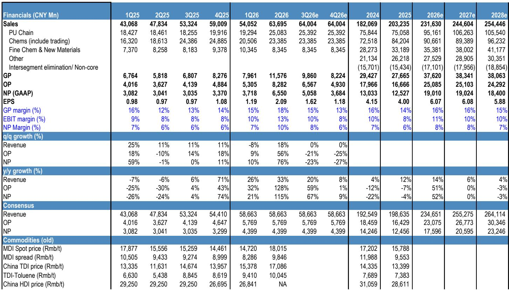
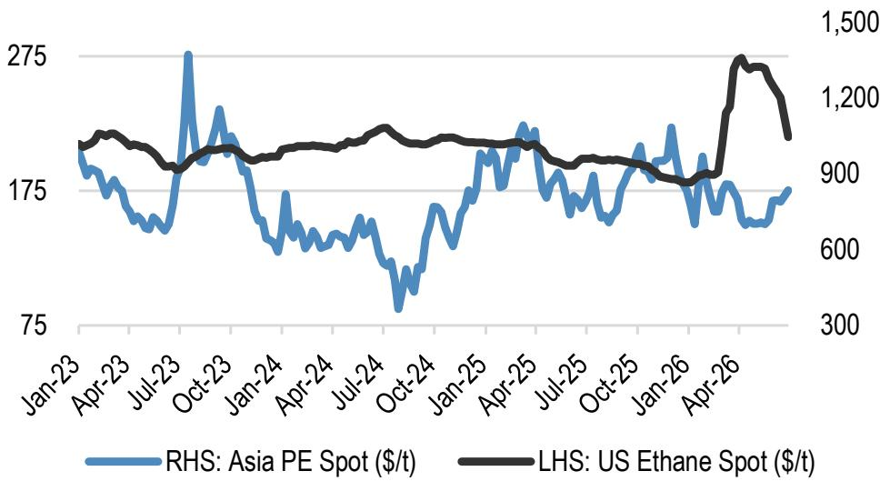
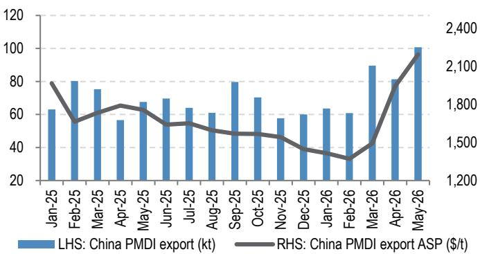

# 关于万华化学的一份研究笔记

市场对万华化学的关注，过去几个月集中在MDI价差收窄和油价走弱上。报价从4月高点回落超过20%，同期上证指数几乎未动。市场情绪似乎已经充分反映。

某机构最新发布的研究报告给出了一个不同的判断：万华化学二季度净利润预告远超预期，隐含的季度利润达到61亿至67亿元，环比增长68%至80%，创下公司历史上第二高的单季利润。这份报告的核心结论是，利润超预期的主要驱动力并非传统MDI业务，而是一个更结构性的变量——其烟台乙烯裂解装置成功完成原料切换，从油基转向乙烷基。

这意味着，万华正在经历一次成本曲线的重塑，而市场对此的认知可能仍停留在旧框架里。

## 1. 乙烷裂解的宏观环境性，正在改写万华的利润结构

报告明确指出，二季度利润超预期，很大一部分来自万华烟台100万吨乙烯裂解装置。该装置在2026年1月完成从丙烷到乙烷的原料切换，并实现满负荷运行。这一切换的时机极为关键。

在油价处于每桶70至80美元的区间时，乙烷裂解（ECC）的成本优势明显优于传统石脑油裂解（NCC）。数据显示，亚洲乙烯利润在4月和5月较2月显著提升，因为聚乙烯（PE）价格季度环比上涨超过30%，而美国乙烷价格基本持平。即便随后油价回落，亚洲PE现货价格仍比冲突前水平高出15%。

> **KC评论：** 乙烷裂解的核心逻辑不是赚产品价格波动的钱，而是赚原料价差的结构性钱。万华把一套原本烧油的装置改成了烧乙烷，相当于在化工周期底部给自己装了一个成本减震器。报告没有完全展开的一点是，万华二期120万吨裂解装置具备石脑油和乙烷灵活切换能力，这给了它在不同油价环境下动态调节利润率的期权。

## 2. MDI价差修复是短期催化剂，但供给冲击的持续性需要验证

二季度MDI和TDI价差环比分别扩大1560元/吨和635元/吨，直接原因是中东局势升级导致约44万吨MDI和24万吨TDI产能关停，分别占全球产能的4%和6%。巴斯夫在7月安排了45天检修，科思创也从7月1日起提价每磅0.22美元。

这些因素叠加，给万华的传统聚氨酯业务提供了短期支撑。但报告也暗示，供给冲击的持续性存在不确定性。中东产能恢复的时间表、巴斯夫美国扩产后的市场再平衡，都是需要观察的变量。

万华在MDI领域拥有约30%的全球市场份额和明确的成本优势，这是其长期护城河。但真正让这份报告从“中性”上调至“观点偏积极”判断的，是乙烷裂解带来的利润增量，而非MDI周期本身。

## 3. 报告尚未完全回答的关键问题：利润可持续性

某机构将万华2026年净利润预测上调21%至190亿元，为五年新高。这一估值基于15倍一年期远期市盈率，与五年历史均值一致。

但报告也留下了一个值得追问的问题：2027年净利润预测仅略高于2026年，几乎没有增长。这意味着，当前利润的高点很大程度上依赖于乙烷裂解的超额收益和MDI供给冲击的叠加。一旦这两个因素中的一个消退，利润能否维持？

万华正在推进的精细化学品和新材料业务，在报告中的收入预测增长并不激进。2026年该板块收入预计353亿元，2027年380亿元，增速远低于聚氨酯和石化板块。这意味着，市场对万华的中期增长叙事，仍高度依赖大宗品周期和成本套利，而非市场期待的“新材料第二曲线”。

## 4. 对产业观察者的框架：关注成本曲线而非价格曲线

这份报告对化工行业读者的真正启发，可能不在于万华的具体数字，而在于一个观察框架的切换。

当市场普遍盯着MDI报价、油价和价差图表时，真正驱动利润分化的变量，往往是那些不在主流视线内的成本结构变化。万华的乙烷裂解切换，卫星化学的乙烷裂解利润弹性较高，这些案例说明，在化工行业，真正的超额收益来自原料路线的选择，而非产品价格的猜测。

对于关注万华的研究者，需要持续跟踪的不仅是MDI价差，还有亚洲PE与乙烷的价差、欧洲与亚洲的烯烃套利空间，以及万华二期裂解装置的原料切换节奏。这些才是决定未来两年利润中枢的关键参数。

> **KC评论：** 报告里有一张图值得反复看——美国乙烷价格与亚洲PE现货的对比。乙烷价格几乎不波动，而PE价格随宏观和供给事件波动。这种“固定成本+浮动售价”的组合，在油价高企时是利润放大器，在油价下跌时是安全垫。万华真正在做的事情，是在化工行业里构建一个类似“天然气+化工”的盈利模式，而不是传统的“炼油+化工”模式。

---

For informational purposes only. Portions may be generated,translated,summarized,or edited with AI assistance based on source materials and may contain omissions or errors. Please verify independently. This is not investment,legal,tax,accounting,or other professional advice.

For informational purposes only. Portions may be generated,translated,summarized,or edited with AI assistance based on source materials and may contain omissions or errors. Please verify independently. This is not investment,legal,tax,accounting,or other professional advice.

