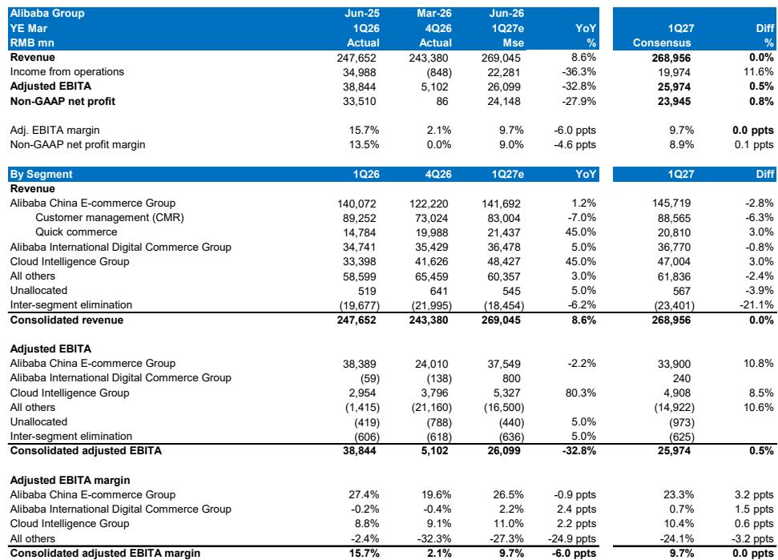
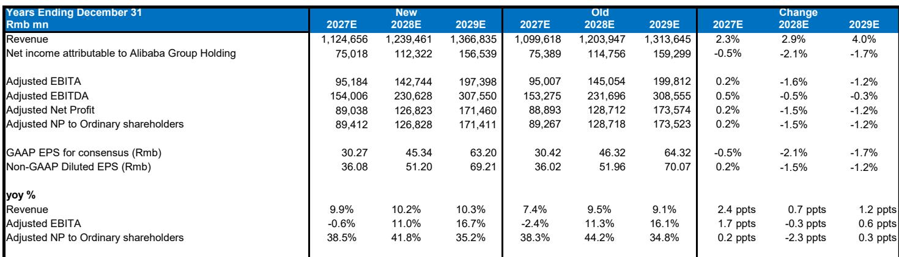
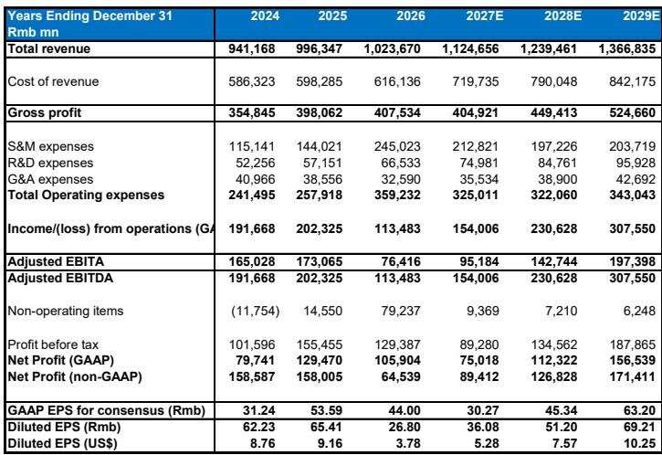

# MS：阿里即时零售亏损收窄超预期，电商稳利润控亏损

市场对阿里的关注，过去几个季度一直停在“电商还能不能稳”、“亏损业务何时止血”这些老问题上。但MS最新发布的1QF27预览报告给出了一个值得重新校准视角的信号：云业务的增速和利润改善，正在成为这家公司最值得跟踪的变量，其重要性可能超过电商本身的短期波动。

报告预计阿里云当季收入同比增长45%，高于市场预期的40%，利润率也从9%进一步扩张至11%。这个增速不是一次性脉冲——MAAS贡献的超预期、4月起提价、以及AI相关收入继续三位数增长，都指向云业务有持续加速的能力。与此同时，国内电商的EBITA表现“好于担忧”，即时零售亏损收窄的速度也比预期更快。

换句话说，阿里正在经历一个结构转换：增长引擎从电商向云迁移，而电商业务则从“高增长高投入”转向“稳利润控亏损”的现金牛模式。

## 1. 云业务45%的增速背后，是MAAS和AI驱动的结构性升级

这份报告最核心的判断，是阿里云的增速正在从“追赶行业”变成“引领行业”。45%的同比增长，相比上一季度40%的外部增速继续加速，且利润率的改善与规模扩张同步发生——EBITA margin从9%升至11%，距离管理层长期20%的目标还有空间，但方向明确。

驱动因素有三层。第一层是MAAS（模型即服务）贡献超预期，此前管理层设定的季度ARR 100亿目标已提前达成。第二层是AI相关收入继续三位数增长，这部分业务的利润率天然高于传统IaaS。第三层是4月开始的价格调整，叠加MAAS收入占比提升，直接拉动了利润率。

> **KC评论：** 云业务45%的增速和11%的利润率放在一起看，意味着阿里云不再只是“烧钱抢份额”的阶段。如果MAAS和AI的贡献持续提升，市场对云业务长期利润率的预期需要上调。报告里没有完全展开的一个问题是：当云收入占比从目前不到20%继续上升，阿里的整体估值框架是否应该从“电商估值+云期权”切换到“云估值+电商现金牛”？

## 2. 电商EBITA“好于担忧”，但真正的看点在于亏损收窄的速度

市场对阿里国内电商最大的担忧，始终是即时零售的亏损。上一季度亏损180亿，市场预期本季度可能仍在150亿以上。但报告给出的预估值是亏损100亿，收窄幅度明显快于预期。原因在于客单价提升带动了单位宏观环境改善。

电商核心的CMR收入在同口径下增长1-2%，略低于上季度的7-8%，但与行业整体增速（全国社零4-5月增长1.4%）基本一致。考虑到行业竞争格局没有根本性变化，这个增速本身并不令人意外。值得注意的反而是电商EBITA（剔除即时零售）仅下降3-4%，与CMR增速的差距在收窄——说明成本控制正在见效。

> **KC评论：** 即时零售亏损收窄的速度，是这份报告里最值得深挖的细节。如果这一趋势可持续，意味着阿里国内电商整体EBITA有可能在未来1-2个季度转正。报告没有给出亏损收窄的具体驱动拆解，但客单价提升和UE改善是关键词——这需要持续跟踪。

## 3. 报告没有完全回答的问题：其他业务的亏损拆分何时透明化

“所有其他业务”本季度亏损预计165亿，相比上季度的210亿有所收窄，但相对值仍然不小。报告特别指出，通义千问模型训练相关的费用会随着token量激增而持续上升，且规模可观。这意味着AI投入的“成本面”在短期内仍然是一个压制因素。

报告期待管理层在未来提供更细分的亏损拆解。当前“所有其他业务”这个黑箱里，既有本地生活、文娱等传统亏损业务，也有AI基础设施投入。如果不拆开看，很难判断亏损改善是来自业务优化，还是来自资本开支节奏的调整。

## 4. 对观察者的框架：从“电商利润”到“云增速+亏损收窄”的双轮跟踪

过去跟踪阿里，核心指标是CMR增速和电商EBITA。但这份报告提示了一个新的观察框架

第一层，看云业务的增速和利润率是否持续超预期。45%的增速如果能在未来2-3个季度维持，云的估值权重就需要重新评估。报告给出的DCF估值中，WACC为10%、终值增长率为3%，并未对云业务单独估值——这意味着如果云业务持续超预期，估值有上调空间。

第二层，看即时零售亏损收窄的斜率。如果亏损从180亿到100亿的趋势能延续至50亿甚至更低，国内电商整体的利润贡献将显著改善。

第三层，看其他业务的亏损拆分何时透明化。这是市场目前定价最不充分的变量——如果AI投入能被单独列示，市场对“投入期”和“回报期”的判断会更清晰。

整份报告传递的核心信息是：阿里正在从一个“电商公司”变成“云+AI公司”，而这个转变的早期信号已经出现在数据里。市场是否愿意为这个新叙事定价，取决于接下来几个季度云业务能否继续加速，以及亏损业务能否持续改善。

For informational purposes only. Portions may be generated,translated,summarized,or edited with AI assistance based on source materials and may contain omissions or errors. Please verify independently. This is not investment,legal,tax,accounting,or other professional advice.

For informational purposes only. Portions may be generated,translated,summarized,or edited with AI assistance based on source materials and may contain omissions or errors. Please verify independently. This is not investment,legal,tax,accounting,or other professional advice.

