Investor Presentation | Asia Pacific

Asia Summer School 2026: China Healthcare

## MS ASIA LIMITED+

Laurence Tam
Equity Analyst
Laurence.Tam@morganstanley.com +852 2239-1753

Alexis Yan, CFA
Equity Analyst
Alexis.Yan@morganstanley.com +852 2239-7953

Jack Lin
Equity Analyst
Jack.Lin@morganstanley.com +852 3963-3746

Clinton Ng
Equity Analyst
Clinton.Ng@morganstanley.com +852 2848-6659

Marco Wong
Research Associate
Marco.Wong@morganstanley.com +852 3963-2021

Vanessa Liao
Research Associate
Vanessa.Liao@morganstanley.com +852 3963-0115

## CHINA HEALTHCARE

Asia Pacific
Industry View Attractive

MS does and seeks to do business with companies covered in MS. As a result, investors should be aware that the firm may have a conflict of interest that could affect the objectivity of MS. Investors should consider MS as only a single factor in making their investment decision.

For analyst certification and other important disclosures, refer to the Disclosure Section, located at the end of this report.

+= Analysts employed by non-U.S. affiliates are not registered with FINRA, may not be associated persons of the member and may not be subject to FINRA restrictions on communications with a subject company, public appearances and trading securities held by a research analyst account.

## Asia Summer School 2026

## China Healthcare Universe

Year-to-date sector performance - aggregate market cap

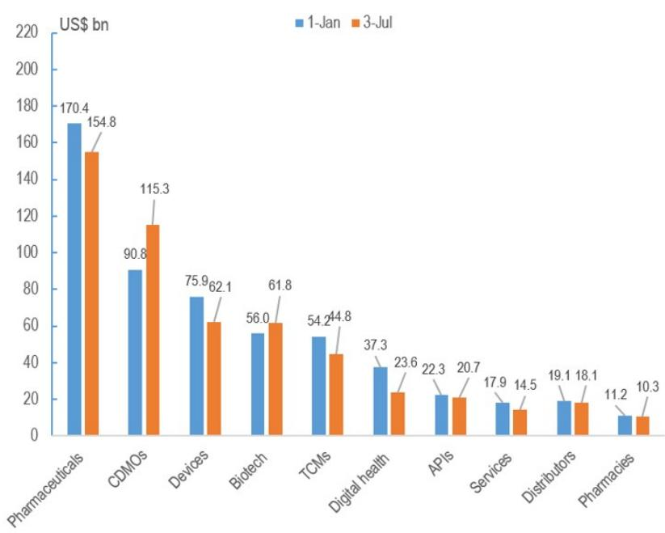  
Key sector events we track

<table><tr><td>Time</td><td>Event</td><td>Implications for stocks</td></tr><tr><td>Sep-Nov 26</td><td>NDRL and Catalog C negotiation (Sep-Nov) &amp; result release (Nov)</td><td>Pharma, biotech</td></tr><tr><td>Ongoing</td><td>DRG/DIP expansion</td><td>Healthcare service, medtech, etc.</td></tr><tr><td>Ongoing</td><td>Equipment replacement stimulus for hospital</td><td>Medtech, etc.</td></tr><tr><td>Possibly 2H26/1H27</td><td>Anhui-led VBP for biosimilars</td><td>Pharma, biotech</td></tr></table>

Conferences & Exhibitions

<table><tr><td>Sep&#x27;26</td><td>WCLC 2026</td><td>Pharma, biotech</td></tr><tr><td>Sep&#x27;26</td><td>PCR-CIT 2026 (Chengdu)</td><td>Medtech</td></tr><tr><td>Oct&#x27;26</td><td>ESMO 2026</td><td>Pharma, biotech</td></tr><tr><td>Nov-Dec&#x27;26</td><td>RSNA 2026</td><td>Medtech</td></tr><tr><td>Dec&#x27;26</td><td>SABCS 2026</td><td>Pharma, biotech</td></tr><tr><td>Dec&#x27;26</td><td>ASH 2026</td><td>Pharma, biotech</td></tr></table>

Source: FactSet; MS. Note: Constituents are the 89 healthcare companies under our coverage.

## Pharma: China and Global TAM for Pharmaceutical Sales

China's pharmaceutical market is sized at ~Rmb1.8trn...

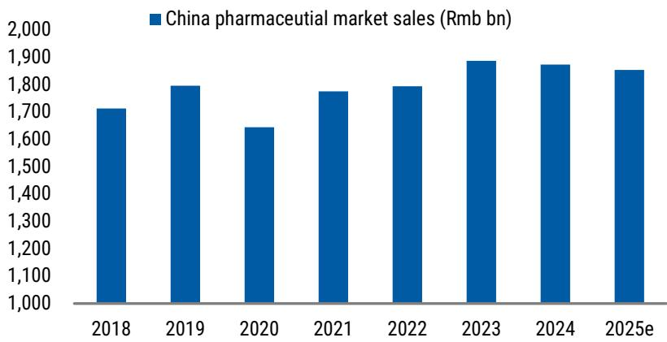  
... And represents ~15% of the global pharmaceutical market

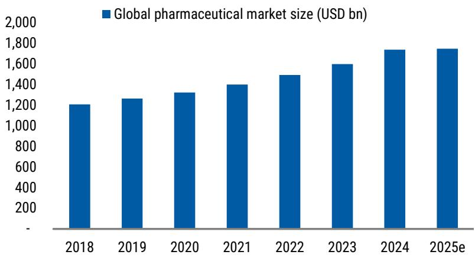

## Pharma: Out-licensing Momentum Stayed Robust 2026

## Key Takeaways from Inaugural MS Biopharma Symposium

\- Global recognition of China innovation is moving beyond engineering to the 2.0 Era - more novel modalities, disease areas and next-gen technologies.

• Correspondingly, BD deal models are broadening from pure out-licensing to NewCo, Co-co (co-commercialization) and strategic partnerships.

\- Clean IP, corporate structure and globally translatable clinical development strategies are additional factors to consider in preparing for globalization.

\- AI-driven drug discovery is shifting from platform narrative to asset generation.

\- Hengrui is an example of China biopharma globalization, underpinned by end-to-end development capabilities and monetized via versatile BD models.

Global pharma % of 2025 revenue that goes off patent by the end of 2030

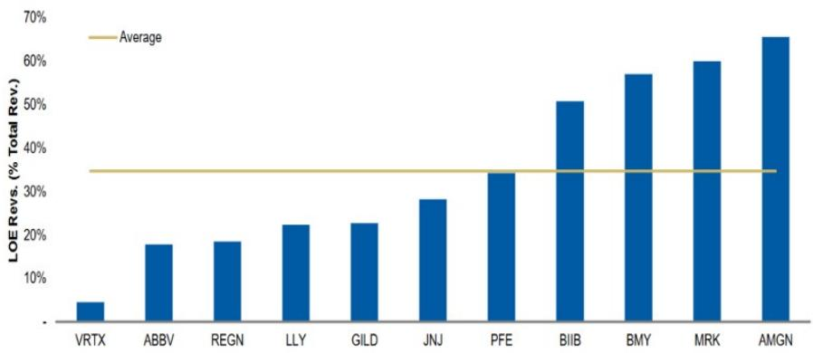  
Source: GBI, MS.

China out-licensing: Upfront payments and total deal value (US\$ bn)  
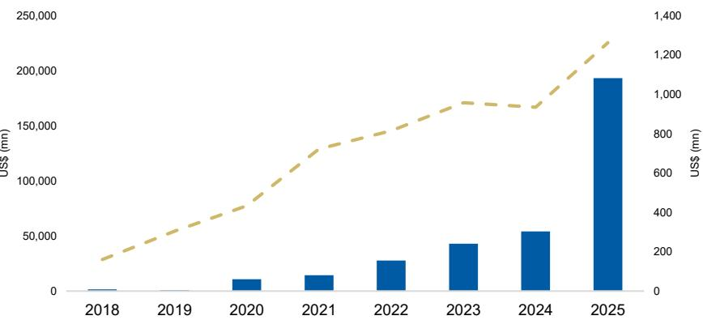

Pharma: Broadening Models to Globalization

<table><tr><td colspan="5">Selected landmark deals from China biopharma</td></tr><tr><td>Example Structure</td><td>Platform / Company</td><td>Asset / Area</td><td>Selected Economics</td><td>Globalization Signal</td></tr><tr><td>Hengrui w/BMS</td><td>Out-license, in-license, co-development and co-commercialization options</td><td>Oncology/hematology projects licensed to BMS, immunology projects licensed to Hengrui, co-developing five assets</td><td>US$600mn upfront + US$350mn anniversary payments; ~US$15.2bn milestones; tiered royalties; co-commercialization rights for certain assets</td><td>Portfolio-level sourcing at scale: global pharma securing repeat pipeline access from China, also reverse-licensed own asset to China pharma, plus co-developments and co-commercialization rights</td></tr><tr><td>Hengrui → Kailera</td><td>NewCo</td><td>Cardio-metabolic (GLP-1 franchise)</td><td>Kailera NewCo completed US IPO in Apr-26; Hengrui owns 13.6% stake</td><td>Common out-license interests plus equity interests with clear exit paths</td></tr><tr><td>CSPC w/AstraZeneca</td><td>Ex-China license with AstraZeneca</td><td>Long-acting platform including GLP-1R/GIPR and seven other assets</td><td>US$1.2bn upfront; US$3.5bn R&amp;D and US$13.8bn commercial milestones, double-digit royalties</td><td>Repeated partnerships with deepening scope; China pharma contribution for early-stage metabolic assets</td></tr><tr><td>3SBio w/Pfizer</td><td>Late-stage license with Pfizer</td><td>SSGJ-707 PD-1/VEGF</td><td>US$1.4bn upfront; US$4.8bn+ milestones; tiered double-digit % royalties</td><td>Large upfronts signal late-stage clinical validation</td></tr><tr><td>Hansoh w/GSK</td><td>Ex-China license with GSK</td><td>HS-20093 B7H3 ADC, HS-20089 B7H4 ADC</td><td>US$260mn upfront; US$3bn milestones; tiered sales royalties</td><td>Smooth global development across indications leveraging China PoC</td></tr></table>

## Hengrui case study: Out-licensing, NewCo and strategic alliances

NewCo (Top-tier PE/VCs)  
Strategic Alliance (MNCs)  
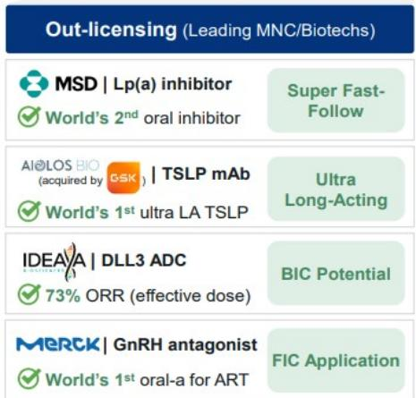  
Source: Company data, MS.

Super Fast-Follow

BIC Potential

\- Multiple GLP-1-based assets
  ✓ Largest NewCo deal in China
  ✓ Largest biotech IPO of all time

NASDAQ listed in Apr'26

BIC Portfolio

## braveheart

World's $3^{\mathrm{rd}}$ myosin inhibitor, with superior efficacy, safety and simplified dosing

\- PDE3/4i + up to 11 program options across respiratory, I&I and oncology

FIC/BIC Portfolio

√ Landmark deal b/w a MNC and Chinese PharmaCo

## Bristol Myers Squibb®

• 13 programs in oncology, hematology and immunology

• Joint R&D efforts on novel assets leveraging Hengrui platforms

Co-Co opportunities

Pharma: Broadening Models to Globalization (Continued)

<table><tr><td colspan="7">Top 15 China BD deals ranked by total deal size, 2025-1H26</td></tr><tr><td>China Biopharma/Biotech</td><td>Licensee</td><td>Total deal value / USD</td><td>Upfront fee / USD</td><td>Product/technology</td><td>Mechanism of action</td><td>News date</td></tr><tr><td>CSPC</td><td>AstraZeneca PLC</td><td>18,500,000,000</td><td>1,200,000,000</td><td>Once-monthly injectable weight management products; Proprietary sustained-release delivery technology platform and peptide drug AI discovery platform SYH2082</td><td>Long-acting delivery</td><td>2026-01-30</td></tr><tr><td>Jiangsu Hengrui</td><td>Bristol-Myers Squibb</td><td>15,200,000,000</td><td>600,000,000</td><td>13 early stage programs spanning oncology, hematology and immunology</td><td>NA</td><td>2026-05-12</td></tr><tr><td>Genequantum Medicine (Suzhou)</td><td>Biohaven, Ltd.;AIMEDBIO</td><td>13,000,000,000</td><td>Not available</td><td>Basket of ADCs</td><td>ADCs</td><td>2025-01-24</td></tr><tr><td>Jiangsu Hengrui</td><td>GlaxoSmithKline</td><td>12,500,000,000</td><td>500,000,000</td><td>HRS-9821</td><td>PDE3/4 and others</td><td>2025-07-28</td></tr><tr><td>Innovent Biologics</td><td>Takeda</td><td>11,400,000,000</td><td>1,200,000,000</td><td>IBI363, IBI343, IBI3001</td><td>PD1/IL2, CLDN18.2 ADC, EGFR/B7H3 ADC</td><td>2025-10-22</td></tr><tr><td>Innovent Biologics</td><td>Pfizer</td><td>10,500,000,000</td><td>650,000,000</td><td>A sweeping global strategic partnership spanning 12 early stage, first-in-class oncology discovery and R&amp;D programs with breakthrough potential</td><td>NA</td><td>2026-05-29</td></tr><tr><td>Innovent Biologics</td><td>Eli Lilly</td><td>8,850,000,000</td><td>350,000,000</td><td>The innovative drugs in the oncology and immunology fields</td><td>NA</td><td>2026-02-08</td></tr><tr><td>Shanghai Fosun Pharmaceutical</td><td>Clavis Bio</td><td>7,250,000,000</td><td>Not available</td><td>Basket</td><td>NA</td><td>2025-12-18</td></tr><tr><td>3SBio</td><td>Pfizer</td><td>6,050,000,000</td><td>1,250,000,000</td><td>SSGJ-707</td><td>PD1/VEGF</td><td>2025-05-20</td></tr><tr><td>RemeGen Co., Ltd.</td><td>AbbVie</td><td>5,600,000,000</td><td>650,000,000</td><td>RC148</td><td>PD1/VEGF</td><td>2026-01-13</td></tr><tr><td>Shanghai Argo Biopharma</td><td>Novartis AG</td><td>5,360,000,000</td><td>160,000,000</td><td>Two molecules in early stage research, another siRNA candidate drug in preclinical research BW-00112</td><td>siRNA</td><td>2025-09-03</td></tr><tr><td>CSPC</td><td>AstraZeneca</td><td>5,330,000,000</td><td>110,000,000</td><td>A preclinical-stage oral small-molecule therapy for immune disorders</td><td>NA</td><td>2025-06-13</td></tr><tr><td>Harbour BioMed</td><td>AstraZeneca</td><td>4,680,000,000</td><td>175,000,000</td><td>Multi-specific antibody platform</td><td>Multi-specific antibodies</td><td>2025-03-21</td></tr><tr><td>Suzhou Ribo Life Science</td><td>Madrigal</td><td>4,400,000,000</td><td>60,000,000</td><td>Six innovative siRNA therapies for MASH</td><td>siRNA</td><td>2026-02-11</td></tr><tr><td>RemeGen</td><td>Vor Biopharma</td><td>4,230,000,000</td><td>125,000,000</td><td>Telitacicept</td><td>BLyS/APRIL</td><td>2025-06-25</td></tr></table>

Source: GBI, Company data, MS.

## Pharma: Catalyst Watch and Policy Trackers

## MS Policy and Industry-event Trackers

## Beijing Health Check

• 2025 NRDL Results Takeaways

• More Liberal Pricing for Innovative Drugs in China

• Online Prescriptions for Injectable Drugs

## Catalyst Previews

• ASCO 2026 Abstracts – Pharma Edition

• Key Summer Events for China Pharma

\- Earnings Previews

## Event Takeaways

Takeaways from Inaugural MS China Biopharma Symposium

China Healthcare Trip Takeaways: China Pharma Edition

## Single-stock Insights

## China Biopharma: Key industry-level catalysts for 2H26

<table><tr><td>Event</td><td>Timing</td></tr><tr><td colspan="2">Academic conferences</td></tr><tr><td>EHA</td><td>June 11-14, 2026</td></tr><tr><td>ERS Congress</td><td>September 5-9, 2026</td></tr><tr><td>WCLC</td><td>September 12-15, 2026</td></tr><tr><td>EASD</td><td>September 28- October 2, 2026</td></tr><tr><td>MS Global Healthcare Conference</td><td>Septemeber 14-16, 2026</td></tr><tr><td>ESMD</td><td>October 23-26, 2026</td></tr><tr><td>ASH</td><td>December 12-15, 2026</td></tr><tr><td>SABCS</td><td>December 8-11, 2026</td></tr><tr><td colspan="2">Industry/Policy</td></tr><tr><td>Director of National Intelligence (DNI) assessment report on global threats</td><td>June 18, 2026</td></tr><tr><td>Supplemental information submission deadline for NRDL and commercial insurance</td><td>July 3, 2026</td></tr><tr><td>Implementation of new sales representative policy</td><td>August 1, 2026</td></tr><tr><td>Release of drug list eligible for negotiations for NRDL and commercial insurance</td><td>August-September, 2026</td></tr><tr><td>Negotiations for drug prices/bidding</td><td>September-October, 2026</td></tr><tr><td>Release of final drug lists for updated NRDL and commercial insurance</td><td>October - November, 2026</td></tr><tr><td>Potential announcement of Biosimilar VBP</td><td>2H26</td></tr></table>

## Globalization: Push and Pull Factors into Globalization

With Global pharma LOE gap as a demand factor, and rising risk capacity and financial resilience of China biotech, globalization momentum continues

Global Pharma LOE Gap  
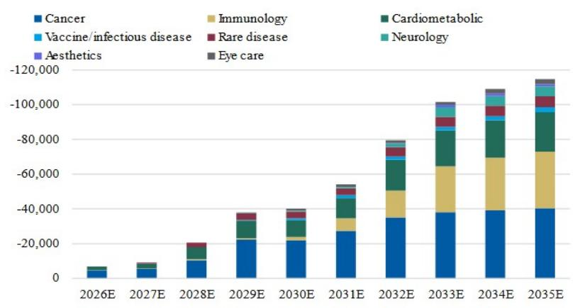  
China Biotech: Increasingly Self-funded

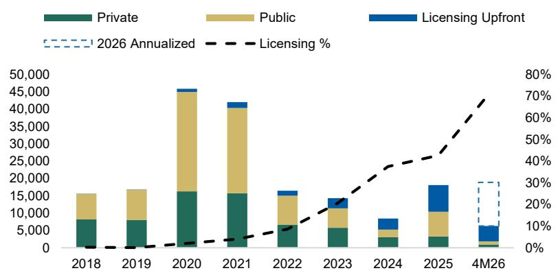

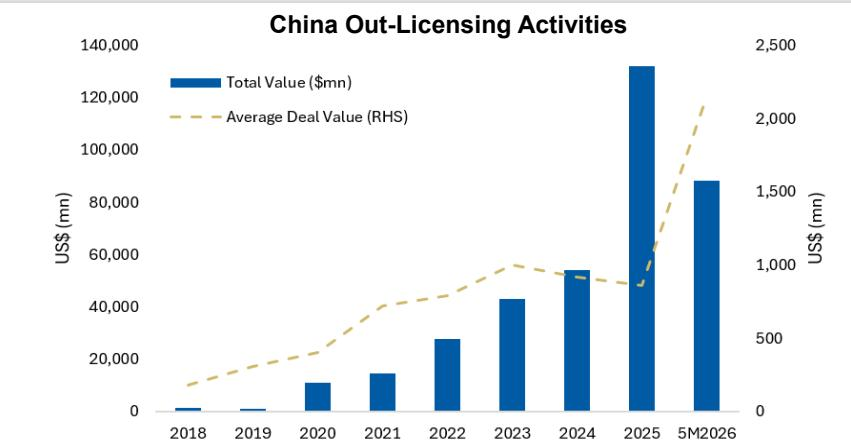  
Source: MS estimates; IQVIA Institute; GBI; US FDA; FactSet.  
China-Originated Asset Forecast % of US FDA Approvals by 2040

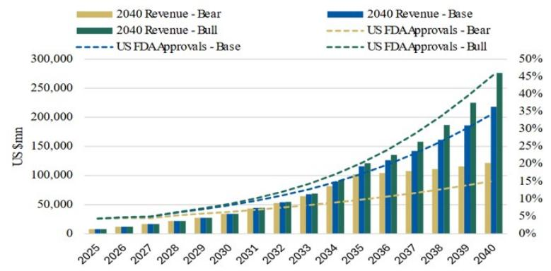

## Biotech: China Supply Drivers

## Talent, publication quality and capital cycles explain why the pipeline supply is durable

STEM Graduate US vs. China  
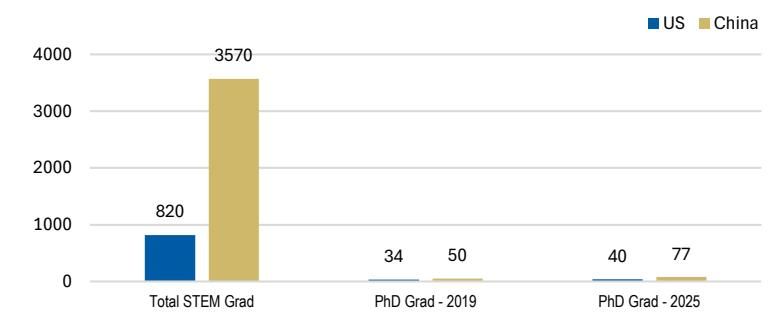  
US vs. China Field-Weighted Citation Impact

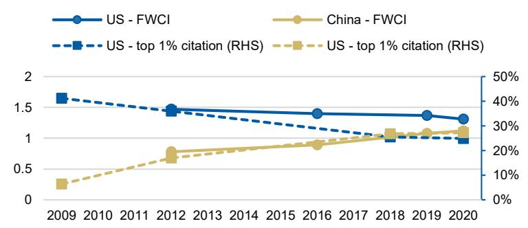

US vs. China's Trial Cost  
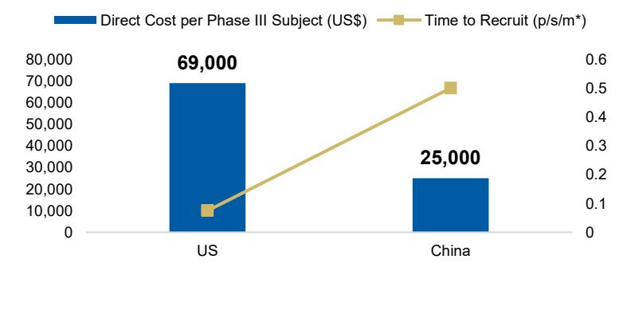  
Source: China Ministry of Education; US NCSES; Elsevier Scopus; Clarivate InCites; Springer Nature; GBI; MS.

Cancer Incidence by Type  
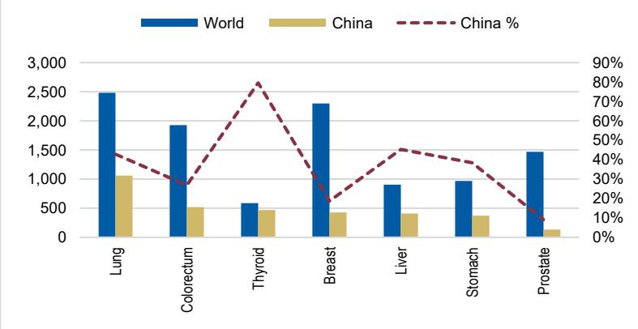

## Biotech: From Supply to Conversion

Trial design, population mix and regulatory acceptability determine whether China-originated assets can convert globally

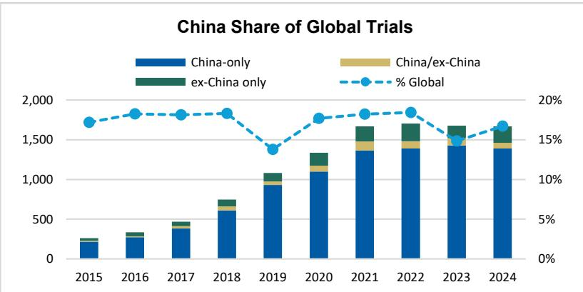

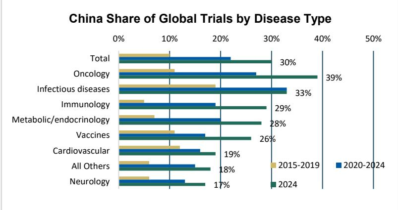

China's Progress on Regulatory Harmonization  
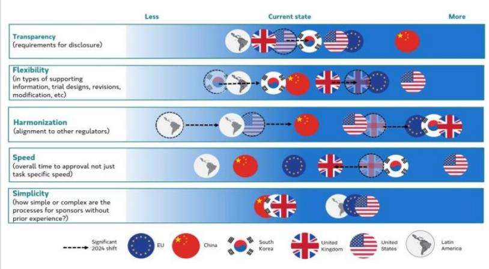  
Source: China Ministry of Education; US NCSES; Elsevier Scopus; Clarivate InCites; Springer Nature; GBI; MS.

China's Leveraged Cashflow & ROI  
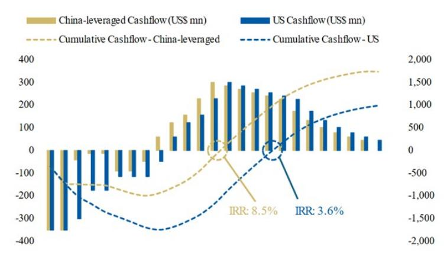

## Biotech: Evolution of Deal Structure

## Headline deal value often overstates validation; retained economics determine true value

Valuation Ladder -> Domestic-only, licensing, NewCo/Co-co, M&A

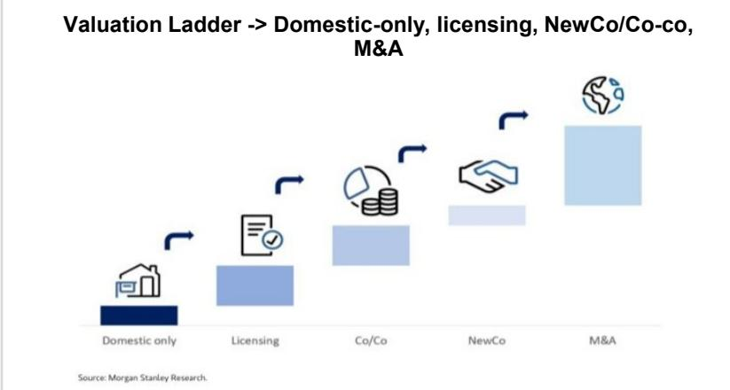

Out-licensing to M&A NPV Discount  
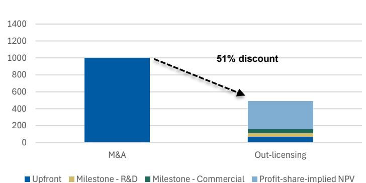

Co-dev to M&A NPV Discount  
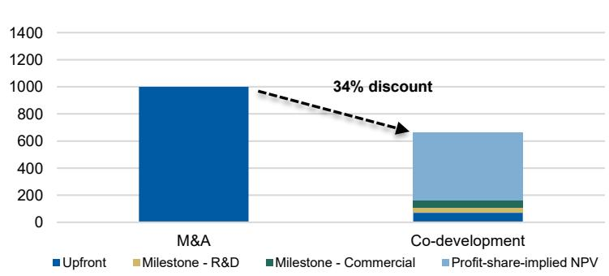

NewCo to M&A NPV Discount  
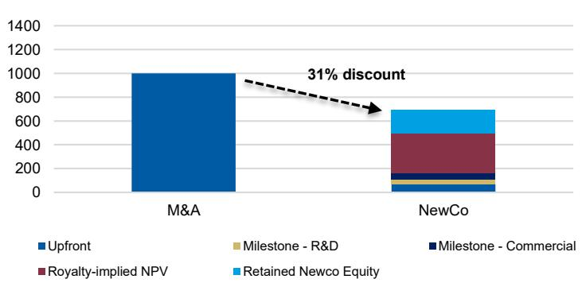

## CRO/CDMO – China Emerging as a Global R&D Base

Global pharma CRO outsourcing rate set to reach 62% by 2030e  
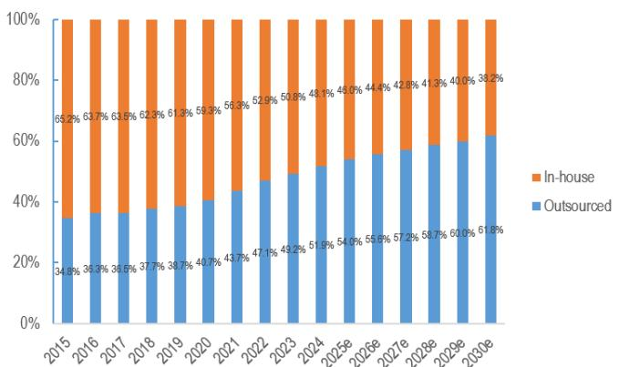  
Note: CRO = contract research organizations. Source: Frost & Sullivan estimates; WuXi AppTec; MS.

## Clinical trial starts in China have surged in the 5 years

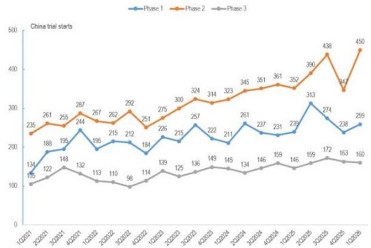  
Source: ClinicalTrials.gov, MS. Note: This is a restated version of China clinical trial start data. Data are subject to revision as sponsors may upload or update trial registrations retrospectively.

Phase I-III trial starts based on sponsor headquarters  
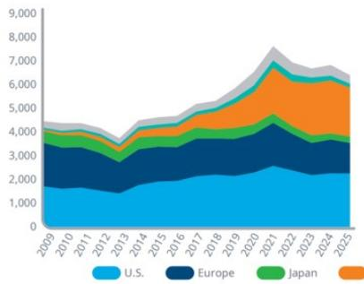  
Source: Citeline Trialtrove, IQVIA, MS.

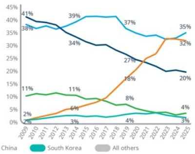

Share of industry interventional trial country uses for top-10 markets in 2025 (Phase I-III)  
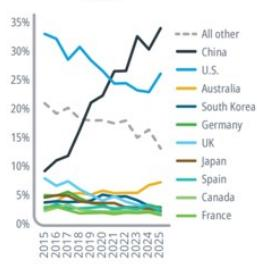

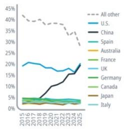

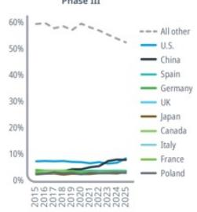  
Note: "Interventional" means involving a therapeutic agent. Source: Citeline Trialtrove, IQVIA, MS.

## CRO/CDMO – Demand for China CRO Services Is on the Rise

\- MNCs/biopharmas are more inclined to partner with Chinese CROs due to their advantages on cost, efficiency, tech capability and favorable regulatory environment.

\- The IND review process has been cut from 60 to 30 days in China.

\- The US FDA has now unveiled plans to shorten the IND phase by 6-12 months, following its call to ban the use of China data in IND applications, to compete with China.

Normalizing supply and demand in China clinical trial outsourcing  
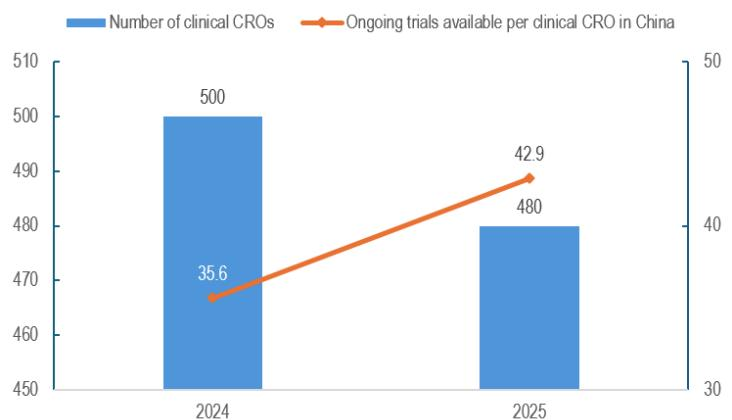  
Source: Frost & Sullivan; Tigermed; MS.  
China clinical CRO market is expected to pick up significantly in 2025-30e

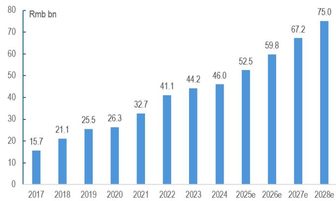  
Source: Frost & Sullivan estimates; Tigermed; MS.

China lab monkey prices are trending higher  
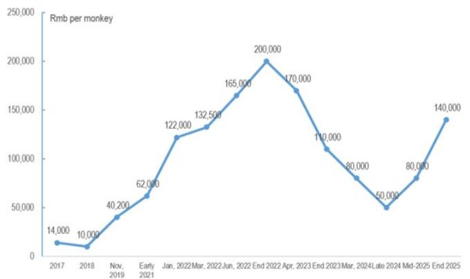  
Source: Sixth Tone; Exigyn; The China Project; Global Times; Gelonghui Finance; Joinn Labs; MS.

## CRO/CDMO – Small Molecules a Significant Growth Driver

FDA drug approvals in the past 10 years  
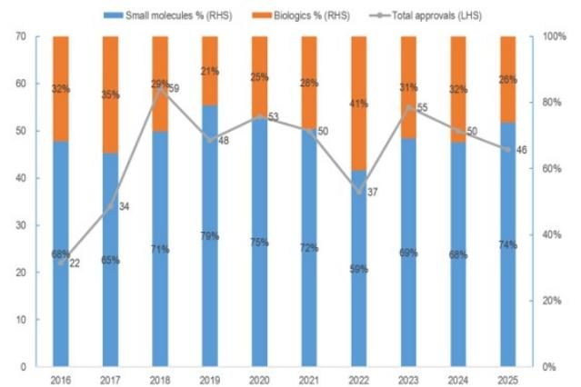  
Note: Small molecules include peptides and oligo-nucleotides. Source: "The Pharmaceutical Industry in 2025: An Analysis of FDA Drug Approvals from the Perspective of Molecules", Molecules 2026, 31, 419; MS.

NMPA drug approvals in the past 10 years  
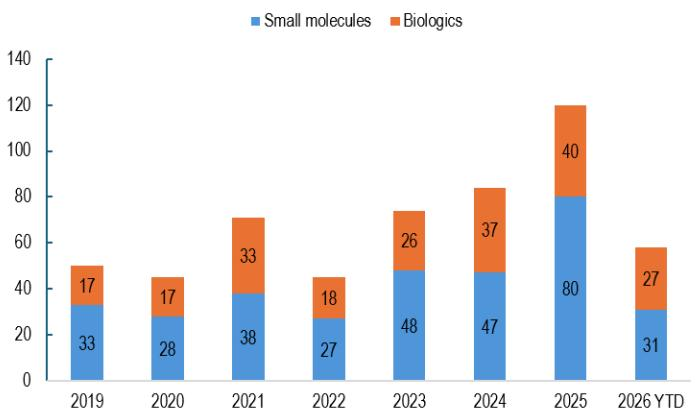  
Source: PharmCube; NMPA; MS.

Latest CDMO book-to-bill ratios and backlog growth YoY

<table><tr><td></td><td>Book-to-bill ratio</td><td>Backlog growth</td></tr><tr><td>Apeloa</td><td>2.99</td><td>13%</td></tr><tr><td>Tigermed*</td><td>2.66</td><td>15%</td></tr><tr><td>Joinn Labs</td><td>1.84</td><td>41%</td></tr><tr><td>WuXi XDC*</td><td>1.73</td><td>50%</td></tr><tr><td>WuXi Bio*</td><td>1.42</td><td>24%</td></tr><tr><td>Asymchem</td><td>1.38</td><td>32%</td></tr><tr><td>WuXi Apptec</td><td>1.29</td><td>24%</td></tr><tr><td>Zhejiang Jiuzhou</td><td>1.02</td><td>20%-25%</td></tr><tr><td>Hepalink</td><td>0.59</td><td>67%</td></tr><tr><td>Medtide*</td><td>0.49</td><td>-31%</td></tr></table>

Note: \* refers to FY2025. Apeloa backlog growth rate - QoQ. WuXi AppTec backlog - generally executable within 18 months. WuXi Bio backlog - within 3 years. WuXi XDC backlog - 12 to 18 months for revenue conversion. Apeloa backlog - within 3 years. Medtide backlog - revenue recognition within 2 years. Hepalink backlog - revenue recognition within 1 year and growth rate reflects the YoY change in 2025 vs. 2024. Source: Company data, MS.

Breakdown of the global CRDMO market  
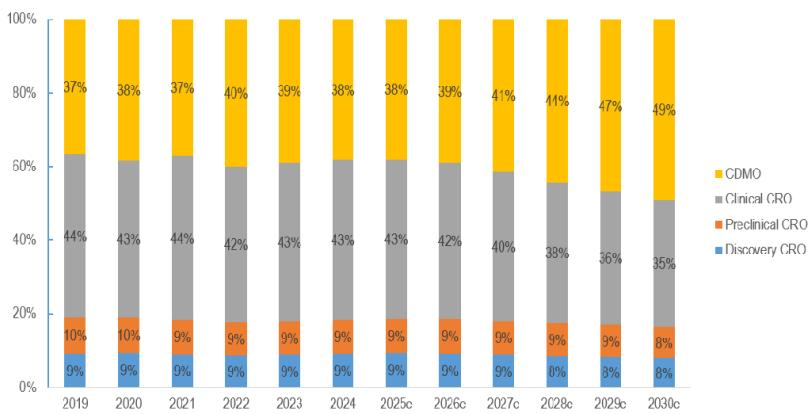  
Source: Frost & Sullivan estimates; WuXi AppTec; MS

Source: Pharmcube, MS.

## CRO/CDMO – Fast-growing Modalities

## Global CDMO market for small molecules and TIDEs is set to accelerate in the next 5 years

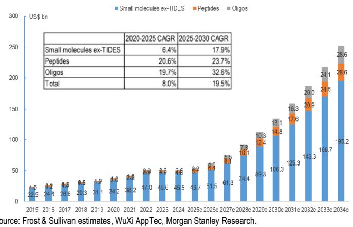  
Number of in vivo CAR-T programs in the pipeline globally

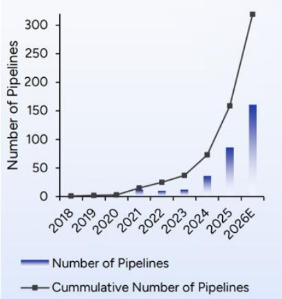  
Source: GenScript; Beacon; PharmCube; MS. E = PharmCube estimates.  
Global ADC pipeline by antibody drug target

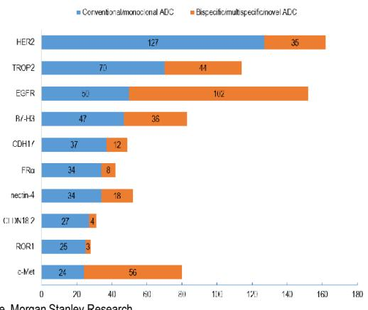  
Capex spending of Chinese leading CDMOs

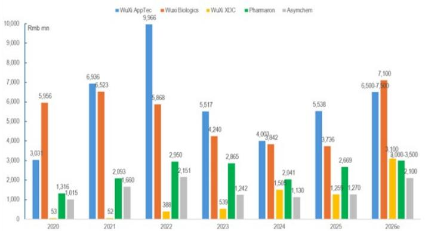  
Source: FactSet, company data and projections (2026e), MS. Note: 2026e figures - company guidance.

## Medtech – China TAM and Capex Outlook

China's medical device market is sized at ~Rmb1.2trn  
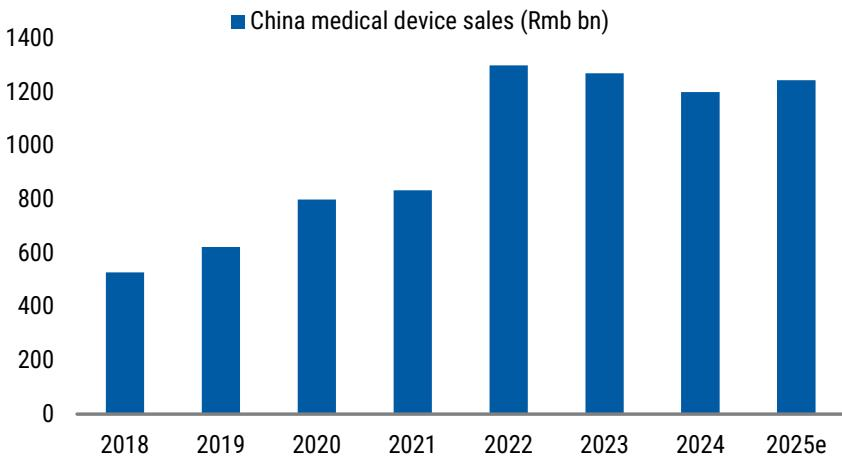

More hospital executives expect capex to increase in 2026 at a higher weighted average growth rate of 4.7%  
Expected Change in Capital Spending  
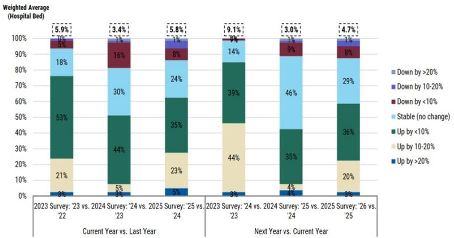

## Medtech – Domestic Market and Regulatory Environment

\- China Hospital AlphaWise Survey: Annual survey of ~80 China hospital executives on capex outlook and brand preferences

• US Dental AlphaWise Survey: Quarterly survey of US dentists on brand usage, pricing and feedbacks

\- Beijing Health Check: CMEF Takeaways

\- Beijing Health Check: More Regional VBP for Medical Equipment Underway

\- Global Lateral read: China MedTech Reimbursement call takeaways

% of VBP in medical equipment, 2025  
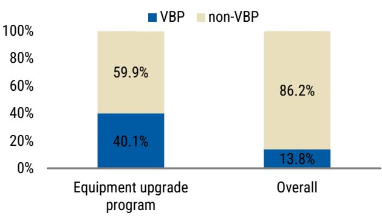  
Source: Joinchain, MS  
Hospital income & surplus, expected patient demand and local fiscal support are the top decision-making factors  
Factors Affecting Capital Spending Decisions Over Next 12 Months

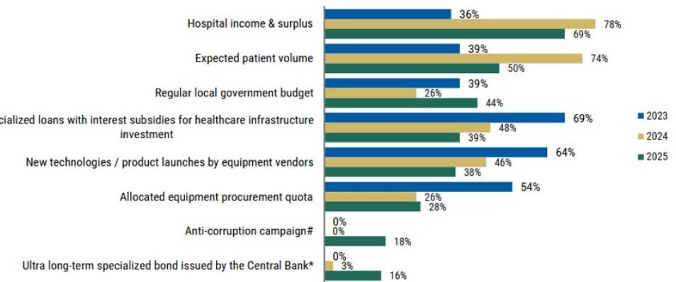

## AI and digitization topped investment priorities, followed by OR, imaging, clinical labs, ICU...

Expected NET Change (% Increase - % Decrease) in Capital Spending Next Year by Category (excluding N/A)

■ 2023 Survey: '24 vs. '23 ■ 2024 Survey: '25 vs. '24 ■ 2025 Survey: '26 vs. '25

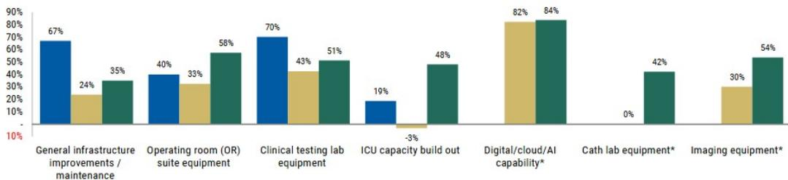  
\* = newly added in 2024 survey; # = newly added in 2025 survey. Source: AlphaWise, MS

## Medtech – Globalization on Robust Commercial Momentum

China medical device trade balance

<table><tr><td>Year</td><td>Imports (USD bn)</td><td>Exports (USD bn)</td><td>Trade Balance (USD bn)</td></tr><tr><td>2025</td><td>48.0</td><td>52.4</td><td>-4.4</td></tr><tr><td>2024</td><td>49.1</td><td>49.9</td><td>-0.8</td></tr><tr><td>2023</td><td>49.1</td><td>46.0</td><td>3.1</td></tr><tr><td>2022</td><td>49.8</td><td>60.0</td><td>-10.2</td></tr><tr><td>2021</td><td>45.3</td><td>61.3</td><td>-16.0</td></tr></table>

Breakdown of export categories

<table><tr><td>Category</td><td>2025</td><td>2024</td><td>2023</td><td>2022</td><td>2021</td></tr><tr><td>Diagnostic Equipment</td><td>22.3%</td><td>22.0%</td><td>25.2%</td><td>25.1%</td><td>25.4%</td></tr><tr><td>Medical Consumables</td><td>29.7%</td><td>29.7%</td><td>29.2%</td><td>29.4%</td><td>34.1%</td></tr><tr><td>Other Devices</td><td>2.9%</td><td>2.8%</td><td>3.2%</td><td>3.1%</td><td>2.9%</td></tr><tr><td>In Vitro Diagnostic Reagents</td><td>36.6%</td><td>36.4%</td><td>32.1%</td><td>32.5%</td><td>26.3%</td></tr><tr><td>IVD Analyzers</td><td>8.5%</td><td>9.0%</td><td>10.4%</td><td>10.0%</td><td>11.4%</td></tr></table>

Source: Custom data, High-end Medical Devices Research Institute, MS

% of Overseas Revenue in 2025 vs. Medium Term, per Company target or MSe  
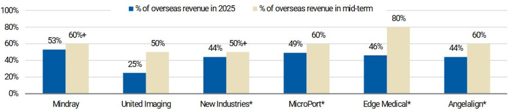  
\* = our estimates Source: Company data, MS estimates

## Medtech – Aesthetics

Clear aligner: Estimate global market share for doctor-directed cases

![](
