# 市场观察

# 7月8日 — 动能趋缓下的分化操作

## 散户交易活动概览

- 上周散户买入意愿增强（82%分位），受ETF需求回升（71%分位）及个股持续活跃（86%分位）推动。板块资金流向变化不大，科技板块仍是近期市场调整中的关注焦点，逢低买入活动集中在散户偏好的标的（如存储龙头）。ETF方面，配置比例周环比保持稳定，SOXL的持续减持（-1.9z）被SMH的持续买入（2.6z）所抵消。

- 随着相关军事行动推进及能源价格回升至80美元上方，散户对能源板块的买入意愿在周三升至92%分位。不过，能源类ETF需求温和，如BNO（1.0z）和USO（0.2z），而做空能源类产品（SCO）本周继续被减持（-1.5z，图7）。

- 动量因子本月动能有所减弱，半导体板块领跌——我们的专有动量拥挤度指标已从约100%分位降至98.6%分位（图4）。散户对推动7月调整的高动量标的操作出现分化：对今年受关注的标的如SNDK（2.3z，尽管周三出现资金流出）和MU（0.3z）采取逢低买入策略，而对AMAT（-3.4z）、WDC（-3.0z）、KLAC（-2.9z）、MRVL（-1.0z）和LRCX（-2.3z）则选择减持。AVGO宣布与AAPL的合作关系延长至2031年，但并未显著吸引散户资金流入（AVGO：0.0z，AAPL：0.6z，详见宏观与基本面专题）。

- 除6月18日至23日期间外，散户读者一直是SPCX的持续净买入方（图6）。上市后前三个交易日交投最为活跃，期间该标的价格上涨约50%。周二，我们的分析师首次覆盖SPCX，给予增持评级，目标价为225美元。研究观点围绕该公司的发射能力及Starship的快速复用特性展开。预计Starship发射次数将从2026年的少量逐步增至2031年的约5000次，从而支持SpaceX建设75GW的轨道计算能力。团队预测2025至2030年间收入复合年增长率为91%，同时随着业务结构从连接服务向人工智能（先地面后轨道）转变，利润率将显著提升。SpaceX在纳斯达克上市首日，散户读者获配约20%的股份，而通常这一比例接近5%。

- 发电设备类标的如GEV（7月1日-1.3z，图17）、CAT（-1.5z，图19）和CMI（0.6z，图21）在7月1日下跌约7%，此前一家德国竞争对手被下调评级。此次广泛调整表明，市场对人工智能相关支出峰值的担忧仍在影响相关及上游受益标的的估值情绪（详见宏观与基本面专题）。

## 权益策略与量化研究

Arun Jain AC
(1-212) 622-9454
arun.p.jain@JPM.com
JPM Securities LLC

Shizuka Suga, CFA AC
(1-212) 622-2134
shizuka.suga@JPM.com
JPM Securities LLC

Ana Pous Avila
(1-212) 622-0496
ana.pousavila@JPM.com
JPM Securities LLC

William Matheson
(1-212) 622-9538
william.matheson@jpmchase.com
JPM Securities LLC

Khuram Chaudhry
(44-20) 7134-6297
khuram.chaudhry@JPM.com
JPM Securities plc

Bhupinder Singh AC
(1-212) 622-9812
bhupinder.singh@JPM.com
JPM Securities LLC

(1-212) 622-3601
dubravko.lakos-bujas@JPM.com
JPM Securities LLC

## 往期回顾：

7/1 - 相同策略，逢低买入
6/24 - 记忆中的调整，MU表现符合预期
6/17 - 科技热潮蔓延至通信板块
6/10 - 科技板块调整中的卖出，世界杯
6/3 - MEME财报，围绕IPO交易
5/27 - 主题组合：AI、存储、太空、量子
5/13 - 软件与半导体持仓对比
5/6 - 存储与AI，追赶交易
4/29 - 盈利高峰，Mag-7高峰
4/22 - MEME复苏？
4/15 - 回归均值
4/8 - 停火期间未现买入
4/1 - 防御模式
3/25 - 反弹中卖出
3/18 - 从FOMO到FOHO：对能源价格上行的担忧
3/11 - 买入能源，卖出能源股
3/4 - 谨慎乐观
2/25 - 平衡乐观
2/18 - AI软件平均成本下行

## 散户交易活动数据概览：7月1日至7月8日

- 本周散户资金流为89亿美元，高于12个月周均水平68亿美元。散户读者继续偏好ETF（+62亿美元）而非个股（+27亿美元）。

- 除大盘宽基权益类ETF（+19亿美元）外，散户ETF买入受固定收益——多板块（+3.37亿美元）、投资级公司债（+2.35亿美元）、权益风格——红利（+2.33亿美元）和权益宽基多市值（+2.22亿美元）影响。

- 本周，与之前几周一致，散户读者继续买入Mag 7、AI数据中心与电气化（JPAMAIDE）、前30大AI/数据中心受益标的、AI软件/产品/变现、成长，以及OBBBA即时费用化受益标的（见图8）。

- Mag7本周活动：散户读者买入NVDA（+4.98亿美元）、TSLA（+4.32亿美元）、MSFT（+3.08亿美元）、GOOGL/GOOG（+2.23亿美元）、META（+0.61亿美元）、AMZN（+0.43亿美元），卖出AAPL（-0.18亿美元）。

- 除Mag7外，散户读者青睐科技（+7.12亿美元）、通信（+6.17亿美元），净卖出可选消费（-1.89亿美元）和金融（-1.35亿美元）。

- 上周散户交易前5名：SPCX（+5.54亿美元）、NVDA（+4.98亿美元）、SNDK（+4.59亿美元，2.3z）、TSLA（+4.32亿美元）、MSFT（+3.08亿美元）。后5名：AMAT（-0.78亿美元，-3.4z）、PANW（-0.75亿美元，-2.4z）、MRVL（-0.66亿美元）、WDC（-0.64亿美元，-3.0z）、KLAC（-0.52亿美元，-2.9z）。

- 期权方面，散户占比处于高位（图51）。交易最活跃的期权标的与前几周相似：TSLA、MU、NVDA、META、AMZN、SNDK、AMD、AAPL、MSFT和SPCX。关于Delta和Gamma买卖最多的标的，详见期权散户活动部分。另见各板块散户期权活动。

- 期货活动（非散户）：过去一周，期货交易者净卖出约22亿美元，主要由RTY的净卖出（约52亿美元）驱动，部分被ES的净买入（约30亿美元）所抵消。

2/11 - 围绕错位的持仓调整
2/4 - 情绪软化，软件与半导体对比
1/28 - 财报、国际权益、贵金属
1/21 - 波动冲击中保持稳定
1/14 - 一月效应？
1/7 - 十二月热潮与一月良好开局
12/10 - 2025散户热潮
12/3 - 散户AI交易
11/26 - 每周亮点
11/19 - 2025散户热潮：AI逢低买入
11/12 - 从黄金到硅：AI淘金热重启
11/5 - 跳过调整，财报选股
10/29 - 触及盈利高峰，AI，FOMC
10/22 - 卖出GLD，转向新MEME和财报
10/15 - 围绕关税、AI和财报交易
10/8 - 夏休后回归
10/1 - 回归股票，主题ETF，GLD热潮
9/24 - 贵金属、周期股与国内
9/17 - FOMC，OPEN和GRAB的羊群效应

我们感谢JPM印度私人有限公司的G. K. Kiruthik Srinivaas和Aditya Mulye对本报告的重要贡献。

图1：SPCX散户资金流不平衡
截至7月8日
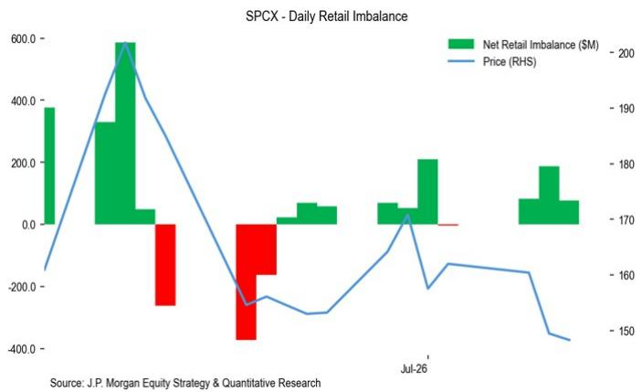
来源：JPM权益策略与量化研究

图2：SPCX散户累计资金流不平衡
截至7月8日
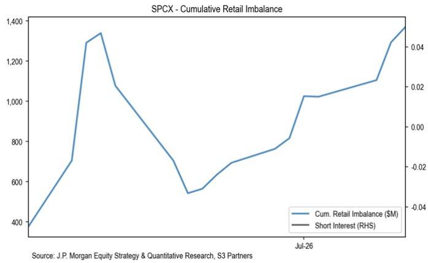
来源：JPM权益策略与量化研究

图3：动量拥挤度脱离近期高点...
截至7月7日
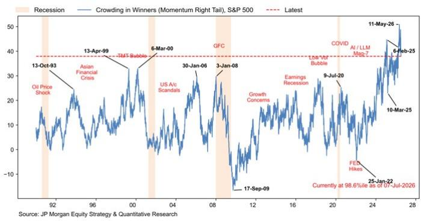
来源：JPM权益策略与量化研究

图4：...近期情况

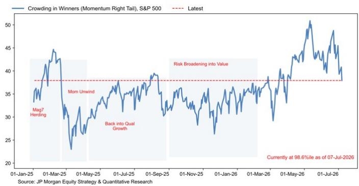
来源：JPM权益策略与量化研究

-2000 - 1月8日 1月15日 1月23日 1月30日 2月6日 2月13日 2月23日 3月2日 3月9日 3月16日 3月23日 3月30日 4月7日 4月14日 4月21日 4月28日 5月5日 5月12日 5月19日 5月27日 6月3日 6月10日 6月17日 6月25日 7月2日

图5：散户每日个股与ETF买入金额（百万美元），截至7月8日
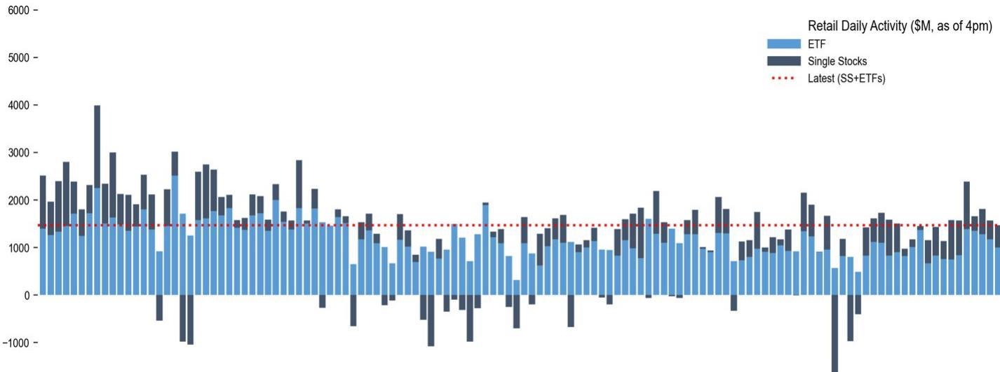
来源：JPM权益策略与量化研究

图6：SCO散户资金流不平衡
截至7月8日
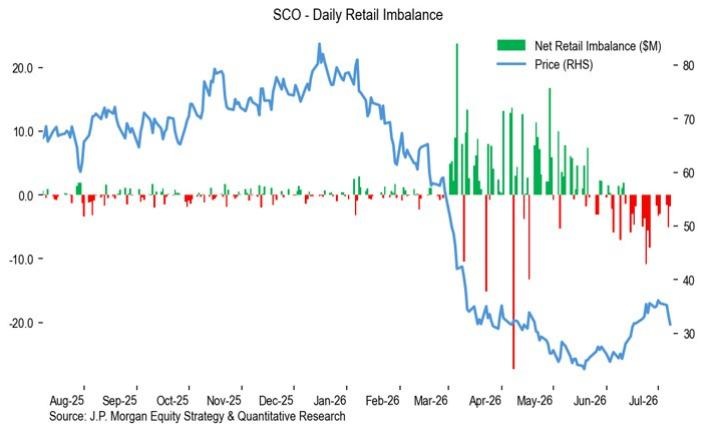
来源：JPM权益策略与量化研究，S3 Partners

图7：SCO散户累计资金流不平衡 截至7月8日
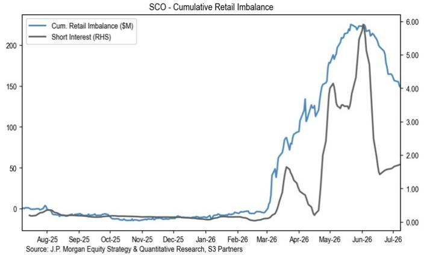
来源：JPM权益策略与量化研究，S3 Partners

## 散户现金活动——概览

图8：散户个股活动按主题分类

<table><tr><td colspan="2">主题篮子</td><td colspan="3">散户成交额变化（十亿美元）</td></tr><tr><td>篮子</td><td>指数</td><td>一周前</td><td>一个月前</td><td>年初至今</td></tr><tr><td>Magnificent 7</td><td>Mag7</td><td>0.99</td><td>3.47</td><td>32.82</td></tr><tr><td>AI/数据中心/电气化</td><td>JPAMAIDE</td><td>0.96</td><td>6.42</td><td>41.64</td></tr><tr><td>标普500前30大AI/数据中心受益标的</td><td>JPRAID30</td><td>0.89</td><td>6.52</td><td>40.94</td></tr><tr><td>AI软件/产品/变现</td><td>JPAMAISO</td><td>0.86</td><td>3.42</td><td>25.77</td></tr><tr><td>成长</td><td>JPAMGROW</td><td>0.70</td><td>5.57</td><td>39.94</td></tr><tr><td>OBBBA即时费用化受益标的</td><td>JPGTIEXB</td><td>0.36</td><td>3.90</td><td>19.62</td></tr><tr><td>国内</td><td>JPAMDOME</td><td>-0.03</td><td>-0.53</td><td>-0.29</td></tr><tr><td>特朗普放松监管议程</td><td>JPRGDREG</td><td>-0.04</td><td>-0.56</td><td>-4.10</td></tr><tr><td>通胀受益者</td><td>JPAMINOP</td><td>-0.06</td><td>-0.89</td><td>-3.36</td></tr><tr><td>高贝塔投机性成长</td><td>JPAMHBSG</td><td>-0.08</td><td>1.48</td><td>7.46</td></tr><tr><td>CHIPS法案受益篮子</td><td>JPAMCHIP</td><td>-0.35</td><td>2.06</td><td>4.44</td></tr><tr><td>去全球化/回流受益标的</td><td>JPAMDGLO</td><td>-0.37</td><td>2.03</td><td>4.26</td></tr></table>

图9：散户在Mag 7 + PLTR的累计买入金额（十亿美元）
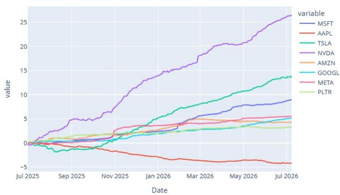
来源：JPM权益策略与量化研究

来源：JPM权益策略与量化研究。有关上述篮子的详细信息，请参见相关报告。注：JPM未对上述篮子提供研究覆盖，读者不应期望获得持续分析或额外报告。

图10：散户个股活动按板块划分（十亿美元）
活动以科技和可选消费为主。注：最后一个周数据点包含7月3日假期。
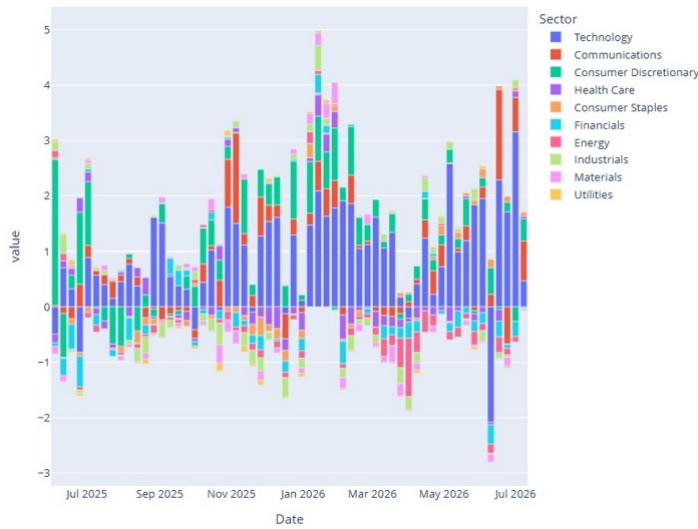
来源：JPM权益策略与量化研究
图11：散户ETF活动按主题划分
按主题汇总的ETF买卖情况，单位十亿美元。注：最后一个周数据点包含7月3日假期。

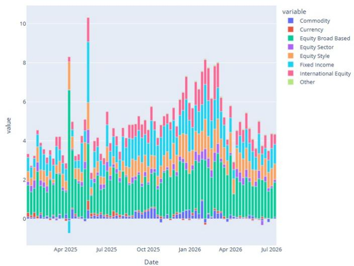
来源：JPM权益策略与量化研究

## 散户活动显著的个股专题

对冲基金 vs. 散户：高做空比例MEME标的

- CUPR（上周买入120万美元，0.9z，图14）：该公司于7月7日提交了一份关于其A类普通股拟议公开发行的注册声明。自2026年6月以来散户兴趣持续升高，净买入总额达1000万美元，同时做空比例约为流通股的30%，自2026年5月底以来上升28%。

- HIVE（上周卖出110万美元，-0.4z，图15）：该标的于2026年7月7日下跌6%，公司近期通过子公司完成了1.3亿美元零息可交换优先票据的私募发行，包括初始购买者全额行使额外票据选择权。自2025年5月以来该标的受到散户关注，净买入总额达6000万美元，做空比例约为18%，自2026年5月以来上升8%。

- SERV（上周卖出20万美元，-0.2z，图16）：公司近期对其董事会进行了调整，而散户兴趣持续存在，自2025年9月以来净买入总额达3000万美元。这些变化发生在做空比例约为流通股32%的背景下，自2025年10月以来上升10%。

## 宏观与基本面专题

- 我们的分析师首次覆盖SpaceX，给予增持评级，目标价为225美元。研究观点围绕该公司的发射能力及Starship的快速复用特性展开，预计Starship发射次数将从2026年的少量逐步增至2031年的约5000次，从而支持SpaceX建设75GW的轨道计算能力。团队预测2025至2030年间收入复合年增长率为91%，同时随着业务结构从连接服务向人工智能（先地面后轨道）转变，利润率将显著提升。SpaceX于6月12日在纳斯达克上市，向散户读者分配了创纪录的20%股份，而通常这一比例接近5%。散户需求支撑了首周强劲交易，买入总额达11亿美元。该标的较7月16日高点下跌26%，较IPO水平上涨11%，过去七天散户为净卖出/买入状态（上周买入5.296亿美元，0.3z）。

- 发电设备类标的如GE Vernova（GEV，7月1日卖出800万，-1.3z，图17）、Caterpillar（CAT，7月1日卖出1200万，-1.5z，图19）和Cummins（CMI，7月1日买入200万，0.6z，图21）在7月1日下跌约7%，此前一家德国竞争对手被下调评级。此次广泛调整表明，市场对人工智能相关支出峰值的担忧仍在影响相关及上游受益标的的估值情绪。

- 半导体板块上周下跌8%（同期标普500下跌0.3%），领跌标的包括Teradyne（TER，上周卖出900万美元，-0.9z，图23）、Kla Corp（KLAC，上周卖出5270万美元，-2.9z，图25）、Lam Research（LRCX，上周卖出1600万美元，-1.0z，图27）、Intel（INTC，上周买入2460万美元，-0.1z，图29）、Marvell Technology（MRVL，上周卖出4750万美元，-0.7z，图31）、Applied Materials（AMAT，上周卖出6970万美元，-3.0z，图33）和Skyworks Solutions（SWKS，上周卖出230万美元，-0.5z，图35）。Broadcom（AVGO，上周买入8730万美元，0.3z，图37）和Qualcomm（QCOM，上周买入970万美元，0.6z，图39）是仅有的两个表现显著为正的标的，分别上涨4%和1%，前者宣布与Apple（AAPL，7月6日卖出4830万美元，-0.8z，图41）的合作关系延长至2031年（链接）。

- 存储标的，即Micron（MU，上周买入2.614亿美元，0.7z，图43）和Western Digital（WDC，上周卖出5490万美元，-2.6z，图45），过去一周下跌17%。值得注意的是，WSTS 5月行业数据显示，行业收入有望在2026年超过1.5万亿美元，受益于周期性趋势改善、AI支出动能以及有利的定价动态（链接）。

## MEME战场：散户买入 vs. 对冲基金做空

在本节中，我们标记了一些在社交媒体上被广泛提及、散户买入意愿高且对冲基金做空比例高的标的。这些标的在活动增加时可能出现意外资金流。

## 社交媒体筛选与散户活动

图12：社交媒体上最受关注的标的
基于本周社交媒体热度（社交兴趣）的前20名，按市值调整

<table><tr><td>代码</td><td>名称</td><td>市值（十亿美元）</td><td>社交兴趣评分</td><td>中位数做空比例（占流通股%）</td><td>极端不平衡1D Z</td><td>不平衡日期</td></tr><tr><td>TLRY</td><td>Tilray Brands Inc</td><td>0.5</td><td>42.6</td><td>14.3%</td><td>0.2</td><td>7月6日</td></tr><tr><td>MSTR</td><td>Strategy Inc</td><td>34.1</td><td>41.3</td><td>12.1%</td><td>1.2</td><td>7月2日</td></tr><tr><td>WEN</td><td>Wendy's Co/The</td><td>1.5</td><td>36.3</td><td>35.9%</td><td>-2.3</td><td>7月1日</td></tr><tr><td>NVDA</td><td>NVIDIA Corp</td><td>4765.7</td><td>30.6</td><td>1.3%</td><td>-0.2</td><td>7月6日</td></tr><tr><td>NKE</td><td>NIKE Inc</td><td>64.0</td><td>28.7</td><td>4.9%</td><td>-3.7</td><td>7月1日</td></tr><tr><td>MAT</td><td>Mattel Inc</td><td>3.9</td><td>28.6</td><td>9.6%</td><td>1.4</td><td>7月2日</td></tr><tr><td>MU</td><td>Micron Technology Inc</td><td>1059.8</td><td>28.4</td><td>3.8%</td><td>-4.3</td><td>7月2日</td></tr><tr><td>RKLB</td><td>Rocket Lab Corp</td><td>52.1</td><td>27.1</td><td>6.0%</td><td>-0.5</td><td>7月7日</td></tr><tr><td>WULF</td><td>Terawulf Inc</td><td>10.0</td><td>27.0</td><td>31.3%</td><td>1.0</td><td>7月7日</td></tr><tr><td>NBIS</td><td>Nebius Group NV</td><td>49.6</td><td>26.8</td><td>28.6%</td><td>7.9</td><td>7月1日</td></tr><tr><td>TSLA</td><td>Tesla Inc</td><td>1513.2</td><td>26.6</td><td>3.0%</td><td>2.0</td><td>7月2日</td></tr><tr><td>XOM</td><td>ExxonMobil Holdings Corp</td><td>587.2</td><td>26.1</td><td>1.2%</td><td>0.7</td><td>7月2日</td></tr><tr><td>BB</td><td>BlackBerry Ltd</td><td>6.5</td><td>26.0</td><td>6.4%</td><td>-3.6</td><td>7月2日</td></tr><tr><td>AMD</td><td>Advanced Micro Devices Inc</td><td>841.6</td><td>25.0</td><td>2.9%</td><td>0.8</td><td>7月1日</td></tr><tr><td>HOOD</td><td>Robinhood Markets Inc</td><td>101.7</td><td>24.9</td><td>4.9%</td><td>-1.1</td><td>7月2日</td></tr><tr><td>MSFT</td><td>Microsoft Corp</td><td>2888.5</td><td>24.8</td><td>1.3%</td><td>0.8</td><td>7月6日</td></tr><tr><td>RDDT</td><td>Reddit Inc</td><td>38.4</td><td>24.8</td><td>12.0%</td><td>-1.1</td><td>7月1日</td></tr><tr><td>BCG</td><td>Binah Capital Group Inc</td><td>0.0</td><td>23.7</td><td>0.6%</td><td>-0.2</td><td>7月1日</td></tr><tr><td>ADBE</td><td>Adobe Inc</td><td>88.1</td><td>23.1</td><td>5.3%</td><td>-0.7</td><td>7月1日</td></tr><tr><td>MSCI</td><td>MSCI Inc</td><td>44.5</td><td>22.4</td><td>2.6%</td><td>1.5</td><td>7月1日</td></tr></table>

来源：JPM权益策略与量化研究，S3 Partners
图13：MEME标的做空挤压风险上升：散户买入高做空比例标的

正斜率 = 反向持仓（做空挤压或散户损失风险升高）；负斜率 = 相似持仓（挤压风险消散）

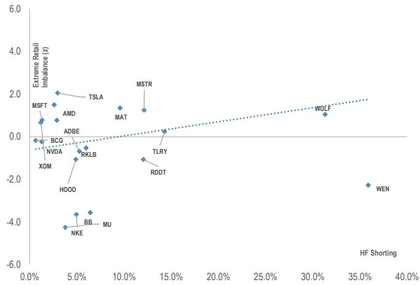
来源：JPM权益策略与量化研究，S3 Partners

图14：CUPR散户活动
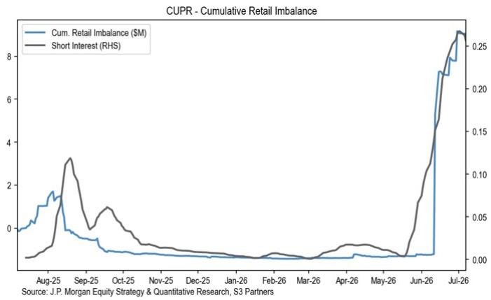
来源：JPM权益策略与量化研究，S3 Partners

图15：HIVE散户活动
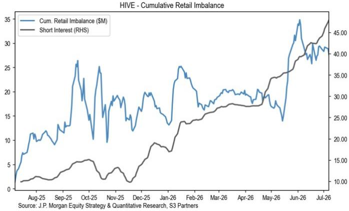
来源：JPM权益策略与量化研究，S3 Partners

图16：SERV散户活动
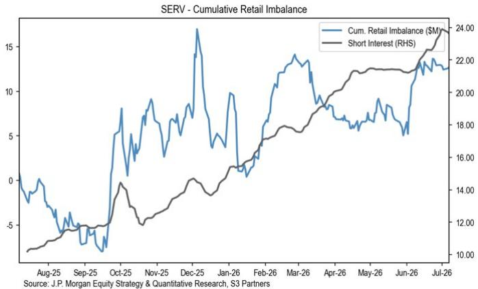
来源：JPM权益策略与量化研究，S3 Partners

## 宏观与基本面专题

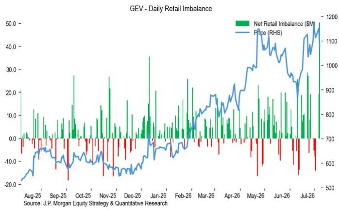
来源：JPM权益策略与量化研究，S3 Partners

图18：GEV散户累计资金流不平衡
截至7月7日
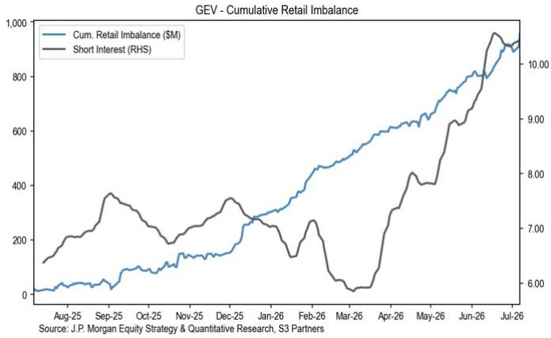
来源：JPM权益策略与量化研究，S3 Partners

图19：CAT散户资金流不平衡
截至7月7日
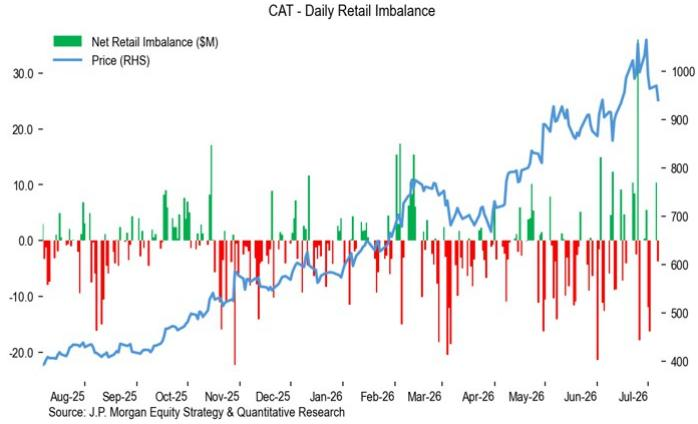
来源：JPM权益策略与量化研究，S3 Partners

图20：CAT散户累计资金流不平衡
截至7月7日
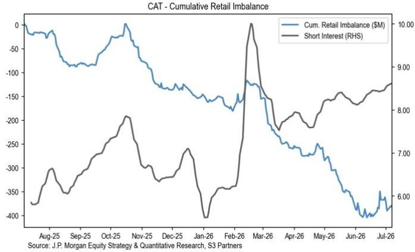
来源：JPM权益策略与量化研究，S3 Partners

图21：CMI散户资金流不平衡
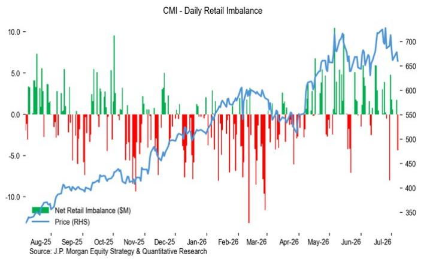
来源：JPM权益策略与量化研究，S3 Partners

图22：CMI散户累计资金流不平衡
截至7月7日
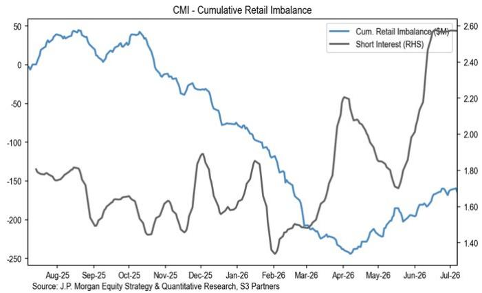
来源：JPM权益策略与量化研究，S3 Partners

图23：TER散户资金流不平衡
截至7月7日
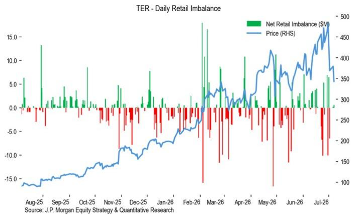
来源：JPM权益策略与量化研究，S3 Partners

图24：TER散户累计资金流不平衡
截至7月7日
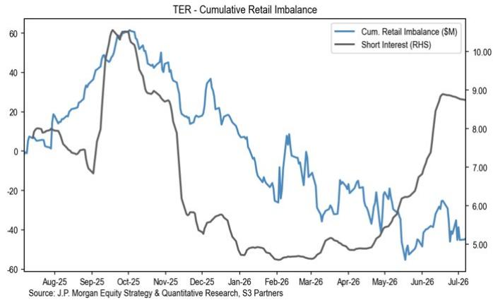
来源：JPM权益策略与量化研究，S3 Partners

图25：KLAC散户资金流不平衡
截至7月7日
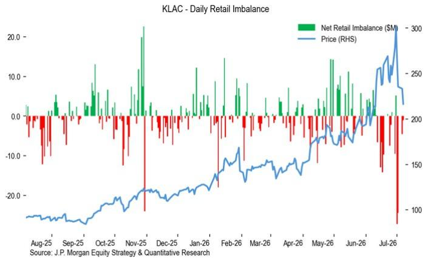
来源：JPM权益策略与量化研究，S3 Partners

图26：KLAC散户累计资金流不平衡
截至7月7日
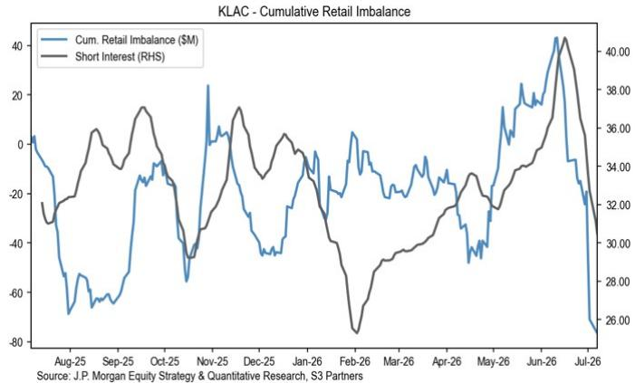
来源：JPM权益策略与量化研究，S3 Partners

图27：LRCX散户资金流不平衡
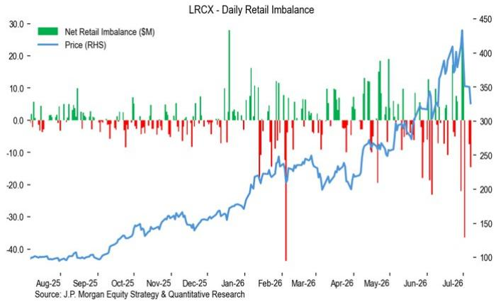
来源：JPM权益策略与量化研究，S3 Partners

图28：LRCX散户累计资金流不平衡
截至7月7日
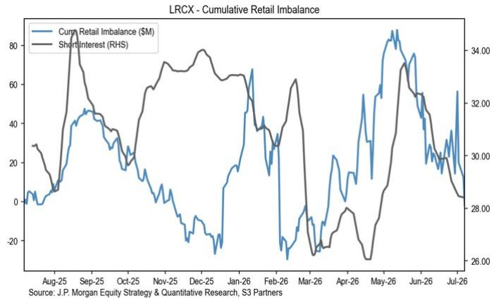
来源：JPM权益策略与量化研究，S3 Partners

图29：INTC散户资金流不平衡
截至7月7日
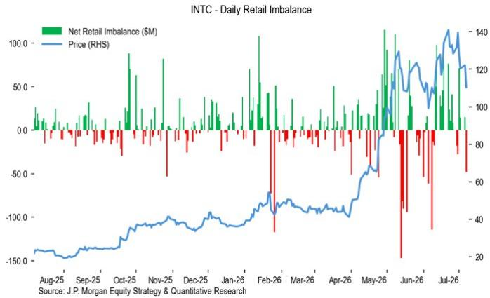
来源：JPM权益策略与量化研究，S3 Partners

图30：INTC散户累计资金流不平衡
截至7月7日
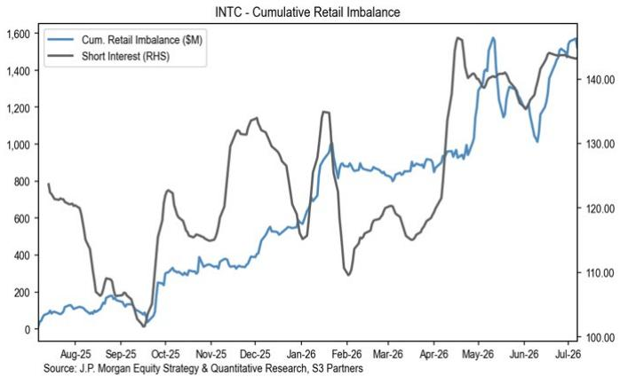
来源：JPM权益策略与量化研究，S3 Partners

图31：MRVL散户资金流不平衡
截至7月7日
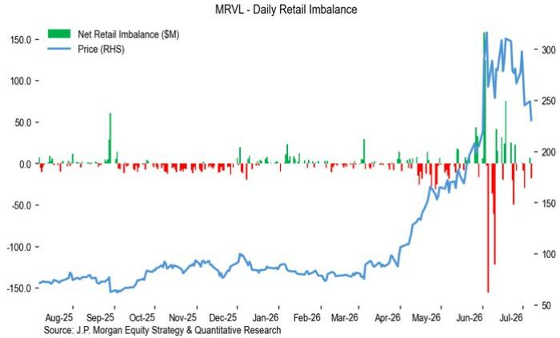
来源：JPM权益策略与量化研究，S3 Partners

图32：MRVL散户累计资金流不平衡 截至7月7日
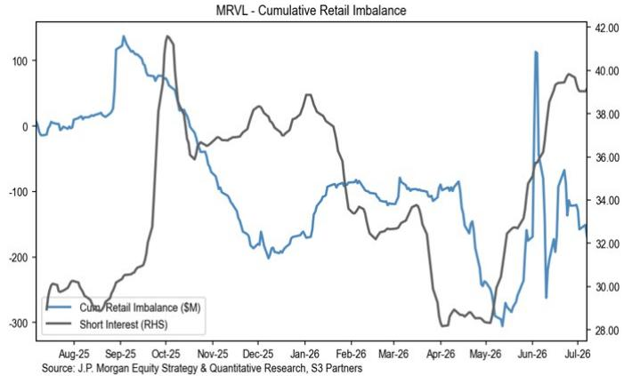
来源：JPM权益策略与量化研究，S3 Partners

图33：AMAT散户资金流不平衡
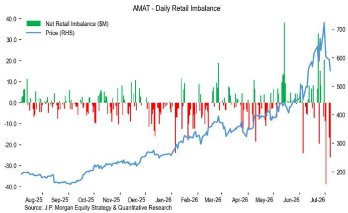
来源：JPM权益策略与量化研究，S3 Partners

图34：AMAT散户累计资金流不平衡
截至7月7日
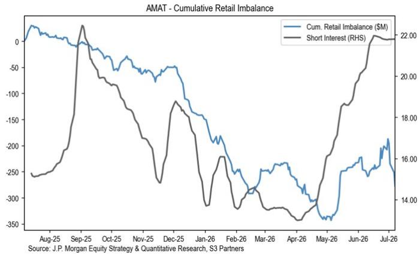
来源：JPM权益策略与量化研究，S3 Partners

图35：SWKS散户资金流不平衡
截至7月7日
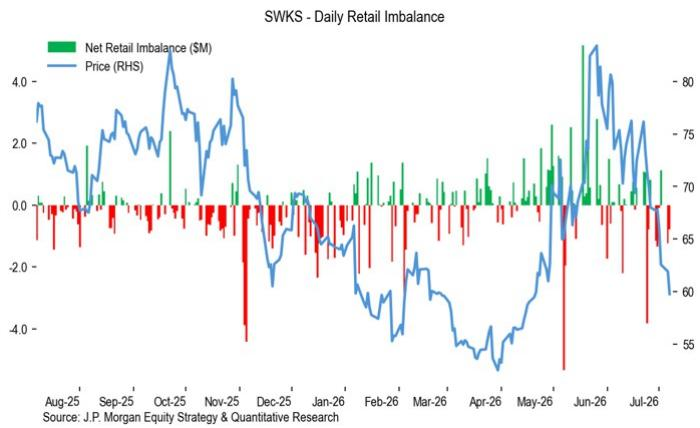
来源：JPM权益策略与量化研究，S3 Partners

图36：SWKS散户累计资金流不平衡
截至7月7日
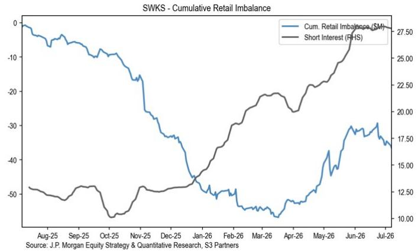
来源：JPM权益策略与量化研究，S3 Partners

图37：AVGO散户资金流不平衡
截至7月7日
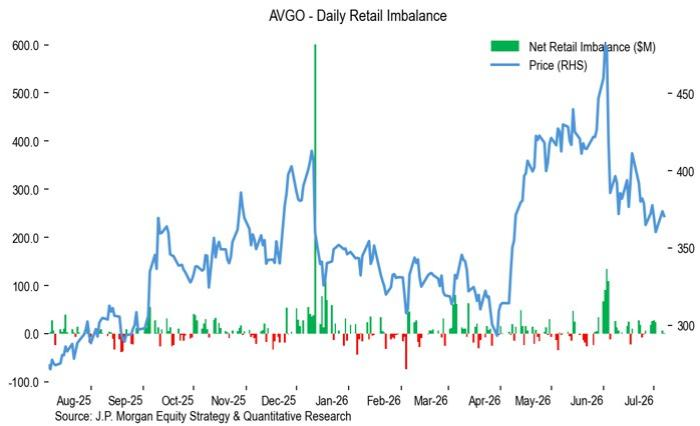
来源：JPM权益策略与量化研究，S3 Partners

图38：AVGO散户累计资金流不平衡
截至7月7日
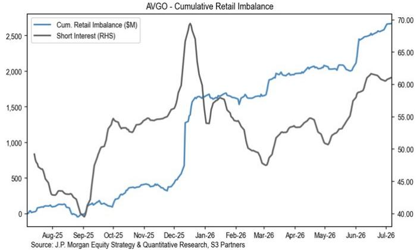
来源：JPM权益策略与量化研究，S3 Partners

图39：QCOM散户资金流不平衡
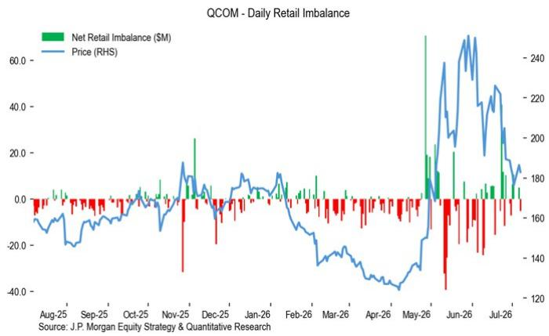
来源：JPM权益策略与量化研究，S3 Partners

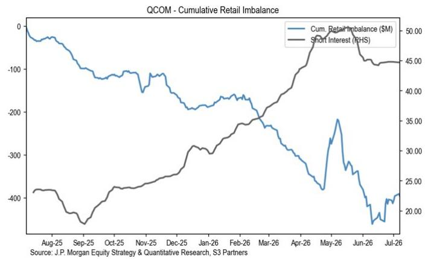
来源：JPM权益策略与量化研究，S3 Partners

图41：AAPL散户资金流不平衡
截至7月7日
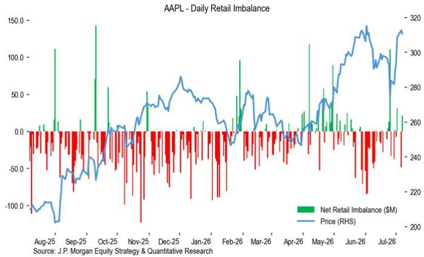
来源：JPM权益策略与量化研究，S3 Partners

图42：AAPL散户累计资金流不平衡
截至7月7日
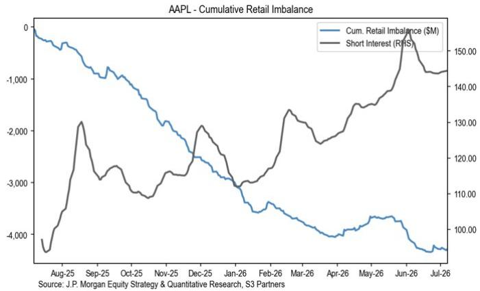
来源：JPM权益策略与量化研究，S3 Partners

图43：MU散户资金流不平衡
截至7月7日
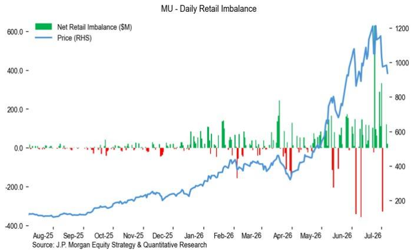
来源：JPM权益策略与量化研究，S3 Partners

图44：MU散户累计资金流不平衡 截至7月7日
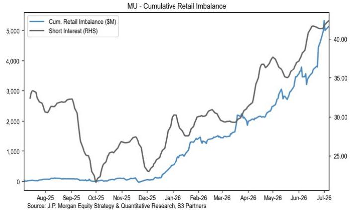
来源：JPM权益策略与量化研究，S3 Partners

图45：WDC散户资金流不平衡
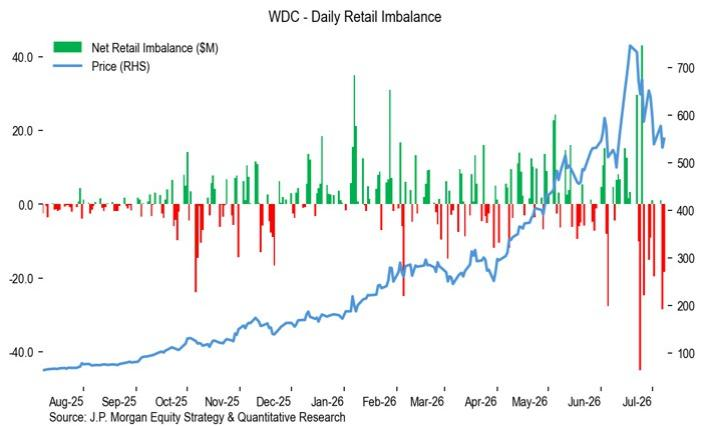
来源：JPM权益策略与量化研究，S3 Partners

图46：WDC散户累计资金流不平衡
截至7月8日
![](images/956fe08820925d9121fb4b9ac7192a8d862f86
