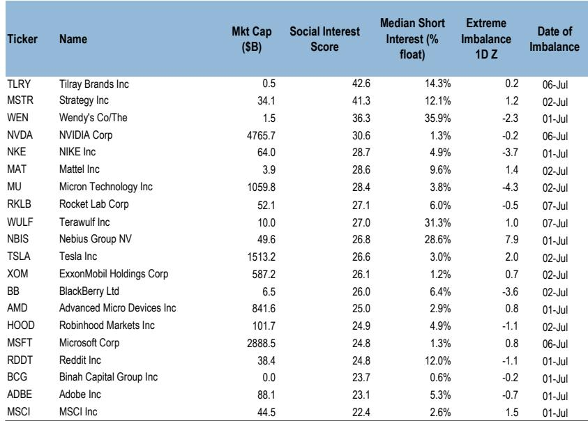
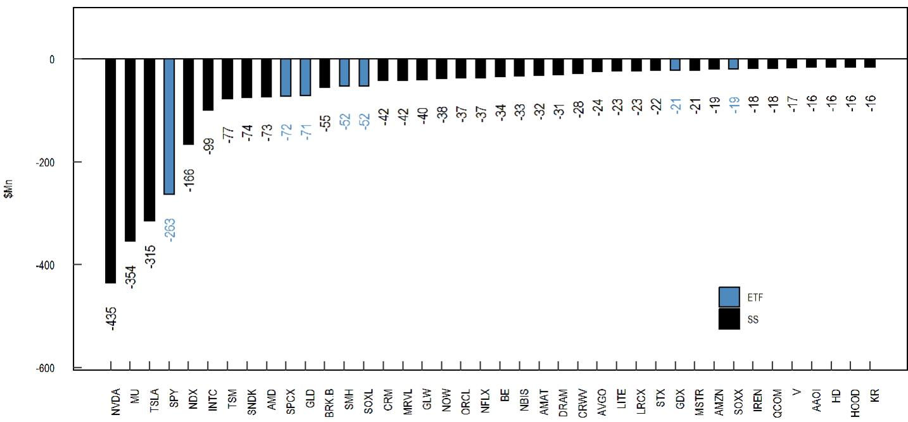

# JPM：散户不再一起买什么才是市场真正信号

散户资金上周加速入场，ETF和公司净观点偏积极均处高位。但JPM在最新一期Retail Radar中发现，一个更值得关注的信号已经出现：动量因子正在退潮，散户的操作从一致追涨，分裂为“底部观察部分明星股”与“观点偏谨慎其他高位股”两种截然不同的行为。这轮变化真正考验的，是市场能否在动量退潮后找到新共识。

## 1. 动量拥挤度从极值回落，散户不再“一起买”

JPM自建的动量拥挤度指标已从接近100%的高位回落至98.6%。虽然相对值仍高，但趋势拐点清晰。报告特别指出，半导体板块是这轮动量节奏变化的主要影响。散户在High Momentum组合中的操作出现了明显分化：他们继续观点偏积极Sandisk（SNDK）和Micron（MU）这类年度明星股，但对Applied Materials（AMAT）、Western Digital（WDC）、KLA Corp（KLAC）和Marvell Technology（MRVL）却选择了观点偏谨慎。同一个板块，同一个动量因子，散户的判断已经不再统一。

> **KC评论：** 散户的分化通常发生在市场情绪从“一致看多”转向“选择性相信”的阶段。报告没有直接说这轮回调是否见底，但散户从追涨到挑标的转变，本身就是一个值得跟踪的情绪信号。完整报告里对半导体各子行业的资金流向拆解，值得仔细看。

## 2. SpaceX上市后的散户行为，提供了一个新的观察样本

SpaceX（SPCX）是本期报告最突出的个案。该公司6月12日登陆纳斯达克，散户获得了约20%的IPO配售份额，远高于通常的5%。上市首周，散户净观点偏积极达11亿美元，报价一度较IPO价上涨约50%。但截至7月8日，报价已从高点回落26%，散户在过去七天转为净观点偏谨慎约5.3亿美元。

摩根，核心逻辑是Starship的快速可复用能力，预计发射量从2026年的个位数增长至2031年的约5000次，支撑75GW的轨道算力建设。但散户的行为表明，即使有如此宏大的叙事，短期报价波动仍会引发获利了结。

> **KC评论：** SpaceX的散户行为，可能是未来大型科技IPO的先行指标。当机构认为一家公司有10年成长逻辑时，散户的持仓周期可能只有几周。这种时间维度上的错配，会加大IPO后的价格波动。报告里对SpaceX营收结构从连接业务向AI和轨道算力切换的假设，是理解其长期估值的核心。

## 3. 报告尚未完全回答：AI资本支出见顶的担忧是否被过度定价

7月1日，电力设备股GE Vernova、Caterpillar和Cummins因一家德国竞争对手被更新公司观点而集体下跌约7%。JPM将此归因于“AI相关支出见顶的担忧仍在影响上游受益者的估值情绪”。半导体板块也在过去一周下跌8%，远超标普500的0.3%跌幅。

但报告同时引用了WSTS 5月行业数据：全球半导体行业收入有望在2026年超过1.5万亿美元，由周期改善、AI支出势头和有利的价格环境共同支撑。一边是短期报价下跌，一边是中期行业数据强劲。这份报告没有给出明确判断，只是呈现了这种矛盾。对于决策者而言，关键问题是：当前的回调，是市场在提前消化增速节奏变化，还是对结构性需求的误判？

## 4. 散户的ETF配置变化，透露了防御信号的加强

尽管散户整体净买入强劲，ETF配置中出现了值得注意的结构性变化。SOXL（三倍做多半导体ETF）连续被减持，而SMH（半导体ETF）仍在净买入。同时，固定收益ETF、研究级公司债ETF和红利类ETF的买入量均显著增加。散户在加仓科技的同时，也在为组合增加缓冲。

这种“既要进攻又要防守”的配置，与动量因子退潮形成呼应。散户并未离场，但他们正在为市场可能的变化做准备。

---

对于跟踪美股资金流向的读者，这份报告最值得关注的不是散户买了什么，而是他们不再一起买什么。当动量因子从极值回落时，市场的下一个共识需要更长时间来形成。

For informational purposes only. Portions may be generated,translated,summarized,or edited with AI assistance based on source materials and may contain omissions or errors. Please verify independently. This is not investment,legal,tax,accounting,or other professional advice.

For informational purposes only. Portions may be generated,translated,summarized,or edited with AI assistance based on source materials and may contain omissions or errors. Please verify independently. This is not investment,legal,tax,accounting,or other professional advice.

