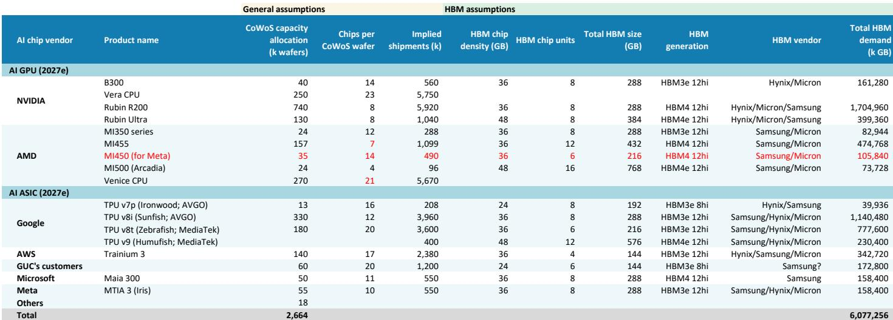
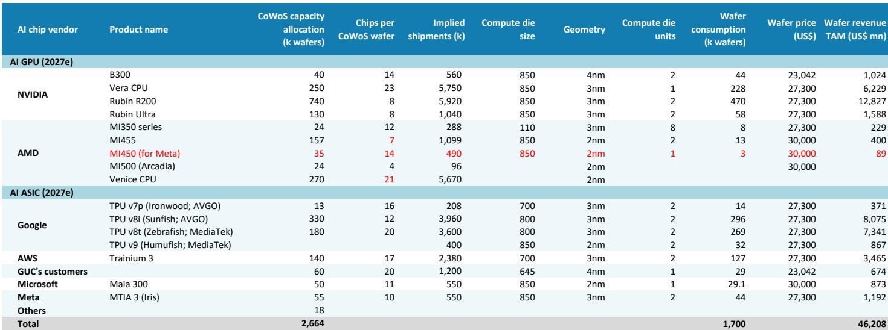
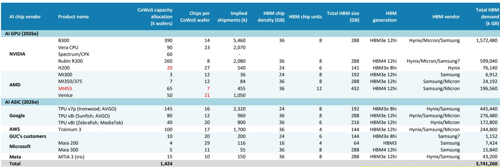

# The AI Supply Chain Is Entering a New Phase: Hyperscaler Customization Is Reshaping the 2027 CoWoS Allocation Landscape

The narrative that NVIDIA dominates the AI chip supply chain indefinitely is no longer sufficient for strategic planning. A detailed analysis of 2027 CoWoS (Chip-on-Wafer-on-Substrate) allocation data reveals a fundamental structural shift: hyperscalers are not merely customers but are becoming architects of their own silicon destiny, and this transformation carries profound implications for capacity planning, vendor selection, and timing.

By 2027, total CoWoS capacity is projected to reach approximately 2.7 million wafers, up from roughly 1.4 million in 2026. This near-doubling of capacity is not simply a linear extrapolation of demand. It reflects a deliberate rebalancing of the ecosystem. NVIDIA's share of total CoWoS allocation is expected to decline from approximately 62 percent in 2025 to around 45 percent in 2027, even as its absolute wafer count grows. The gap is being filled by a diverse set of players: AMD, Google, Amazon, Meta, and a growing list of ASIC design houses. This is not a story of NVIDIA losing; it is a story of the pie expanding faster than any single company can consume.

The most telling data point is the explosion of custom ASIC (Application-Specific Integrated Circuit) shipments. Google's TPU v8i (Sunfish) alone is expected to ship nearly 4 million units in 2027. Amazon's Trainium 3 is projected at 2.4 million units. Combined, the major hyperscaler ASIC programs could account for over 10 million chip shipments, rivaling the volume of NVIDIA's flagship Rubin series. This is the moment when the AI infrastructure build-out transitions from a single-vendor dependency to a multi-vendor, multi-architecture reality.

The urgency of understanding this shift is immediate. The data suggests that 2026 will be a year of inventory digestion and transition, while 2027 represents the true inflection point for next-generation architectures. Those who map the supply chain based on 2025 or 2026 assumptions risk missing the critical reconfiguration that is already underway in foundry bookings, packaging capacity, and HBM (High Bandwidth Memory) procurement. The decisions being made now in CoWoS allocation will determine competitive positioning for the rest of the decade.

## The Blackwell "Inventory" Situation Was a Misreading of Supply Chain Dynamics, and the Rubin Cycle Will Follow a Similar Pattern

Recent market discussion around Blackwell chip inventory was based on a fundamental misunderstanding of how the AI supply chain operates. The data now confirms that what appeared to be excess inventory was in fact a deliberate supply chain buffer designed to ensure seamless rack-level delivery. This buffer will be fully consumed by the end of 2026. The implication is clear: the market overreacted to what was a normal, even prudent, inventory management practice in a capacity-constrained environment.

The report's modeling approach provides the analytical clarity needed here. By introducing a chip versus rack comparison framework, and treating nine HGX servers as equivalent to one NVL72 rack, the analysis demonstrates that chip supply and rack demand are converging. In 2026, approximately 5.4 million Blackwell units are expected, and the data suggests chip volume will meet Grace Blackwell NVL72 demand by the second half of the year. This is not a story of oversupply; it is a story of supply catching up to demand in a rational, phased manner.

The same logic applies to the Rubin generation. The report projects close to 7 million Rubin and Rubin Ultra units in 2027, with total Rubin NVL72 server racks reaching 90,000 units. The pattern of building a supply chain buffer is likely to repeat. Observers should not interpret early-stage inventory buildup as a signal of demand weakness. Instead, they should recognize it as a necessary feature of a complex, multi-tiered production system where chip fabrication, advanced packaging, and system integration operate on different lead times. The analytical question is not whether buffer exists, but whether the buffer is proportionate to the ramp schedule. In this case, the evidence supports proportionality.

## AMD's 2027 CoWoS Allocation Reveals a Strategic Pivot Toward Customization, But Execution Risk Remains the Central Variable

AMD's CoWoS allocation of 240,000 wafers in 2027, with combined MI455 and MI450 shipments of 1.5 million units, represents a significant commitment to the AI accelerator market. However, the structure of this allocation tells a more nuanced story than the headline number suggests. The MI400 series is not a monolithic product line. It is bifurcated into two distinct offerings: the MI455, a standard version with two compute dies and twelve HBM4 stacks, and the MI450, a half-size chip customized for Meta with one compute die and six HBM4 stacks.

This bifurcation is strategically significant. It signals that AMD is willing to engage in the kind of hyperscaler-specific customization that has traditionally been the domain of ASIC vendors. The MI450 is not a general-purpose product; it is a bespoke solution for Meta's specific rack architecture, pairing with nine CPUs and 36 GPUs in a half-rack configuration. This move blurs the line between merchant silicon and custom silicon, and it positions AMD to capture hyperscaler wallet share that might otherwise go to Broadcom or Marvell.

Yet the execution risk cannot be dismissed. AMD has a prior record of trimming CoWoS bookings in 2026, and the report explicitly states that it does not rule out a repeat of this behavior. The question is whether AMD's organizational capability has matured to the point where it can manage a dual-product strategy across multiple foundry nodes and packaging technologies. The MI455 will use 2nm process technology, while the MI450 uses a different configuration. Managing yield, packaging, and HBM supply across these variants is a logistical challenge that even established players have struggled with. The open question is whether AMD's management team has the operational rigor to deliver on these commitments, or whether the 2027 allocation will need to be revised downward.

## The ASIC Ecosystem Is Undergoing a Structural Expansion That Will Reshape the CoWoS Supply Chain by 2027

The most underappreciated trend in the data is the rapid scaling of ASIC programs from the major hyperscalers. Google alone is expected to have four distinct TPU generations in production or ramp by 2027: the v7p (Ironwood), v8i (Sunfish), v8t (Zebrafish), and v9 (Humufish). Combined, these programs could consume over 520,000 CoWoS wafers and produce nearly 8 million chip shipments. This is not a niche experiment; it is a mainstream production program that rivals the volume of merchant GPU offerings.

Amazon's Trainium 3, at 140,000 wafers and 2.4 million chip shipments, further reinforces the trend. Microsoft's Maia 300 and Meta's MTIA 3 (Iris) add additional demand. The cumulative effect is that by 2027, hyperscaler ASICs could account for nearly 40 percent of total CoWoS consumption, up from a much smaller share in 2025. This shift has profound implications for the packaging supply chain.

The data shows that ASIC programs are diversifying their packaging strategies. While TSMC remains the dominant CoWoS vendor, the report indicates growing allocation to OSATs (Outsourced Semiconductor Assembly and Test providers) such as ASE/SPIL, Amkor, and Powertech. For AMD's Venice CPU, CoW production is concentrated in OSATs. For Broadcom's ASIC programs, ASE/SPIL and Amkor are gaining allocation. This diversification is not accidental. It reflects a strategic imperative among hyperscalers to avoid single points of failure in the packaging supply chain, and it creates opportunities for OSATs to capture value that was previously concentrated at TSMC.

The strategic question for observers is whether the OSAT ecosystem has the technical capability and capacity to handle the volume and complexity of these programs. CoWoS-L and CoWoS-R variants require different process technologies and quality standards. The report suggests that ASE/SPIL and Amkor are making progress, but the ramp from current levels to 2027 targets is steep. Any delays in OSAT qualification or yield improvement could create bottlenecks that ripple through the entire ASIC production schedule.

## The Report Raises More Questions Than It Answers About the Timing and Volume of Next-Generation ASIC Programs

Despite the wealth of data in the report, several critical questions remain unresolved. The most pressing concerns the timing of Google's Zebrafish (TPU v8t) volume ramp. The report indicates that Zebrafish's 4Q26 volume ramp remains unchanged, but this assumption is based on industry checks that may not capture the full complexity of MediaTek's production readiness. MediaTek is new to the AI ASIC space, and its ability to manage CoWoS-S packaging at scale is unproven. Any slippage in Zebrafish could create a domino effect, delaying HBM4 procurement and impacting the broader memory supply chain.

Another unresolved question is the trajectory of Meta's ASIC strategy. The cancellation of the original 2nm ASIC Olympus and its replacement with Apollo, with mass production not expected until 1Q28, suggests that Meta's internal silicon roadmap is still in flux. The report mentions that GUC (Global Unichip Corporation) is likely to win one of Meta's ASIC projects, possibly a side project from the MTIA product line. But the scope and volume of this project remain unclear. If Meta's ASIC ambitions are scaling back, it could free up CoWoS capacity for other players, but it could also signal a strategic retreat from custom silicon in favor of merchant solutions.

The most significant open question is the demand elasticity for AI accelerators in 2027. The report projects 7 million Rubin units and 90,000 NVL72 racks, but these numbers are based on supply-side modeling of CoWoS capacity. The demand-side validation is less rigorous. If hyperscalers decide to moderate their AI infrastructure spending in response to broader conditions or diminishing returns from model scaling, the supply-demand balance could shift. The report does not provide a demand sensitivity analysis, and this is a critical gap for any strategic decision-maker.

## A Decision Framework for Navigating the 2027 AI Supply Chain

For readers who need to translate this analysis into actionable considerations, a structured framework is essential. The following three-pillar approach can help evaluate opportunities and risks in the AI supply chain through 2027.

First, assess capacity leverage. The key metric is not just total CoWoS allocation, but the diversification of packaging sources. Companies that have secured allocation across TSMC, ASE/SPIL, and Amkor have lower execution risk than those dependent on a single vendor. For observers, this means favoring OSATs that are gaining share in CoWoS-L and CoWoS-R, as these are the fastest-growing segments. For hyperscalers, it means negotiating multi-source packaging agreements now, before capacity becomes even tighter.

Second, evaluate architectural specificity. The data shows that customization is becoming a competitive necessity. AMD's MI450 for Meta and Google's multiple TPU variants are evidence that one-size-fits-all solutions are losing relevance. Companies that can offer tailored architectures, whether through ASIC design services or configurable GPU platforms, will capture premium pricing and longer-term customer commitments. The risk lies in over-customization: developing too many variants can fragment engineering resources and complicate supply chain management.

Third, monitor the HBM supply-demand balance. The report projects total HBM demand of over 6 billion GB in 2027, up dramatically from prior years. HBM4 and HBM4e are the key enablers of next-generation AI accelerators, and any supply disruption in memory could derail the entire production schedule. The strategic question is whether HBM suppliers can ramp production fast enough to meet the demand from NVIDIA, AMD, Google, and Amazon simultaneously. The answer will determine which chip programs ship on time and which face delays.

## Join the community to read the full report and review the original charts.

The data presented here represents only a fraction of the analysis available in the full report. Detailed breakdowns of CoWoS allocation by vendor, chip shipment projections for every major program, and HBM consumption estimates by generation are essential for building a complete picture of the 2027 landscape. The original charts provide visual clarity on the trends discussed here, including the shifting market share dynamics and the ramp trajectories for each product line. Access to the full report will allow you to conduct your own sensitivity analysis and stress-test the assumptions that underpin these projections.

*For informational purposes only. Portions may be generated, translated, summarized, or edited with AI assistance based on source materials and may contain omissions or errors. Please verify independently. This is not professional advice.*

For informational purposes only. Portions may be generated, translated, summarized, or edited with AI assistance based on source materials and may contain omissions or errors. Please verify independently. This is not professional advice.

