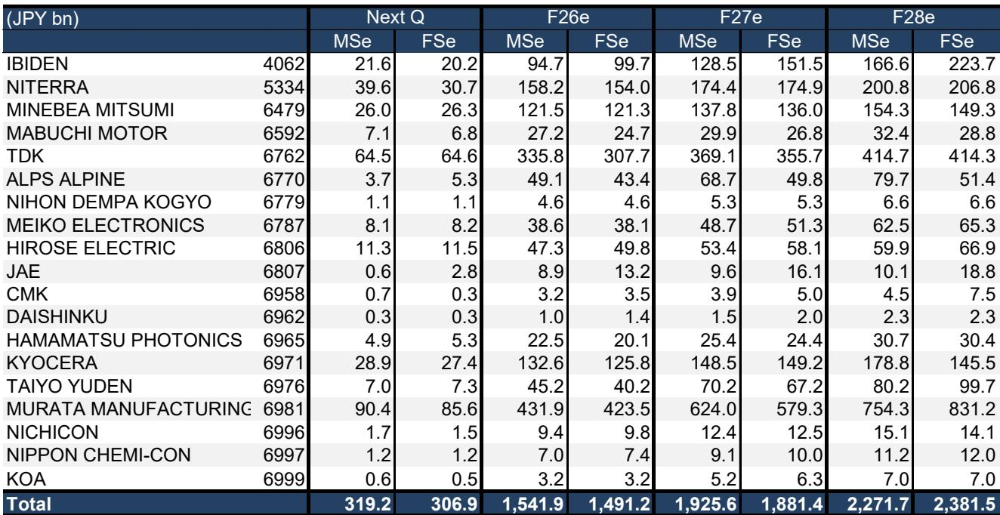
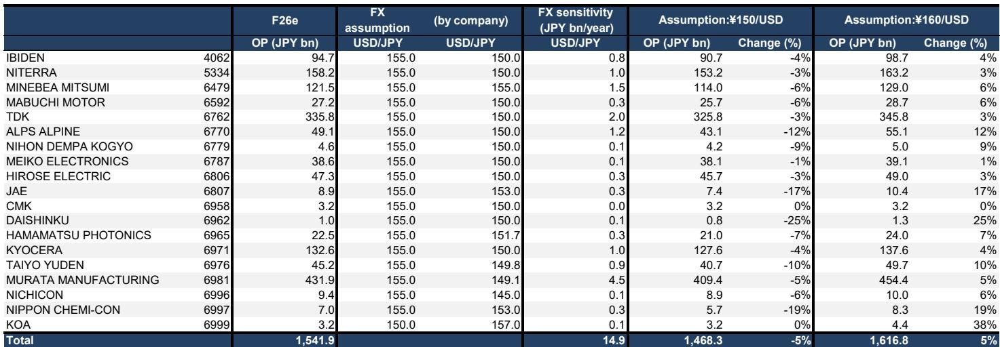
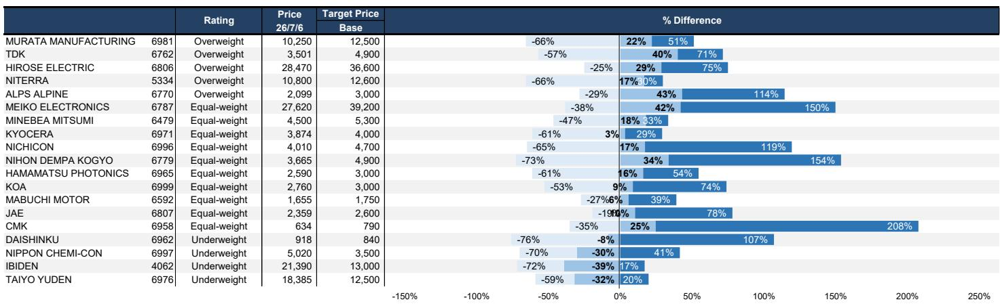

# The AI Demand Cycle Is Real, But the Real Test Is Which Japanese Component Makers Can Sustain Margin Expansion Through 2028

The April-June 2026 earnings season for Japanese electronic component manufacturers will confirm what the market already suspects: that AI and data center demand is driving a powerful upswing. The aggregate operating profit for 19 major firms is forecast to rise 33.6% year-on-year, a headline number that will generate enthusiasm. But the critical question for serious observers is not whether this quarter is strong. It is whether the strength is sustainable, and more precisely, which companies have the structural advantages to compound that growth into 2028 without being undermined by rising costs, valuation excess, or competitive convergence.

This earnings season marks a pivot point. The easy comparisons from the post-correction trough are behind the sector. What lies ahead is a period where differentiation will matter far more than tailwinds. The report from a global research institution makes a clear argument: the sustainability of strong earnings is the key consideration. This framing is correct. The next several quarters will separate companies that are genuinely building moats in high-value-added components from those that are merely riding a cyclical wave.

Three themes will dominate the earnings calls and the subsequent analyst debates. First, the depth and breadth of AI-related demand, particularly for ABF package substrates and high-end MLCCs. Second, the emerging cost pressures, especially in raw materials for aluminum electrolytic capacitors, which could compress margins in segments that lack pricing power. Third, the valuation question: the market has already priced significant optimism into several names, meaning that execution risk is now elevated. The companies that beat guidance will be rewarded, but those that merely meet expectations may face a harsh reassessment.

For observers, this is not a moment for blanket sector exposure. It is a moment for precision. The earnings data points, when they arrive, will either validate or challenge the current dispersion in valuations. The winners will likely be those with proprietary technology, deep customer relationships in AI infrastructure, and the ability to pass through cost increases. The losers will be those whose current earnings quality is inflated by one-time factors or whose long-term targets strain credibility.

## The AI Infrastructure Build-Out Is Creating a Two-Tier Market Within Japanese Components, and the Gap Is Widening

The most important structural development in this sector is the bifurcation between companies that serve the AI and data center ecosystem with high-value-added products and those that serve legacy end markets with commoditized components. This is not a new observation, but the second-order implications are becoming clearer.

Consider the contrast between Murata Manufacturing and Taiyo Yuden, both major MLCC producers. The report positions Murata as the top pick, with an 报告观点, while Taiyo Yuden is rated 报告观点. The rationale is instructive. Both companies benefit from the expansion of core MLCC volumes. But the earnings gap between them is expected to widen because Murata has a higher weighting of high-value-added MLCCs specifically designed for AI and data center applications. This is not a cyclical difference. It is a structural difference in product mix, customer concentration, and technological positioning.

The implication is that the AI demand cycle is not lifting all boats equally. It is creating a virtuous cycle for the leaders: higher-value products generate higher margins, which fund more R&D, which deepens the technological lead. For the followers, the risk is that they become trapped in the volume-driven, lower-margin segments of the market, where competition is intense and pricing power is weak.

A similar dynamic is visible in the substrate market. Ibiden is a clear beneficiary of the AI build-out, with strong growth in ABF package substrates for NVIDIA's Rubin platform expected to exceed sales for Blackwell. The near-term earnings trajectory is impressive. Yet the report rates Ibiden 报告观点, citing that market expectations and valuation look too high. This is a critical analytical distinction. A company can have excellent fundamental momentum and still be a poor consideration if the price already reflects years of future success. The report estimates that even if Ibiden achieves its ambitious F3/31 operating profit target of ¥300 billion, the P/E would still be approximately 24 times. The bar is high, and the margin for error is low.

This creates an uncomfortable question for observers: how much of the AI demand is already priced into these stocks? For the 报告观点-rated names, the answer appears to be too much. For the 报告观点-rated names like Murata, the valuation may still offer room for upside if the mix improvement continues to accelerate.

## Rising Raw Material Costs Will Test Pricing Power and Expose Which Companies Have True Margin Control

Every earnings cycle has a hidden variable that separates the prepared from the exposed. In this quarter, that variable is raw material costs. The report explicitly flags rising raw material costs as a key risk, particularly for aluminum electrolytic capacitors. But the implications extend across the component spectrum.

The analytical framework observers should apply is simple: in an environment of rising input costs, a company's ability to maintain or expand margins depends on its pricing power. Pricing power, in turn, depends on the degree of product differentiation, the concentration of supply, and the switching costs for customers.

For companies producing highly differentiated, application-specific components for AI data centers, passing through cost increases is feasible. The customers are building infrastructure worth billions of dollars, and the component cost is a tiny fraction of the total system cost. Price sensitivity is low. For companies producing standardized components for price-sensitive end markets like consumer electronics or general industrial equipment, the ability to pass through costs is far more limited.

This is where the 报告观点 on Nippon Chemi-Con becomes analytically coherent. The company faces risk to its second-half operating profit guidance, and at approximately 50 times forward earnings, the valuation offers no cushion for disappointment. The combination of cost pressure, cyclical end-market exposure, and a premium valuation is a dangerous triad.

The broader lesson is that observers should scrutinize margin trends, not just revenue growth. A company that grows revenue by 20% but sees gross margins compress by 300 basis points is not creating sustainable value. It is simply riding a volume wave while its competitive position erodes. The earnings calls this quarter will be revealing on this front. Listen for how management teams discuss pricing, cost pass-through, and inventory levels. Those who can articulate a clear strategy for margin resilience will deserve a premium.

## The Long-Term Earnings Targets of Several Companies Imply an Execution Challenge That the Market May Be Underestimating

One of the most valuable analytical exercises in equity research is to stress-test management guidance against realistic assumptions about market growth, competition, and capital requirements. The report implicitly does this for several companies, and the results are sobering.

Ibiden's target of ¥300 billion operating profit by F3/31 is a case study in ambition versus achievability. To reach that level, the company would need to sustain an extraordinary growth trajectory in ABF substrates, maintain pricing power as competitors ramp capacity, and execute flawlessly on its capital spending plans. The report's assessment that the bar is high is an understatement. Even if the target is achieved, the valuation is not obviously compelling. If it is missed, the downside could be severe.

Similarly, Nippon Chemi-Con's guidance for second-half operating profit of ¥5 billion looks fragile in the context of rising raw material costs and the company's competitive position. The market is implicitly discounting a recovery that may not materialize. For 报告观点-rated names like Daishinku, the risk is not just about the current quarter but about the structural challenges in crystal oscillators for optical transceivers, where delays in gaining meaningful market share could undermine the long-term growth narrative.

The analytical takeaway is that observers should be deeply skeptical of long-term targets that require a significant acceleration from current trends, especially when those targets are used to justify premium valuations. The correct approach is to build a range of scenarios, assign probabilities, and ask whether the current price offers a margin of safety. In many cases within this sector, it does not.

There is also an important lesson about the declining-balance method of depreciation, which the report notes will benefit Ibiden's first-quarter earnings by reducing depreciation expense by ¥4.5 billion quarter-on-quarter. This is a real accounting benefit, but it is not an operational improvement. Observers should adjust their mental models to distinguish between earnings quality that comes from genuine operating leverage and earnings that are temporarily boosted by non-recurring or accounting factors. The former is sustainable. The latter is not.

## What the Report Does Not Fully Answer: The Timing and Magnitude of Competitive Capacity Ramp in ABF Substrates and MLCCs

Every insightful research report leaves open questions that demand further analysis. The most important unresolved question in this report concerns the competitive dynamics in the ABF substrate and MLCC markets over the next two to three years.

The report is clear that demand from AI and data center applications is strong and growing. But it does not fully address the supply side. How much new capacity is coming online from competitors in Taiwan, South Korea, and China? What is the likely impact on pricing and margins as that capacity reaches the market? The history of the semiconductor and component industries is littered with examples of boom cycles that ended in oversupply and margin compression. The current cycle may be different due to the structural nature of AI demand, but it would be naive to assume that competition will not intensify.

For ABF substrates, the key question is whether Ibiden can maintain its technological lead as other substrate manufacturers invest heavily in advanced packaging capabilities. For MLCCs, the question is whether the premium that high-value-added products command can be sustained as more players develop similar capabilities. The report's 报告观点 on Murata implies a belief that the company's lead is durable. But the evidence on this point is not fully explored.

Observers who want to make informed decisions on these names need to develop their own views on competitive capacity, customer concentration, and technology roadmaps. The earnings season will provide some data points, but the full picture will only emerge over several quarters. This uncertainty is precisely why valuation discipline is so important. When the future is genuinely uncertain, paying a high multiple for a company that may face competitive headwinds is a bet with poor odds.

## A Decision Framework for Navigating the Japanese Component Sector Through the Next Twelve Months

For observers who want to translate the insights from this report into actionable portfolio decisions, the following framework may be useful. It is not a set of predictions. It is a set of questions to ask before making a decision.

First, assess the product mix. What percentage of revenue comes from AI and data center applications? Is that percentage growing? Companies with high and growing exposure to AI infrastructure have a structural tailwind. Companies with low exposure are essentially cyclical plays on the broader economy.

Second, evaluate the pricing power. In the current environment of rising raw material costs, can the company pass through cost increases without losing market share? The answer depends on the degree of product differentiation and the switching costs for customers. Companies with proprietary technology and deep customer integration will fare better than those selling standardized components.

Third, stress-test the valuation. Assume that current growth rates slow by half. Assume that margins compress by 200 basis points. Under those assumptions, does the stock still offer a reasonable return? If the answer is no, the risk-reward is unattractive regardless of the near-term momentum.

Fourth, examine the balance sheet and capital allocation. Companies with strong balance sheets can invest through cycles and acquire competitors at attractive prices. Companies with high leverage and ambitious capital spending plans are vulnerable to any downturn in demand or increase in costs.

Fifth, listen to management on earnings calls with a skeptical ear. Are they providing specific, measurable targets, or are they offering vague optimism? Are they acknowledging risks, or are they dismissing them? The quality of management communication is often a leading indicator of the quality of management execution.

Applying this framework to the names covered in the report, the 报告观点-rated companies like Murata, TDK, and Hirose Electric appear to score well on most dimensions. The 报告观点-rated names like Ibiden, Taiyo Yuden, and Nippon Chemi-Con have significant vulnerabilities that the market may be underestimating.

## The Full Report Contains the Detailed Earnings Forecasts and Valuation Analysis That Enable Precision in a Market That Rewards It

This article has focused on the strategic logic and decision framework behind the report. But the full value of the analysis lies in the specific numbers: the quarterly operating profit forecasts for each of the 19 companies, the comparisons to consensus expectations, the bull and bear case valuations, and the detailed breakdown of which companies are likely to surprise to the upside or downside.

The exhibit showing the gap between cplies 22% upside. For Niterra, it implies 17% upside. For TDK, it implies 40% upside. For Hirose Electric, it implies 29% upside. These are not trivial return potentials in a market where many stocks are fully valued.

Conversely, the downside risk for 报告观点-rated names is significdownside. Nippon Chemi-Con implies 30% downside. These are not marginal adjustments. They reflect a fundamental disagreement between the market's optimism and the analyst's assessment of realistic outcomes.

The full report also includes the detailed earnings announcement schedule, the focus KPI surprises for each company, and the likely impact on consensus earnings per share. This is the granular data that allows observers to position ahead of the earnings releases and to react with conviction when the results are announced.

For serious observers who want to navigate this earnings season with a clear analytical framework and a detailed roadmap, the full report is essential reading.

*For informational purposes only. Portions may be generated, translated, summarized, or edited with AI assistance based on source materials and may contain omissions or errors. Please verify independently. This is not professional advice.*

For informational purposes only. Portions may be generated, translated, summarized, or edited with AI assistance based on source materials and may contain omissions or errors. Please verify independently. This is not professional advice.

