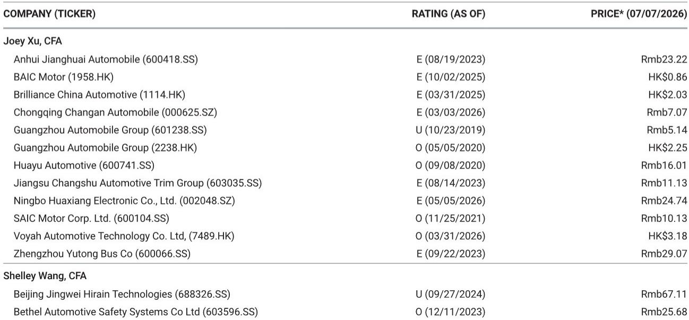

# 中国新能源汽车市场进入策略性调整期，而非下行——善用7月窗口期的企业将赢得先机

7月已至，中国新能源汽车市场迎来了每年夏季都会出现的季节性调整。从6月最后一周到7月第一周的数据，呈现出一个容易被误读的图景。多数主要品牌的周度订单量出现回落，部分降幅明显，整体表现趋于平稳。但正确的解读不应是消极的，而应视为一次策略性的再校准。市场并非在走弱，而是在巩固。在这一巩固过程中，部分车企正在悄然为下一轮发展积蓄力量。

从最新的周度订单数据中可以提炼出的核心洞察是：7月的放缓是一个已知的季节性规律，并且被产品周期中一个特定的、暂时的空档期所放大。真正的竞争态势要到8月下旬新一轮产品发布启动时才会明朗。对于观察者和策略制定者而言，问题不在于需求是否在减弱，而在于哪些公司正在利用这段平静期构建结构性优势，这些优势将在市场周期转换时产生叠加效应。周度数据是策略的滞后指标，而非市场转向的先行指标。

数据显示，市场正日益呈现分化态势。一边是能够凭借规模和品牌惯性维持动力的销量领先者；另一边是将全部赌注押在单一车型上的创新者；而在中间地带，一些公司正在失去阵地，并非因为产品不佳，而是因为时机不对。这些策略层面的影响是深远的，其意义远超下一个季度。

## 比亚迪的优势不仅在于规模——更在于其他公司难以匹敌的产品周期节奏

比亚迪周度订单量达到9.09万至9.14万辆，环比增长25%，同比增长17%，是本报告中最突出的数据点。但这一数字本身还不足以体现其策略意义。比亚迪不仅是规模最大的参与者，也是相对少见似乎对季节性放缓具有免疫力的公司。当几乎所有其他主要品牌的订单量都在下降或停滞时，比亚迪却在加速。

催化剂是海狮08的发布，但这只是表面原因。更深层次的原因在于，比亚迪的产品周期足够密集和频繁，能够有效抵消季节性低谷的影响。大多数车企每年只有一到两次重大发布，而比亚迪则有一系列滚动更新的新车型，持续吸引消费者的关注。海狮08并非特例，而是这家公司掌握产品节奏之道的常态。

这对市场其他参与者产生了二阶影响。如果比亚迪能够在淡季维持订单动力而其他公司不能，那么在这几个月里，市场份额的差距将以非线性的方式扩大。竞争损害不是线性的。一家在淡季失去20%份额的公司，并不能在旺季轻易夺回。客户注意力、经销商关注度以及供应链资源都会在淡季发生转移，且难以重新获取。比亚迪正在利用7月巩固其地位，而不仅仅是维持现状。

## MONA L03的发布将定义小鹏的发展轨迹，但数据对其核心品牌提出了严峻问题

小鹏汽车周度订单量为6700至6900辆，环比增长2%，相对数字看似积极，但结合背景来看则具有迷惑性。该公司因MONA L03的亮相而获得了显著的展厅客流量，发布周末的预订单量也较为扎实。然而，同比数据却惊人地下降了77%。这一数字需要解释，而解释并不轻松。

小鹏实际上在运行两条并行的叙事线。MONA品牌正在激发消费者的真实兴趣，并可能成为一个有意义的销量驱动因素。但小鹏的核心品牌正在挣扎。77%的同比降幅表明，公司现有产品线的市场相关性正在加速下降，其速度超过了新车型所能弥补的程度。报告未能完全回答、而观察者必须思考的问题是：MONA的发布究竟是真正的转折点，还是暂时的喘息机会。

策略风险在于，MONA可能会蚕食小鹏自身利润率更高的车型，同时未能吸引足够多的全新客户进入品牌生态系统。预订单数据令人鼓舞，但预订单不等于持续的需求。真正的考验将在8月和9月到来，届时初始的新鲜感消退，车辆必须在重复购买周期中竞争。如果MONA的成功是以牺牲核心品牌为代价，那么小鹏将是用利润率换取销量，而未能解决其根本的定位问题。

## 蔚来的放缓揭示了品牌延伸与品牌稀释之间的结构性张力

蔚来汽车周度订单量为1.12万至1.14万辆，环比下降14%，同比下降63%，是数据集中降幅最明显的之一。报告将此归因于ONVO销量放缓以及ES8在五座版发布前的需求减弱。但这一模式比单一数据点所显示的更令人担忧。

蔚来正在尝试一项微妙的策略操作：推出价格更低的子品牌ONVO以获取销量，同时维持核心蔚来品牌的高端定位。早期证据表明，这带来的更多是混淆而非清晰。ONVO的放缓可能意味着初始需求已被早期用户提前释放，剩余的可触达市场规模小于预期。与此同时，核心品牌的销量因客户等待更新的ES8而走软，表明蔚来的产品周期正在制造真空而非桥梁。

这里的策略张力是根本性的。汽车行业的品牌延伸几乎总是伴随着稀释风险。特斯拉通过让Model 3和Model Y在其细分市场中成为明显更优的产品（而不仅仅是Model S的廉价版）来避免这一问题。蔚来尚未证明ONVO能够凭借自身实力立足。接下来的两个月至关重要。如果ONVO订单企稳，且ES8的发布重新点燃核心品牌需求，那么当前的疲软将只是一个小插曲。如果两者继续下滑，蔚来将面临一个在销量与利润率之间没有简单答案的策略选择。

## 特斯拉中国保持稳定，但竞争环境正在对其不利

特斯拉中国周度订单量为1.1万至1.12万辆，环比增长16%，乍看之下表现稳定。然而，35%的同比降幅揭示了其面临的压力。特斯拉并非在输给某一个竞争对手，而是被十几个中国品牌累积的效应所挤压，这些品牌进步的速度超过了特斯拉创新的速度。

特斯拉面临的策略问题是，其品牌实力和充电基础设施能否维持其地位足够长的时间，以等待下一个产品周期的到来。答案并不明确。特斯拉在中国的优势历来有三：品牌声望、软件领先以及超级充电网络密度。品牌声望正在被侵蚀，因为中国车企在更低的价格点上生产出客观上更豪华、技术更先进的车辆。软件优势正在缩小，因为本土厂商整合了更适合中国路况的语音控制、导航和自动驾驶功能。充电网络仍然是一条真正的护城河，但这条护城河正被国有运营商和第三方运营商的积极扩张所填平。

16%的周度订单环比增长是一个积极信号，但不足以抵消结构性趋势。特斯拉需要一款新产品、一次显著的价格调整或一次技术飞跃来重获动力。根据现有数据，这些似乎都非迫在眉睫。该公司正处于一个等待模式，而在像中国这样动态的市场中，等待模式是危险的。

## 报告留下了关于8月复苏形态的未解问题

报告指出，整体车辆销量可能会保持季节性平淡，直到8月下一轮新产品周期启动。这是一个合理的预测，但它留下了几个关键问题。首先，8月复苏的预期幅度是多少？是恢复到6月水平，还是存在被压抑的需求可能带来更强劲的反弹？其次，哪些品牌最有能力抓住这一复苏？报告指出比亚迪、吉利银河和极氪在当前时期订单表现突出，但并未将其即将到来的产品周期与8月的时间线进行映射。

最重要的未解问题是，8月的复苏将是广泛的还是集中的。如果只有少数品牌受益，市场结构将变得更加两极分化。强者愈强，弱者将进一步落后。这并非仅凭周度订单数据就能做出的预测。它需要对库存水平、经销商情绪和消费者融资条件进行更深入的分析。报告提供了当前需求的出色快照，但并未完全回答需求将如何演变的问题。

## 应对季节性淡季的决策框架

对于需要依据这些信息采取行动的观察者和策略制定者，一个简单的决策框架可以帮助区分信号与噪音。该框架包含三个维度：产品周期位置、品牌韧性以及利润率结构。

首先，评估产品周期位置。在8月或9月有重大发布的公司，更有能力度过7月的淡季，因为它们的订单簿将迅速补充。在第四季度之前没有重大发布的公司，面临需求低谷延长的风险更大。比亚迪凭借其持续的发布节奏，在这一维度上得分最高。小鹏凭借MONA的发布，如果产品表现出色，则处于有利位置。蔚来和理想汽车，其发布分布在第三季度，处于中等位置。

其次，评估品牌韧性。这更难量化，但同样重要。品牌韧性是指在交易量低迷时期维持消费者关注度和经销商忠诚度的能力。比亚迪和特斯拉具有较高的品牌韧性。小鹏和蔚来具有中等韧性。像零跑这样规模较小的参与者韧性较低，这意味着它们更容易受到长期放缓的影响。

第三，评估利润率结构。毛利率较高的公司能够吸收淡季的固定成本负担，而不会对盈利造成重大损害。利润率薄的公司则更为脆弱。比亚迪和特斯拉的利润率状况相对较强。蔚来和小鹏，由于持续投资于新车型和子品牌，对销量波动更为敏感。

将这一框架应用于当前数据表明，比亚迪是组合中最稳妥的选择。吉利银河和极氪是有吸引力的次级选择。小鹏和蔚来的风险回报更为平衡，如果其发布成功，则有显著上行空间；如果令人失望，则有显著下行风险。特斯拉仍然是一项高质量的资产，但面临结构性挑战，需要催化剂来解决。

## 完整图景需要超越周度订单的数据

周度订单数据是理解短期需求动态的有力工具，但不足以做出长期策略决策。本报告中的数据告诉我们现在正在发生什么。它没有告诉我们9月会发生什么，届时竞争格局将被MONA、极氪9X和银河战舰700的发布所重塑。它没有告诉我们经销商库存的布局情况，而这是定价压力的关键先行指标。它也没有告诉我们消费者融资条件如何演变，这将决定下半年需求的弹性。

这些并非对报告的批评，而是承认没有任何单一数据源能够回答所有问题。本报告的价值在于，它提供了一个及时、精细的快照，展现了一个快速变化的市场。读者的策略任务是，将这个快照与其他数据源和定性洞察相结合，以构建完整的图景。

中国新能源汽车市场正处于一个创造性破坏的时期。能够生存并繁荣的公司，将是那些利用平静月份来强化产品线、加深品牌护城河并优化成本结构的公司。周度订单数据是一面镜子，而非水晶球。它清晰地反映了当下。未来需要推断，而最佳的推断来自于将数据与策略判断相结合。

*仅供参考。部分内容可能基于源材料通过AI辅助生成、翻译、总结或编辑，可能存在遗漏或错误。请独立核实。本文不构成任何专业建议。*

仅供参考。部分内容可能基于源材料通过AI辅助生成、翻译、总结或编辑，可能存在遗漏或错误。请独立核实。本文不构成任何专业建议。

