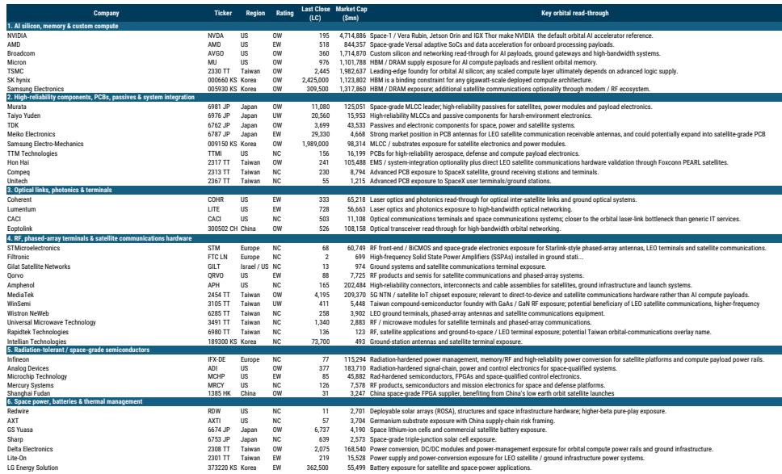
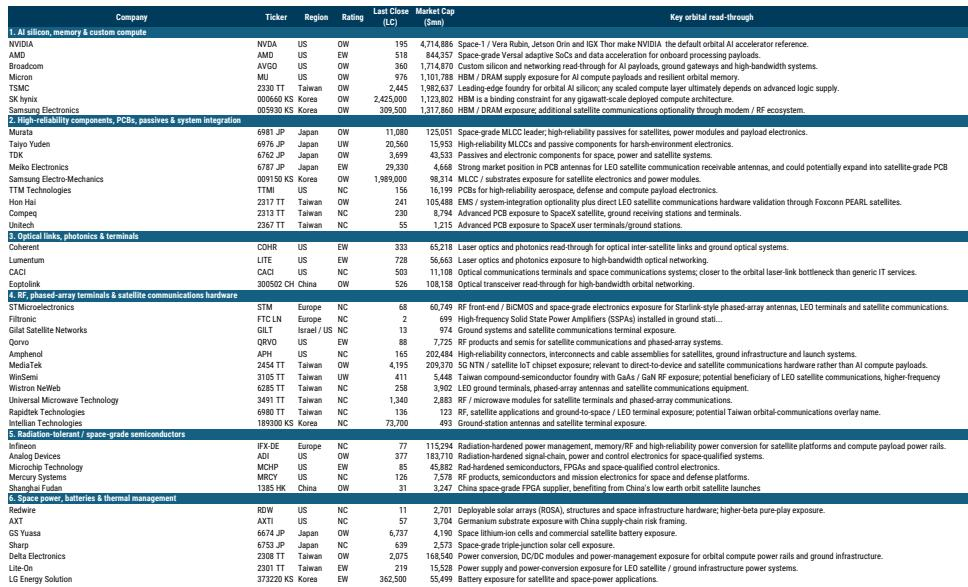
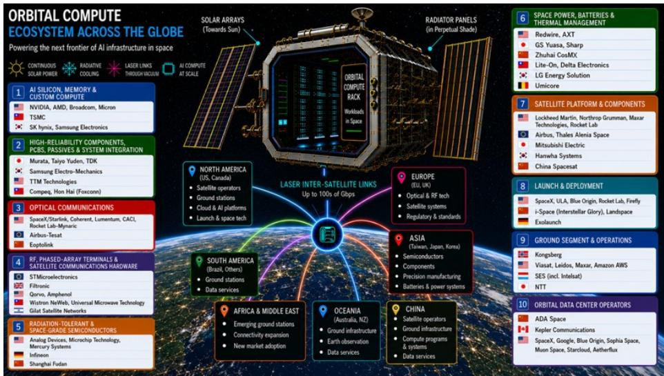

# MS：太空计算的真正起点不是数据中心，是边缘AI

把数据中心搬到太空，听起来像是科幻小说的场景。但MS一份最新研报给出了更务实的判断：大规模轨道计算基础设施仍是一个长期选项，未来五到十年真正能落地的商业场景，是“轨道边缘AI”——卫星在轨完成图像、传感器数据和推理任务，只把有用结果传回地面。

这份报告的价值不在于描绘一个宏大的太空计算愿景，而在于拆解了哪些技术环节已经成熟、哪些成本曲线正在收敛、以及供应链上哪些公司正在提供真正可交付的组件。对于关注AI基础设施研究的读者，这是一个值得提前建立观察框架的领域。

## 1. 轨道计算的宏观环境账正在接近地面AI基础设施

报告给出了一个关键的成本对标：轨道计算每瓦资本支出，预计从2030年的约60美元，下降到2035年的15美元，2040年进一步降至9美元。以五年使用寿命折算，2031年的约6.5美元/瓦/年，已经接近当前行业Blackwell基准的6.8美元/瓦/年。

这个数字的意义在于，它表明轨道计算不再是一个成本无限高的概念验证。驱动下降的因素有三个可追踪的变量：可重复使用发射技术持续降低入轨成本、卫星硬件本身的规模效应、以及计算载荷能效的提升。换句话说，太空不再只是通信中继站的天下，它正在变成一个可以运行AI工作负载的平台。

> **KC评论：** 成本对标是这份报告最值得细读的部分。它给出了一个可验证的假设框架——如果发射成本每下降10%，轨道计算的单位成本改善多少？报告没有完全展开，但这个框架本身就可以用来跟踪关键公司的季度进展。

## 2. 供应链机会集中在三大技术层，欧洲两家公司位置突出

报告把轨道计算供应链分为六个层级，但真正有价值增量的是三个方向：光学/RF通信、电源与热管理、以及抗辐射半导体。这与地面AI数据中心的供应链结构有本质区别——地面数据中心的核心瓶颈是电力、土地和水冷，而轨道计算的核心瓶颈是发射成本、散热和辐射耐受。

在欧洲半导体领域，STMicroelectronics和Infineon被报告列为关键供应商。STMicro的LEO业务被拆分为三个收入来源：宽带、直接到手机、以及轨道数据中心。管理层指引未来三年累计销售额“远高于30亿美元”，其中用户终端是最大收入贡献者。报告模型预测STMicro的LEO销售额从2026财年的8.15亿美元增长到2028财年的18亿美元，同时指出这一预测可能偏保守——如果卫星发射规模超出当前模型假设。

> **KC评论：** 这里有一个值得追问的未解问题：用户终端是STMicro目前最大的LEO收入来源，但终端本身的技术门槛和定价权如何？如果终端进入大规模量产，毛利率是否会向消费电子方向收敛？报告没有展开这一层，但这是判断供应链公司长期价值的关键变量。

## 3. 报告没有完全回答的三个关键问题

这份研报在技术拆解和供应链映射上做得非常扎实，但有几个判断缺口值得关注。

第一，轨道计算的商业驱动力究竟来自哪里。报告提到“地面数据中心面临电力、土地、水资源和许可限制”，但并没有量化这些限制在什么时间点会变得足够紧迫，以至于运营商愿意支付轨道计算的溢价。如果地面AI基础设施的电力瓶颈在2027-2028年被核能或新型储能部分缓解，轨道计算的紧迫性就会下降。

第二，光学星间链路的带宽瓶颈何时突破。报告指出，AI规模的分布式计算需要远高于当前卫星网络所能提供的星间带宽。目前激光通信在轨验证的速率和可靠性数据仍然有限，这个技术节点的进展速度将直接决定轨道计算能否从“边缘处理”走向“分布式训练”。

第三，中国“三体计算星座”的实际进展。报告提到Adaspace在2025年5月发射了首批12颗卫星，长期计划是2800颗。但中国商业航天在发射频率、供应链成熟度和政策支持上的实际节奏，目前公开信息仍然有限。这既是不确定性，也是观察变量。

## 4. 给读者的观察框架：三个先行指标

与其试图预测轨道计算何时爆发，不如建立一个可追踪的信号系统。

第一个信号是发射成本的持续下降曲线。SpaceX的Starship进展、中国可重复使用火箭的测试频率、以及欧洲Ariane 6的定价策略，都是可以季度追踪的数据点。

第二个信号是抗辐射芯片的商业化进度。目前辐射加固芯片主要依赖专用设计，成本高、产能有限。如果NVIDIA或AMD开始推出针对轨道环境的商用AI加速器（报告已提及NVIDIA的Jetson Orin和IGX Thor作为参考设计），意味着这个市场开始从军工级走向规模级。

第三个信号是光学星间链路的供应商动态。Coherent、Lumentum、CACI这些公司的卫星通信订单和产品路线图，比任何宏观预测都更能反映技术成熟度。

这份报告的价值不在于给出一个确定性的研究结论，而在于为读者建立了一个可以持续跟踪的框架。轨道计算不会一夜之间取代地面数据中心，但它正在从一个研究概念变成一个可计算的工程选项。对于关注AI基础设施边界的读者，现在开始建立观察坐标，比等到技术拐点再入场要有效得多。

For informational purposes only. Portions may be generated,translated,summarized,or edited with AI assistance based on source materials and may contain omissions or errors. Please verify independently. This is not investment,legal,tax,accounting,or other professional advice.

For informational purposes only. Portions may be generated,translated,summarized,or edited with AI assistance based on source materials and may contain omissions or errors. Please verify independently. This is not investment,legal,tax,accounting,or other professional advice.

