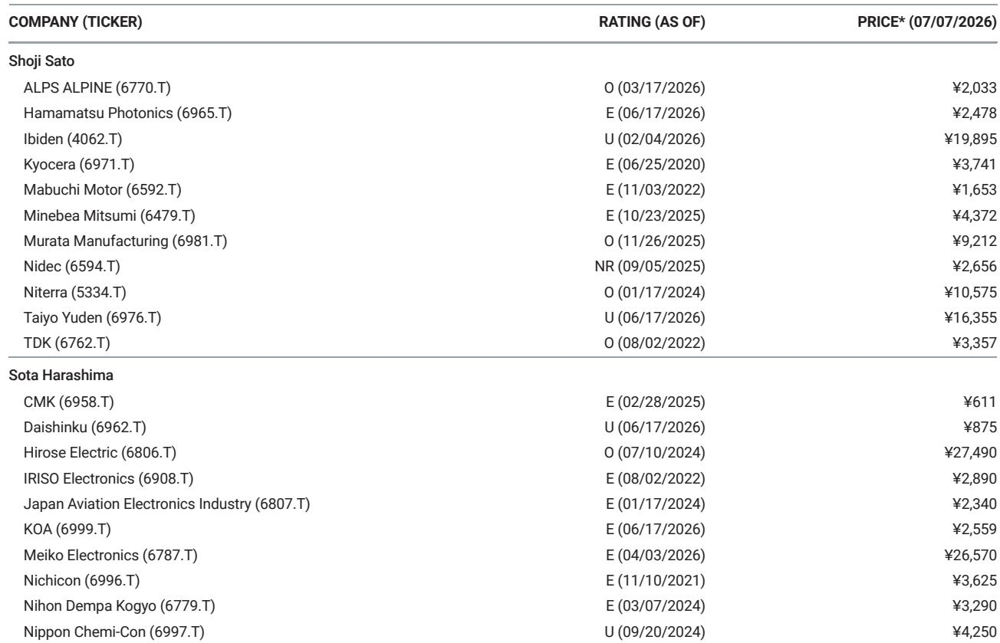
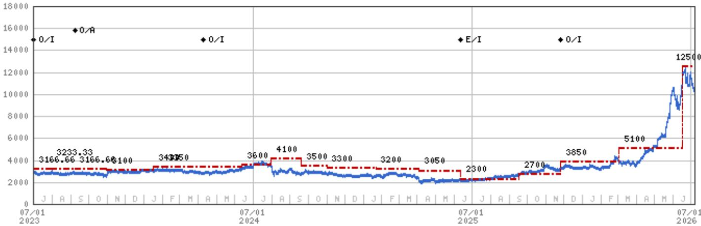
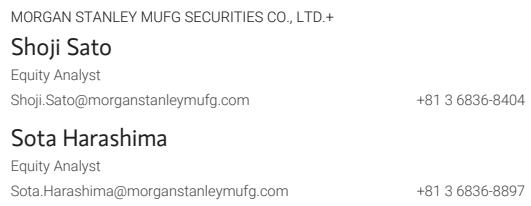

# Murata Manufacturing's Upcoming Earnings Release Creates a Tactical Opportunity for Observers Who Can Look Beyond the Headlines

The most compelling opportunities often emerge not from broad strategic shifts, but from well-timed tactical observations on predictable catalysts. In the case of Murata Manufacturing, a global leader in electronic components, the upcoming first-quarter earnings announcement on July 31 presents precisely such an opportunity. A global research report has identified a scenario where Murata's share price may show relative strength over the next 60 days, driven by earnings that are expected to meaningfully exceed consensus expectations. This is not a speculative gamble on an unknown outcome; it is a calculated observation based on a clear asymmetry between what the market currently prices and what the underlying business fundamentals are likely to deliver.

The core thesis is straightforward but powerful. The report forecasts Murata's first-quarter operating profit at 90.4 billion yen, a figure that stands significantly above both the year-ago period's 61.6 billion yen and the previous quarter's 78.8 billion yen. More critically, this projection exceeds the FactSet consensus estimate of 85.6 billion yen by nearly 5 percent. In a market environment where earnings beats are increasingly rewarded and misses are severely punished, this gap between the analyst's forecast and the broader market's expectation creates a tangible opportunity for price appreciation. The report assigns an 80 percent or higher probability to this scenario unfolding, a level of conviction that demands serious consideration from any observer focused on near-to-medium term developments.

Why now matters is equally important. The global semiconductor and electronic components cycle has been through a prolonged period of inventory correction and demand adjustment. Many observers have grown cautious on the sector, waiting for clearer signals of a sustained recovery. Murata's earnings, however, may provide the first concrete evidence that the recovery is not only underway but is accelerating faster than most models have captured. The company's exposure to high-end smartphones, automotive electronics, and advanced connectivity solutions positions it at the nexus of multiple growth trends that are converging simultaneously. If the earnings beat materializes as expected, it will force a rapid reassessment of the entire sector's trajectory, with Murata leading the way.

The implications extend beyond a single company. Murata is often viewed as a bellwether for the broader electronic components industry in Japan and globally. Its results provide critical data points on end-market demand, inventory levels, and pricing power. A significant earnings beat would likely catalyze re-ratings across the sector, benefiting other component manufacturers and suppliers. Conversely, even a modest miss could reinforce the cautious sentiment that has weighed on the group. This makes the upcoming announcement a pivotal moment not just for Murata shareholders, but for anyone with exposure to the technology hardware and semiconductor supply chain.

Observers who wait for the earnings confirmation before acting will likely find that the most attractive entry point has already passed. The market's reaction to earnings surprises is typically swift and decisive, with the majority of the price adjustment occurring within the first few trading sessions following the release. The tactical opportunity, therefore, lies in positioning ahead of the catalyst, accepting the modest risk that the outcome may deviate from the expected path in exchange for the asymmetric upside that a confirmed earnings beat would deliver.

## Murata's Earnings Beat Is Not an Anomaly; It Reflects Structural Demand Tailwinds That the Market Underappreciates

The temptation is to view a single quarter's earnings beat as a transient event driven by one-time factors such as favorable currency movements or temporary customer restocking. In Murata's case, this interpretation would be a mistake. The projected operating profit of 90.4 billion yen represents a 47 percent year-over-year increase and a 15 percent sequential improvement. These are not the numbers of a company experiencing a fleeting tailwind; they are the numbers of a company benefiting from structural shifts in demand that are likely to persist across multiple quarters.

The primary driver of this outperformance is the accelerating adoption of high-end smartphones, particularly models that incorporate advanced functionality such as enhanced camera systems, higher data transmission speeds, and more sophisticated power management. Murata's core products, including multilayer ceramic capacitors (MLCCs), high-frequency modules, and circuit boards, are essential components in these devices. As smartphone manufacturers continue to push the envelope on performance and features, the content value per device for Murata increases. This is not a one-time boost; it is a secular trend that compounds with each new product generation.

Beyond smartphones, Murata is also benefiting from the rapid expansion of automotive electronics, particularly in electric vehicles and advanced driver-assistance systems. The electronic content per vehicle is rising exponentially, and Murata's components are integral to powertrain control, battery management, infotainment, and safety systems. The automotive segment provides a diversifying revenue stream that is less correlated with the consumer electronics cycle and offers longer visibility into demand. As global EV penetration rates continue to climb, this segment will become an increasingly important contributor to Murata's overall profitability.

The report's forecast also implies that Murata is gaining market share in key product categories. In a competitive landscape where many peers are struggling with margin compression and capacity utilization issues, Murata's ability to deliver above-consensus earnings suggests that its technology leadership and manufacturing efficiency are translating into superior financial performance. The company's investment in advanced production capabilities, particularly in next-generation MLCCs and radio frequency components, is creating barriers to entry that smaller competitors cannot easily overcome. This competitive moat is a durable source of earnings power that the market may not be fully pricing into the stock.

The market's skepticism about the sustainability of the recovery in electronic components is understandable given the industry's history of boom-bust cycles. However, the current environment is different. The pandemic-induced supply chain disruptions forced many end customers to adopt just-in-case inventory strategies that have created a structural floor under demand. Additionally, the proliferation of 5G and Internet of Things applications is driving a step-change in component demand that is not cyclical but secular. Murata's earnings beat, if confirmed, will serve as the catalyst that forces the market to recalibrate its expectations for the entire cycle.

## The 80 Percent Probability Assessment Deserves Close Scrutiny, but It Also Raises Important Questions About What Could Go Wrong

A probability estimate of 80 percent or higher is unusually high for any tactical idea, particularly one that depends on an earnings surprise relative to consensus. This level of conviction suggests that the analyst has identified a clear and identifiable gap between the company's underlying operating trajectory and the market's expectations. However, sophisticated observers must interrogate the assumptions that underpin this assessment and consider the scenarios that could invalidate it.

The most obvious risk is that the consensus estimate itself may be stale or based on outdated assumptions. If the consensus has not fully incorporated recent positive developments such as a stronger demand outlook from key customers or favorable currency trends, then the reported earnings may beat expectations even without any fundamental acceleration in the business. In this case, the beat would be a catch-up to reality rather than a signal of new strength. The market's reaction to such a beat may be more muted, as observers had already begun to price in the improvement through a higher share price in the days leading up to the announcement.

A more concerning risk is that the beat is driven by unsustainable factors such as aggressive channel stuffing, one-time gains, or accounting adjustments. While there is no evidence in the report to suggest this is the case, observers should carefully review the quality of the earnings when they are released. A beat that is accompanied by weak cash flow, rising receivables, or declining order backlogs would be a red flag that the underlying business is not as strong as the headline numbers suggest. The market is increasingly sophisticated in distinguishing between high-quality and low-quality beats, and a poor-quality beat could actually lead to a negative share price reaction.

Another risk is that the broader macroeconomic environment deteriorates between now and the earnings announcement. The report is dated July 7, 2026, and the earnings are scheduled for July 31. In that three-week window, any negative macro surprise such as a sharp rise in interest rates, a geopolitical escalation, or a sudden slowdown in global trade could overwhelm the company-specific positive catalyst. While these risks are always present, they are particularly acute in the current environment of heightened uncertainty around monetary policy and trade dynamics. Observers positioning for the earnings beat must be comfortable accepting this macro tail risk.

Finally, there is the risk that the market has already priced in a beat. If the stock has rallied significantly in the weeks leading up to the earnings announcement, the bar for a positive reaction is higher. The report notes that the stock price was 9,212 yen as of the report date, suggesting that some of the positive news may already be reflected in the price. The key question is whether the earnings beat will be large enough to surprise even the most optimistic observers and drive further upside. The report believes there is still substantial upside, but observers should monitor the stock's price action in the days leading up to the announcement for signs of front-running.

## The Decision Framework for Acting on This Tactical Idea Requires Balancing Conviction Against Portfolio Construction Constraints

For observers considering whether to act on this tactical idea, the decision should be framed not as a binary bet on Murata's earnings, but as a portfolio construction question. The expected value of the trade is positive given the high probability of a beat and the asymmetric upside, but the actual decision depends on the observer's risk tolerance and the opportunity cost of deploying capital in a short-duration trade versus a longer-term strategic holding.

The first step in the decision framework is to assess the conviction level. The report's 80 percent probability estimate is a subjective assessment, but it is based on a detailed analysis of the company's operating trends, customer demand signals, and industry dynamics. Observers should independently verify these assumptions by reviewing Murata's recent financial reports, listening to its investor presentations, and monitoring industry data points such as smartphone shipment forecasts and automotive production trends. If the observer's own analysis confirms the report's conclusions, the conviction level should be high enough to warrant a position.

The second step is to determine the appropriate position sizing. For a tactical trade with a 60-day horizon, the position should be large enough to generate a meaningful return if the thesis plays out, but not so large that a negative outcome would materially damage the portfolio. A reasonable starting point might be 2 to 4 percent of the portfolio, depending on the observer's risk appetite and the liquidity of the stock. Murata is a large-cap stock with significant daily trading volume, so execution risk is minimal.

The third step is to define the exit strategy. If the earnings beat materializes and the stock rallies as expected, the observer should have a clear plan for taking profits. This plan should be based on the stock's price action and the post-earnings market reaction. If the stock gaps up sharply on the earnings release, the observer may choose to take partial profits immediately and let the remainder run. If the stock does not react as expected, the observer should have a stop-loss level that limits the downside to an acceptable level.

The fourth step is to consider the opportunity cost. Over a 60-day horizon, there are always competing opportunities in the market. The observer should compare the risk-adjusted expected return of this tactical idea against other available options, including holding cash. If the expected return is significantly higher than the alternatives, the trade is worth executing. If the expected return is only marginally better, the observer may choose to wait for a better entry point or a different catalyst.

The final step is to monitor the position actively. Unlike a long-term strategic holding, a tactical trade requires constant attention to new information that could change the probability assessment. Any negative news about Murata's end markets, its customers, or the broader economy should trigger an immediate reassessment. The observer should be prepared to exit the position quickly if the thesis breaks, without waiting for confirmation from the earnings announcement.

## The Report Leaves Critical Questions Unanswered That Only the Full Analysis Can Resolve

While the tactical idea is compelling, the report's summary leaves several important questions unanswered that are essential for a fully informed decision. These gaps are not weaknesses in the analysis; they are the natural consequence of the format and the need to present a concise case. However, they create meaningful uncertainty that observers should seek to resolve before committing capital.

The most important unanswered question is the specific composition of the earnings beat. The report forecasts operating profit of 90.4 billion yen, but it does not break down this figure by business segment or product category. Understanding whether the beat is driven by MLCCs, high-frequency components, circuit boards, or other products is critical for assessing the sustainability of the trend. A beat driven by a single product category that is experiencing a temporary demand spike is less compelling than a diversified beat across multiple segments. The full report likely provides this segmentation, and observers should seek it out.

Another critical question is the role of currency in the earnings forecast. The report notes that a one yen change in the dollar-yen exchange rate impacts operating profit by 4.5 billion yen. Given the significant volatility in currency markets, the observer needs to understand what exchange rate assumptions are embedded in the 90.4 billion yen forecast. If the forecast assumes a weaker yen than the current spot rate, the beat may be partially or fully attributable to currency rather than operational performance. This would reduce the quality of the beat and potentially limit the stock's upside.

The report also does not address the company's guidance for the full fiscal year. If Murata's first-quarter beat is accompanied by a raise in full-year guidance, the positive catalyst would be significantly amplified. Conversely, if the company maintains its existing guidance despite the strong quarter, the market may interpret this as a sign that management sees headwinds in the second half of the year. The observer needs to know what the report expects regarding guidance and how that expectation compares to the consensus.

Finally, the report does not discuss the competitive dynamics in Murata's key markets. Are there any new entrants or technological shifts that could threaten Murata's market position? Are customers diversifying their supplier base to reduce dependence on Murata? These questions are particularly relevant in the current environment where supply chain resilience has become a strategic priority for many companies. The full report likely addresses these competitive risks, and observers should not make a decision without understanding them.

## Join the community to read the full report and review the original charts.

The tactical opportunity in Murata Manufacturing is clear, but the decision to act requires a deeper understanding of the underlying analysis, the risks, and the potential second-order implications. The full report from the global research institution provides the detailed segment-level forecasts, the currency assumptions, the competitive analysis, and the scenario planning that are essential for a fully informed decision. By joining the community, you gain access to this critical analysis and the original charts that illustrate the key data points and valuation framework. The community also provides a forum for discussing the research thesis with other sophisticated observers and sharing insights that can sharpen your own analysis. Do not make this decision based on a summary alone; access the full report and make your judgment with the complete picture in front of you.

*For informational purposes only. Portions may be generated, translated, summarized, or edited with AI assistance based on source materials and may contain omissions or errors. Please verify independently. This is not professional advice.*

For informational purposes only. Portions may be generated, translated, summarized, or edited with AI assistance based on source materials and may contain omissions or errors. Please verify independently. This is not professional advice.

