# 中国工业行业中期展望

## 资本开支展望

在我们覆盖的子行业中，2026年下半年资本开支预计整体保持强劲。在2026年上半年各公司市场表现出现分化后，我们基于销售和订单动能、盈利能力、催化剂因素及估值等多维度进行选择性研究。

## 四大主题及关注方向

**(+) 四大主题：**

- AI基础设施结构性增长持续，关注相关配套领域
- 人形机器人处于早期商业化阶段，催化剂密集
- 超越AI领域，资本开支周期正在扩大
- 出口保持强劲

**(-) 关注度较低的领域：** 传统基建承包商、铁路设备及太阳能制造设备

## 相关报告

• 中国工业中期展望：在强劲资本开支前景下的选择性研究

## 行业周期位置

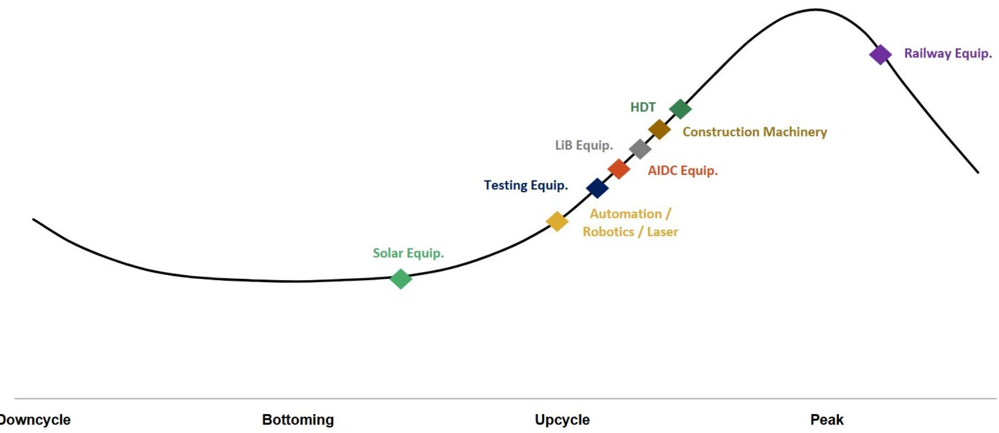

## 行业表现——净利润增长与市场表现对比

## 行业估值倍数

多数细分领域当前估值倍数高于过去五年平均水平，反映了对产业持续升级、全球化及AI相关趋势的预期。

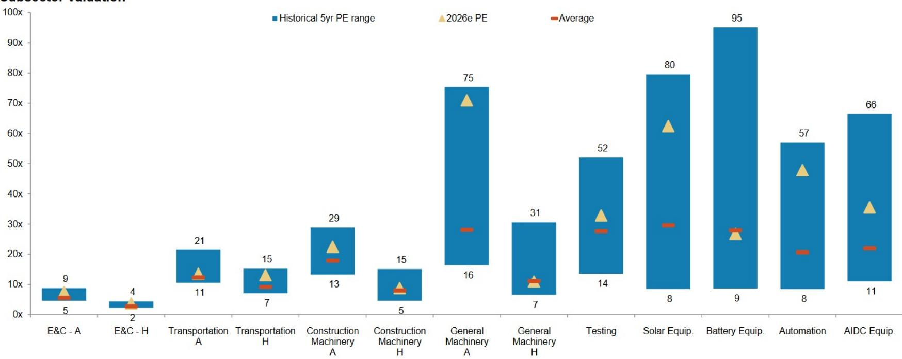

## 净资产回报表现——从2024年水平回升

预计2026-27年中国工业企业净资产回报表现将有所改善。

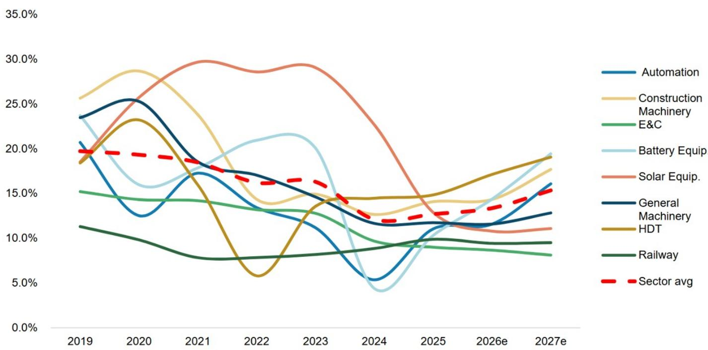

## 自动化、机器人、AIDC及通用设备

### 自动化——超级资本开支周期推动2026-27年持续上行

自动化需求处于上行周期，工业企业盈利能力改善（2026年5月同比增长19%），订单承接稳健，反映了传统下游领域复苏及科技驱动行业的强劲增长。

预计2026年自动化市场同比增长约5%（对比2026年一季度同比增长1%），动能有望延续至2027年，驱动因素包括：AI/物理AI应用需求韧性（智能机器人、PCB设备、AI可穿戴及电子设备、AI嵌入式设备）、更新换代需求以及设备企业出口竞争力增强。

AI转型已成为自动化企业的核心主题，领先企业已制定AI解决方案及具身AI产品的战略规划。同时，海外拓展持续推进，有望成为长期增长动力。

OEM市场在AI推动下增速更快；项目市场因下游行业产能因素表现相对较弱。

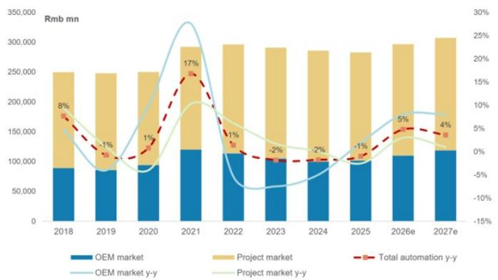

2026-27年关键自动化产品中，伺服及工业机器人增速预计较快。

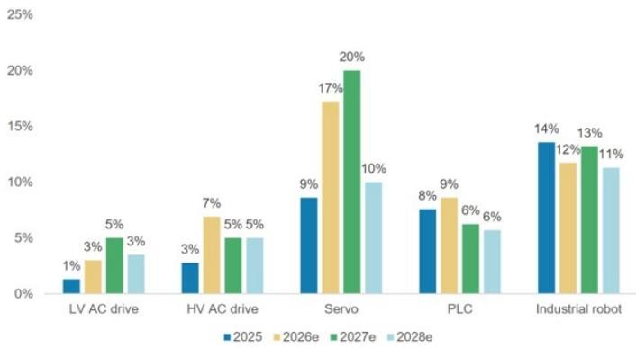

### 自动化——2026-27年明确的上行周期

预计自动化市场需求将在2026-27年经历明确的上行周期。

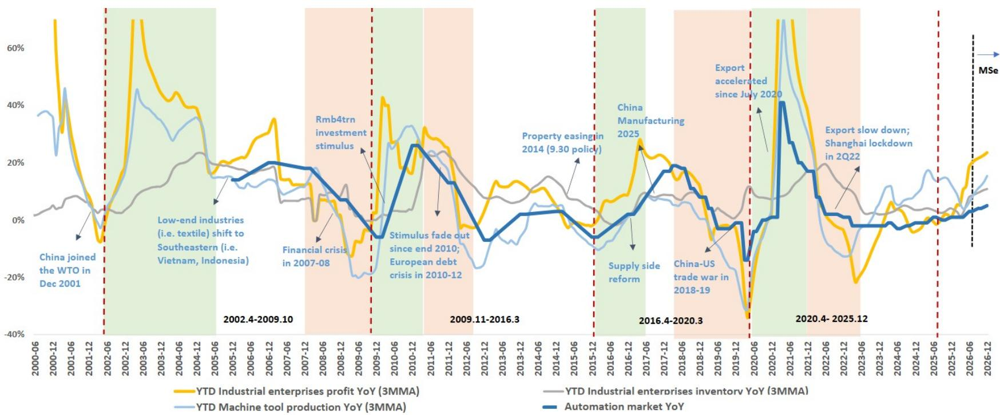

### 自动化市场更新：OEM持续领先

2026年一季度中国自动化市场同比增长1%（对比2025年四季度下降3%），主要由OEM市场驱动。

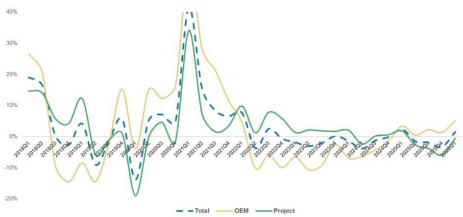

2026年一季度中国自动化OEM市场下游细分领域表现

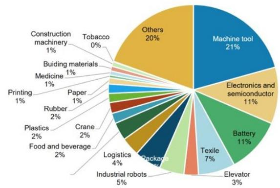

### 自动化市场更新：关键产品销售稳健，国产化持续推进

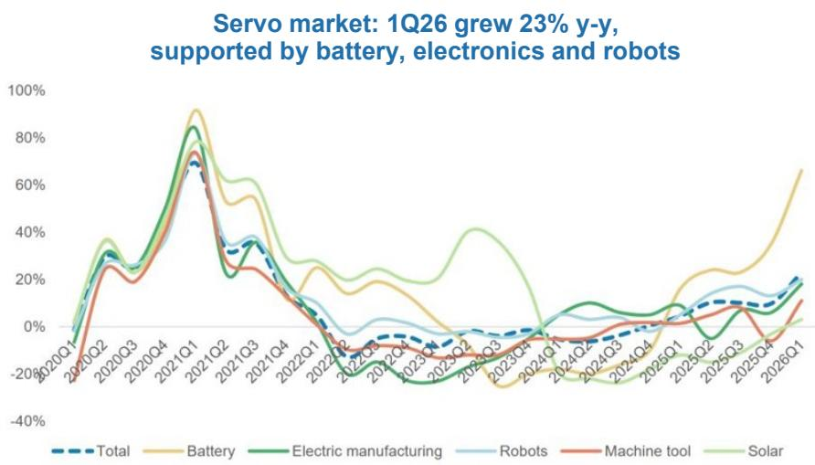

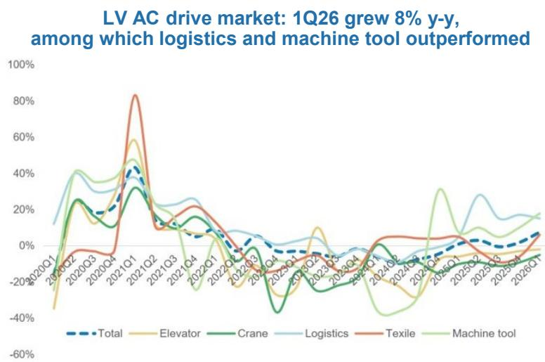

伺服市场：2026年一季度国产化率达60%

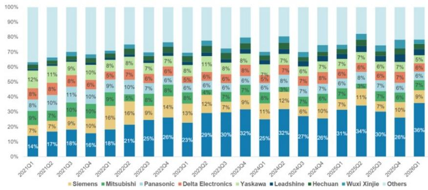

低压交流驱动市场：2026年一季度国产化率达38%

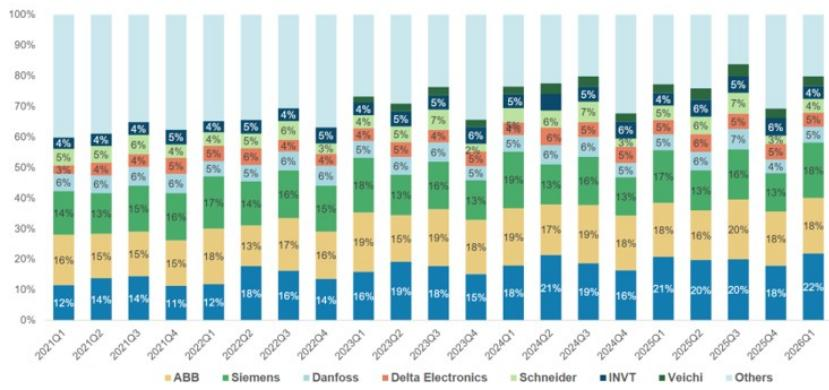

### 自动化市场更新：关键产品销售稳健，国产化持续推进

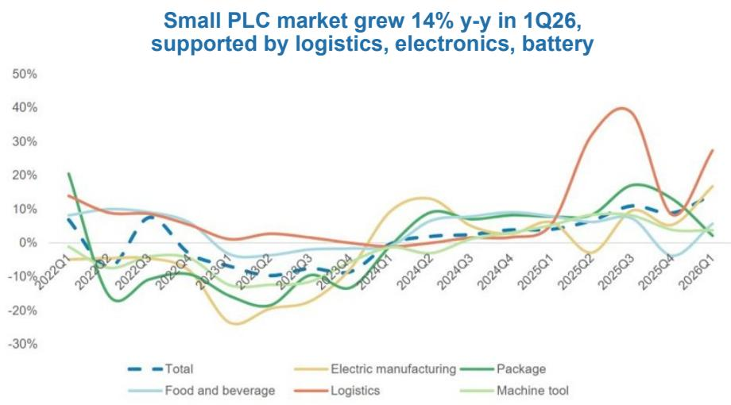

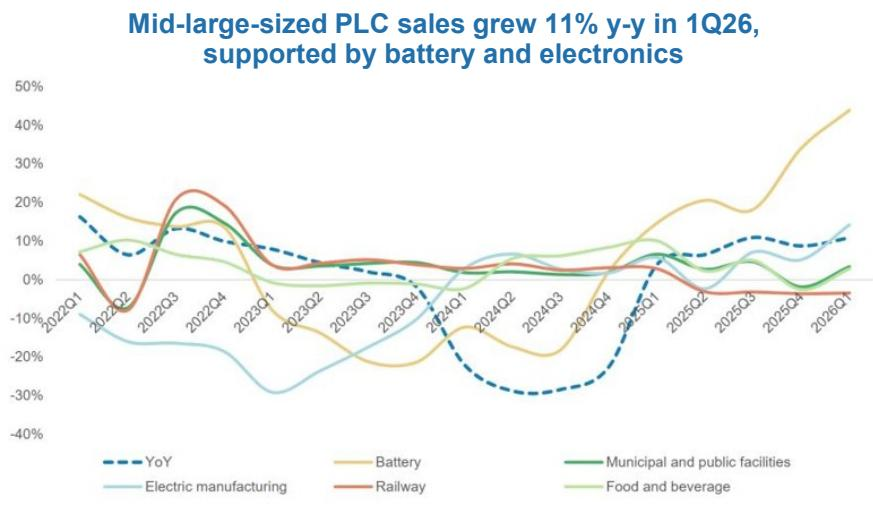

中国小型PLC市场：2026年一季度国产化率达36%

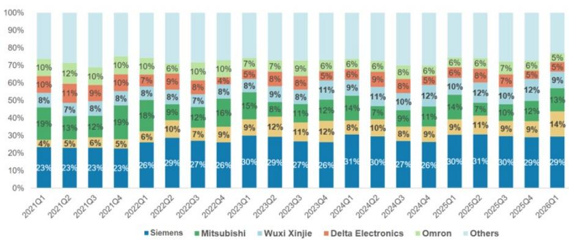

中国中大型PLC市场：本土品牌份额仍较低

## 国产化：领先企业有望持续获取市场份额

供应链持续多元化及全球近岸/在岸生产趋势

• 供应链多元化将对整体市场规模增长形成一定影响。

• 预计中国将进一步支持本土制造升级及高端制造、设备和材料的本地化。

• 预计国内整体市场规模增速将有所放缓，但本土企业在多数行业的中国市场份额将保持较高水平。

|  | 中国市场规模（人民币十亿） |  | 国产化率 |  |
| :--- | :--- | :--- | :--- | :--- |
|  | 2023年规模，2017-23年复合增速 | 2030年预计规模，2024-30年复合增速 | 2025年 | 2030年预计 |
| 自动化* | 1820亿，5% | 2600亿，4% | 40% | 60-70% |
| 工业机器人 | 550亿，14% | 750亿，6% | 55% | 70-80% |
| RV减速器 | 32亿，27% | 50亿，9% | 40% | 60% |
| 谐波减速器 | 17亿，22% | 43亿，8% | 55% | 70-80% |
| 液压** | 430亿，5% | 710亿，7% | 35% | 50-60% |
| 工程机械 | 4700亿，3% | 8600亿，10% | 90% | 90-95% |
| 锂电池设备 | 620亿，23% | 930亿，6% | 97% | 接近100% |
| 太阳能设备 | 1100亿，30% | 1650亿，6% | 97% | 接近100% |

## 机器人演进：更智能、更灵活

机器人行业正迎来突破性发展，移动性与智能化的结合正在拓展新的应用场景。

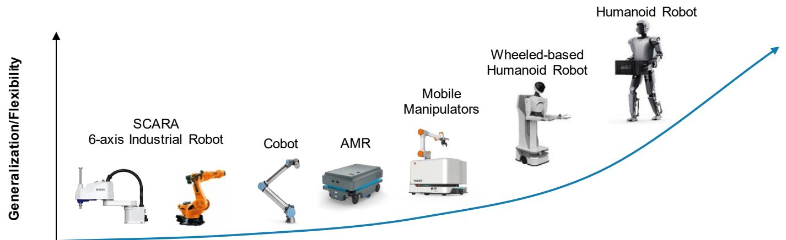

|  | 2010年之前 | 2010-2025年 | 2025-2030年 | 2030年之后 |
| :--- | :--- | :--- | :--- | :--- |
|  | 固定功能任务自动化 | 智能增强机器人 | 高级智能 | 通用智能 |
| 关键技术特征 | 固定任务自动化 | SLAM导航 | 大型多模态模型 | AGI，通用化 |
|  | 无传感器 | 运动控制 | VLA，强化学习 | 高自主性 |
| 关键产品 | SCARA、工业机器人、AGV | 六轴及以上协作机器人、AMR | 轮式人形机器人、移动操作臂、商用人形机器人 | 商用/消费级人形机器人 |

## 机器人将无处不在

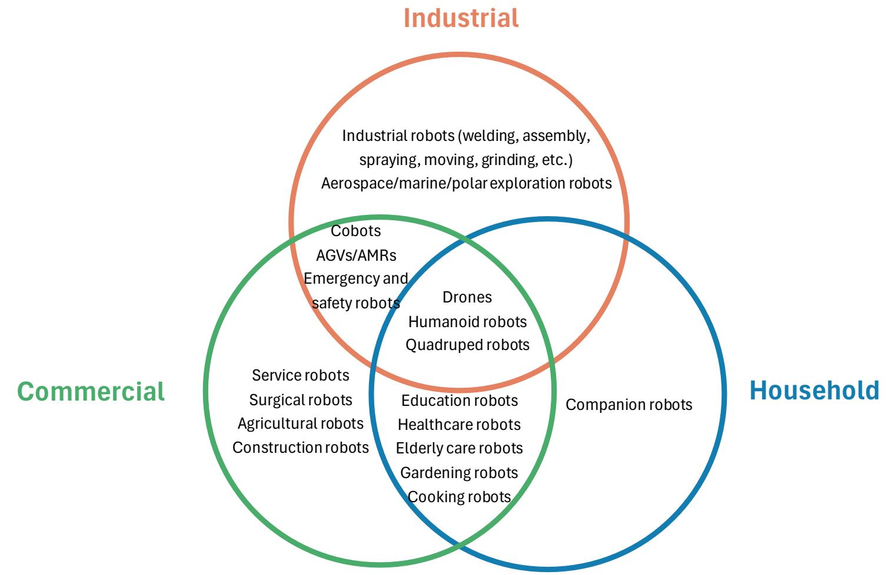

## 机器人家族概览

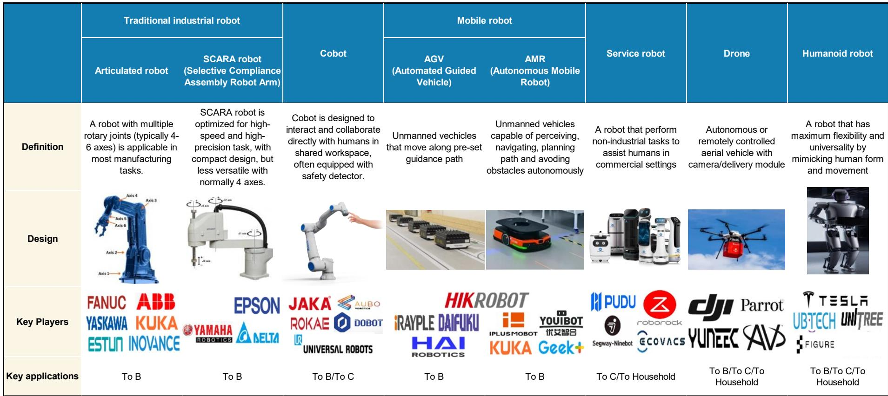

## 人形机器人——最大的具身AI机遇

全球人形机器人市场规模及保有量

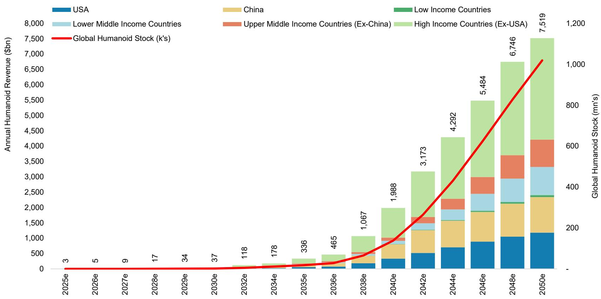

硬件物料清单构成

关键组件包括丝杠、减速器、电机和传感器

|  | 2026年预计 | 2030年预计 | 2035年预计 | 2040年预计 |
| :--- | :--- | :--- | :--- | :--- |
| 其他 | 16% | 14% | 13% | 13% |
| 芯片 | 5% | 8% | 12% | 15% |
| 电池 | 7% | 5% | 4% | 4% |
| 轴承 | 25% | 21% | 19% | 17% |
| 摄像头 | 22% | 22% | 20% | 20% |
| 力/触觉传感器 | 7% | 5% | 4% | 4% |
| 电机 | 7% | 5% | 4% | 4% |
| 减速器 | 13% | 14% | 12% | 11% |
| 丝杠 | 7% | 10% | 12% | 12% |

## 结合其他机器人需求，组件市场有望实现指数级增长

摄像头：2680亿美元，84倍

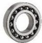

轴承：3160亿美元，370倍

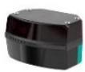

激光雷达：1280亿美元，40倍

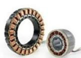

电机：20740亿美元，170倍

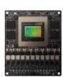

减速器：13430亿美元，155倍

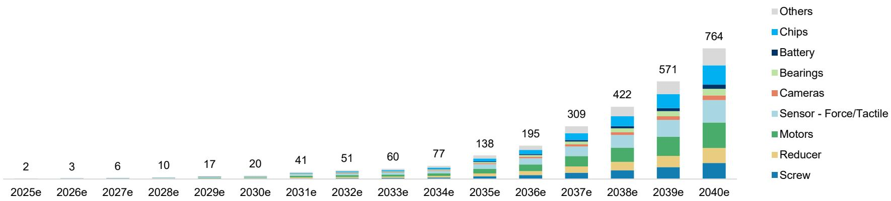

边缘计算：12340亿美元，1906倍

## 聚焦中国人形机器人：2026年，初步小规模商业化

2020年代初 - 原型机

2024年 静态展示/演示

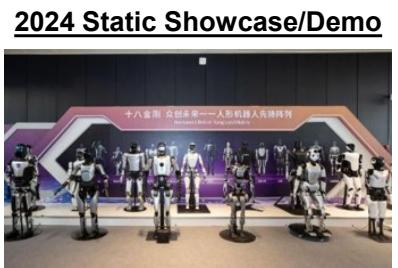

2026年：试点部署

2024年世界人工智能大会系列人形机器人展示

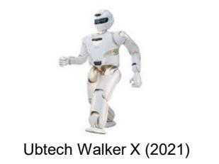

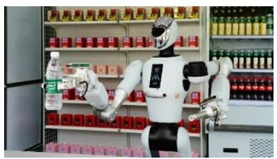

优必选Walker X（2021年）

## 2025年：运动能力提升，初步量产

宇树G1

售价1.6万美元

小米CyberOne（2022年）

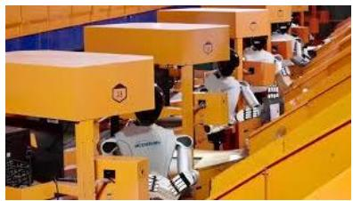

宇树H1在2025年春晚表演

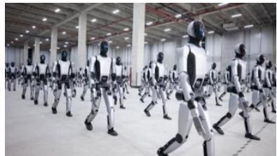

中国人形机器人出货量超过1万台

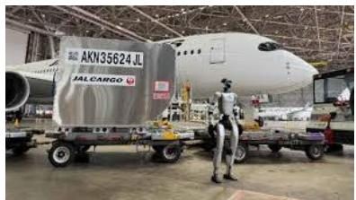

## 2026年标志着中国人形机器人商业化的开端

中国人形机器人销量（千台）

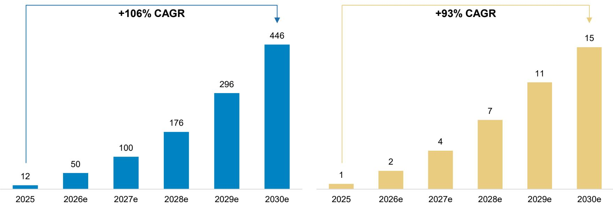

中国人形机器人市场规模（十亿美元）

## 推动中国在人形机器人/机器人领域领先的多重因素

AlphaWise调查显示，在行业早期阶段，企业采用意愿较强，支持快速的应用验证和初步采用。

已启动轮式或腿式人形机器人项目的组织占比（占总样本百分比）

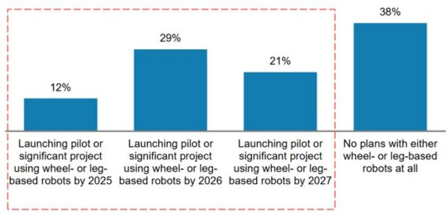

生态系统——从上游到下游的支持

制造经验正在转化为机器人能力

- 供应链：调研显示集成商主要使用本地组件，芯片除外。
- 丰富的数据：中国多样化的制造场景为机器人模型快速迭代提供了基础。

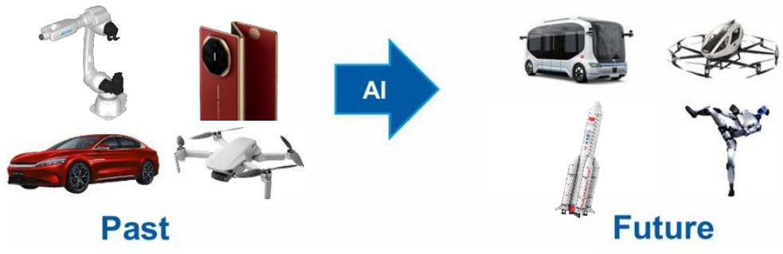

显著的成本优势对比非中国供应链

■ 中国供应链 ■ 非中国供应链

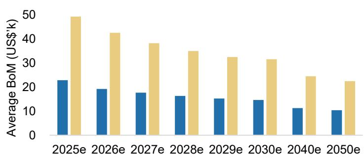

## 工业机器人更新：增长动能持续

对中国工业机器人出货量持更乐观态度，预计2026年同比增长18%

中国工业机器人销量（千台）

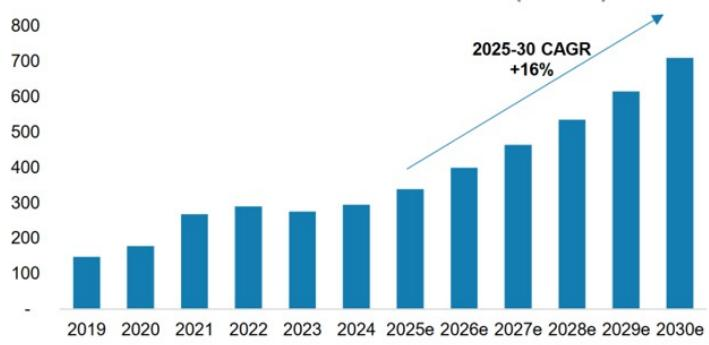

中国工业机器人产量增长保持稳健...

...对应2026年市场规模约110亿美元，2030年约170亿美元

中国工业机器人市场规模（十亿美元）

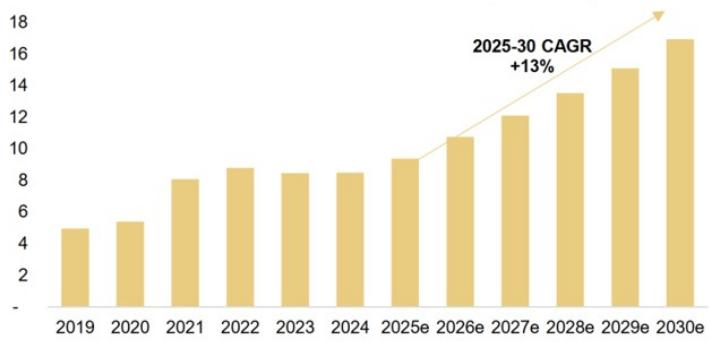

年初至今工业机器人产量

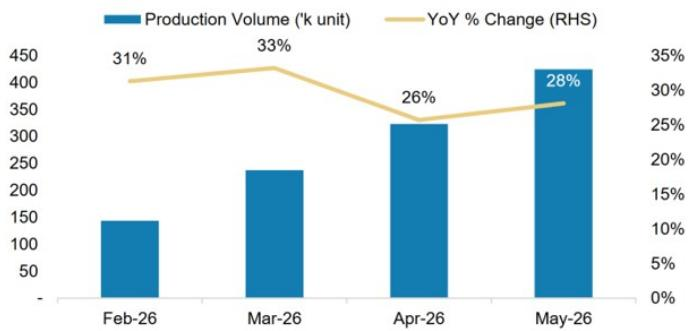

...5月出口加速

年初至今工业机器人出口

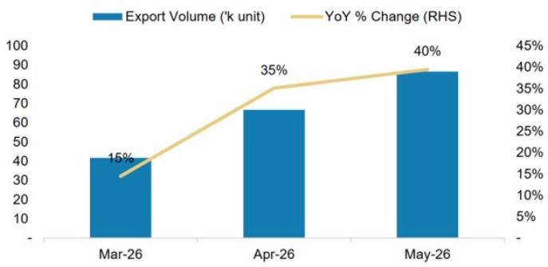

## 工业机器人更新：增长动能持续

2026年一季度机器人出货量增长由电池、电子、汽车零部件等领域支撑

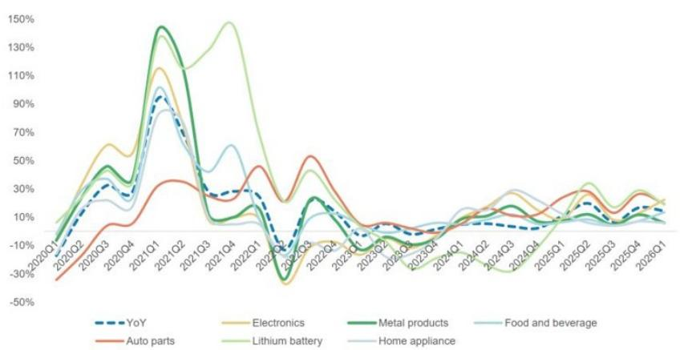

2026年一季度，工业机器人出货量同比增长14%，按产品分类，SCARA和协作机器人表现突出，分别增长23%和34%

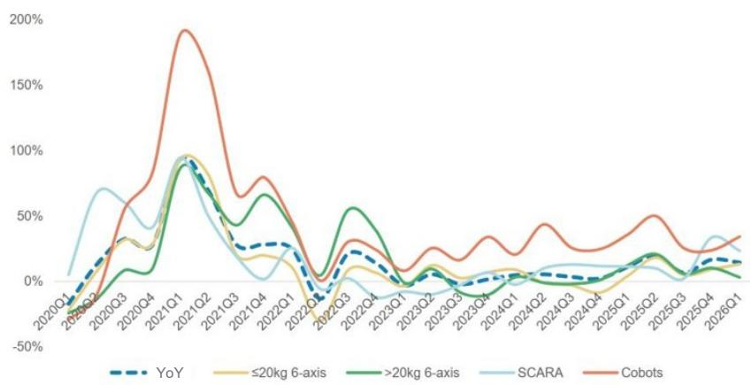

中国工业机器人市场份额动态——2026年一季度国产化率达56%

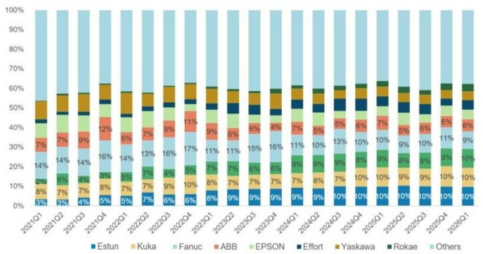

## AIDC设备——全球AI资本开支超级周期持续

自2025年以来，全球AI资本开支保持强劲势头，预计这一趋势将持续至2026年。

- 全球前14家上市云服务提供商2026年云资本开支预计约9160亿美元，同比增长92%。
- 中国方面，前六大公司年度资本开支预计在2026/27年分别超过6000亿/7000亿元人民币。
- AI芯片出货前景乐观，包括AI GPU及ASIC。

快速的产品迭代推动设备升级加速，产生新的设备需求。例如，在Rubin机架物料清单中，PCB内容价值增幅最大（+233%），并引入新模块。

我们认为，高价值AI相关收入占比的提升有望在中期内改善这些设备公司的利润率，支持净资产回报表现改善。

全球云资本开支追踪显示2026年同比增长92%至9160亿美元，2027年预计增长14%

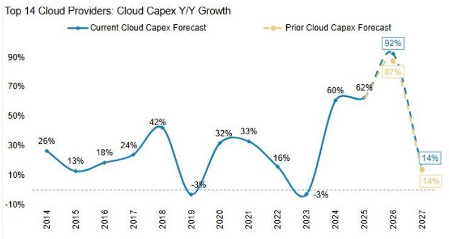

中国主要云厂商AI资本开支保持稳健，2026年同比增长约40%，2027年约20%

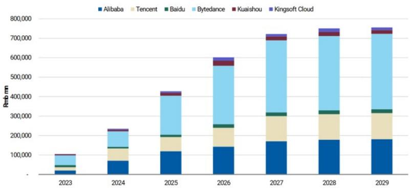

## 基础设施建设、工程机械及重卡

### 中国年初至今基础设施固定资产投资

固定资产投资保持稳定

5月固定资产投资同比变化

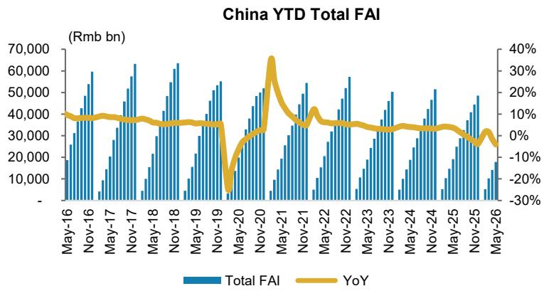

主要影响因素为基础设施推进节奏

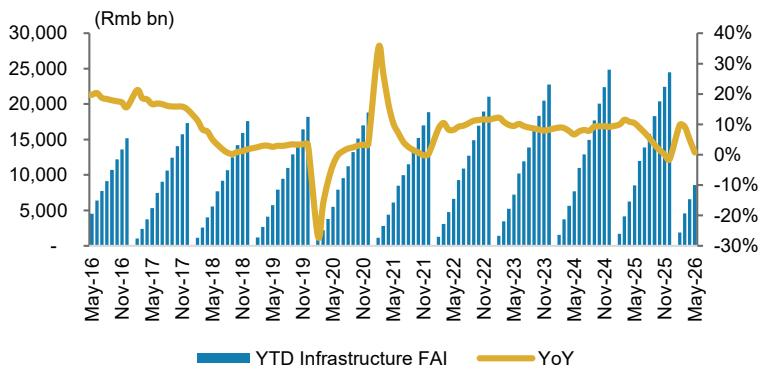

房地产领域情况

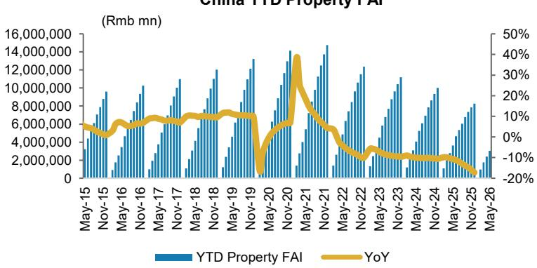

制造业资本开支情况

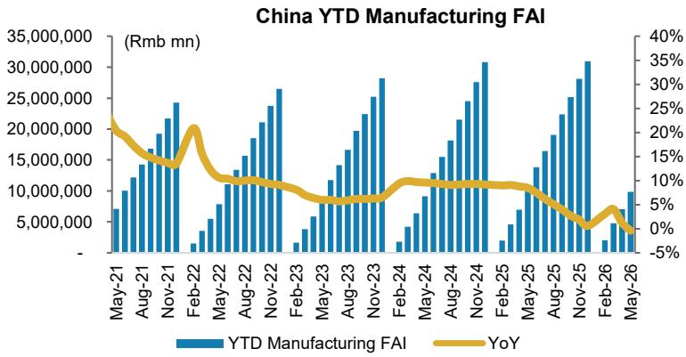

## 中国工程机械更新

6月中国挖掘机销量同比增长35%

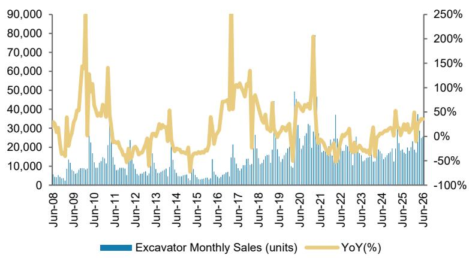

6月轮式装载机销量增长25%

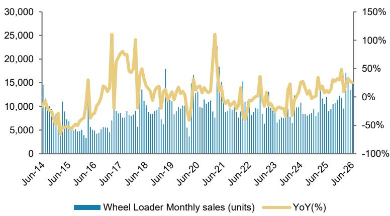

5月起重机销量同比增长19%

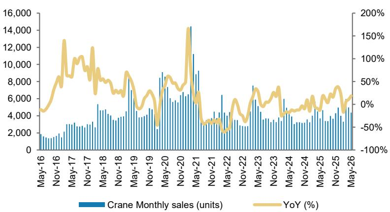

5月高空作业平台销量增长30%

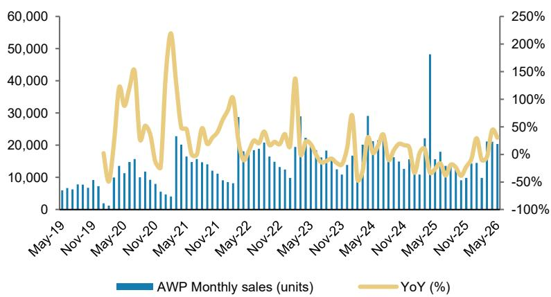

中国工程机械利用率

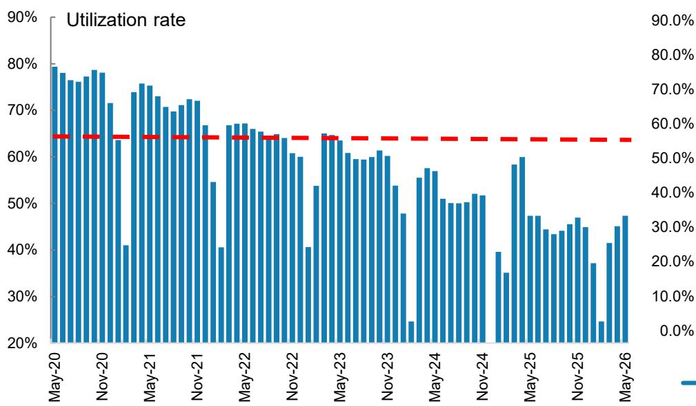

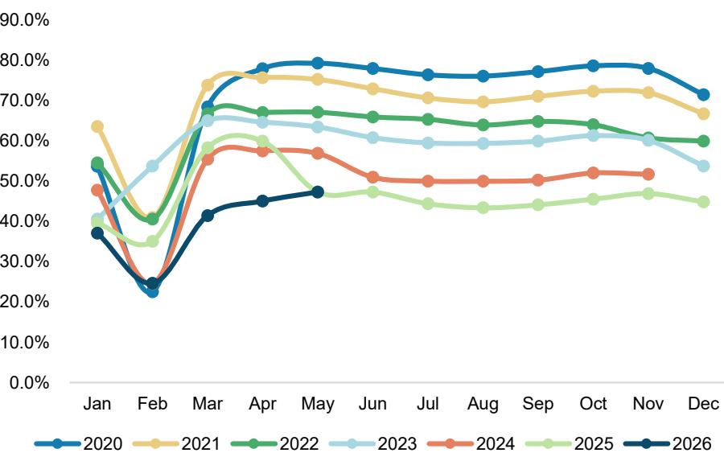

## 工程机械：上行周期展望

上调2026年中国挖掘机预测至同比增长21%（此前为+15%）。

近期强劲的行业数据印证了国内上行周期的判断，支撑因素包括：

1) 上一轮高峰期（2020-21年）设备的更新换代需求，典型生命周期6-8年；

2) 基础设施投资稳健，预计2026年基础设施投资同比增长8%（对比2025年-1.5%），新规划的政策性金融工具8000亿元、2025年下半年结转的5000亿元（因合格项目不足大部分未使用），以及"十五五"规划下国家重点战略项目的前置启动，有助于缓解项目储备瓶颈；

3) 近期提价（包括三一重工、中联重科、徐工机械、山推股份）有望支撑2026年下半年利润率环比改善。

中国OEM全球市场份额持续提升。海外增长受发达市场需求复苏、新兴市场持续城市化、大宗商品价格支撑下的强劲采矿需求以及中国OEM市场份额持续增长等因素推动。

中国挖掘机年销量（千台）

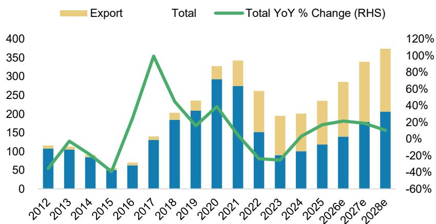

中国挖掘机月销量（台）

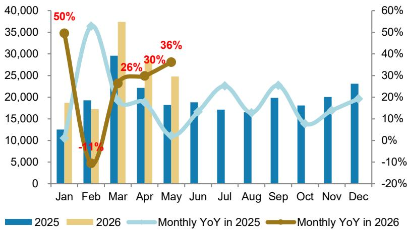

## 重卡——出口是亮点

上调2026-27年重卡销量预测至127万辆和130万辆，同比分别增长11%和2%。

2026年上半年重卡市场超出预期，达65.5万辆，同比增长约21%，支撑因素包括：

1. 国内补贴政策持续刺激，
2. 电动重卡渗透率提升（上半年电动重卡同比增长超60%，渗透率约30%），
3. 出口强劲（上半年同比增长约25%）。

展望2026年下半年，预计整体增速将因高基数而放缓，但相对数量仍将维持高位。

预计2027年销量温和增长，主要由出口支撑。

中国重卡出口按地区划分——年初至今东南亚和非洲动能强劲

重卡出口按地区划分

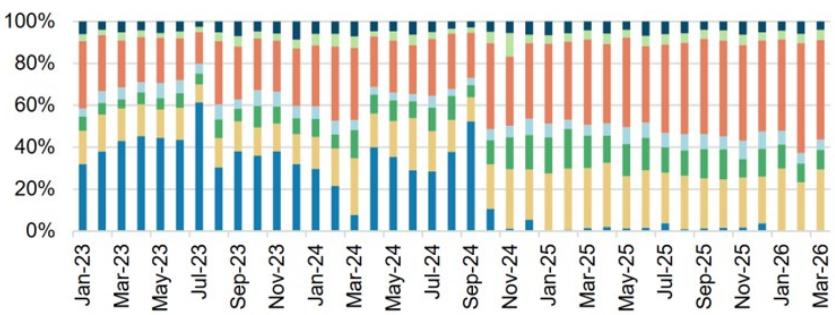

■ 俄罗斯 ■ 东南亚 ■ 西亚 ■ 中亚 ■ 非洲 ■ 南美 ■ 其他

重卡预测模型——预计2026年同比增长约11%至约127万辆——国内销量增长7%，出口加速至22%

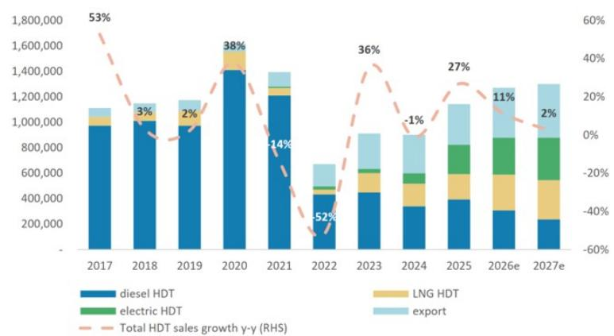

2026年重卡出口增长加速意味着海外销量占比提升

重卡：海外销量占总销量比例

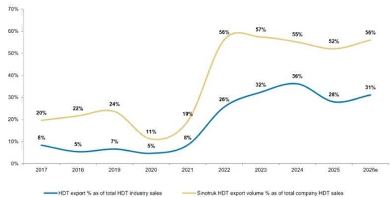

LNG重卡渗透率预计2026年升至28%

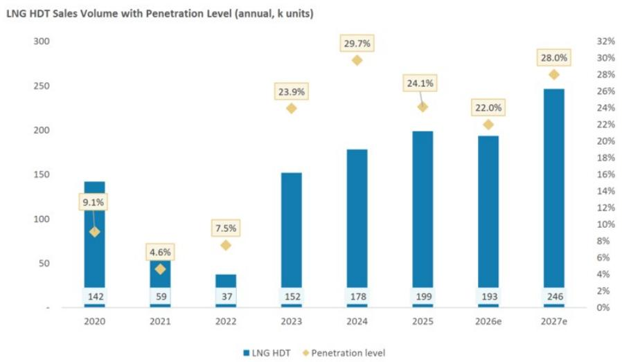

电动重卡渗透率预计2026年升至33%

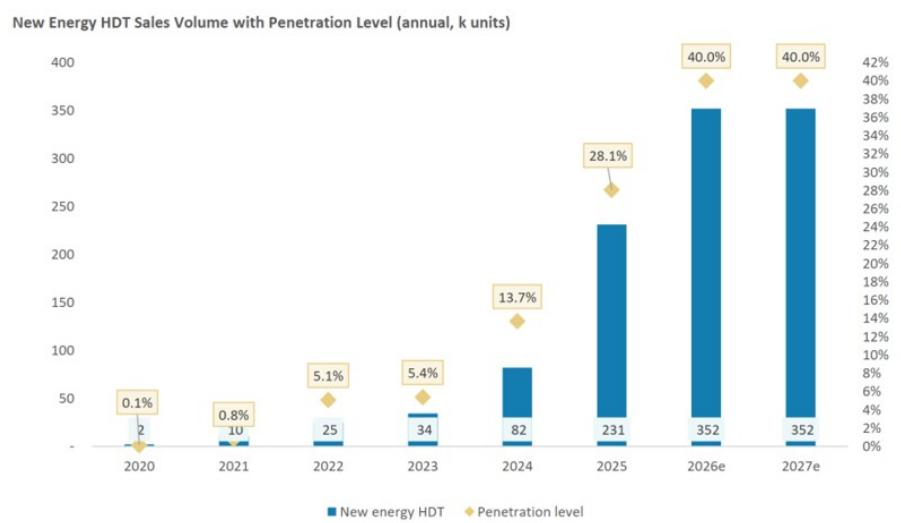

## 新能源设备

### 锂电池设备——结构性需求有望超越短期关注

近期对电池设备需求的关注有所增加，主要源于下游需求（电动汽车和储能）及电池制造产能扩张计划的变化。然而，我们仍持建设性看法。

我们认为，多重结构性机遇有望超越短期因素。根据国家统计局数据，2026年前5个月锂电池制造投资同比增长25%。展望2026年下半年，三个结构性需求驱动因素同时汇聚，有望支撑电池设备供应商的新订单承接：

1. 更新换代周期：自2020年以来的大规模产能建设正接近五年使用寿命终点，形成可见的基线需求。
2. 钠离子电池商业化：从目前的试点阶段扩展至2030年全球市场830GWh、2035年2.4TWh。
3. 全球储能建设：2030年全球储能市场规模预计达5TWh，对比当前约1TWh，复合增速约46%。

中国电池产能预计2025-30年复合增速约14%

全球有效电池产能（GWh）

...受储能需求支撑，全球年新增储能预计2025-30年复合增速约30%

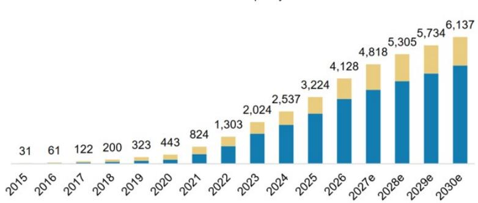

全球储能年新增量（GWh）

中国 美国 欧盟 澳大利亚 东盟 中东 其他

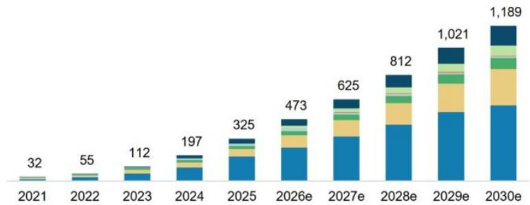
