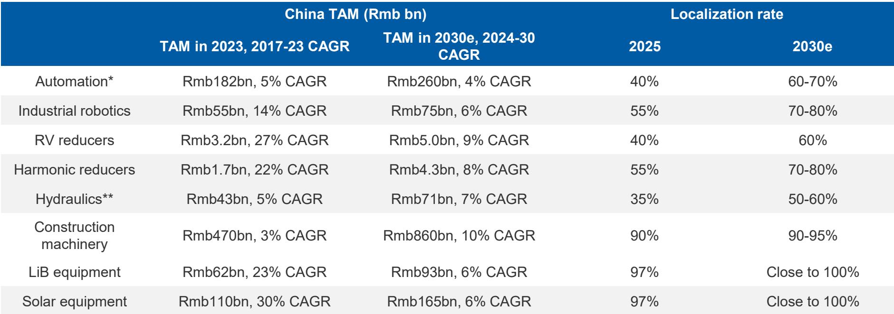
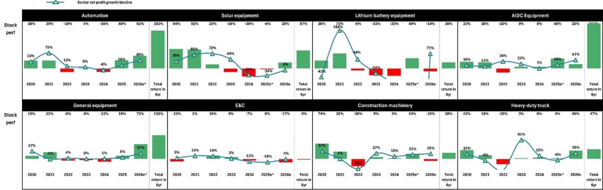

# MS：人形机器人2026年中国出货5万台，供应链比整机更受益

资本开支的扩张周期还没有结束，但这轮增长的结构已经和2025年完全不同。MS在最新发布的中国工业2026年中展望中给出了一个清晰判断：整体资本开支在下半年仍将保持强劲，但1H26各子板块报价表现已经出现明显分化，接下来选股不仅要看订单和收入动能，还要叠加盈利质量、催化剂和估值。

这份报告覆盖了自动化、机器人、AI数据中心设备、工程机械等多个领域。核心信号是：AI驱动的资本开支仍是主线，但“卖铲子”的公司比直接做AI应用的公司更具确定性；人形机器人正从展示阶段进入小批量商业化，2026年中国出货量预计达到5万台；而传统基建承包商、铁路设备和光伏制造设备，则被列为最不偏好的方向。

**报告的真正判断不是“资本开支还在涨”，而是“这轮资本开支的质量和分布已经变了”。** 理解这一点，比押注某个子板块的增速更重要。

## 1. AI资本开支超级周期仍在加速，但收益正在向“铲子”集中

MS对美国前14家云服务商的资本开支追踪显示，2026年全球云资本开支预计达到9160亿美元，同比增长92%。中国前6家科技公司的年度资本开支预计在2026/27年分别超过6000亿和7000亿元人民币。

这些数字本身已经很大，但报告关注的不是总量，而是结构。随着AI芯片快速迭代（从GB200到Rubin架构），设备升级周期被大幅压缩，这直接拉动了PCB、连接器、冷却系统等“卖铲子”环节的需求。以Rubin机架为例，其PCB单机价值量比GB300增长了233%。

> **KC评论：** 报告没有直接说，但隐含的逻辑是：AI硬件迭代越快，设备公司受益越确定。真正的不确定性在于——当芯片迭代速度节奏变化后，这批公司的增长故事还能讲多久？这是每个参与者都需要追问的问题。

## 2. 人形机器人：2026年是中国商业化元年，但供应链才是长期红利

报告将2026年定义为人形机器人“小规模商业化”的起点，预计全年出货量5万台，到2030年增长9倍。从WAIC 2024的静态展示，到2025年春晚宇树H1的公开亮相，再到2026年进入工厂试点部署，这条路径正在变清晰。

但MS真正强调的，不是机器人整机公司，而是供应链。报告估算，到2050年全球人形机器人保有量将达到10亿台，对应7.5万亿美元的市场规模。在这个假设下，减速器、轴承、电机、传感器等零部件的市场规模将增长40倍到370倍不等。

**中国供应链的优势在于成本。** 报告中AlphaWise调查显示，中国供应链在减速器、电机、传感器等环节的成本比非中国供应链低30%-50%。这意味着，无论最终哪家整机公司胜出，中国零部件供应商都将是确定性受益方。

## 3. 自动化周期在2026-27年明确上行，但OEM和项目市场分化加剧

自动化市场正在经历一个清晰的上升周期。MS预计2026年自动化市场同比增长约5%，2027年动能延续。驱动因素包括：AI和物理AI应用的持续扩张（智能机器人、PCB设备、AI穿戴）、设备更新需求，以及中国企业出口竞争力的提升。

需要留意的是分化。OEM（原始设备制造商）市场受益于AI和出口，增速明显更快；而项目市场受到下游行业产能过剩的影响，表现相对仍在调整。在具体产品上，伺服系统和工业机器人增速领先，小型PLC的国产化率已经达到36%，但中大型PLC的国产化率仍然很低。

**报告没有完全回答的问题：** 国产化率提升到60%-70%之后，下一步增长来自哪里？是向高端PLC和大型工业软件突破，还是只能靠海外市场扩张？这可能是决定自动化公司长期估值天花板的关键。

## 4. 工程机械：出口是相对少见亮点，内需仍在筑底

报告数据显示，中国6月挖掘机销量同比增长35%，看似强劲，但需要拆开看。国内固定研究（FAI）5月同比下滑10.7%，基建和地产研究均未见明显改善。工程机械的增长几乎完全来自出口。

MS在工程机械领域重点提到的是三一重工、中联重科、恒立液压和浙江鼎力，这些公司的共同特征是海外收入占比持续提升。相对而言，传统基建承包商（中国中铁、中国建筑）和铁路设备（中国中车）仍被列为最不偏好的方向。

> **KC评论：** 工程机械的出口故事听起来顺理成章，但需要警惕的是：当全球主要市场（北美、欧洲）开始强化本土制造和供应链安全，中国工程机械的出口增速能否持续？报告中提到的“供应链多元化”趋势，对TAM（总可寻址市场）的影响，是一个值得持续跟踪的变量。

---

**报告尚未完全回答的关键问题：**

第一，当AI资本开支增速从92%回落到正常水平时，设备公司的估值如何调整？目前大多数工业子板块的市盈率已经高于过去五年均值，市场是否已经过度定价了AI带来的增量？

第二，人形机器人从5万台到50万台，中间最大的瓶颈是什么？是成本、技术、还是应用场景？报告给出了乐观的长期预测，但中期路径仍有大量不确定性。

第三，国产化率提升到60%以后，下一步是向高端突破，还是走向海外？这两个路径对应的竞争格局和利润率完全不同。

对于产业决策者和研究者来说，这份报告的价值不在于提供了多少研究交流，而在于给出了一个清晰的观察框架：**在资本开支扩张周期中，谁在真正受益，谁只是“被周期带动的跟随者”。** 区分这两者，比判断周期何时结束更重要。

For informational purposes only. Portions may be generated,translated,summarized,or edited with AI assistance based on source materials and may contain omissions or errors. Please verify independently. This is not investment,legal,tax,accounting,or other professional advice.

For informational purposes only. Portions may be generated,translated,summarized,or edited with AI assistance based on source materials and may contain omissions or errors. Please verify independently. This is not investment,legal,tax,accounting,or other professional advice.

