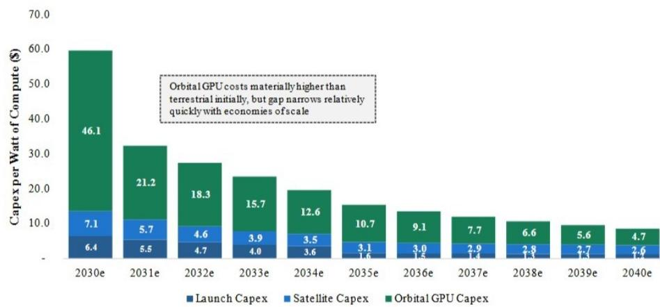
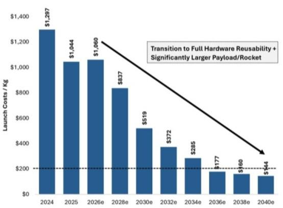
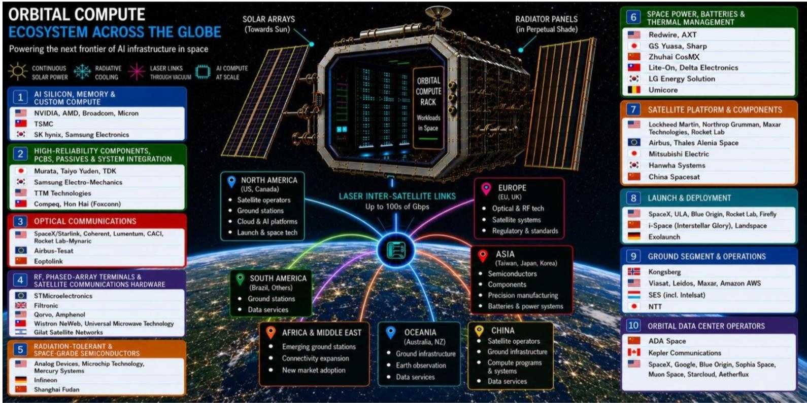
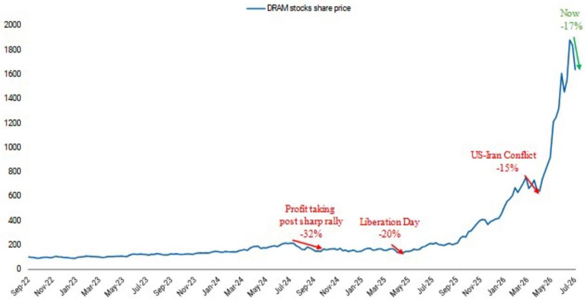
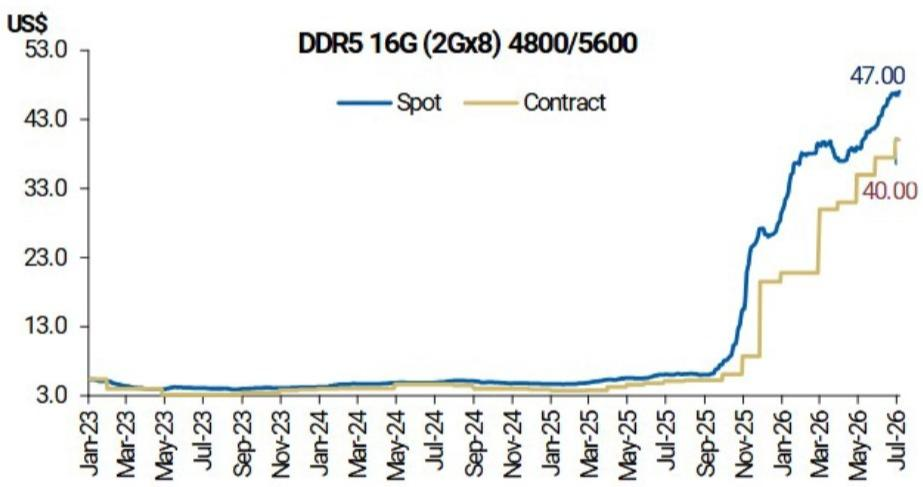
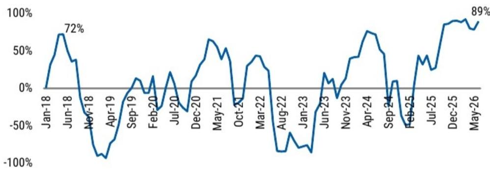
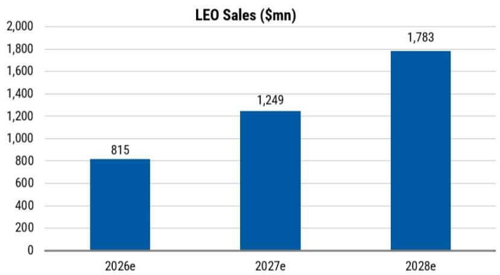
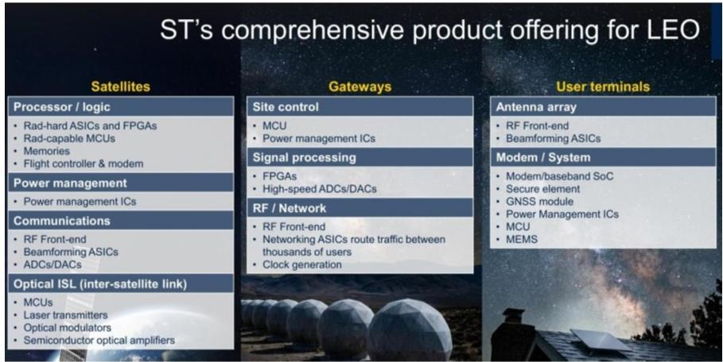
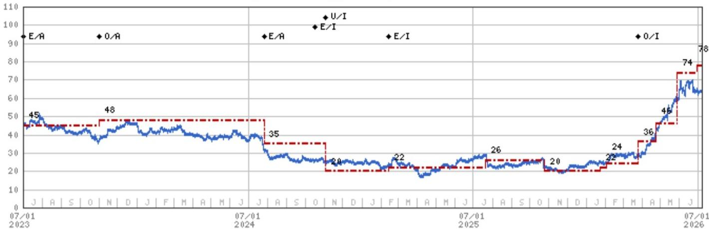

# 全球科技网络研讨会：太空技术、轨道计算机遇与存储技术

## 技术 - 欧洲半导体 | 欧洲

# 全球科技网络研讨会：太空技术、轨道计算机遇与存储技术

欢迎加入Shawn Kim、Adam Jonas、William Tackett和Amelia Scicluna，共同探讨SpaceX、轨道计算机遇、存储技术及相关主题。

Shawn Kim  
股票研究分析师  
Shawn.Kim@morganstanley.com +44 20 7677-1018

MS & CO. LLC  
Adam Jonas, CFA  
股票研究分析师  
Adam.Jonas@morganstanley.com +1 212 761-1726

William Tackett, CFA  
研究助理  
William.Tackett@morganstanley.com +1 212 761-6028

Amelia M Scicluna  
研究助理  
Amelia.Scicluna@morganstanley.com +44 20 7425-6694

## 技术 - 欧洲半导体

欧洲行业观点：中性

## 全球科技网络研讨会：太空技术、轨道计算机遇与存储技术

MS Europe

MS & Co. International plc + Shawn Kim  
股票研究分析师  
Shawn.Kim@morganstanley.com  
+44 20 7677-1018

MS & Co. LLC  
Adam Jonas  
股票研究分析师  
Adam.Jonas@morganstanley.com  
+1 212 761 1726

William Tackett  
研究助理  
William.Tackett@morganstanley.com  
+1 212 761-6028

MS & Co. International plc + Amelia Scicluna 研究助理 Amelia.Scicluna@morganstanley.com +44 20 7425-2803

分析师认证及其他重要披露信息，请参阅本报告末尾的披露部分。

MS

Shawn Kim

亚洲及欧洲科技研究主管

## 轨道计算——人工智能基础设施的新前沿

## 第一阶段 近期

## 轨道边缘计算

\- 在轨人工智能处理图像、传感器数据和推理工作负载。

\- 卫星仅将有价值的输出结果传回地球。

\- 初期需求：地球观测、国防、海事、灾害监测及自主航天器。

现实的第一步：太空原生边缘人工智能，而非在轨的1GW人工智能训练园区。

来源：MS

## 第二阶段 中期

## 轨道云/分布式计算

\- 多颗计算卫星通过光学星间链路实现组网。

\- 工作负载可在变化的低地球轨道链路间进行调度、卸载和路由。

\- 需要先进的编排软件和动态资源管理。

关键挑战：低地球轨道卫星移动速度快，资源有限，链路持续变化。

## 第三阶段 长期展望

## 天基人工智能基础设施

\- 卫星搭载人工智能加速器、存储、太阳能阵列和散热器。

\- 编队飞行卫星通过高速光学链路通信。

\- 在太空构建虚拟数据中心。

• 大规模可扩展的分布式人工智能层，服务于太空和地面工作负载。

最终状态论点：一个关于低成本发射、人工智能能源稀缺性和太空激光组网的选择权。

轨道计算——潜在优势与关键挑战

<table><tr><td>潜在优势</td><td>理由</td><td>关键挑战</td><td>理由</td></tr><tr><td>能源</td><td>晨昏太阳同步轨道近乎持续的太阳照射；无地面电网限制。</td><td>辐射</td><td>需要抗辐射芯片、纠错码和屏蔽。</td></tr><tr><td>热管理</td><td>无需空气或水冷，但热量仍需通过热管和散热器排出。</td><td>维修/更新</td><td>在轨维护困难；人工智能硬件更新周期短。</td></tr><tr><td>延迟</td><td>低地球轨道可实现低延迟连接（约10–30毫秒往返时间）。</td><td>光学组网</td><td>人工智能规模的分布式计算需要远高于当前卫星网络的星间带宽。</td></tr><tr><td>可扩展性</td><td>可重复使用运载火箭可随时间推移降低部署成本。</td><td>轨道碎片/安全</td><td>碰撞规避、网络安全和物理防护成为核心运营要求。</td></tr></table>

## 轨道计算经济学：每瓦成本趋于持平

轨道计算每瓦资本支出预计将从2030年的约60美元/瓦下降至2040年的9美元/瓦，驱动因素包括更便宜的可重复使用发射、更低的卫星硬件成本以及改进的有效载荷经济学。

轨道计算每瓦资本支出  

SpaceX发射成本/公斤随时间变化预测  

  
来源：公司数据，NASA，MS估计

运作方式——轨道计算堆栈

<table><tr><td>层级</td><td>功能</td><td>关键技术要求</td></tr><tr><td>人工智能计算有效载荷</td><td>在轨运行推理、图像处理、传感器分析及选定的人工智能工作负载</td><td>人工智能加速器、中央处理器、高带宽内存、纠错、容错软件</td></tr><tr><td>服务器/有效载荷模块</td><td>将芯片、板卡、存储和电源集成到可承受发射的计算单元中</td><td>加固型人工智能托盘、抗振性、远程管理、模块化更换</td></tr><tr><td>电源系统</td><td>将太阳能转换为稳定的计算电力</td><td>太阳能阵列、电池、高效直流转换、电源管理集成电路</td></tr><tr><td>热管理系统</td><td>将热量从芯片传导至散热器并排入太空</td><td>冷板、热管、导热界面材料、散热器涂层、热传感器</td></tr><tr><td>轨道与编队</td><td>决定太阳照射、延迟、散热器几何形状及卫星间距</td><td>晨昏太阳同步轨道、近距离编队、碰撞规避、自主控制</td></tr><tr><td>光学网络</td><td>连接卫星之间以及卫星与地面/云系统</td><td>激光终端、相干光学、光束控制、光学数字信号处理器、密集波分复用</td></tr><tr><td>存储与编排软件</td><td>缓冲数据、调度工作负载、路由流量及处理故障</td><td>固态硬盘、控制器、任务调度、遥测、网络安全、自主运行</td></tr></table>

## 映射轨道计算技术供应链

## 我们关注STMicroelectronics和Infineon作为该堆栈中的关键欧洲推动者。

  
来源：公司数据，MS

## 存储：变化率见顶，但非周期终点

自生成式人工智能（2022年11月）以来经历三次周期性调整；我们将当前约17%的回调置于人工智能资本支出结构性扩张的背景中看待。

DRAM与NAND价格仍在上涨——但变化率正见顶

同比价格涨幅依然强劲，但随着变化率在2026年第四季度见顶，增速将放缓。

## 盈利修正广度接近历史高位

DRAM盈利修正广度已达到约89%，接近此前峰值——这可能预示着随着变化率减弱，存储板块可能出现相对表现偏弱的情况。

## 我们持谨慎态度的领域

\- 存储动能可能减弱，因每股盈利修正广度处于历史高位，且超大规模企业面临一定压力。

\- 企业盈利——而非存储公司评论——将主导后续公司报价走势。

## 公司偏好

\- 偏好DRAM和传统存储而非NAND——资金正在投入且瓶颈正在显现的领域。

\- 相对不偏好：存储模组制造商。

MS

Adam Jonas

全球具身人工智能与机器人策略师

MS

William Tackett

全球具身人工智能与机器人研究助理

MS

欧洲半导体研究助理

Amelia Scicluna

## STMicroelectronics：欧洲半导体太空领域受益者 目标价78欧元（较2026年7月6日收盘价有23%空间）

我们预计低地球轨道销售额在2026至2028财年将以48%的年复合增长率增长，主要由用户终端内容驱动。

## ST针对低地球轨道的全面产品组合

## 估值方法与风险

## STMicroelectronics NV (STMPA.PA)

我们基于分部加总框架对STMicroelectronics估值为每股78欧元。我们将核心业务基于2028财年预期每股盈利2.11欧元按18倍市盈率估值，光学和低地球轨道业务基于2028财年预期每股盈利1.34欧元按36倍市盈率估值，以反映周期性业务和结构性业务的不同增长轨迹。使用10%加权平均资本成本折现，得出78欧元目标价。

## 上行风险

■ 碳化硅的市场采用

■ 汽车和工业领域的设计中标增长

■ 2026年下半年/2027财年光学业务增长超预期

■ 低地球轨道销售额显著超过2026/2028财年累计30亿美元

## 下行风险

■ 全球宏观环境持续变化，导致汽车和工业OEM产量偏弱

■ 库存渠道调整导致微控制器定价偏弱

■ DRAM短缺影响汽车销售

■ 关键智能手机中传感器内容的设计丢失/减少

## 披露部分

MS中的信息和意见由MS Europe S.E.（受德国联邦金融监管局监管）和/或MS & Co. International plc（由审慎监管局授权，受金融行为监管局和审慎监管局监管）准备或分发。MS & Co. International plc在英国分发其自身准备或由其任何关联公司准备的研究报告，仅面向以下人士：(i) 符合《2000年金融服务与市场法（金融促进）令2005》（经修订，"该法令"）第19(5)条规定的专业读者；(ii) 符合该法令第49(2)(a)至(d)条规定的高净值实体；(iii) 可合法接收投资活动邀请或诱导（定义见经修订的《2000年金融服务与市场法》第21条）的人士。在本披露部分中，MS包括RMB MS Proprietary Limited、MS Europe S.E.、MS & Co International plc及其关联公司。

有关本报告涉及公司的重要披露、股价图表和股权评级历史，请访问MS披露网站 www.morganstanley.com/eqr/disclosures/webapp/generalresearch，或联系您的投资代表或MS，地址：1585 Broadway, (Attention: Research Management), New York, NY, 10036 USA。

有关本研究报告引用的任何推荐、评级或目标价的估值方法和风险，请联系客户支持团队：美国/加拿大 +1 800 303-2495；香港 +852 2848-5999；拉丁美洲 +1 718 754-5444（美国）；伦敦 +44 (0)20-7425-8169；新加坡 +65 6834-6860；悉尼 +61 (0)2-9770-1505；东京 +81 (0)3-6836-9000。或者，您可以联系您的投资代表或MS，地址：1585 Broadway, (Attention: Research Management), New York, NY 10036 USA。

## 分析师认证

以下分析师特此证明，他们对本报告讨论的公司及其证券的观点准确表达，且他们未曾也不会因表达具体推荐或观点而直接或间接获得补偿：Adam Jonas, CFA; Shawn Kim; Amelia M Scicluna; William Tackett, CFA。

## 全球研究冲突管理政策

MS已根据我们的冲突管理政策发布，该政策可在 www.morganstanley.com/institutional/research/conflictpolicies 获取。该政策的葡萄牙语版本可在 www.morganstanley.com.br 找到。

## 关于标的公司的重要监管披露

截至2026年5月29日，MS实益拥有MS所覆盖的以下公司一类普通股证券的1%或以上：Aixtron SE, ASML Holding NV, BE Semiconductor Industries NV, Infineon Technologies AG, Soitec SA, STMicroelectronics NV。

在过去12个月内，MS担任了Aixtron SE, STMicroelectronics NV证券公开发行（或144A发行）的主承销商或联席主承销商。

在过去12个月内，MS因向Aixtron SE, ASM International NV, BE Semiconductor Industries NV, STMicroelectronics NV提供投资银行服务而获得补偿。

在未来3个月内，MS预计将寻求或打算寻求向Aixtron SE, ASM International NV, ASML Holding NV, BE Semiconductor Industries NV, Infineon Technologies AG, Nordic Semiconductor ASA, Soitec SA, STMicroelectronics NV, VAT Group AG提供投资银行服务的补偿。

在过去12个月内，MS因向ASM International NV, BE Semiconductor Industries NV, Infineon Technologies AG提供投资银行服务以外的产品和服务而获得补偿。

在过去12个月内，MS已向或正在向以下公司提供投资银行服务，或与以下公司存在投资银行客户关系：Aixtron SE, ASM International NV, ASML Holding NV, BE Semiconductor Industries NV, Infineon Technologies AG, Nordic Semiconductor ASA, Soitec SA, STMicroelectronics NV, VAT Group AG。

在过去12个月内，MS已向或正在向以下公司提供非投资银行、证券相关服务，和/或过去已签订协议提供服务或与以下公司存在客户关系：Aixtron SE, ASM International NV, BE Semiconductor Industries NV, Infineon Technologies AG。

主要负责编制MS的股权研究分析师或策略师的薪酬基于多种因素，包括研究质量、读者客户反馈、选股能力、竞争因素、公司收入及整体投资银行收入。股权研究分析师或策略师的薪酬不与MS执行的投行或资本市场交易或特定交易台的盈利能力或收入挂钩。

MS及其关联公司从事与MS所覆盖公司/工具相关的业务，包括做市、提供流动性、基金管理、商业银行、信贷扩展、投资服务和投资银行。MS以主承销商身份向客户买卖MS所覆盖公司的证券/工具。MS可能持有本报告讨论的公司债务或工具的头寸。MS作为主承销商交易或可能交易作为债务研究报告主题的债务证券（或相关衍生品）。上述某些披露也是为了遵守非美国司法管辖区的适用法规。

## 股票评级

MS使用相对评级体系，包括超配、等配、未评级或低配（定义见下文）。MS不对我们覆盖的股票分配买入、持有或报告评级。超配、等配、未评级和低配不等同于买入、持有和卖出。读者应仔细阅读MS中使用的所有评级的定义。此外，由于MS包含分析师观点的更完整信息，读者应仔细阅读完整的MS，而不应仅从评级推断内容。在任何情况下，评级（或研究）不应被用作或依赖为研究交流。读者买卖股票的决定应取决于个人情况（如读者现有持仓）和其他考虑因素。

## 全球股票评级分布

（截至2026年6月30日）

下述股票评级适用于MS的基础股权研究，不适用于公司生产的债务研究。

仅为披露目的（根据FINRA要求），我们在超配、等配、未评级和低配评级旁包含买入、持有和卖出的类别标题。MS不对我们覆盖的股票分配买入、持有或报告评级。超配、等配、未评级和低配不等同于买入、持有和卖出，而是代表推荐的相对权重（见定义）。为满足监管要求，我们将超配（我们最积极的股票评级）对应买入推荐；我们将等配和未评级对应持有，低配对应卖出推荐。

<table><tr><td colspan="3">覆盖范围</td><td colspan="3">投资银行客户</td><td colspan="2">其他重要投资服务客户</td></tr><tr><td>股票评级类别</td><td>数量</td><td>占比</td><td>数量</td><td>占投资银行客户总数比例</td><td>占评级类别比例</td><td>数量</td><td>占其他重要投资服务客户总数比例</td></tr><tr><td>超配/买入</td><td>1544</td><td>42%</td><td>453</td><td>49%</td><td>29%</td><td>757</td><td>44%</td></tr><tr><td>等配/持有</td><td>1577</td><td>43%</td><td>390</td><td>42%</td><td>25%</td><td>769</td><td>44%</td></tr><tr><td>未评级/持有</td><td>3</td><td>0%</td><td>1</td><td>0%</td><td>33%</td><td>1</td><td>0%</td></tr><tr><td>低配/卖出</td><td>544</td><td>15%</td><td>89</td><td>10%</td><td>16%</td><td>204</td><td>12%</td></tr><tr><td>总计</td><td>3,668</td><td></td><td>933</td><td></td><td></td><td>1731</td><td></td></tr></table>

数据包括当前已分配评级的普通股和美国存托凭证。投资银行客户是MS在过去12个月内收到投资银行补偿的公司。由于四舍五入，"占总计比例"列中的百分比可能不完全等于100%。

## 分析师股票评级

超配（O）：预计该股票的总回报在风险调整基础上，在未来12-18个月内将超过分析师行业（或行业团队）覆盖范围的平均总回报。

等配（E）：预计该股票的总回报在风险调整基础上，在未来12-18个月内将与分析师行业（或行业团队）覆盖范围的平均总回报保持一致。

未评级（NR）：目前分析师对该股票相对于分析师行业（或行业团队）覆盖范围平均总回报的总回报没有足够的信心。

低配（U）：预计该股票的总回报在风险调整基础上，在未来12-18个月内将低于分析师行业（或行业团队）覆盖范围的平均总回报。

除非另有说明，MS中包含的目标价的时间范围为12至18个月。

## 分析师行业观点

正面（A）：分析师预计其行业覆盖范围在未来12-18个月的表现相对于相关广泛市场基准（如下所示）将具有吸引力。

中性（I）：分析师预计其行业覆盖范围在未来12-18个月的表现将与相关广泛市场基准（如下所示）保持一致。谨慎（C）：分析师对其行业覆盖范围在未来12-18个月的表现相对于相关广泛市场基准（如下所示）持谨慎态度。各区域基准如下：北美 - 标普500指数；拉丁美洲 - 相关MSCI国家指数或MSCI拉丁美洲指数；欧洲 - MSCI欧洲指数；日本 - TOPIX指数；亚洲 - 相关MSCI国家指数或MSCI次区域指数或MSCI AC亚太（除日本）指数。

## 股票价格、目标价和评级历史（见评级定义）

STMicroelectronics NV (STMPA.PA) - 截至2026年7月7日 GMT，以欧元计价
行业：技术 - 欧洲半导体  

股票评级历史：2021年7月1日 : 超配/中性; 2021年12月8日 : 等配/中性; 2022年2月9日 : 未评级/中性; 2022年11月1日 : 未评级/未评级; 2022年11月7日 : 等配/正面; 2023年11月1日 : 超配/正面; 2024年7月26日 : 等配/正面; 2024年10月17日 : 等配/中性; 2024年11月3日 : 低配/中性; 2025年2月13日 : 等配/中性; 2026年3月26日 : 超配/中性

目标价历史：2021年4月29日 : 39; 2021年8月6日 : 40; 2021年10月28日 : 43.5; 2021年12月8日 : 44.5; 2022年1月27日 : 46; 2022年2月9日 : 未评级; 2022年11月7日 : 36;

2023年1月30日 : 45; 2023年11月1日 : 48; 2024年7月26日 : 35; 2024年11月3日 : 20; 2025年2月13日 : 22; 2025年7月21日 : 26; 2025年10月24日 : 20; 2026年1月23日 : 22; 2026年2月2日 : 24;
2026年3月26日 : 36; 2026年4月24日 : 46; 2026年5月28日 : 74; 2026年6月30日 : 78

来源：MS 日期格式：月/日/年 目标价 = 未分配目标价（未评级）

股票价格（当前分析师未覆盖）— 股票价格（当前分析师覆盖）

股票和行业评级（缩写如下）显示为 ♦ 股票评级/行业观点

股票评级：超配（O）等配（E）低配（U）未评级（NR）无可用评级（NA）

行业观点：正面（A）中性（I）谨慎（C）无评级（NR）

自2014年1月13日起，MS亚太地区覆盖的股票将相对于分析师行业（或行业团队）覆盖范围进行评级。

自2014年1月13日起，MS亚太地区的行业观点基准如下：相关MSCI国家指数或MSCI次区域指数或MSCI AC亚太（除日本）指数。

## 关于MS Smith Barney LLC客户的重要披露

关于可能合理预期影响MS Smith Barney LLC选择第三方研究提供商或第三方研究报告标的公司的任何重大利益冲突的重要披露，可在MS财富管理披露网站 www.morganstanley.com/online/researchdisclosures 获取。关于MS的具体披露，您可参考 https://www.morganstanley.com/eqr/disclosures/webapp/generalresearch。

每份MS报告均由MS Smith Barney LLC代表审核和批准。此审核和批准由审核MS研究报告的同一人执行。这可能产生利益冲突。

## 其他重要披露

MS的政策是，当研究分析师和研究管理层认为基于发行人、行业或市场的发展可能对研究观点或意见产生重大影响时，适时更新研究报告。此外，某些研究出版物旨在定期更新（每周/每月/每季度/每年），并将按该频率定期更新，除非研究分析师和研究管理层根据当前情况确定不同的出版计划更为合适。

MS不担任市政顾问，本文所含意见或观点不旨在也不构成《多德-弗兰克华尔街改革与消费者保护法》第975条意义上的建议。

MS生产一种称为"战术性观点"的股权研究产品。关于特定股票的"战术性观点"中包含的观点可能与同一股票的研究中表达的建议或观点相反。这可能是由于不同的时间范围、方法论、市场事件或其他因素造成的。如需获取特定股票的所有研究，请联系您的销售代表或访问Matrix网站 http://www.morganstanley.com/matrix。

MS通过我们专有的研究门户Matrix向客户提供，并由MS以电子方式分发给客户。某些（但非全部）MS产品也通过第三方供应商提供给客户，或通过替代电子方式作为便利重新分发给客户。如需访问所有可用的MS，请联系您的销售代表或访问Matrix网站 http://www.morganstanley.com/matrix。

任何对MS的访问和/或使用均受MS使用条款（http://www.morganstanley.com/terms.html）的约束。通过访问和/或使用MS，您表示已阅读并同意受我们的使用条款约束。此外，您同意MS根据我们的隐私政策和全球Cookie政策（http://www.morganstanley.com/privacy_pledge.html）处理您的个人数据并使用Cookie，包括用于设置您的偏好和收集读者数据，以便我们为您提供更好、更个性化的服务和产品。要了解有关MS如何处理个人数据、我们如何使用Cookie以及如何拒绝Cookie的更多信息，请参阅我们的隐私政策和全球Cookie政策（http://www.morganstanley.com/privacy_pledge.html）。请使用提供的链接查看MS印度公司私人有限公司的条款和条件及最重要条款和条件（https://www.morganstanley.com/assets/pdfs/about-us-global-offices/india/Terms_and_conditions.pdf），并使用以下链接查看审计报告（https://ny.matrix.ms.com/eqr/research/webapp/researchdocs/MSICPL_Morgan_Stanley_Research_Audit_Report.pdf）。

如果您不同意我们的使用条款和/或不希望同意MS处理您的个人数据或使用Cookie，请勿访问我们的研究。

MS不提供量身定制的个人研究交流。MS的编制未考虑接收者的个人情况和目标。MS建议读者独立评估特定投资和策略，并鼓励读者寻求财务顾问的建议。投资或策略的适当性取决于读者的个人情况和目标。MS中讨论的证券、工具或策略可能不适合所有读者，某些读者可能没有资格购买或参与其中部分或全部。MS不是买入或卖出要约，也不是参与任何特定交易策略的买入或卖出要约的招揽。您的研究价值和收入可能因利率、汇率、违约率、提前还款率、证券/工具价格、市场指数、公司的运营或财务状况或其他因素的变化而变动。期权或其他证券/工具交易权利的行使可能存在时间限制。过往表现并不一定预示未来结果。对未来表现的估计基于可能无法实现的假设。如果提供且除非另有说明，封面上的收盘价是标的公司证券/工具主要交易所的价格。

主要负责编制MS的固定收益研究分析师、策略师或经济学家的薪酬基于多种因素，包括研究质量、准确性和价值、公司盈利能力或收入（包括固定收益交易和资本市场盈利能力或收入）、客户反馈和竞争因素。固定收益研究分析师、策略师或经济学家的薪酬不与MS执行的投行或资本市场交易或特定交易台的盈利能力或收入挂钩。

MS中的"关于标的公司的重要监管披露"部分列出了MS持有该公司一类普通股证券1%或以上的所有提及公司。对于MS中提及的所有其他公司，MS可能持有少于1%的证券/工具或证券/工具衍生品，并可能以与MS中讨论的方式不同的方式进行交易。未参与MS编制的MS员工可能持有提及公司的证券/工具或证券/工具衍生品，并可能以与MS中讨论的方式不同的方式进行交易。衍生品可能由MS或关联人士发行。

除关于MS的信息外，MS基于公开信息。MS尽一切努力使用可靠、全面的信息，但我们不保证其准确或完整。我们没有义务在MS中的意见或信息发生变化时通知您，除非我们打算停止对标的公司的股权研究覆盖。MS中提出的事实和观点未经MS其他业务领域的专业人士审查，可能不反映他们所知的信息，包括投资银行人员。

MS人员可能参与公司活动，如实地考察，并且通常被禁止接受公司支付相关费用，除非事先获得研究管理授权成员的批准。

MS可能做出与本报告中的建议或观点不一致的投资决策。

致基于台湾或交易台湾证券/工具的读者：关于在台湾交易的证券/工具的信息由MS台湾有限公司分发。此类信息仅供您参考。读者应独立评估投资风险，并对其投资决策全权负责。未经MS明确书面同意，MS不得向公共媒体分发、引用或由公共媒体使用。在台湾证券交易所推荐规则第7-1条范围内的任何非客户读者访问和/或接收MS，不得将MS提供给任何第三方（包括但不限于关联方、关联公司和任何其他第三方）或从事任何可能产生或造成利益冲突表象的与MS相关的活动。关于不在台湾交易的证券/工具的信息仅供参考，不构成推荐或招揽交易此类证券/工具。MS台湾有限公司可能不为客户执行这些证券/工具的交易。

MS未根据中国法律注册，与本报告相关的研究在中国境外进行。MS不构成在中国出售任何证券的要约或招揽购买任何证券的要约。中国读者应具有投资此类证券的相关资格，并应自行负责从相关政府机构获得所有相关批准、许可、验证和/或注册。本报告或其任何部分均不旨在也不构成中国法律定义的任何证券投资咨询或顾问服务的提供。此类信息仅供您参考。

MS在巴西由MS C.T.V.M. S.A.分发，地址：Av. Brigadeiro Faria Lima, 3600, 6th floor, São Paulo - SP, Brazil；受巴西证券委员会监管；在墨西哥由MS México, Casa de Bolsa, S.A. de C.V分发，受国家银行和证券委员会监管，地址：Paseo de los Tamarindos 90, Torre 1, Col. Bosques de las Lomas Floor 29, 05120 Mexico City；在日本由MS MUFG Securities Co., Ltd.分发，对于商品相关研究报告，由MS Capital Group Japan Co., Ltd分发；在香港由MS Asia Limited（对其内容负责）和MS Bank Asia Limited分发；在新加坡由MS Asia (Singapore) Pte. (注册号 199206298Z) 和/或MS Asia (Singapore) Securities Pte Ltd (注册号 200008434H) 分发，受新加坡金融管理局监管（对其内容承担法律责任，如有任何问题应联系），以及由MS Bank Asia Limited, Singapore Branch (注册号 T14FC0118) 分发；在澳大利亚向《澳大利亚公司法》定义的"批发客户"由MS Australia Limited A.B.N. 67 003 734 576分发，持有澳大利亚金融服务牌照号233742，对其内容负责；在澳大利亚向"批发客户"和"零售客户"由MS Wealth Management Australia Pty Ltd (A.B.N. 19 009 145 555, 持有澳大利亚金融服务牌照号240813) 分发，对其内容负责；在韩国由MS & Co International plc, Seoul Branch分发；在印度由MS India Company Private Limited分发，公司识别号 U22990MH1998PTC115305，受印度证券交易委员会监管，持有研究分析师（SEBI注册号 INH000001105）、股票经纪人（SEBI股票经纪人注册号 INZ000244438）、商人银行家（SEBI注册号 INM000011203）和国家证券存管有限公司存管参与者（SEBI注册号 IN-DP-NSDL-567-2021）牌照，注册地址：Altimus, Level 39 & 40, Pandurang Budhkar Marg, Worli, Mumbai 400018, India；电话：+91-22-61181000；合规官详情：Mr. Tejarshi Hardas, 电话：+91-22-61181000 或电邮：tejarshi.hardas@morganstanley.com；投诉官详情：Mr. Tejarshi Hardas, 电话：+91-22-61181000 或电邮：msic-compliance@morganstanley.com。MS India Company Private Limited (MSICPL) 可能使用人工智能工具提供研究服务。本文包含的所有推荐均由合格的研究分析师做出；在加拿大由MS Canada Limited分发；在德国和欧洲经济区（如需要）由MS Europe S.E.分发，由德国联邦金融监管局授权和监管，参考号149169；在美国由MS & Co. LLC分发，对其内容负责。MS & Co. International plc由审慎监管局授权，受金融行为监管局和审慎监管局监管，在英国分发其自身准备或由其任何关联公司准备的研究报告，仅面向以下人士：(i) 符合《2000年金融服务与市场法（金融促进）令2005》（经修订，"该法令"）第19(5)条规定的专业读者；(ii) 符合该法令第49(2)(a)至(d)条规定的高净值实体；(iii) 可合法接收投资活动邀请或诱导（定义见经修订的《2000年金融服务与市场法》第21条）的人士。RMB MS Proprietary Limited是JSE Limited和A2X (Pty) Ltd的成员。RMB MS Proprietary Limited是由MS International Holdings Inc.和RMB Investment Advisory (Proprietary) Limited（由FirstRand Limited全资拥有）各占50%股权的合资企业。MS中的信息由MS Saudi Arabia分发，受沙特阿拉伯王国资本市场管理局监管，仅面向成熟读者。

MS Hong Kong Securities Limited是ASM International NV在香港联合交易所有限公司上市证券的流动性提供者/做市商。更新列表可在港交所网站获取：http://www.hkex.com.hk。

MS中的信息由MS & Co. International plc (DIFC Branch)（受迪拜金融服务管理局监管）或MS & Co. International plc (ADGM Branch)（受阿布扎比金融服务监管局监管）传达，仅面向专业客户（定义见迪拜金融服务管理局或阿布扎比金融服务监管局）。本研究所涉及的金融产品或金融服务仅向符合专业客户监管标准的客户提供。按行业划分的MS研究评级或推荐分布百分比，可向您的销售代表索取。

MS中的信息由MS & Co. International plc (QFC Branch)（受卡塔尔金融中心监管局监管）传达，仅面向商业客户和市场对手方，不面向卡塔尔金融中心监管局定义的零售客户。

根据土耳其资本市场委员会的要求，此处所述的投资信息、评论和建议不属于投资咨询活动范围。投资咨询服务仅由授权公司根据个人的风险和收入偏好提供。此处所述的评论和建议具有一般性质。这些意见可能不符合您的财务状况、风险和回报偏好。因此，仅依赖此处所述信息做出投资决策可能不会产生符合您预期的结果。

MS中包含的商标和服务标志是其各自所有者的财产。第三方数据提供商不对其提供的数据的准确性、完整性或及时性做出任何保证或陈述，并且不对与此类数据相关的任何损害承担责任。全球行业分类标准由MSCI和S&P开发，是其专有财产。

未经MS书面同意，不得转载、出售或重新分发MS或其任何部分。

MS中引用的指标和追踪器不得用作或被视为欧盟法规2016/1011或任何其他类似框架下的基准。

某些固定收益研究报告中推荐或讨论的发行人和/或固定收益产品可能不会持续跟踪。
