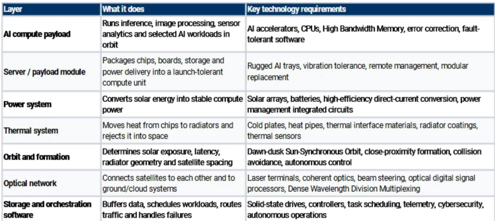
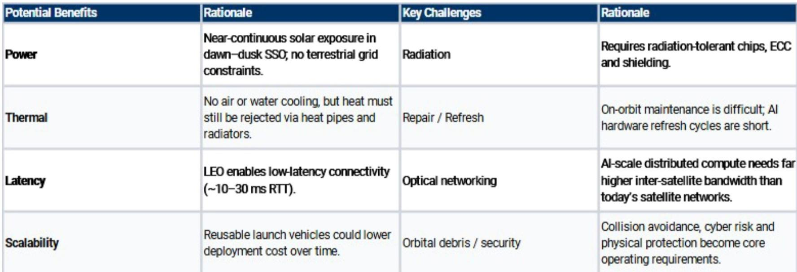

# Orbital Compute Is Not a Science Experiment — It Is the Next Logical Layer of AI Infrastructure

The conversation around artificial intelligence infrastructure has been dominated by terrestrial data centers, power grid constraints, and the escalating cost of cooling. But a global investment bank report on space technology and orbital computing opportunities suggests that the next frontier for AI infrastructure is not under the ocean or in the desert — it is in low Earth orbit. This is not a speculative vision of space colonies or interplanetary data centers. It is a pragmatic, staged evolution of compute architecture that begins with orbital edge computing and, over the next decade, could scale into a distributed AI layer that serves both space and terrestrial workloads. The implications for semiconductor supply chains, memory markets, and European technology companies are material and immediate.

The argument is straightforward: terrestrial AI infrastructure is running into hard constraints on power availability, thermal management, and deployment speed. Space offers near-continuous solar exposure, no grid interconnection delays, and a thermal environment that, while challenging, is fundamentally different from the air-cooled or liquid-cooled systems that dominate today. The cost per watt of orbital compute is projected to fall from roughly $60 in 2030 to $9 by 2040, driven by cheaper reusable launch, lower satellite hardware costs, and improved payload economics. At that trajectory, orbital compute does not need to be cheaper than terrestrial compute to be viable — it only needs to be competitive for workloads that benefit from its unique characteristics.

The report lays out a three-stage progression: near-term orbital edge computing, intermediate orbital cloud or distributed compute, and a long-term bull case of space-based AI infrastructure. The first stage is already realistic. Onboard AI processing for earth observation, defense, maritime monitoring, and autonomous spacecraft does not require a 1-gigawatt AI training campus in orbit. It requires inference-capable accelerators, memory, and power systems that can operate in a radiation-hardened, thermally constrained environment. This is not science fiction. It is an engineering problem that European semiconductor companies are already positioned to solve.

The strategic question for technology executives and observers is not whether orbital compute will happen. It is which parts of the value chain will capture the economic value, and when the inflection points will arrive.

## The First Stage of Orbital Compute Is Not a Data Center in Space — It Is Edge AI for Space-Native Workloads

The most common misconception about orbital computing is that it is about moving terrestrial AI training workloads into orbit. That is the long-term bull case, but it is not the near-term reality. The realistic first step is space-native edge AI: processing images, sensor data, and inference workloads on the satellite itself, sending only useful outputs back to Earth. This eliminates the bandwidth bottleneck of transmitting raw data from orbit and enables real-time decision-making for applications that cannot tolerate the latency of a round trip to a ground station.

This matters because the demand for space-based data is growing exponentially. Earth observation, defense surveillance, maritime tracking, disaster monitoring, and autonomous spacecraft operations all generate volumes of data that exceed downlink capacity. The bottleneck is not compute power on the ground — it is the ability to get data off the satellite. Orbital edge computing solves this by doing the compute where the data is generated.

For semiconductor companies, this creates a specific and addressable market. The compute payload requires AI accelerators, CPUs, high-bandwidth memory, error correction, and fault-tolerant software. The power system demands solar arrays, batteries, and high-efficiency DC conversion. The thermal system needs cold plates, heat pipes, and radiators. The optical network requires laser terminals, coherent optics, and beam steering. This is not a single product opportunity. It is a systems-level opportunity that spans multiple layers of the semiconductor stack.

The report identifies STMicroelectronics and Infineon as key European enablers across this stack. STMicroelectronics, in particular, is positioned with a comprehensive product offering for low Earth orbit, including power management, microcontrollers, sensors, and optical components. The report forecasts LEO sales growing at a 48% compound annual growth rate from fiscal year 2026 to fiscal year 2028, driven primarily by user terminal content. That is not a rounding error in a semiconductor company's revenue. It is a structural growth vector that is independent of the cyclical automotive and industrial markets that have weighed on European semis in recent years.

## The Economics of Orbital Compute Are Improving Faster Than Most Realize

The cost per watt of orbital compute is the single most important metric for assessing the viability of this thesis. The report models a decline from approximately $60 per watt in 2030 to $9 per watt by 2040. To put that in context, terrestrial data center infrastructure today costs roughly $5 to $10 per watt, depending on location, power availability, and cooling requirements. At $9 per watt, orbital compute is not dramatically more expensive than terrestrial compute for certain workloads — and it offers advantages that terrestrial infrastructure cannot replicate.

The primary driver of this cost decline is reusable launch vehicles. The report shows projected SpaceX launch costs per kilogram declining from roughly $1,500 in 2025 to under $500 by 2030 and approaching $200 by 2040. Launch cost has historically been the dominant barrier to space-based infrastructure. At $200 per kilogram, the cost of putting a compute payload into orbit becomes a manageable line item rather than a prohibitive expense.

But launch cost is only part of the equation. Satellite hardware costs are also declining as the commercial space industry scales production. The report's model assumes that satellite payload costs follow a similar trajectory to terrestrial data center hardware, with the added benefit of radiation-tolerant components becoming more commodity-like over time. The combination of cheaper launch and cheaper hardware creates a compounding effect that drives the cost per watt down faster than either factor alone.

The key challenge is that orbital compute economics are not yet at parity with terrestrial compute, and they may never need to be. The value proposition is not cost equivalence — it is capability differentiation. Orbital compute offers near-continuous solar power, global low-latency connectivity, and a deployment model that does not require land acquisition, grid interconnection, or water for cooling. For workloads that value these attributes, orbital compute can command a premium.

## Memory Markets Are at a Cyclical Peak, But the Structural Story Remains Intact

The report also addresses memory markets, which are experiencing a rate-of-change peak. DRAM and NAND pricing are still rising year-over-year, but the rate of change is decelerating into the fourth quarter of 2026. Earnings revision breadth for DRAM has reached approximately 89%, near historical highs. This is a signal that memory stocks could see relative underperformance as the rate of change fades.

This cyclical caution is important context for the orbital compute thesis. Memory is a critical component of the orbital compute stack — high-bandwidth memory, solid-state drives, and error-correcting memory are all required for space-based AI workloads. But the memory cycle is not the story. The story is that memory demand from AI infrastructure, both terrestrial and orbital, is creating a structural trend that will persist through cyclical corrections.

The report notes that there have been three cyclical corrections in memory since the emergence of generative AI in November 2022. Each correction has been shallower than the previous cycle, and each has been followed by a recovery driven by AI capex. The current reset of approximately 17% in memory stocks is consistent with this pattern. The report favors DRAM and legacy memory over NAND, and is least preferred on memory module makers. This reflects a view that the money is being spent where bottlenecks are emerging — in high-bandwidth memory for AI accelerators — rather than in commoditized NAND storage.

For observers, the implication is that memory is a tactical caution but a structural opportunity. The orbital compute thesis adds a new demand vector that is not yet priced into memory stocks. If orbital compute scales as the report models, memory demand from space-based infrastructure could become a meaningful incremental driver in the second half of this decade.

## What the Report Does Not Fully Answer — and Why That Matters

The report is comprehensive in its analysis of the orbital compute stack, the cost trajectory, and the semiconductor supply chain. But it leaves several important questions unanswered, and these gaps are where the most interesting analytical work remains.

First, the report does not fully resolve the tension between the short refresh cycle of AI hardware and the long operational life of satellites. AI accelerators are typically replaced every two to three years in terrestrial data centers. Satellites are designed for five to ten years of operation. How will the orbital compute architecture handle hardware obsolescence? The report mentions on-orbit maintenance as a key challenge, but it does not model the economic impact of having to launch replacement compute payloads every two years. If the refresh cycle is shorter than the satellite bus life, the economics change significantly.

Second, the report does not quantify the addressable market for orbital compute in revenue terms. It provides cost per watt projections and identifies STMicroelectronics as a beneficiary, but it does not estimate total industry revenue or the share that European semiconductor companies can capture. Observers are left to infer the market size from the growth rate and the identified beneficiaries. A more explicit market sizing would help assess whether this is a niche opportunity or a multi-billion-dollar market.

Third, the report does not address the regulatory and geopolitical dimensions of orbital compute. Spectrum allocation, export controls on radiation-hardened chips, and international agreements on orbital debris management could all affect the pace of deployment. The report acknowledges orbital debris and security as key challenges, but it does not model how regulatory risk might affect the cost trajectory or the timeline.

These open questions are not weaknesses of the report. They are invitations for deeper analysis. Those who want to position for the orbital compute theme need to develop their own views on hardware refresh cycles, market sizing, and regulatory risk. The report provides the framework and the data. The judgment calls are up to the reader.

## A Decision Framework for Assessing the Orbital Compute Opportunity

For those who want to translate the report's analysis into actionable decisions, a structured framework is essential. The following four questions can guide the assessment.

First, what is your time horizon? The near-term opportunity in orbital edge computing is real and investable today. The intermediate and long-term opportunities are more speculative but offer higher upside. Those with a three-to-five-year horizon should focus on the supply chain beneficiaries that are already generating revenue from LEO applications. Those with a ten-year horizon can consider the structural thesis around space-based AI infrastructure as a call option on cheap launch and power scarcity.

Second, which part of the value chain do you want to own? The report identifies semiconductor companies as key enablers, but the value chain includes launch providers, satellite manufacturers, optical networking companies, and software orchestration platforms. Each layer has different risk-return characteristics. Semiconductor companies offer lower risk and more immediate revenue. Launch providers offer higher leverage to volume but more cyclicality. Software platforms offer the highest potential margins but the longest path to revenue.

Third, how do you weigh the cyclical headwinds against the structural tailwinds? The memory market is at a cyclical peak, and European semiconductor stocks are facing headwinds from automotive and industrial end markets. The orbital compute thesis is a structural tailwind that is independent of these cycles. Observers need to decide whether the structural story is strong enough to offset the cyclical risks, or whether it is better to wait for a better entry point.

Fourth, what is your view on the key uncertainties? The hardware refresh cycle, market sizing, and regulatory risk are the three most important unknowns. Those who believe these uncertainties are manageable can take a more aggressive position. Those who see them as material risks should size their positions accordingly.

## The Orbital Compute Thesis Is Not a Diversion — It Is a Logical Extension of the AI Infrastructure Buildout

The terrestrial AI infrastructure buildout is not finished. Hyperscalers are still spending aggressively on data centers, and the demand for AI inference is only beginning to scale. But the constraints on terrestrial infrastructure are real and growing. Power availability, grid interconnection timelines, and cooling requirements are becoming binding constraints in many markets. Orbital compute offers a complementary solution that avoids these constraints entirely.

The report makes a compelling case that orbital compute is not a distant fantasy. It is a staged, engineering-driven evolution that begins with edge AI in orbit and could scale to distributed AI infrastructure over the next decade. The cost trajectory is improving faster than most realize. The semiconductor supply chain is already positioned to serve this market. The open questions are about timing, market size, and regulatory risk — not about feasibility.

For those who want to understand the full analysis, including the detailed cost models, the supply chain mapping, and the specific company valuations, the original report contains charts and data that are essential for building a complete picture.

*For informational purposes only. Portions may be generated, translated, summarized, or edited with AI assistance based on source materials and may contain omissions or errors. Please verify independently. This is not professional advice.*

For informational purposes only. Portions may be generated, translated, summarized, or edited with AI assistance based on source materials and may contain omissions or errors. Please verify independently. This is not professional advice.

