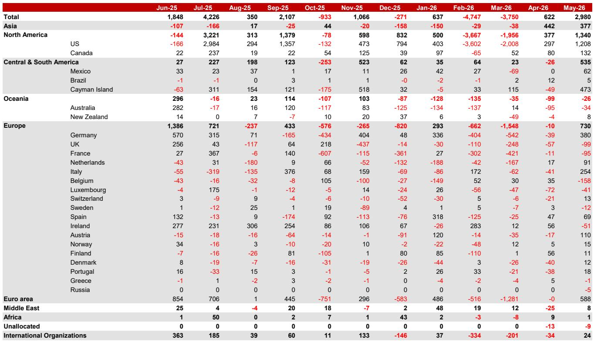
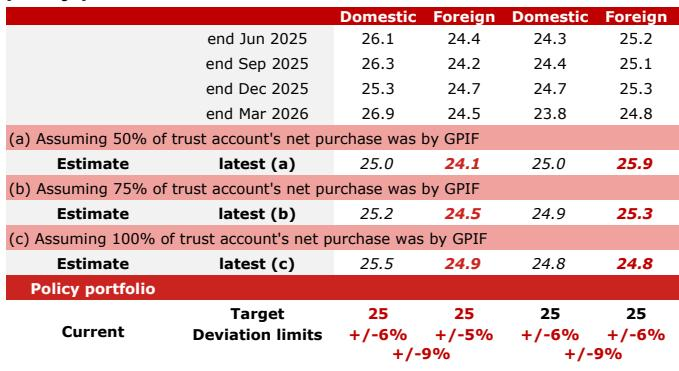
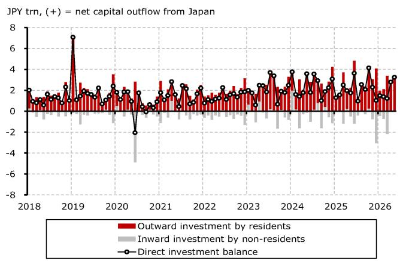

# Japan's Retail Investors Are Becoming a Structural Force in Yen Weakness—And That Changes the FX Playbook

For months, the dominant narrative around yen depreciation has centered on the Bank of Japan's policy stance, US interest rate differentials, and foreign investor sentiment. But a deeper look at Japan's June cross-border flow data reveals a less discussed but increasingly powerful driver: Japanese retail investors, channeled through the new NISA scheme, are becoming a persistent source of yen-selling pressure. This is not a temporary phenomenon tied to summer bonuses or a single month's equity rally. It reflects a structural shift in how Japanese households allocate savings, and it has direct implications for currency forecasts, portfolio strategy, and the effectiveness of intervention.

The data shows that investment trusts—the primary vehicle for NISA flows—remained net buyers of foreign equities at JPY767 billion in June, even as other investor groups pulled back. When combined with trust account rebalancing and life insurers' cautious positioning, the picture that emerges is one of fragmented but cumulatively significant outward capital flows. The yen did not weaken in June because of a single large seller. It weakened because multiple domestic investor groups, each acting on their own logic, simultaneously reduced their exposure to yen-denominated assets.

This matters now because the composition of flows is shifting in ways that make the yen more vulnerable to a slow, grinding depreciation rather than sharp, intervention-triggered reversals. The traditional stabilizers—life insurers hedging, banks reducing foreign bond exposure, GPIF rebalancing—are either absent or operating at reduced scale. The new stabilizer, if any, will have to come from a different place entirely.

## Banks' Six-Month Selling Streak in Foreign Bonds Signals a Structural Retreat from Unhedged US Exposure

The most striking institutional signal in the June data is that banks have net sold foreign bonds for six consecutive months. In June alone, banks sold JPY2.0 trillion in foreign bonds while buying only JPY390 billion in foreign equities. This is not a tactical adjustment. It is a sustained repositioning that reflects a fundamental reassessment of the attractiveness of US Treasuries on a hedged basis.

The mechanism is well understood but worth restating. Japanese banks typically invest in US Treasuries via asset swaps, where they receive USD and pay JPY, effectively hedging the currency risk. The net return is the US Treasury yield minus the cost of the swap. In recent months, US swap spreads have tightened even as expectations for Fed rate hikes rose. This combination has compressed the hedged yield to levels that no longer compensate for the regulatory and operational costs of holding foreign bonds.

The implication is straightforward: if banks continue to reduce their foreign bond holdings, the natural buyer of last resort for US Treasuries from Japan diminishes. This does not mean US yields will spike, but it does mean that the traditional Japanese bid for US government debt is structurally weaker. For currency markets, the effect is more direct. Banks selling foreign bonds means they are repatriating dollars into yen, which should theoretically support the yen. But the scale of these flows is being overwhelmed by other channels, particularly retail-driven foreign equity purchases, which have the opposite currency effect.

The open question for readers is whether this bank selling is a leading indicator of broader institutional de-risking, or whether it is a sector-specific phenomenon that will reverse once swap spreads normalize. The report does not provide a definitive answer, but the persistence of the trend suggests that the burden of proof is now on those who expect a reversal.

## Trust Account Rebalancing Masks a Deeper Question About GPIF's Strategic Direction

Trust accounts were large net sellers of foreign equities (JPY1.3 trillion) and large net buyers of foreign bonds (JPY1.5 trillion) in June. The report attributes this to rebalancing: after equity markets rose, the portfolio weight of foreign equities exceeded targets, triggering automatic sales and corresponding bond purchases.

On its face, this is a mechanical, non-directional flow. But it raises a deeper strategic question that the report leaves partially unanswered. The GPIF's estimated portfolio allocation shows domestic bonds, domestic equities, foreign bonds, and foreign equities all clustered around 25 percent. This is exactly the policy portfolio target. However, the report notes that the latest annual report showed a slight rise in domestic bond allocation, and it explicitly states that there is not yet clear evidence of a GPIF portfolio review aimed at materially raising domestic bond weightings.

The tension here is critical. If GPIF were to shift its strategic allocation away from foreign assets and toward domestic bonds, it would represent a massive structural shift in capital flows. Japan's public pension fund manages approximately JPY250 trillion. Even a 5 percentage point shift from foreign to domestic bonds would redirect trillions of yen away from overseas markets and into JGBs, with significant implications for yen demand and JGB yields.

The report's analysis suggests that such a shift is not yet underway. But the absence of evidence is not evidence of absence. The question for readers is what conditions would trigger a GPIF review. Would it require a change in government policy? A sustained rise in JGB yields? A political signal from the Takaichi administration? The report provides the data but does not resolve the uncertainty. This is precisely the kind of strategic ambiguity that demands ongoing monitoring.

## Life Insurers Are Sitting on Their Hands, and That Is a Bearish Signal for the Yen

Life insurers net bought only JPY70 billion of foreign securities in June, with a modest JPY111 billion in foreign equities and negligible foreign bond activity. The report notes that both purchase and sale flows in foreign bonds remained small by historical standards.

This inactivity is itself a signal. Life insurers have long been among the largest and most predictable cross-border investors from Japan. Their investment plans for FY2026 signaled a cautious stance on unhedged foreign bonds, but the report observes that large-scale net selling has not materialized. The implication is that life insurers are waiting rather than acting.

Why does this matter for the yen? Life insurers are natural sellers of yen when they purchase unhedged foreign assets, and natural buyers of yen when they hedge or repatriate. Their current posture—neither aggressively buying nor selling—means they are not providing the stabilizing currency flows that markets have historically relied upon. In previous cycles, life insurers would step in to purchase foreign bonds on dips or increase hedging when the yen weakened. Today, they are largely absent.

The report suggests that if life insurers continue to expect yen depreciation, they might prefer unhedged foreign bonds over hedged ones. This would amplify yen weakness rather than counteract it. The open question is whether a sharp yen move would trigger a response, or whether life insurers have structurally altered their approach to currency risk. The answer will depend on their internal assumptions about the terminal level of USD/JPY and the credibility of BOJ intervention.

## NISA Flows Are the Wild Card That Could Keep the Yen Under Pressure Even as Other Drivers Fade

The most analytically provocative finding in the report is that NISA-related flows were likely sizeable in June and may have contributed to the acceleration in yen depreciation. Investment trusts net bought JPY767 billion in foreign equities, and the report argues that this understates the true retail flow because the MOF data may include selling by private funds and quarter-end cash management.

The mechanism is simple but powerful. Japanese retail investors, encouraged by the expanded NISA scheme, are buying foreign equity funds on a regular basis. These purchases require the fund manager to convert yen into foreign currency, creating persistent downward pressure on the yen. Unlike institutional flows, which can be tactical and reversible, retail flows tend to be more sticky. Households that have committed to monthly NISA contributions are unlikely to reverse course after a single month of currency weakness.

The report notes that the pace of foreign equity buying via investment trusts is likely to slow from July, as global equity gains have moderated and June flows were boosted by summer bonuses. But this is a moderation, not a reversal. The structural trend remains intact. Japanese households hold over JPY1,100 trillion in financial assets, the majority in cash and deposits. Even a small reallocation toward foreign assets represents a large and persistent flow.

For FX strategists, the critical question is whether NISA flows are now large enough to offset the traditional stabilizers of Japanese current account surpluses and institutional hedging. The report does not provide a precise calculation, but the data strongly suggests that the answer is yes. If NISA flows continue at even half of June's pace, they will represent a structural headwind for the yen that no amount of verbal intervention can fully neutralize.

## A Decision Framework for Positioning in a Yen Market Driven by Domestic Flows

The report's data can be translated into a simple but powerful decision framework for investors. The framework has three layers: identify the dominant flow regime, assess the sustainability of that regime, and position for the most likely transition.

First, identify the dominant flow regime. The current regime is characterized by fragmented outward flows from multiple domestic investor types. Banks are selling foreign bonds. Trust accounts are rebalancing. Life insurers are inactive. Retail investors are buying foreign equities. None of these flows alone is decisive, but together they create a persistent bid for foreign currency and a persistent offer for yen. The regime is not driven by a single catalyst but by a confluence of structural and cyclical factors.

Second, assess the sustainability of each flow. Bank selling is likely to persist as long as swap spreads remain compressed. Trust account rebalancing is mechanical and will continue as long as equity markets generate deviations from target weights. Life insurer inactivity could break either direction depending on currency expectations. Retail NISA flows are the most structurally entrenched, driven by policy design and demographic trends.

Third, position for the most likely transition. The most probable near-term change is a slowdown in NISA flows, as the report suggests. This would remove some yen-selling pressure but would not reverse the overall direction. The more consequential transition would be a GPIF portfolio review or a life insurer shift toward unhedged foreign bonds. Both would represent a step-change in flow magnitude.

For readers who want to operationalize this framework, the key is to monitor the weekly and monthly flow data for signs of regime change. A sustained increase in life insurer foreign bond buying would be a bearish signal for the yen. A GPIF announcement of higher domestic bond targets would be a bullish signal. The absence of either means the current regime remains intact.

## Join the Community to Read the Full Report and Review the Original Charts

The analysis above draws on the June JPY Monthly Flow Monitor, which contains granular breakdowns by investor type, country, and asset class that are essential for forming a complete view. The full report includes detailed charts on trust account rebalancing dynamics, life insurer flow trends, and the country-level breakdown of Japanese foreign bond purchases that were only summarized here. It also contains the original data tables and methodology notes that allow readers to verify the estimates and extend the analysis to their own portfolios.

For serious investors and strategists who need to stay ahead of these structural shifts, the full report is an indispensable resource. Join the community to read the full report and review the original charts.

*For informational purposes only. Portions may be generated, translated, summarized, or edited with AI assistance based on source materials and may contain omissions or errors. Please verify independently. This is not investment, legal, tax, accounting, or other professional advice.*

For informational purposes only. Portions may be generated, translated, summarized, or edited with AI assistance based on source materials and may contain omissions or errors. Please verify independently. This is not investment, legal, tax, accounting, or other professional advice.

