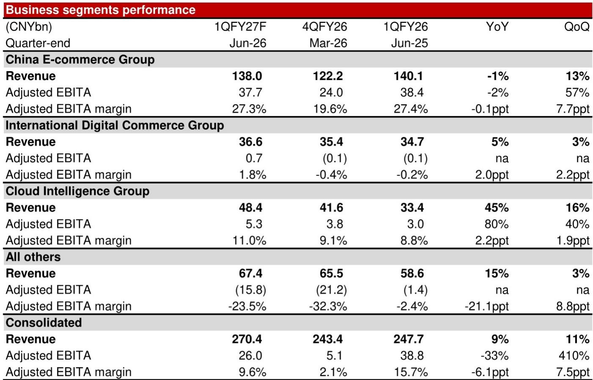
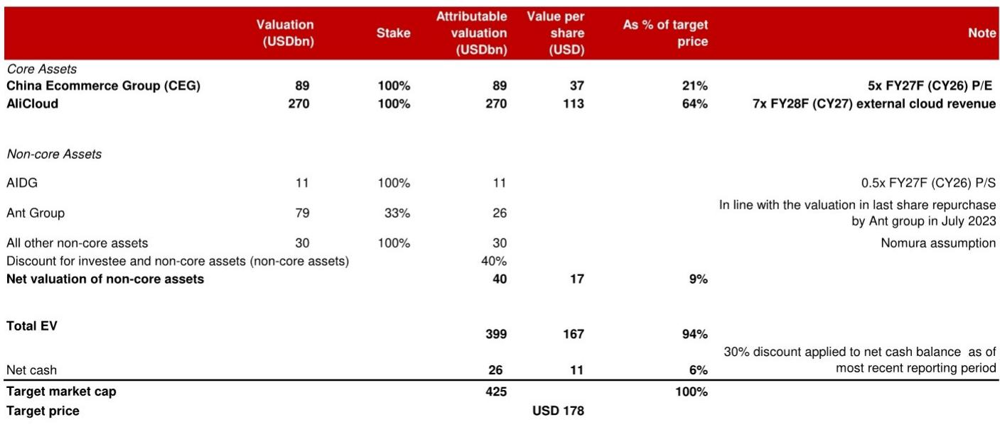
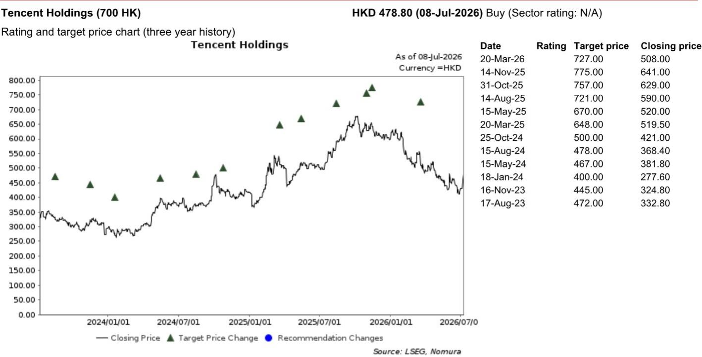

# NOM：电商利润韧性超预期，NOM指阿里云正重塑公司利润结构

市场对阿里巴巴的讨论仍集中在电商份额与宏观消费的拉锯上。但NOM在2026年7月发布的最新季度预览报告中，给出了一个值得重新审视的判断：阿里云的盈利能力正在加速改善，其MaaS（模型即服务）业务的年化经常性收入已经超过百亿元人民币指引，达到120亿元。这个数字本身不算巨大，但结合该机构对云业务利润率持续扩张的预测，它指向了一个更结构性的变化——阿里巴巴的核心利润构成正在从“电商主导”向“电商+云双引擎”迁移，而云的边际贡献可能在未来2-3个季度内超出市场定价。

以下是这份报告中最关键的三个层次。

## 1. 云业务的收入增速和利润率改善，都超出了市场共识

NOM预计，阿里巴巴中国云业务在6月季度的收入同比增长45%，显著高于市场一致预期的37.5%。更值得注意的是利润率。报告指出，阿里云的EBITA利润率目前约为11-12%，但受年初提价以及高毛利MaaS业务收入占比提升的推动，这一数字有望持续上行。

这里的关键变量不是收入规模，而是收入结构。MaaS业务的毛利率显著高于传统的IaaS和PaaS。当MaaS的ARR从100亿跳升至120亿，并且仍在加速，云的利润弹性就会被放大。NOM没有给出具体的利润率目标，但从其表述“should improve further”来看，这并非一次性修复，而是一个可持续的趋势。

> **KC评论：** 市场习惯用电商的GMV和CMR来给阿里定价，但云的利润贡献正在快速接近甚至超过电商。这意味着，如果云的利润率每提升1个百分点，对整体利润的拉动可能比电商业务同等幅度的改善更显著。完整报告中对云业务各细分增速的拆解，值得仔细看。

## 2. 电商利润在宏观环境下展现出韧性，而非脆弱

报告预期中国电商CMR同比下降8%，但EBITA仅下降3%。这个差异来自两个因素：一是淘天集团对商家变现效率的主动管理，二是亏损业务（尤其是即时零售）的亏损大幅收窄。NOM估计即时零售的亏损从上一季度的180亿元收窄至103亿元，好于市场预期的120-130亿元。

同时，国际电商AIDC实现了小幅盈利，EBITA为6.58亿元，而去年同期为小幅亏损。这些信号叠加在一起，说明阿里巴巴在电商领域的策略已经从“不惜代价抢份额”转向“在守住份额的前提下修复利润”。对于一家正在经历云业务资本开支高峰期（FY26资本开支预计同比增长46.6%至1261亿元）的公司，这种利润韧性至关重要。

## 3. 报告尚未完全回答：云的利润弹性能否对冲电商的结构性不确定性

NOM对阿里巴巴更新公司观点。其估值框架中，给阿里云的估值是2700亿美元，基于FY28市销率7倍。这个倍数本身不低，意味着市场必须相信云的利润率改善是可持续且可量化的。

但报告没有完全回答的问题是：如果电商的CMR长期处于低个位数甚至负增长区间，云的利润增量能否完全对冲？NOM的财务模型显示，FY27-29年正常化净利润复合增速约为34%，这需要电商利润稳定、云利润率持续提升、以及“所有其他”业务的亏损进一步收窄。这三个条件同时成立的概率有多大，报告没有给出不确定性测试。

> **KC评论：** 这份报告最有价值的部分不是结论，而是它对云业务MaaS收入超预期的具体拆解。如果你关注阿里巴巴，不妨去原文中找“Fig 1-3”对6月季度各业务条线的详细预测表，那里藏着比标题更丰富的判断边界。

对于关注中国互联网公司的读者而言，阿里巴巴正在经历一个从“电商公司”到“AI基础设施公司”的叙事切换。云的利润弹性，是检验这个叙事能否被市场接受的关键变量。NOM的这份报告提供了第一个有力的数据点，但远非最后一个。

For informational purposes only. Portions may be generated,translated,summarized,or edited with AI assistance based on source materials and may contain omissions or errors. Please verify independently. This is not investment,legal,tax,accounting,or other professional advice.

For informational purposes only. Portions may be generated,translated,summarized,or edited with AI assistance based on source materials and may contain omissions or errors. Please verify independently. This is not investment,legal,tax,accounting,or other professional advice.

