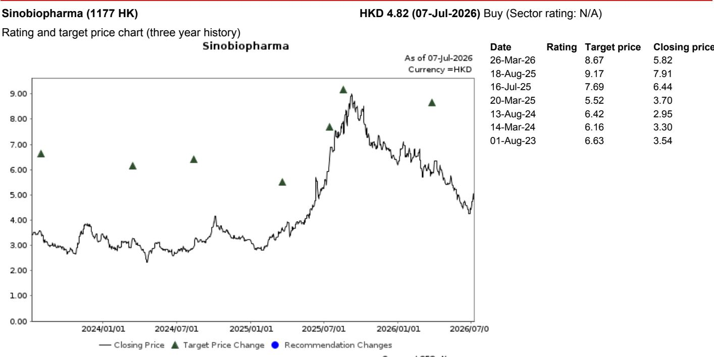

# 中国生物制药与GSK深化合作：商业化基础设施成为核心优势

中国医药行业中最被低估的资产，已不再是临床试验中的候选药物。在一个监管和支付环境快速变化的市场中，规模化商业化复杂疗法的能力正变得至关重要。2026年7月8日，中国生物制药宣布获得GSK两款呼吸系统产品——Trelegy Ellipta和Anoro Ellipta——在中国的商业化权利，将两个月前始于一款乙肝药物的合作进一步扩大。这不仅是产品线的延伸，更是一个战略信号：中国生物制药正将其商业化平台定位为中国呼吸市场的核心竞争优势，而GSK正对这一平台投下重要信任票。

这一合作之所以重要，是因为它揭示了中国医药行业的一个更广泛趋势。当跨国公司在不从头建设昂贵本土基础设施的前提下，面临日益增长的本土化运营压力时，在特定治疗领域拥有成熟能力的合作伙伴变得不可或缺。中国生物制药的呼吸产品组合已包含成熟产品，如今又增添了GSK最重要的两款呼吸资产。Trelegy Ellipta作为中国首个且相对少见获批用于哮喘和COPD的单吸入器三联疗法，在2025财年全球销售额达30亿英镑。Anoro Ellipta自2018年在中国获批用于COPD维持治疗，全球销售额另增5.42亿英镑。仅在中国，Trelegy Ellipta 2025年样本医院销售额达8.19亿元人民币，同比增长34%。

这一合作的战略逻辑超越了直接收入贡献。它深化了中国生物制药与GSK的关系，为未来合作创造了更多可能性。同时，它也向市场传递了一个信号：中国生物制药在呼吸领域的商业化能力已获得全球最大疫苗和专科药物公司之一的认可。对于观察者而言，问题已不再是中国生物制药能否在呼吸领域执行，而是当一家拥有强大商业化基础设施的公司成为跨国公司寻求中国市场准入的首选合作伙伴时，其机会空间将有多大。

## 中国呼吸市场进入新阶段，商业化能力成为关键变量

中国呼吸系统疾病负担巨大且持续增长。COPD影响约1亿中国人，使中国成为全球患病率最高的国家之一。受城市化、污染和生活方式变化推动，哮喘患病率持续上升。尽管如此，诊断率仍然较低，治疗依从性也不稳定。市场机会不仅在于患者数量，更在于可用疗法与实际使用之间的差距。

近年来发生变化的是监管和支付环境。国家医保目录已扩大至更多呼吸疗法，集中带量采购项目则压缩了老一代仿制药的价格。在这种环境下，赢家不一定是拥有最多创新分子的公司，而是那些能够驾驭医院准入、医生教育、患者依从项目以及真实世界证据生成的公司。

中国生物制药在呼吸领域的商业化平台具有差异化优势。公司拥有一支专注于呼吸领域的销售团队，与三级和二级医院建立了合作关系。它在推出复杂吸入疗法方面拥有经验，这类疗法比口服药物需要更多的医生培训和患者支持。其分销网络覆盖从一线城市到地县级医院，而大多数COPD和哮喘患者正是在这些医院接受治疗。这种基础设施建设成本高昂且难以复制。GSK决定将其两款最重要的呼吸产品委托给中国生物制药，正是对这种基础设施实际价值的认可。

来自药智网的数据进一步印证了这一机会。Trelegy Ellipta在中国样本医院的销售额2025年同比增长34%，2026年第一季度增长6%。Anoro Ellipta 2025年增长11%，但2026年第一季度下降3%。Anoro Ellipta增速放缓未必是担忧——它可能反映市场动态、库存调整或来自新疗法的竞争压力。但这恰恰凸显了中国生物制药商业化能力的重要性：公司在医生教育、患者识别和依从项目方面的专长，有助于维持可能趋于平稳的增长轨迹。

## 合作结构揭示更深层战略逻辑：平台价值超越产品价值

此次合作的具体条款未详细披露，但其结构具有启示意义。中国生物制药获得的是这些产品的中国商业化权利，而非生产或研发权利。这是一项纯商业化安排，意味着财务风险主要在于销售和营销投入，而非研发或监管审批。对中国生物制药而言，这是轻资产扩张。对GSK而言，这是在无需承担大型本土商业组织固定成本的情况下，维持中国市场准入的一种方式。

这一结构具有二阶影响。首先，它表明GSK将中国生物制药视为长期商业合作伙伴，而非临时分销商。短短两个月内连续达成两项合作——先是5月的乙肝药物，现在是7月的两款呼吸产品——表明GSK有意整合商业关系。GSK实际上是将这些产品在中国的商业化基础设施外包给了中国生物制药。如果这一模式奏效，它可能扩展到其他治疗领域。

其次，这一合作使中国生物制药能够随着时间的推移从其商业化平台中获取更多价值。将新产品添加到现有销售团队和分销网络的边际成本较低。每增加一个产品，都会提高固定商业资产的利用率。这形成了一个良性循环：更多产品吸引更多医生关系，进而吸引更多产品。中国生物制药正在医药领域构建一个经典的平台商业模式。

第三，这一合作表明中国生物制药管理层正在战略性地思考产品组合构建。呼吸产品补充了公司现有的肿瘤和乙肝产品组合，在不同治疗领域实现了多元化，这些领域具有不同的增长驱动因素、患者群体和支付动态。这种多元化降低了公司对任何单一产品或治疗类别的依赖，在一个监管变化可能迅速改变竞争动态的市场中，这一点尤为重要。

## 合作在中国呼吸市场创造新的竞争格局

中国呼吸市场的竞争格局分散但正在整合。GSK、阿斯利康和勃林格殷格翰等跨国公司历史上主导了吸入疗法领域。本土公司则专注于仿制药和中药。中国生物制药选择与GSK合作而非自主研发呼吸管线，是一种务实的认识：开发新型吸入疗法资本密集、耗时且风险高。公司选择在商业化而非创新上竞争。

这一策略对其他本土制药公司具有启示意义。如果中国生物制药成功在呼吸领域建立主导性商业化平台，它将成为其他寻求中国市场准入的跨国公司的首选合作伙伴。这可能在商业化领域形成赢家通吃的格局。试图自建商业化基础设施的竞争对手将面临更高成本和更长周期。试图与其他跨国公司合作的竞争对手可能会发现，最好的资产已被锁定。

对于在中国拥有自有商业运营的阿斯利康和勃林格殷格翰而言，竞争威胁是真实的。中国生物制药的平台与GSK的产品组合相结合，在哮喘和COPD治疗领域创造了一个强大的竞争者。作为中国首个单吸入器三联疗法，Trelegy Ellipta在一个快速增长的治疗类别中拥有先发优势，因为医生和患者对单吸入器方案的便利性越来越认可。

数据支持这一观点。Trelegy Ellipta 2025年34%的增长表明市场接受度强劲。如果中国生物制药能通过其商业化努力加速这一增长，该产品可能成为中国呼吸市场的主导者。问题在于公司能否在Anoro Ellipta上复制这一成功，后者是一款面临更多竞争的双联疗法产品。

## 报告未完全解答的问题：财务影响、产品线及竞争回应

研究报告对合作战略逻辑提供了清晰和积极的评估，但留下了几个重要问题。首先，这些产品对中国生物制药收入和利润的财务影响尚未量化。报告指出Trelegy Ellipta和Anoro Ellipta全球销售额分别为30亿英镑和5.42亿英镑，中国样本医院销售额2025年分别为8.19亿元和1.18亿元。但商业化合作的经济条款——收入分成、预付款、里程碑付款、成本结构——未披露。没有这些信息，无法评估利润贡献或资本回报率。

其次，报告未涉及这两款产品之外的产品线。与GSK的合作协议现在涵盖一款乙肝药物和两款呼吸产品。这是合作的全部范围，还是一个可能扩展到其他治疗领域的框架？GSK拥有强大的疫苗业务、专科药物组合以及肿瘤和免疫学领域不断增长的产品线。如果中国生物制药成为GSK在中国的首选商业合作伙伴，机会空间可能比当前合作所暗示的要大得多。

第三，竞争回应未得到分析。阿斯利康、勃林格殷格翰和其他跨国公司将如何应对这一合作？它们会寻找自己的中国商业合作伙伴，还是会加强内部能力？本土竞争对手会试图通过建立自己的合作来复制中国生物制药的策略吗？中国医药市场的竞争动态正在迅速变化，中国生物制药优势的可持续性取决于竞争对手如何回应。

第四，报告未涉及监管和定价风险。中国的国家医保谈判近年来变得更加积极，集中采购项目压缩了许多药物的价格。Trelegy Ellipta和Anoro Ellipta目前定价较高，但如果它们被纳入未来的医保谈判，或者竞争对手以更低价格推出类似产品，这一溢价可能被侵蚀。中国生物制药的商业能力有助于缓解数量风险，但无法完全抵消定价风险。

## 评估中国生物制药策略的决策框架

对于试图评估中国生物制药合作策略是否创造可持续价值的观察者而言，一个结构化框架是有用的。分析应聚焦三个维度：平台经济学、竞争护城河和执行风险。

**平台经济学：** 关键问题是中国生物制药的商业化平台是否具有递增的规模回报。随着公司在其呼吸产品组合中增加更多产品，商业化的边际成本是否下降？平台是否产生网络效应，即更多产品吸引更多医生，进而吸引更多产品？早期证据是积极的：公司在两个月内与GSK达成两项重大合作，表明平台随着每次增加而变得更有价值。但证实这一论点所需的财务数据尚不可得。

**竞争护城河：** 中国生物制药优势的持久性取决于其商业化能力是否真正差异化。许多本土制药公司声称拥有强大的商业化基础设施。问题在于中国生物制药的呼吸销售团队、分销网络和医生关系是否真正优越，以及这种优越性能否维持。GSK愿意将其最重要的呼吸产品委托给中国生物制药是一个强烈信号，但并非证明。观察者应关注其他跨国公司是否也选择与中国生物制药合作，以及公司能否抵御试图复制其模式的竞争对手。

**执行风险：** 最大的风险不是战略性的，而是运营性的。商业化复杂吸入疗法需要专业知识：医生培训、患者教育、依从项目和真实世界证据生成。中国生物制药在呼吸领域有经验，但Trelegy Ellipta是公司此前商业化过的产品中更复杂的一款。公司还必须将这些新产品整合到现有产品组合中，同时不干扰其商业运营。医药商业化中的执行失败是常见且代价高昂的。

该框架表明中国生物制药定位良好，但证据尚不确凿。未来12至18个月将是关键时期。观察者应关注Trelegy Ellipta和Anoro Ellipta的季度销售数据、GSK或其他跨国公司的任何额外合作公告，以及阿斯利康或勃林格殷格翰的任何竞争回应迹象。

## 未解答的问题：这是平台还是产品集合？

从这一分析中浮现的最重要问题是，中国生物制药是在构建一个真正的平台业务，还是仅仅在产品组合中添加产品。平台业务具有网络效应、递增的规模回报以及合作伙伴的高转换成本。产品集合则不具备这些特征。这一区别之所以重要，是因为它决定了竞争优势的可持续性。

中国生物制药的策略有潜力成为一个平台。如果公司能够证明其商业化基础设施持续为合作产品带来卓越的销售增长，它将吸引更多跨国合作伙伴。每个新合作伙伴通过添加产品来强化平台，产品吸引更多医生，医生生成更多真实世界数据，数据改善公司瞄准新患者的能力。这一良性循环创造了一个难以复制的护城河。

但平台论点尚未得到证实。中国生物制药必须证明它能够在多个治疗领域执行，而不仅仅是呼吸领域。它必须展示其商业化能力可转移至不同产品类型、不同医生专业和不同患者群体。它还必须证明其合作模式为其合作伙伴带来的回报优于其自有商业运营。

这些都是开放性问题，它们将决定中国生物制药是成为中国医药商业化领域的主导者，还是仍局限于有限产品组合的利基合作伙伴。与GSK的合作是朝着正确方向迈出的一步，但并非终点。

---

*仅供信息参考。部分内容可能基于源材料通过AI辅助生成、翻译、总结或编辑，可能存在遗漏或错误。请独立核实。本文不构成任何专业建议。*
