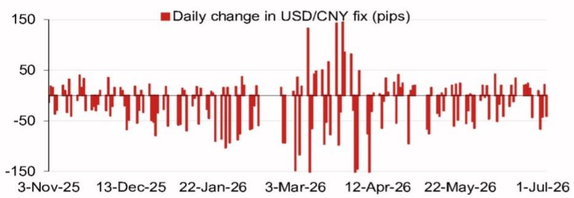
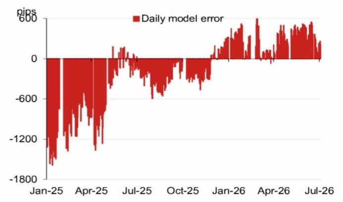

# NOM：不是点位而是机制，NOM解读人民币中间价新信号

人民币对美元中间价近期持续调整，但真正值得关注的不是具体点位，而是定价机制内部的信号。NOM亚洲外汇策略团队在最新报告中更新了其人民币中间价预测模型，结果显示，在不含逆周期因子的情况下，模型预测值已较前一日官方收盘价低约90个基点。这个缺口暗示了什么？中间价管理可能正在从“稳定”向“有序弹性”过渡。

报告的核心判断是：当前中间价定价已隐含更强的市场化信号，而非单纯的政策干预。NOM的模型显示，剔除逆周期因子后，预测中间价为6.7984，较前一日官方收盘价低93个基点。这一偏离幅度在近期属于相对明显水平，意味着决策层可能正在利用中间价机制，释放更灵活的管理信号，而非被动跟随市场波动。

> **KC评论：** 这组数字的实质是，中间价不再是简单的“市场+过滤”公式，而是一个带有前瞻指引意味的政策工具。读者应关注模型误差的累积方向，而非单日变动。

## 1. 逆周期因子的使用已趋于克制

逆周期因子是中间价定价中用来缓冲市场波动的工具。NOM模型显示，当前含与不含逆周期因子的预测值仅相差0.3个基点，几乎可以忽略。这与2023年或2024年初期的情形形成对比——当时逆周期因子曾被频繁使用以对抗单边贬值预期。

这种变化意味着什么？决策层可能认为当前市场环境已不需要强力干预，或者更愿意让价格发现机制发挥更大作用。对市场参与者而言，逆周期因子的淡出意味着中间价的波动性可能上升，单日调整幅度或更接近模型隐含的方向。

## 2. 报告尚未完全回答的关键问题：弹性管理的边界在哪里

NOM的模型提供了清晰的“当前信号”，但并未明确回答：这种弹性管理的容忍区间是多少？报告提到了未来一系列关键事件——7月底重要会议、10月国庆假期、11月APEC会议、12月中央宏观环境工作会议，以及年底可能的中美元首会晤。

这些事件构成了一个“政策观察窗口”。在重要会议前后，中间价管理是否会重新收紧？弹性管理的窗口期能持续多久？报告没有给出明确答案，但这恰恰是读者需要持续跟踪的变量——中间价的弹性不是一次性的开关，而是一个需要结合事件节奏判断的区间。

## 3. 读者应如何观察：从“看点位”转向“看机制”

对于关注人民币走势的读者，NOM报告提供了一个更重要的分析框架：不要只看中间价每天调了多少，而要关注定价机制本身的变化。具体来说，有三个维度值得持续跟踪：

第一，模型预测值与实际中间价的偏离幅度。偏离越大，说明政策信号越强。第二，逆周期因子的使用频率和力度。当前几乎为零，如果后续重新放大，意味着政策态度转变。第三，官方收盘价与中间价的互动关系。如果收盘价持续偏离中间价且偏离未收窄，说明市场对政策信号的解读存在分歧。

这三个维度比任何单日点位都更能反映人民币管理的中期方向。

---

NOM的这份报告虽然篇幅不长，但其核心价值在于提供了一个可量化的政策观察工具。对于宏观策略和外汇市场的参与者而言，中间价定价机制的细微变化，往往比汇率本身的波动更具前瞻意义。

For informational purposes only. Portions may be generated,translated,summarized,or edited with AI assistance based on source materials and may contain omissions or errors. Please verify independently. This is not investment,legal,tax,accounting,or other professional advice.

For informational purposes only. Portions may be generated,translated,summarized,or edited with AI assistance based on source materials and may contain omissions or errors. Please verify independently. This is not investment,legal,tax,accounting,or other professional advice.

