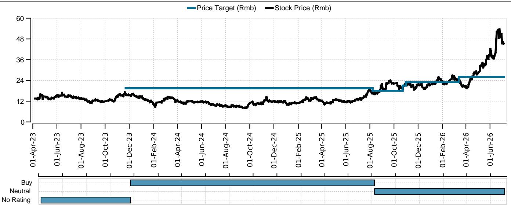
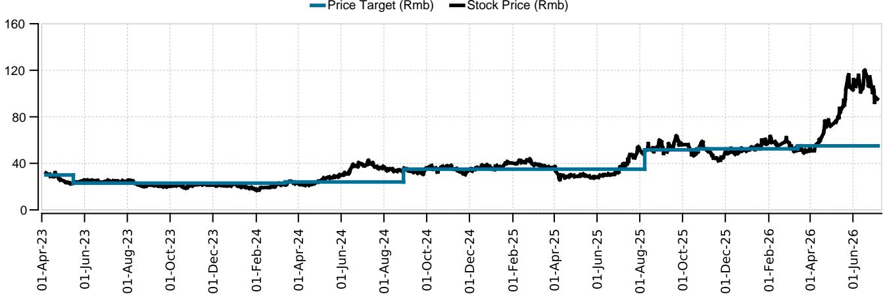

First Read

# China PCB Sector

# Our initial read on potential Kyber backplane delay and sector updates

## Kyber orthogonal backplane delay in-line with our expectation

Recent press noted NVDA Kyber rack architecture is facing delays to 2028 due to supply chain challenges on PCB backplane. We view this timeline as in-line with our expectation based on our early industry study from upstream CCL vendors back in May, suggesting potential delays of orthogonal backplane to Feynman in 2028. This was corroborated by Victory Giant mentioned in our H-share Corp Day (link) that there are currently 10+ material/vendor combinations being considered including different layer count designs. We see potential challenges are: 1) M9+Q-glass' processing difficulties, inadequate supply and higher costs vs. other possible solutions (e.g. with low-dk2); we believe this option is on hold for the Kyber backplane despite multiple rounds of trials; 2) PTFE's unexpected emergence as an optimal alternative due to its outstanding performance and improving yield, despite time required for supply chain readiness with further testing and; 3) suboptimal yields on the PCB side as both Q-glass and PTFE materials demand much higher manufacturing capability on a 100+ layer form factor. We think the impact on PCB companies earnings in 2026/27E could be limited as Kyber was originally expected in late 2027 on Rubin Ultra with relatively small volume, and despite a slightly later timeline, we believe it's not cancelled altogether. Also see our Taiwan analyst Diana Chang's latest reads on Kyber, substrate pricing, and T-glass supply here (link).

## Conventional CCL price hikes accelerate, BT substrate pricing resilient

KBL announced another round of 15% conventional FR4 CCL price hike today, shortly after 2 rounds of hikes in June at 15% and 10%, respectively. We are optimistic on conventional CCL names benefiting from aggressive price hikes with margins expanding and we see current pricing above the previous upcycle peak at c.Rmb220/sheet. We expect this upcycle to be sustainable and forecast monthly hike cadence continuing through 2H26 into 1H27 primarily driven by AI crowding out conventional supply with limited near-term capacity addition. On BT substrate, despite news reported Korean memory makers are pushing for substrate price cuts into H226, our checks with China BT substrate makers (Shennan and FastPrint) indicate no such thing and we expect H226 pricing would be favourable with UTR at very high levels.

## mSAP capacity expansions underway for optical transceiver demand

We see PCB makers are adding mSAP capacity on the back of rising 1.6T/3.2T optical module demand. Avary announced on 3 July to raise up to Rmb9.6bn toward its Huai'an plant, adding 655.6k sqm of annual high-end HDI capacity for AI servers and optical modules. FastPrint's placement plan (23 June) would raise up to Rmb3.9bn, with Rmb2bn for a Zhuhai high-end mSAP plant, adding 120k sqm per year for optical module PCB over a two-year build. Victory Giant is investing c.Rmb1bn on mSAP production lines in Plant 4 with further mSAP capacity expansions in Plant 12/13 dedicated for optical modules at its key customer, mentioned in our H-share Corp Day.

## Prefer upstream/CCL; selective on PCB with diversified AI exposure + share gain

We reiterate our near-term preference on upstream CCL players over downstream PCB. Within PCB names we are selective on players with more diversified AI customer exposure (e.g. ASIC) and with share gain potential into NVDA chain. At current valuation for the PCB sector, especially post numerous stock outperformance over the past 6 months driven by Kyber adoption, we believe some investors could turn more conservative towards how much incremental TAM Kyber could bring and thus discount the earning growth after 2027. For now, we still look toward a 2028-launch timeline for the Kyber backplane and expect the PTFE-M9 hybrid as a prime option.

Equities

China

Communications Technology

Jimmy Yu

Analyst

jimmy.yu@ubs.com

+86-21-3866 8880

Edward Liu

Analyst

edward.liu@ubs.com

+852-3712 3981

David Chow

Associate Analyst

david.chow@ubs.com

+852-3712 3512

## Valuation Method and Risk Statement

We value FastPrint Circuit using the sum-of-the-parts method, in which both the core business and the new ABF business valuations are PE-based. Upside risks to our current valuation include: 1) ABF capacity orders faster than expected; and 2) core PCB business recovery faster than expected. Downside risks to our current valuation include: 1) ramp-up of new ABF capacities is slower than expected; and 2) core PCB business recovery does not outperform the China PCB market.

We value Shennan Circuit using the sum-of-the-parts method, in which both the core business and the new ABF business valuations are PE-based: we derive the core business valuation using 22x 2024E PE and apply 30x 2027E PE to the new ABF business. Downside risks: 1) slower-than-expected server demand pick up in China and the rest of the world; 2) stronger-than-expected pricing pressure from clients and intensifying competition; and 3) longer time to breakeven for ABF business.

Our valuation of Avary is based on target PE methodology. Upside risks: 1) faster FPC/SLP adoption in the Android camp; 2) earlier launches of new AR/VR headsets or devices equipped with mini-LED displays; 3) meaningful orders from auto-related business. Downside risks: 1) more severe ASP cuts in existing FPC parts; 2) underwhelming iPhone shipment numbers; 3) lacklustre demand for AR/VR products and limited application of mini-LED on new devices; 4) unfavourable FX changes.

## Required Disclosures

This document has been prepared by UBS Asia Limited, an affiliate of UBS AG. UBS AG, its subsidiaries, branches and affiliates, including former CS AG and its subsidiaries, branches and affiliates are referred to herein as "UBS".

For information on the ways in which UBS manages conflicts and maintains independence of its UBS Global Research product; historical performance information; certain additional disclosures concerning UBS Global Research recommendations; and terms and conditions for certain third party data used in research report, please visit https://www.ubs.com/disclosures. Unless otherwise indicated, information and data in this report are based on company disclosures including but not limited to annual, interim, quarterly reports and other company announcements. The figures contained in performance charts refer to the past; past performance is not a reliable indicator of future results. Additional information will be made available upon request. UBS Co. Limited is licensed to conduct securities investment consultancy businesses by the China Securities Regulatory Commission. UBS acts or may act as principal in the debt securities (or in related derivatives) that may be the subject of this report. This recommendation was finalized on: 06 July 2026 02:00 PM GMT. UBS has designated certain UBS Global Research department members as Derivatives Research Analysts where those department members publish research principally on the analysis of the price or market for a derivative, and provide information reasonably sufficient upon which to base a decision to enter into a derivatives transaction. Where Derivatives Research Analysts co-author research reports with Equity Research Analysts or Economists, the Derivatives Research Analyst is responsible for the derivatives investment views, forecasts, and/or recommendations. Quantitative Research Review: UBS Global Research publishes a quantitative assessment of its analysts' responses to certain questions about the likelihood of an occurrence of a number of short term factors in a product known as the 'Quantitative Research Review'. Views contained in this assessment on a particular stock reflect only the views on those short term factors which are a different timeframe to the 12-month timeframe reflected in any equity rating set out in this note. For the latest responses, please see the Quantitative Research Review Addendum at the back of this report, where applicable. For previous responses please make reference to (i) previous UBS Global Research reports; and (ii) where no applicable research report was published that month, the Quantitative Research Review which can be found at https://neo.ubs.com/quantitative, or contact your UBS sales representative for access to the report or the Quantitative Research Team on ubs-quant-answers@ubs.com. A consolidated report which contains all responses is also available and again you should contact your UBS sales representative for details and pricing or the Quantitative Research team on the email above.

## Analyst Certification:

Each research analyst primarily responsible for the content of this research report, in whole or in part, certifies that with respect to each security or issuer that the analyst covered in this report: (1) all of the views expressed accurately reflect his or her personal views about those securities or issuers and were prepared in an independent manner, including with respect to UBS, and (2) no part of his or her compensation was, is, or will be, directly or indirectly, related to the specific recommendations or views expressed by that research analyst in the research report.

UBS Global Research: Global Equity Rating Definitions

<table><tr><td>12-Month Rating</td><td>Definition</td><td>Coverage $^{1}$ </td><td>IB Services $^{2}$ </td></tr><tr><td>Buy</td><td>FSR is &gt; 6% above the MRA.</td><td>55%</td><td>24%</td></tr><tr><td>Neutral</td><td>FSR is between -6% and 6% of the MRA.</td><td>40%</td><td>21%</td></tr><tr><td>Sell</td><td>FSR is &gt; 6% below the MRA.</td><td>6%</td><td>21%</td></tr></table>

Source: UBS. Rating allocations are as of 30 June 2026.  
1: Percentage of companies under coverage globally within the 12-month rating category.

2: Percentage of companies within the 12-month rating category for which investment banking (IB) services were provided within the past 12 months.

KEY DEFINITIONS: Forecast Stock Return (FSR) is defined as expected percentage price appreciation plus gross dividend yield over the next 12 months. In some cases, this yield may be based on accrued dividends. Market Return Assumption (MRA) is defined as the one-year local market interest rate plus 5% (a proxy for, and not a forecast of, the equity risk premium). Under Review (UR) Stocks may be flagged as UR by the analyst, indicating that the stock's price target and/or rating are subject to possible change in the near term, usually in response to an event that may affect the investment case or valuation. Equity Price Targets have an investment horizon of 12 months.

EXCEPTIONS AND SPECIAL CASES:UK and European Investment Fund ratings and definitions are: Buy: Positive on factors such as structure, management, performance record, discount; Neutral: Neutral on factors such as structure, management, performance record, discount; Sell: Negative on factors such as structure, management, performance record, discount. Core Banding Exceptions (CBE): Exceptions to the standard +/-6% bands may be granted by the Investment Review Consultation (IRC). Factors considered by the IRC include the stock's volatility and the credit spread of the respective company's debt. As a result, stocks deemed to be very high or low risk may be subject to higher or lower bands as they relate to the rating. When such exceptions apply, they will be identified in the Company Disclosures table in the relevant research piece.

Research analysts contributing to this report who are employed by any non-US affiliate of UBS LLC are not registered/qualified as research analysts with FINRA. Such analysts may not be associated persons of UBS LLC and therefore are not subject to the FINRA restrictions on communications with a subject company, public appearances, and trading securities held by a research analyst account. The name of each affiliate and analyst employed by that affiliate contributing to this report, if any, follows.
UBS AG Hong Kong Branch: David Chow, Edward Liu. UBS Co. Limited: Jimmy Yu.

Company Disclosures

<table><tr><td>Company Name</td><td>Reuters</td><td>12-month rating</td><td>Price</td><td>Price date</td></tr><tr><td>Avary Holding Shenzhen</td><td>002938.SZ</td><td>Neutral</td><td>Rmb95.29</td><td>06 Jul 2026</td></tr><tr><td>Shennan Circuits</td><td>002916.SZ</td><td>Buy (UR)</td><td>Rmb440.20</td><td>06 Jul 2026</td></tr><tr><td>Shenzhen FastPrint Circuit</td><td>002436.SZ</td><td>Neutral</td><td>Rmb45.29</td><td>06 Jul 2026</td></tr></table>

Source: UBS Global Research; LSEG Eikon. All prices as of local market close. Ratings in this table are the most current published ratings prior to this report. They may be more recent than the stock pricing date.

Unless otherwise indicated, please refer to the Valuation and Risk sections within the body of this report. For a complete set of disclosure statements associated with the companies discussed in this report, including information on valuation and risk, please contact UBS LLC, 11 Madison Avenue, New York, NY 10010, USA, Attention: Investment Research.

Shenzhen FastPrint Circuit (Rmb)  

<table><tr><td>Date</td><td>Stock Price (Rmb)</td><td>Price Target (Rmb)</td><td>Rating</td></tr><tr><td>2023-04-06</td><td>13.74</td><td>-</td><td>No Rating</td></tr><tr><td>2023-11-21</td><td>16.22</td><td>19.50</td><td>Buy</td></tr><tr><td>2025-08-07</td><td>16.52</td><td>18.00</td><td>Neutral</td></tr><tr><td>2025-10-22</td><td>19.67</td><td>21.00</td><td>Neutral</td></tr><tr><td>2025-10-30</td><td>21.22</td><td>23.00</td><td>Neutral</td></tr><tr><td>2026-03-13</td><td>23.94</td><td>26.00</td><td>Neutral</td></tr></table>

Source: UBS Global Research; LSEG Eikon as of 06-Jul-2026. All prices as of local market close. Ratings as of date shown.

<table><tr><td>Date</td><td>Stock Price (Rmb)</td><td>Price Target (Rmb)</td><td>Rating</td></tr><tr><td>2023-04-06</td><td>31.99</td><td>30.00</td><td>Neutral</td></tr><tr><td>2023-05-15</td><td>22.94</td><td>23.00</td><td>Neutral</td></tr><tr><td>2024-03-12</td><td>22.15</td><td>24.00</td><td>Neutral</td></tr><tr><td>2024-08-28</td><td>33.61</td><td>35.00</td><td>Neutral</td></tr><tr><td>2025-08-07</td><td>48.52</td><td>51.60</td><td>Neutral</td></tr><tr><td>2025-10-22</td><td>52.05</td><td>52.50</td><td>Neutral</td></tr><tr><td>2026-03-13</td><td>51.13</td><td>55.00</td><td>Neutral</td></tr></table>

Source: UBS Global Research; LSEG Eikon as of 06-Jul-2026. All prices as of local market close. Ratings as of date shown.

Shennan Circuits (Rmb)  

<table><tr><td>Date</td><td>Stock Price (Rmb)</td><td>Price Target (Rmb)</td><td>Rating</td></tr><tr><td>2023-04-06</td><td>96.80</td><td>123.00</td><td>Buy</td></tr><tr><td>2023-11-21</td><td>75.37</td><td>92.00</td><td>Buy</td></tr><tr><td>2024-03-18</td><td>91.75</td><td>100.00</td><td>Buy</td></tr><tr><td>2024-07-25</td><td>110.24</td><td>-</td><td>No Rating</td></tr><tr><td>2024-08-29</td><td>99.38</td><td>100.00</td><td>Buy</td></tr><tr><td>2024-09-11</td><td>92.08</td><td>-</td><td>No Rating</td></tr><tr><td>2024-09-23</td><td>87.79</td><td>100.00</td><td>Buy</td></tr><tr><td>2024-11-01</td><td>101.56</td><td>-</td><td>No Rating</td></tr><tr><td>2024-11-22</td><td>98.50</td><td>100.00</td><td>Buy</td></tr><tr><td>2025-01-14</td><td>128.00</td><td>-</td><td>No Rating</td></tr><tr><td>2025-05-29</td><td>85.03</td><td>100.00</td><td>Buy</td></tr><tr><td>2025-07-24</td><td>132.41</td><td>-</td><td>No Rating</td></tr><tr><td>2025-08-07</td><td>134.49</td><td>171.00</td><td>Buy</td></tr><tr><td>2025-09-04</td><td>168.80</td><td>-</td><td>No Rating</td></tr><tr><td>2025-10-22</td><td>201.99</td><td>233.00</td><td>Buy</td></tr><tr><td>2025-10-30</td><td>233.44</td><td>260.00</td><td>Buy</td></tr><tr><td>2026-03-13</td><td>250.23</td><td>285.00</td><td>Buy</td></tr></table>

Source: UBS Global Research; LSEG Eikon as of 06-Jul-2026. All prices as of local market close. Ratings as of date shown.

The Disclaimer relevant to Global Wealth Management clients follows the Global Research Disclaimer. The Disclaimer relevant to CS Wealth Management follows the Global Wealth Management Disclaimer.

## UBS Global Research Disclaimer

This document has been prepared by UBS Asia Limited, an affiliate of UBS AG. UBS AG, its subsidiaries, branches and affiliates, including former CS AG and its subsidiaries, branches and affiliates are referred to herein as "UBS".

Any opinions expressed in this document may change without notice and are only current as of the date of publication. Different areas, groups, and personnel within UBS may produce and distribute separate research products independently of each other. For example, research publications from UBS CIO are produced by UBS Global Wealth Management. UBS Global Research is produced by UBS Investment Bank. Research methodologies and rating systems of each separate research organization may differ, for example, in terms of investment recommendations, investment horizon, model assumptions, and valuation methods. As a consequence, except for certain economic forecasts (for which UBS CIO and UBS Global Research may collaborate), investment recommendations, ratings, price targets, and valuations provided by each of the separate research organizations may be different, or inconsistent. You should refer to each relevant research product for the details as to their methodologies and rating system. Not all clients may have access to all products from every organization. Each research product is subject to the policies and procedures of the organization that produces it.

This document is provided solely to recipients who are expressly authorized by UBS to receive it. If you are not so authorized you must immediately destroy the document.

UBS Global Research is provided to our clients through UBS Neo, and in certain instances, UBS.com and any other system or distribution method specifically identified in one or more communications distributed through UBS Neo or UBS.com (each a system) as an approved means for distributing UBS Global Research. It may also be made available through third party vendors and distributed by UBS and/or third parties via e-mail or alternative electronic means.

All UBS Global Research is available on UBS Neo. Please contact your UBS sales representative if you wish to discuss your access to UBS Neo. Where UBS Global Research refers to "UBS Evidence Lab Inside" or has made use of data provided by UBS Evidence Lab and you would like to access that data please contact your UBS sales representative. UBS Evidence Lab data is available on UBS Neo. The level and types of services provided by UBS Global Research and UBS Evidence Lab to a client may vary depending upon various factors such as a client's individual preferences as to the frequency and manner of receiving communications, a client's risk profile and investment focus and perspective (e.g., market wide, sector specific, long-term, short-term, etc.), the size and scope of the overall client relationship with UBS Global Research and UBS Evidence Lab and legal and regulatory constraints. UBS HOLT and UBS Pharma Values are offerings of UBS Global Research. HOLT Lens is a corporate performance platform offering that provides an objective accounting-led framework for comparing and valuing companies and is available to clients of UBS Global Research; for further details and pricing please contact your UBS Sales representative. In particular, HOLT has a variety of warranted prices based on the scenario chosen; please mail UBS LLC, 11 Madison Avenue, New York, NY 10010, USA, Attention: Investment Research, if you are interested in the warranted price on a particular company, again subject to commercial considerations. UBS Pharma Values is an analytical tool that involves the creation of a number of individual product net present value calculations, based on published forecasts of sales for pharmaceuticals, and is available to clients of UBS Global Research; for further details and pricing please contact your UBS Sales representative. For all other specific disclaimers, please see https://www.ubs.com/disclosures.

When you receive UBS Global Research through a system, your access and/or use of such UBS Global Research is subject to this UBS Global Research Disclaimer and to the UBS Neo Platform Use Agreement (the "Neo Terms") together with any other relevant terms of use governing the applicable System.

When you receive UBS Global Research via a third party vendor, e-mail or other electronic means, you agree that use shall be subject to this UBS Global Research Disclaimer, the Neo Terms and where applicable the UBS Investment Bank terms of business (https://www.ubs.com/global/en/investment-bank/regulatory.html) and to UBS's Terms of Use/Disclaimer (https://www.ubs.com/global/en/legalinfo2/disclaimer.html). In addition, you consent to UBS processing your personal data and using cookies in accordance with our Privacy Statement (https://www.ubs.com/global/en/legalinfo2/privacy.html) and cookie notice (https://www.ubs.com/global/en/legal/privacy/users.html).

If you receive UBS Global Research, whether through a System or by any other means, you agree that you shall not copy, revise, amend, create a derivative work, provide to any third party, or in any way commercially exploit any UBS provided via UBS Global Research or otherwise, and that you shall not extract data from any research or estimates provided to you via UBS Global Research or otherwise, without the prior written consent of UBS. You agree not to use UBS Global Research in any artificial intelligence system, without the prior written consent of UBS.

In certain circumstances you may receive UBS Global Research otherwise than in the capacity of a client of UBS and you understand and agree that under these circumstances (i) the UBS Global Research is provided to you for information purposes only; (ii) for the purposes of receiving it you are not intended to be and will not be treated as a “client” of UBS for any legal or regulatory purpose; (iii) the UBS Global Research must not be relied on or acted upon for any purpose; and (iv) such content is subject to the relevant disclaimers that follow.

This document is for distribution only as may be permitted by law. It is not directed to, or intended for distribution to or use by, any person or entity who is a citizen or resident of or located in any locality, state, country or other jurisdiction where such distribution, publication, availability or use would be contrary to law or regulation or would subject UBS to any registration or licensing requirement within such jurisdiction.

This document is a general communication and is educational in nature; it is not an advertisement nor is it a solicitation or an offer to buy or sell any financial instruments or to participate in any particular trading strategy. Nothing in this document constitutes a representation that any investment strategy or recommendation is suitable or appropriate to an investor's individual circumstances or otherwise constitutes a personal recommendation. By providing this document, none of UBS or its representatives has any responsibility or authority to provide or have provided investment advice in a fiduciary capacity or otherwise. Investments involve risks, and investors should exercise prudence and their own judgment in making their investment decisions. None of UBS or its representatives is suggesting that the recipient or any other person take a specific course of action or any action at all. The recipient should carefully read this document in its entirety and not draw inferences or conclusions from the rating alone. By receiving this document, the recipient acknowledges and agrees with the intended purpose described above and further disclaims any expectation or belief that the information constitutes investment advice to the recipient or otherwise purports to meet the investment objectives of the recipient. The financial instruments described in the document may not be eligible for sale in all jurisdictions or to certain categories of investors.

Options, structured derivative products and futures (including OTC derivatives) are not suitable for all investors. Trading in these instruments is considered risky and may be appropriate only for sophisticated investors. Prior to buying or selling an option, and for the complete risks relating to options, you must receive a copy of "The Characteristics and Risks of Standardized Options." You may read the document at https://www.theocc.com/publications/risks/riskchap1.jsp or ask your salesperson for a copy. Various theoretical explanations of the risks associated with these instruments have been published. Supporting documentation for any claims, comparisons, recommendations, statistics or other technical data will be supplied upon request. Past performance is not necessarily indicative of future results. Transaction costs may be significant in option strategies calling for multiple purchases and sales of options, such as spreads and straddles. Because of the importance of tax considerations to many options transactions, the investor considering options should consult with his/her tax advisor as to how taxes affect the outcome of contemplated options transactions.

Mortgage and asset-backed securities may involve a high degree of risk and may be highly volatile in response to fluctuations in interest rates or other market conditions. Foreign currency rates of exchange may adversely affect the value, price or income of any security or related instrument referred to in the document. For investment advice, trade execution or other enquiries, clients should contact their local sales representative.

UBS notes that no globally accepted framework or definition (legal, regulatory or otherwise) currently exists, nor is there a market consensus as to what constitutes an “ESG” (Environmental, Social or Governance) or an equivalent-label, or as to what precise attributes are required for the Information (as defined below) to be defined as ESG or equivalently-labelled. Any information, data or other content including from a third party source contained, referred to herein or used for whatsoever purpose by UBS or a third party (“Information”), in relation to any actual or potential ESG objective, issue or consideration is not intended to be relied upon for ESG classification, regulatory regime or industry initiative purposes (“ESG Regimes”). Nothing in these materials is intended to convey, suggest or indicate that UBS considers or represents any product, service, person or body mentioned in these materials as meeting or qualifying for any ESG classification, labelling or similar standards that may exist under the ESG Regimes. UBS has not conducted any assessment of compliance with ESG Regimes. Parties are reminded to make their own assessments for these purposes.

The value of any investment or income may go down as well as up, and investors may not get back the full (or any) amount invested. Past performance is not necessarily a guide to future performance. Neither UBS nor any of its directors, employees or agents accepts any liability for any loss (including investment loss) or damage arising out of the use of all or any of the Information.

Prior to making any investment or financial decisions, any recipient of this document or the information should take steps to understand the risk and return of the investment and seek individualized advice from his or her personal financial, legal, tax and other professional advisors that takes into account all the particular facts and circumstances of his or her investment objectives.

Any prices stated in this document are for information purposes only and do not represent valuations for individual securities or other financial instruments. There is no representation that any transaction can or could have been effected at those prices, and any prices do not necessarily reflect UBS's internal books and records or theoretical model-based valuations and may be based on certain assumptions. Different assumptions by UBS or any other source may yield substantially different results.

No representation or warranty, either expressed or implied, is provided in relation to the accuracy, completeness or reliability of the information contained in any materials to which this document relates (the "Information"), except with respect to Information concerning UBS. The Information is not intended to be a complete statement or summary of the securities, markets or developments referred to in the document. UBS does not undertake to update or keep current the Information. Any statements contained in this report attributed to a third party represent UBS's interpretation of the data, information and/or opinions provided by that third party either publicly or through a subscription service, and such use and interpretation have not been reviewed by the third party. In no circumstances may this document or any of the Information (including any forecast, value, index or other calculated amount ("Values")) be used for any of the following purposes:

(i) valuation or accounting purposes;

(ii) to determine the amounts due or payable, the price or the value of any financial instrument or financial contract; or

(iii) to measure the performance of any financial instrument including, without limitation, for the purpose of tracking the return or performance of any Value or of defining the asset allocation of portfolio or of computing performance fees.

By receiving this document and the Information you will be deemed to represent and warrant to UBS that you will not use this document or any of the Information for any of the above purposes or otherwise rely upon this document or any of the Information.

UBS has policies and procedures, which include, without limitation, independence policies and permanent information barriers, that are intended, and upon which UBS relies, to manage potential conflicts of interest and control the flow of information within divisions of UBS and among its subsidiaries, branches and affiliates. UBS does and seeks to do business with companies covered in its research reports. As a result, investors should be aware that the firm may have a conflict of interest that could affect the objectivity of this report. Investors should consider this report as only a single factor in making their investment decision. For further information on the ways in which UBS Global Research manages conflicts and maintains independence of its research products, historical performance information and certain additional disclosures concerning UBS Global Research recommendations, please visit https://www.ubs.com/disclosures.

UBS Global Research will initiate, update and cease coverage solely at the discretion of UBS Global Research Management, which will also have sole discretion on the timing and frequency of any published research product. The analysis contained in this document is based on numerous assumptions. All material information in relation to published research reports, such as valuation methodology, risk statements, underlying assumptions (including sensitivity analysis of those assumptions), ratings history etc. as required by the Market Abuse Regulation, can be found on UBS Neo. Different assumptions could result in materially different results.

UBS Global Research may utilise artificial intelligence tools (“AI Tools”) in the preparation of this document. Notwithstanding any such use of AI Tools, this document has undergone human review.

The analyst(s) responsible for the preparation of this document may interact with trading desk personnel, sales personnel and other parties for the purpose of gathering, applying and interpreting market information. UBS relies on information barriers to control the flow of information contained in one or more areas within UBS into other areas, units, groups or affiliates of UBS. The compensation of the analyst who prepared this document is determined exclusively by UBS Global Research management and senior management (not including investment banking). Analyst compensation is not based on investment banking revenues; however, compensation may relate to the revenues of UBS and/or its divisions as a whole, of which investment banking, sales and trading are a part, and UBS as a whole.

For financial instruments admitted to trading on an EU regulated market: UBS (excluding UBS LLC) acts as a market maker or liquidity provider (in accordance with the interpretation of these terms under English law or, if not carried out by UBS in the UK the law of the relevant jurisdiction in which UBS determines it carries out the activity) in the financial instruments of the issuer save that where the activity of liquidity provider is carried out in accordance with the definition given to it by the laws and regulations of any other EU jurisdictions, such information is separately disclosed in this document. For financial instruments admitted to trading on a non-EU regulated market: UBS may act as a market maker save that where this activity is carried out in the US in accordance with the definition given to it by the relevant laws and regulations, such activity will be specifically disclosed in this document. UBS may have issued a warrant the value of which is based on one or more of the financial instruments referred to in the document. UBS and its affiliates and employees may have long or short positions, trade as principal and buy and sell in instruments or derivatives identified herein; such transactions or positions may be inconsistent with the opinions expressed in this document.

Within the past 12 months UBS may have received or provided investment services and activities or ancillary services as per MiFID II which may have given rise to a payment or promise of a payment in relation to these services from or to this company.

Please note that all transactions conducted by UBS are consistent with sanctions regulations imposed by Switzerland, the European Union, the United Nations, the United Kingdom and the United States, per UBS' global sanctions policy. UBS opinion as to future investment worthiness assumes no new sanctions are imposed.

US persons are prohibited from purchasing or selling securities of certain companies designated as being associated with the Chinese Military in accordance with the amended US Presidential Executive Order 13959.

United Kingdom: This material is distributed by UBS AG, London Branch to persons who are eligible counterparties or professional clients. UBS AG, London Branch is authorised by the Prudential Regulation Authority and subject to regulation by the Financial Conduct Authority and limited regulation by the Prudential Regulation Authority. Europe: Except as otherwise specified herein, these materials are distributed by UBS Europe SE, a subsidiary of UBS AG, to persons who are eligible counterparties or professional clients (as detailed in the Bundesanstalt für Finanzdienstleistungsaufsicht (BaFin) Rules and according to MIFID) and are only available to such persons. The information does not apply to, and should not be relied upon by, retail clients. UBS Europe SE is authorised by the European Central Bank (ECB) and regulated by the BaFin and the ECB. Germany, Luxembourg, the Netherlands, Belgium and Ireland: Where an analyst of UBS Europe SE has contributed to this document, the document is also deemed to have been prepared by UBS Europe SE. In all cases it is distributed by UBS Europe SE and UBS AG, London Branch. Turkey: Distributed by UBS AG, London Branch. No information in this document is provided for the purpose of offering, marketing and sale by any means of any capital market instruments and services in the Republic of Turkey. Therefore, this document may not be considered as an offer made or to be made to residents of the Republic of Turkey. UBS AG, London Branch is not licensed by the Turkish Capital Market Board under the provisions of the Capital Market Law (Law No. 6362). Accordingly, neither this document nor any other offering material related to the instruments/services may be utilized in connection with providing any
