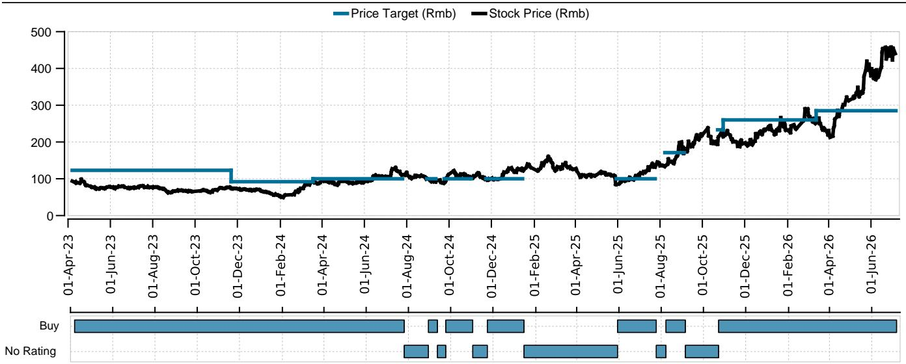

# UBS：常规CCL涨价超预期，UBS揭示AI产能挤占下的新周期

市场对英伟达Kyber正交背板延迟的关注，可能被放大了。UBS最新报告给出一个与多数媒体报道不同的判断：这次延迟早在预期之内，对2026-2027年PCB公司影响有限，真正值得关注的不是时间表推迟，而是材料路线的重新洗牌。

这份报告发布于7月6日，核心信号有三层：Kyber延迟已在5月上游CCL厂商调研中被预判，当前对行业更关键的是常规CCL涨价周期正在加速，以及mSAP产能扩张正在为1.6T/3.2T光模块需求做准备。三个信号指向同一个结论——PCB行业正处于一个结构性分化阶段，不同环节的受益逻辑完全不同。

## 1. Kyber延迟的实质是材料方案尚未收敛，而非项目取消

UBS分析师明确指出，英伟达Kyber正交背板延迟到2028年，与他们在5月从上游CCL供应商处调研得到的预期一致。这并非突发变化，而是技术路线选择过程中的正常波折。

报告拆解了三个核心难点：M9+Q-glass方案加工难度高、供应不足且成本高于其他方案；PTFE作为替代方案性能优异但供应链尚未就绪；100+层PCB对Q-glass和PTFE材料的制造良率要求极高。

> **KC评论：** 读者容易把“延迟”等同于“取消”，但UBS的调研显示，多个材料方案仍在并行推进，PTFE-M9混合方案正成为主要选项。真正需要跟踪的变量不是时间点，而是哪个材料方案最终胜出——这决定了相关PCB供应商的制造壁垒和利润空间。

## 2. 常规CCL涨价周期正在加速，且可持续性超出预期

报告中最具即时冲击力的信息来自常规CCL市场。KBL在6月两轮涨价（15%和10%）之后，7月再次宣布15%的FR4涨价。当前价格已超过上一轮周期峰值约220元/张。

UBS判断这一涨价周期可持续，预计月频涨价将延续至2026年下半年甚至2027年上半年。核心驱动力是AI需求挤占常规产能，而短期内新增产能有限。这与市场对“涨价不可持续”的普遍认知形成反差。

## 3. mSAP产能扩张反映光模块需求正在从预期走向落地

报告披露了三个关键产能扩张案例：Avary宣布募资96亿元用于淮安工厂，新增65.56万平方米高端HDI产能；FastPrint计划募资39亿元，其中20亿元用于珠海mSAP工厂，两年建设期新增12万平方米光模块PCB产能；Victory Giant正在4号工厂投入约10亿元建设mSAP产线。

这些动作背后的需求逻辑是1.6T/3.2T光模块对PCB工艺要求的升级。mSAP工艺成为主流选择，意味着传统PCB制造商的技术壁垒正在被打破，但也意味着先行者的资本开支不确定性不容忽视。

## 4. 报告尚未完全回答的关键问题：材料方案收敛后的赢家格局

UBS明确表示偏好上游CCL而非下游PCB，但在PCB领域，他们倾向于选择AI客户更分散（如ASIC链）且具备进入英伟达供应链能力的公司。这一判断建立在一个未经验证的假设上：PTFE-M9混合方案最终成为主流。

这里存在两个未解问题。其一，如果PTFE供应链准备时间超出预期，Q-glass方案是否会被重新激活？其二，100+层PCB的制造良率瓶颈，是否会限制最终可获取的供应商数量，从而改变竞争格局？对于关注长期布局的读者，这两个问题比短期时间点更重要。

对于产业决策者，这份报告提供了一个观察框架：上游CCL受益于涨价周期，确定性最高；PCB环节则需要区分客户结构和工艺能力，前者决定短期收入韧性，后者决定长期壁垒。在材料方案尚未收敛之前，保持对技术路线的跟踪，比押注单一时间点更为务实。

For informational purposes only. Portions may be generated,translated,summarized,or edited with AI assistance based on source materials and may contain omissions or errors. Please verify independently. This is not investment,legal,tax,accounting,or other professional advice.

For informational purposes only. Portions may be generated,translated,summarized,or edited with AI assistance based on source materials and may contain omissions or errors. Please verify independently. This is not investment,legal,tax,accounting,or other professional advice.

