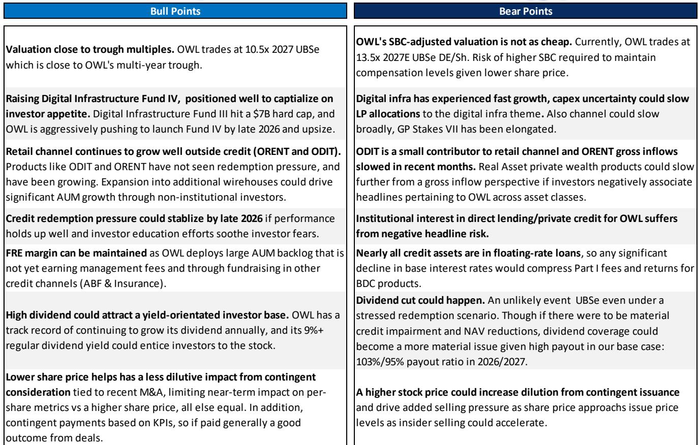
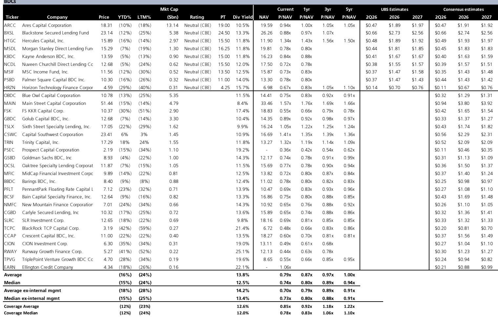
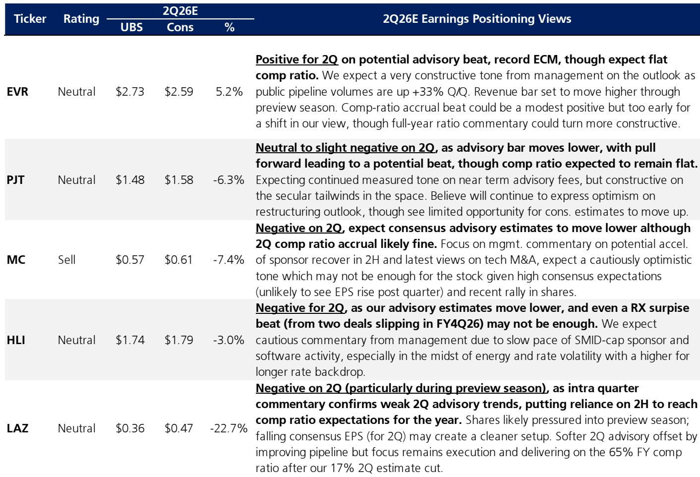

# UBS：黑石KKR利润率近70%，另类资管如何系统蚕食市场

美国资产管理行业正在发生一场并不张扬的洗牌。UBS一份覆盖美国机构与资管机构的研报，用一组对比鲜明的估值和财务数据揭示了一个判断：另类资产管理公司正在系统性蚕食传统资管公司的市场份额与利润池，而市场对这一结构性变化的定价远未完成。

这份报告覆盖了三大类公司——另类资管（黑石、KKR、阿波罗等）、传统资管（贝莱德、富兰克林资源等）以及财富经纪商（嘉信资金规划、LPL等）。数据跨度从2026年预测到2027年预期，呈现的不是短期波动，而是商业模式的分化。

## 1. 另类资管的估值溢价并非情绪驱动，而是盈利结构决定的

报告显示，另类资管公司2026年预期市盈率中位数约为15.9倍，传统资管为13.0倍。表面看差距不大，但深入看盈利质量，差异就清晰了。

另类资管的费用相关收益（FRE）利润率普遍在50%以上，KKR甚至接近70%。相比之下，传统资管的运营利润率多在35-45%区间。更关键的是，另类资管的收益更少依赖市场涨跌——它们从管理费、业绩报酬和自有研究中获取收入，而传统资管高度依赖管理资产规模（AUM）随市场波动的被动增长。

> **KC评论：** 估值差异的核心不在增速，而在收益的“可预测性”。另类资管的FRE相当于订阅收入，传统资管的费用收入更像过路费。市场愿意为前者付更高倍数，逻辑上成立。

## 2. 传统资管面临的真正挑战不是规模，是议价权流失

报告表格中，传统资管公司的预期收入增速并不低，但利润率改善空间有限。贝莱德2026年预期运营利润率46.3%，已属行业领先；但多数传统资管公司仍在35-40%区间。

问题出在定价权。被动产品（ETF、指数产品）持续吞噬主动管理份额，费率节奏变化趋势不可逆。传统资管公司只能靠规模弥补单价损失，但规模增长又面临另类资管在机构客户和超高净值客户中的竞争——后者提供的是私募股权、私募信贷等非流动性溢价产品，费率远高于公募产品。

UBS报告没有明说，但数据指向一个结论：传统资管公司正在失去对客户钱包份额的掌控。另类资管公司管理的资产规模增速远快于行业平均，且它们正在从机构客户向零售高净值客户渗透。

## 3. 财富经纪商是另一个值得关注的“中间地带”

报告中的财富经纪商板块（嘉信资金规划、LPL、RJ等）估值逻辑与资管公司不同，但同样反映行业变迁。这些公司2026年预期市盈率约13.8倍，介于传统与另类资管之间。

它们的竞争力来自客户粘性和现金管理能力。嘉信资金规划的预期ROTCE超过40%，在资金股中极为突出。但不确定性在于，如果利率环境变化压缩净息差，这类公司的收益结构会受到双重挤压——既不像另类资管那样有高FRE利润率，也不像传统资管那样完全依赖AUM。

> **KC评论：** 财富经纪商的价值在于渠道，但渠道价值能否持续高于产品价值，取决于它们能否将客户关系转化为资产管理收入。UBS对嘉信资金规划给出报告观点评级，对RJ给出报告观点，差异或许就来自这一判断。

## 4. 报告尚未完全回答的问题：另类资管的估值天花板在哪里

这份研报覆盖的公司中，传统资管也是28%。表面看预期回报相近，但不确定性收益特征不同。

真正的未解问题是：另类资管当前15.9倍预期市盈率，是否已经反映了FRE利润率的改善预期？KKR的FRE利润率已接近71%，进一步提升空间有限；而传统资管如果能够通过科技手段大幅降低成本，估值修复的可能性同样存在。

报告没有给出一个“应该买哪类”的简单答案，但提供了足够的数据让读者自己判断——另类资管的护城河更深，但估值也更高；传统资管估值便宜，但结构性逆风更持久。

对于关注美国市场的读者，这份报告的价值不在于提到某只公司，而在于提供了一个观察框架：当收益的可预测性成为估值核心变量时，哪些公司真正拥有定价权，哪些只是市场波动的被动受益者。这个框架，同样适用于判断其他行业的竞争格局。

For informational purposes only. Portions may be generated,translated,summarized,or edited with AI assistance based on source materials and may contain omissions or errors. Please verify independently. This is not investment,legal,tax,accounting,or other professional advice.

For informational purposes only. Portions may be generated,translated,summarized,or edited with AI assistance based on source materials and may contain omissions or errors. Please verify independently. This is not investment,legal,tax,accounting,or other professional advice.

