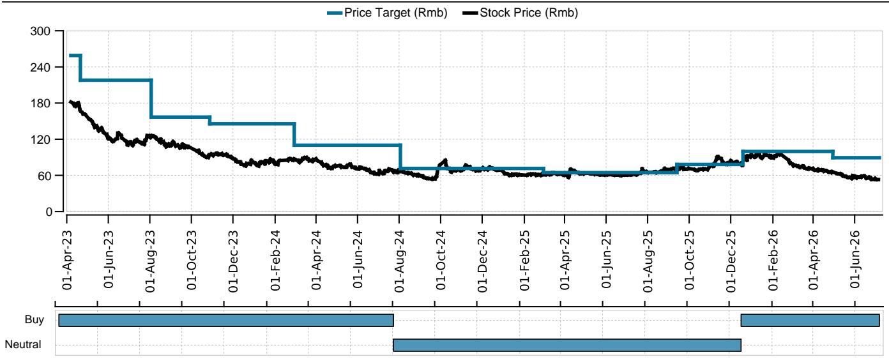
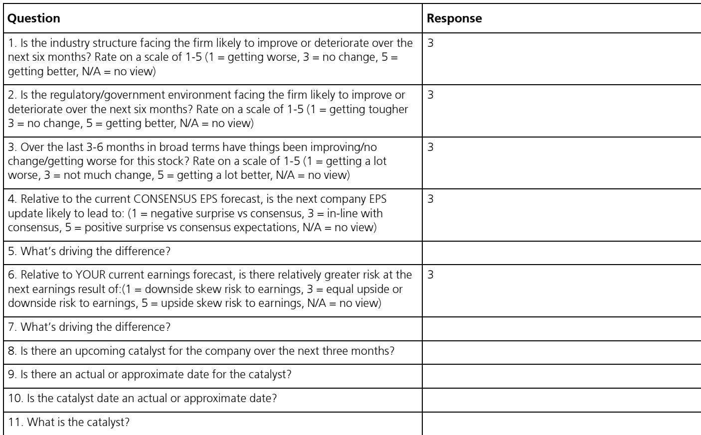
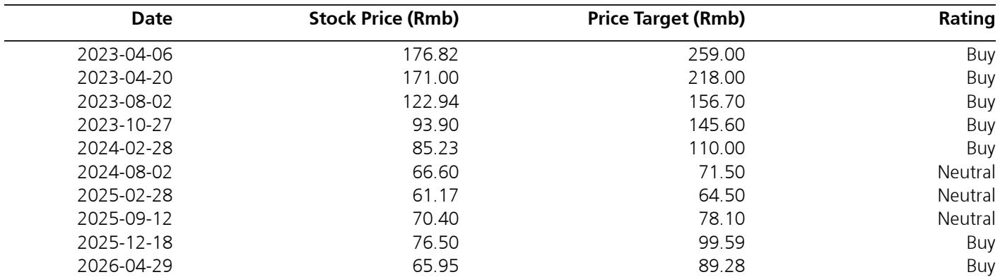

# China Tourism Group Duty Free: Margin Recovery Masks a Revenue Challenge That Only Policy Can Address

The fundamental question facing observers of China Tourism Group Duty Free is no longer about the pace of recovery. It is about whether the company's growth model has structurally changed. For the first time in several quarters, the company's second-quarter revenue is expected to decline year-over-year, according to a recent research report that provides one of the most detailed near-term assessments of the company's trajectory. This is not a temporary fluctuation. It is a signal that the consumer spending adjustment, which has been a persistent market concern, is now materializing in the top line with enough force to outweigh the natural recovery tailwinds that many had expected from the reopening.

The market's instinct will be to focus on the positive: net profit is still expected to grow year-over-year in the second quarter, potentially by more than 20 percent if margins improve. But this is precisely the kind of narrative that requires scrutiny. Profit growth driven entirely by margin recovery, in the absence of revenue expansion, is not a sign of operational health. It is a sign that the company is reducing discounts and optimizing its sales mix to compensate for a shrinking customer base. That is a temporary adjustment, not a durable strategy.

The situation is further complicated by the fact that the magnitude of future earnings growth will depend heavily on government subsidies. The Hainan government has already increased subsidies for duty-free sales in July, including payments to airlines to boost flight volumes. This is a clear admission that the underlying demand is not strong enough to sustain growth on its own. Observers must now ask: what happens when the subsidies fade? And how much of the current earnings trajectory is genuine versus policy-supported?

The answer to these questions will determine whether CTG Duty Free is a value trap or a genuine turnaround story. The report provides the data to frame the debate, but it leaves several critical questions unanswered. This article will unpack the key insights, identify the unresolved analytical tensions, and offer a decision framework for those trying to navigate this complex narrative.

## The Second Quarter Reveals a Divergence That Cannot Be Sustained: Revenue Down, Profit Up

The most striking feature of the second-quarter outlook is the divergence between revenue and profit. Revenue is expected to decline by over 10 percent year-over-year, a sharp deterioration from the first quarter's performance. Yet net profit is expected to grow by a double-digit percentage, with potential upside exceeding 20 percent depending on final net margin outcomes. This is not the kind of divergence that typically signals a healthy business. It signals a company that is squeezing more profit from a smaller revenue base, which is a finite game.

Breaking down the revenue components makes the challenge clear. The Hainan segment, which accounts for over 70 percent of total revenue, is estimated to have grown only about 10 percent year-over-year in the second quarter. That is materially below the 28 percent growth recorded in the first quarter. The deceleration is not subtle. It reflects a broader slowdown in Hainan duty-free sales growth during April and May, which the report attributes to the ongoing impact of consumer spending adjustments. Consumers are still traveling, but they are spending less per trip, and they are trading down to lower-price items.

The other segments tell an equally concerning story. CTG Sunrise, the company's online sales channel, continued to decline year-over-year, and the report does not expect this trend to flatten out within 2026. Airport duty-free sales, despite double-digit growth at Shanghai Airport's Terminal 2 and its satellite terminal, remained in year-over-year decline overall because the company lost operating rights at Shanghai Airport's Terminal 1 and its satellite terminal. That is a structural loss, not a cyclical one. It will not reverse on its own.

The profit improvement, therefore, is coming entirely from internal measures: reduced discounting and a shift in sales mix toward higher-margin products. These are legitimate management actions, and they should be credited. But they cannot offset a declining revenue base indefinitely. At some point, the margin recovery reaches its natural ceiling, and if revenue has not recovered by then, earnings will plateau or decline.

## The Hainan Growth Engine Is Now Dependent on Government Subsidies, Not Consumer Demand

Hainan has been the cornerstone of CTG Duty Free's growth story for years. The island's offshore duty-free policy created a unique competitive position that allowed the company to capture consumers who would otherwise spend abroad. But the report makes clear that this position is now being tested. The sharp slowdown in Hainan duty-free sales growth from 28 percent in the first quarter to an estimated 10 percent in the second quarter is not just a quarterly fluctuation. It is a trend that requires active policy intervention to reverse.

The Hainan government has responded by increasing subsidies for duty-free sales in July, including direct subsidies to airlines to boost flight volumes to the island. The report expects that this will help Hainan duty-free sales growth recover to double digits in July and August. But it also explicitly states that returning to the 20-plus percent growth levels seen in the first quarter will be challenging and will depend heavily on the scale of these subsidies.

This is a critical admission. It means that the company's near-term revenue trajectory is no longer a function of consumer demand alone. It is a function of government fiscal policy. Those who are modeling CTG Duty Free's revenue growth need to incorporate a policy variable that is inherently uncertain. How long will the subsidies last? Will they be increased or reduced? And what happens to the revenue base if they are withdrawn?

The report does not answer these questions, and it cannot. But the implication is clear: the Hainan growth story has shifted from a structural tailwind to a policy-supported one. That changes the risk profile of the observation significantly.

## Consensus Estimates for 2026 and 2027 Face Downside Risk That the Market Has Not Fully Priced

One of the most important contributions of the report is its implicit challenge to consensus earnings estimates for the outer years. The report notes that consensus revenue and earnings estimates for 2026 and 2027 may face downside risk. This is a meaningful statement because it suggests that the consensus may still be too optimistic about the pace of recovery.

Looking at the reported estimates, the analyst's own forecasts for 2026 earnings per share are 2.35 yuan, compared to the consensus of 2.46 yuan. For 2027, the analyst's estimate is 2.85 yuan versus consensus of 2.90 yuan. The gap is not enormous, but it is persistent, and it widens in the nearer term. More importantly, the analyst's revenue forecasts show a gradual recovery path that does not reach 2023 levels until 2028. That is a five-year recovery from the post-pandemic peak, and it assumes that the current margin improvements are sustainable.

The risk is that consensus estimates are still embedding a faster recovery in revenue that may not materialize. If consumer spending adjustments continue, and if government subsidies are not sustained at a sufficient level, the revenue trajectory could be even weaker than the analyst's already cautious forecasts. In that scenario, the margin recovery would eventually hit its limit, and earnings would fall short of both the analyst's estimates and the consensus.

The report's decision to flag this risk explicitly is a service to observers. It forces a re-examination of the base case. Most observers are likely modeling a gradual recovery in revenue and stable margins. The report suggests that revenue may not recover as quickly as assumed, and that margins, while improving, are doing so for reasons that may not be sustainable.

## What the Report Does Not Fully Answer: The Sustainability of Margin Recovery and the Path to Revenue Growth

For all its analytical rigor, the report leaves several critical questions unresolved. The first is the sustainability of the margin recovery. The report attributes the margin improvement to reduced discounting and sales mix optimization. But these are not permanent changes. If revenue continues to decline, the company may face pressure to increase discounting again to defend market share. The competitive dynamics in Hainan are not static. Other duty-free operators and online channels are competing for the same consumer, and if CTG Duty Free holds its prices too high while revenue is falling, it risks losing customers to alternatives.

The second unresolved question is the path to revenue growth. The report identifies government subsidies as the key variable for the near term, but it does not provide a clear view of what would drive organic revenue growth beyond the subsidy period. The overseas expansion into Southeast Asia under the DFS brand is mentioned, but the report provides no details on the scale, timing, or profitability of this initiative. It remains a speculative catalyst, not a concrete driver.

The third question is about the company's competitive position in a post-subsidy environment. If the Hainan government eventually reduces or withdraws its subsidies, will the company have built enough brand loyalty and operational efficiency to sustain its market share? Or will the revenue decline accelerate as consumers revert to other spending channels?

These are not gaps in the report's analysis. They are inherent uncertainties that any observer must grapple with. But they also represent the analytical frontier. The next phase of research on CTG Duty Free will need to focus on these questions, and the answers will determine whether the current valuation is justified.

## A Decision Framework for Observers: Three Questions to Determine Whether the Risk Is Priced In

For those considering CTG Duty Free at its current price of approximately 53 yuan, the key question is not whether the company is a good or bad opportunity. The key question is whether the market has already priced in the risks that the report identifies. The analyst's view relies on assumptions about margin sustainability and subsidy support that may not hold.

A useful decision framework involves three questions. First, what is your view on the duration and magnitude of government subsidies? If you believe the Hainan government will maintain or increase subsidies for at least the next 12 to 18 months, then the near-term revenue and earnings trajectory may be strong enough to support the current valuation. If you believe the subsidies will be reduced sooner than expected, then the downside risk to revenue is significant.

Second, what is your view on the sustainability of margin improvement? If you believe the company can maintain its current discounting discipline and sales mix optimization even as revenue growth slows, then the earnings recovery may be more durable than the market fears. If you believe the company will be forced to increase discounting to defend market share, then the margin recovery is a one-time event, not a trend.

Third, what is your view on the overseas expansion? If you believe the Southeast Asia initiative under the DFS brand will become a meaningful growth driver within the next two to three years, then the long-term story remains intact. If you view it as a speculative and uncertain venture, then the company's growth prospects are entirely dependent on Hainan and domestic airport operations, both of which face structural headwinds.

These three questions do not have easy answers. But they define the analytical terrain. The report provides the data to frame the debate, but it does not resolve it. That is the nature of good research: it clarifies the questions, not just the answers.

## The Unresolved Analytical Tension That Defines This Observation

The most important insight from the report is not any single data point. It is the tension between the near-term earnings improvement and the longer-term structural challenges. The company is generating higher profits from a smaller revenue base, and that is a positive signal in the short term. But it is also a signal that the company's growth model is under pressure, and that the earnings recovery is fragile.

Those who focus solely on the profit growth may be missing the bigger picture. The revenue decline is not a temporary phenomenon that will reverse on its own. It reflects a structural shift in consumer behavior, a policy-dependent growth engine in Hainan, and a loss of operating rights at a key airport. These are not easy problems to solve, and the solutions are largely outside management's control.

The analyst's view reflects a perspective that these risks are already priced into the stock at 53 yuan, and that the margin recovery and subsidy support will be sufficient to drive the stock higher. That is a reasonable view, but it is not a risk-free one. The report provides the evidence to support both the positive case and the cautious case. The observer's job is to decide which one is more likely.

*For informational purposes only. Portions may be generated, translated, summarized, or edited with AI assistance based on source materials and may contain omissions or errors. Please verify independently. This is not professional advice.*
