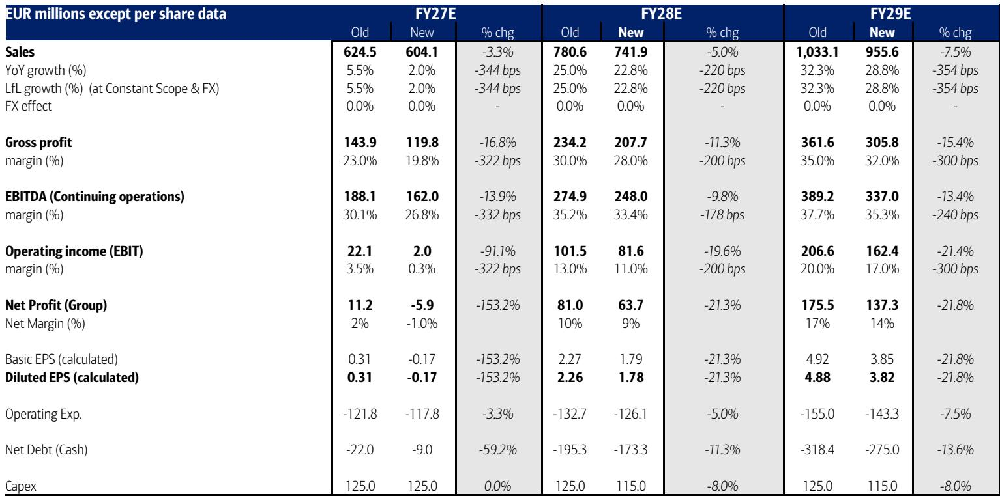
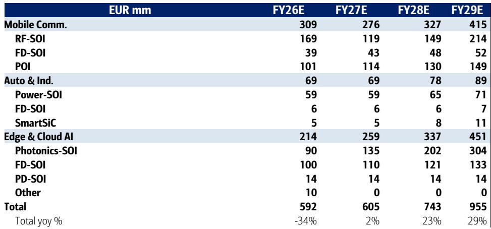
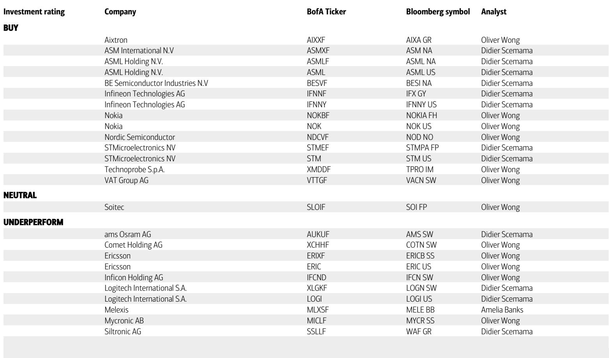

# BofA：市场误判Soitec光子学增速？BofA指移动端影响盈利拐点

这份来自BofA的报告，核心判断并非关于Soitec在光子学领域的潜力——实际上，市场对此已经充分预期。真正的不确定性在于其基本盘：移动通信业务，幅度接近30%，背后是对智能手机市场变化和客户库存消化的审慎评估。

BofA认为，Soitec从FY26的盈利低谷中复苏是确定的，但节奏和幅度远不如市场想象的那么乐观。当市场聚焦于光子学带来的AI增量时，移动端这个占比过半的板块，正在影响整体盈利修复的斜率。

## 1. 市场对光子学的增长假设，可能过于激进

报告最值得关注的洞察在于，市场共识（consensus）对Soitec光子学业务的增长预期，已经隐含了远超行业基本面的乐观情绪。BofA测算，市场预计FY27-29年光子学-SOI收入分别增长28%、34%和43%，这一增速显著高于BofA基于总晶圆面积（die area）CAGR预测的50%复合增长率。

关键问题在于，光子学-SOI的增长并非线性。它依赖于多个尚未明确的变量：NPO/CPO（近封装/共封装光学）的爬坡时间表、光引擎对PIC（光子集成电路）尺寸的要求变化、以及不同收发器速率下的良率表现。这些变量既有上行也有节奏变化，但市场似乎已经将最乐观的NPO/CPO渗透率增长“定价”了进去。

> **KC评论：** 当一家公司的报价已经反映了最乐观的技术路线图时，任何技术落地节奏的延迟，都可能成为报价的谨慎催化剂。完整报告中关于不同技术路径假设的敏感性分析，值得细读。

## 2. 移动端才是决定短期业绩走向的关键变量

Soitec的移动通信业务在FY26贡献了超过一半的收入。BofA判断，智能手机厂商的提价行为将进一步影响终端需求，导致市场对FY27年移动业务仅下降6%的预期存在不确定性。BofA自己的模型更为保守，预计下降11%。

更值得关注的是RF-SOI的库存问题。报告指出，客户库存水平仍处于较高位置，且由于终端市场仍在调整，库存消化的速度正在发生变化。这意味着，即使光子学业务保持高增长，它也无法完全对冲基本盘的变化。FY27的盈利拐点，其高度将更多取决于移动端库存何时见底，而非光子学的爆发。

## 3. 报告尚未完全回答：市占率格局正在发生怎样的变化

BofA在报告中提出了一个关键但未完全展开的疑问：GlobalWafers在光子学/RF-SOI领域的产能爬坡计划，尚未被充分评估。这直接关系到Soitec未来的市场份额。

目前市场对Soitec的估值，很大程度上建立在其在特殊SOI衬底领域的领先地位上。如果竞争对手的产能规划顺利落地，Soitec在光子学-SOI上的定价权或份额将面临变化。报告虽然提及了这一点，但并未给出量化的分析。对于读者而言，跟踪GlobalWafers的产能进展，其重要性可能不亚于跟踪Soitec自身的订单。

## 4. 观察框架：从“增长故事”转向“盈利修复节奏”

对于关注Soitec的读者，BofA的报告提供了一个更务实的观察框架：不应再以“AI光子学”的爆发力来线性外推其市值空间，而应聚焦于以下三个维度的兑现节奏：

第一，移动端库存消化何时完成。这是FY27-28年盈利修复的最大前提。第二，光子学-SOI的季度收入增速是否开始收敛于行业40%的CAGR，而非市场预期的更高水平。第三，竞争对手的产能规划是否开始影响Soitec的定价能力。

只有当这三个变量都给出清晰的、向上的信号时，Soitec的盈利修复故事才能重新获得市场的关注。

For informational purposes only. Portions may be generated,translated,summarized,or edited with AI assistance based on source materials and may contain omissions or errors. Please verify independently. This is not investment,legal,tax,accounting,or other professional advice.

For informational purposes only. Portions may be generated,translated,summarized,or edited with AI assistance based on source materials and may contain omissions or errors. Please verify independently. This is not investment,legal,tax,accounting,or other professional advice.

