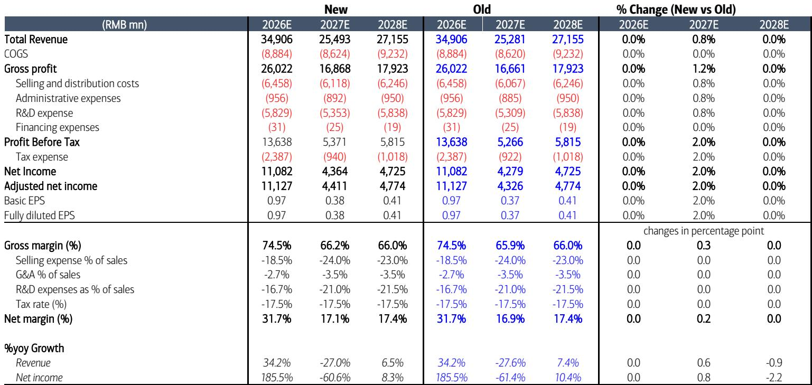
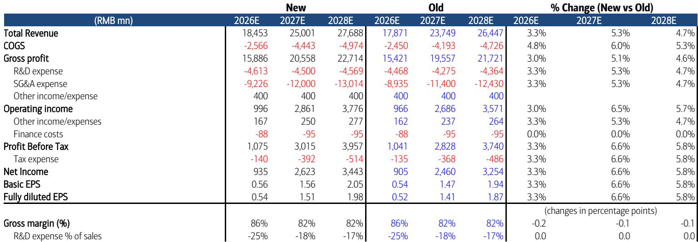
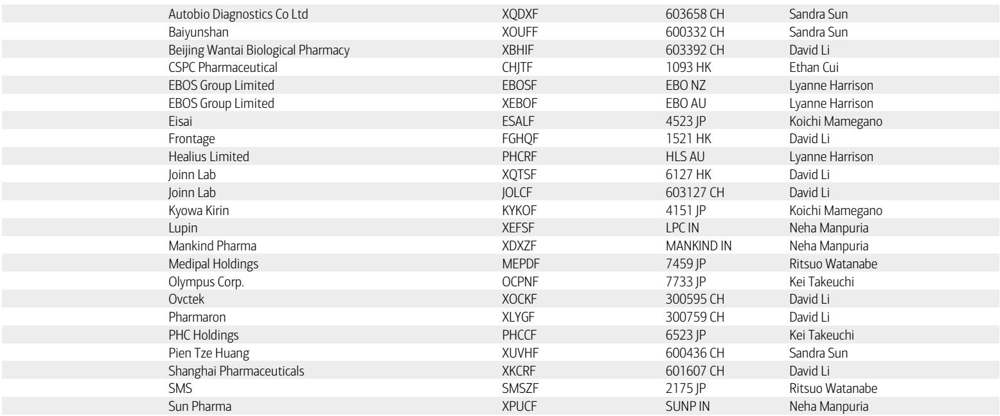

# BofA：中国医药行业交易活跃度正在驱动新一轮市场定价

中国医药行业正在经历一个关键转折：交易活跃度与研发进展的共振，开始推动市场重新审视。BofA在最新一期行业报告中指出，这轮变化并非单纯的政策回暖，而是由具体公司的战略动作和临床数据共同支撑的结构性修复。报告覆盖的四家公司——石药集团、固生堂、信达生物和恒瑞医药——各自展示了不同的增长路径，但背后指向同一个判断：行业已经从“集采冲击”过渡到“创新兑现”阶段。

> **KC评论：** BofA的“重估”判断值得注意。它不是简单地说“行业变好了”，而是强调催化剂密度——合作、并购、临床数据——正在累积到足以改变市场对个别公司未来现金流的预期。这种“微观驱动宏观”的修复，比政策口号更扎实。

## 1. 大型药企的“合作换空间”策略正在被市场验证

石药集团与阿斯利康的 siRNA 平台合作，是这份报告中最具信号意义的交易。石药获得 3000 万美元首付款，并有资格获得最高 12 亿美元的里程碑付款。BofA将石药的报价上调至 7.6 港元，但维持“弱于大盘”评级。这个看似矛盾的判断背后，是报告的核心洞察：石药现有主力产品的销售不确定性，仍然大于新合作带来的增量。合作的价值在于打开了长期技术平台变现的想象空间，而非短期内扭转基本面。

信达生物则走了另一条路——通过承接礼来的 CDK4/6 抑制剂 Verzenios 在中国大陆的商业化，直接补充收入。BofA因此将信达 2026-2028 年收入预期上调 3.3%-5.3%。信达的案例说明，当一家公司拥有成熟的商业化网络时，它可以从跨国药企的“中国授权退出”中获益。

## 2. 恒瑞的研发管线密度才是真正的护城河

恒瑞医药近期多个创新药获批临床和市场申请获受理，包括 SHR-A1811 的第三个适应症（HER2 低表达转移性乳腺癌）获得优先审评。BofA认为其创新药组合在 2026 年可实现 30% 的收入增长。报告没有回避隐忧——新一轮反腐可能影响低线城市的仿制药业务——但核心判断是：恒瑞的创新药增速足以覆盖仿制药不确定性。

> **KC评论：** 恒瑞的案例值得追问一个报告未完全回答的问题：当一家公司的创新药收入占比超过 60% 后，市场是否应该用“创新药企”而非“传统药企”的估值框架来定价？BofA的 DCF 模型假设了 3.5% 的终端增长率，这个数字在创新药企中是否偏低，是读者可以在原文中进一步验证的关键假设。

## 3. 医疗服务领域的“并购整合”逻辑尚未被充分定价

固生堂通过收购沙河医院和北京红阳医院，正在北京建立更密集的医疗服务网络。BofA维持“观点偏积极”评级和 32.60 港元的报价。这笔交易的特殊之处在于，固生堂用的是近期配股和可转债募集的资金，而非债务——这意味着管理层的资本配置纪律仍然克制。但报告尚未完全回答的问题是：在消费环境偏弱的背景下，中医服务的需求韧性能否支撑这些新收购医院的盈利爬坡。

## 4. 报告尚未完全回答的关键问题：重估的可持续性取决于什么

BofA的报告给出了清晰的上行催化剂，但三个未解问题值得读者关注。第一，石药在维持“弱于大盘”评级的同时上调报价，意味着现有产品的集采不确定性何时见底，仍然存在不确定性。第二，信达的 CDK4/6 收入贡献要到 2026 年下半年才开始体现，短期业绩能否支撑当前估值，需要观察 PD-1 等核心产品的销售节奏。第三，恒瑞的创新药 30% 增速假设，建立在反腐对仿制药影响可控的前提上——这个假设在低线城市的验证还需要时间。

对于关注中国医药行业的读者，这份报告提供了一个实用的观察框架：不要只看政策方向，而是追踪每家公司“交易密度”和“临床密度”的变化。合作公告的数量、首付款规模、临床适应症的扩展速度——这些微观指标的累积，才是市场定价重估的真正先行信号。

For informational purposes only. Portions may be generated,translated,summarized,or edited with AI assistance based on source materials and may contain omissions or errors. Please verify independently. This is not investment,legal,tax,accounting,or other professional advice.

For informational purposes only. Portions may be generated,translated,summarized,or edited with AI assistance based on source materials and may contain omissions or errors. Please verify independently. This is not investment,legal,tax,accounting,or other professional advice.

