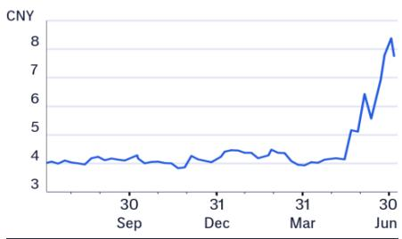
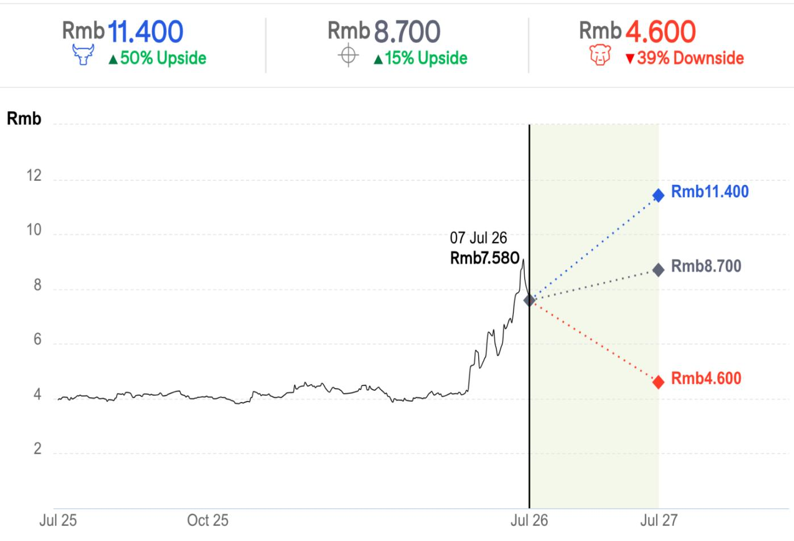
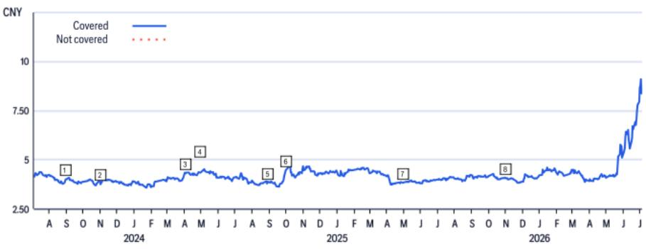

# 京东方A (000725.SZ)

评级调整至中性，玻璃基板预期或已反映在估值中

## Citi观点

我们参加了京东方读者日活动。京东方重申其作为全球显示领域领导者的地位，同时强调其下一阶段增长将由核心能力向玻璃基先进封装、光互连、钙钛矿光伏、可折叠玻璃等领域的延伸所驱动。京东方预计将在2027年年中前就大规模量产投资做出最终决定。其光互连器件仍处于验证阶段，尚未进入量产，但京东方目标是在2028年推出符合1.6T、3.2T和6.4T行业要求的成熟多通道产品演示。我们将京东方评级从买入下调至中性，新目标价为8.7元（此前为5.0元），因我们认为当前估值已反映了LCD业务的改善和潜在的玻璃基板贡献。

京东方的第二和第三增长曲线日益清晰——自2021年启动物联网转型以来，京东方已在超过20个细分领域（包括车载显示、商用显示和公共医疗）实现全球出货量第一。管理层表示，创新业务收入预计在2026年达到600亿元，约占总收入的30%，并成为主要增长支柱。第三曲线孵化组合包括钙钛矿光伏、玻璃基封装基板、光通信/互连、汽车调光玻璃、再生医学、机器人、VR/AR和3D光场显示。

与康宁的合作——京东方与康宁已建立战略合作伙伴关系，以在四大关键技术前沿领域开拓全球市场机会。在玻璃基封装基板方面，京东方正将康宁的TGV配方与其在大规模制造方面的经验相结合，以进行工艺认证、技术转让和国内市场拓展。在光互连方面，京东方将把其Micro-LED技术与康宁的光学系统相结合，为下一代AI数据传输实现量产准备。双方还在验证可折叠和可弯曲玻璃，以将应用从智能手机扩展到更广泛的汽车和IT领域。在钙钛矿光伏方面，京东方正在测试康宁的专用紫外转换玻璃，以提升组件效率和寿命。在这些联合验证的推动下，京东方目标是在2026年底或2027年初就钙钛矿业务做出最终量产投资决定，预计该业务将在2028-29年发展为主要业务支柱。（续内/下页...）

## 盈利摘要

<table><tr><td>截至12月31日</td><td>净利润（百万元）</td><td>摊薄每股收益（元）</td><td>每股收益增长率（%）</td><td>市盈率（倍）</td><td>市净率（倍）</td><td>净资产回报表现（%）</td><td>股息率（%）</td></tr><tr><td>2024A</td><td>5,323</td><td>0.141</td><td>110.5</td><td>54.9</td><td>2.2</td><td>4.1</td><td>0.6</td></tr><tr><td>2025A</td><td>5,857</td><td>0.156</td><td>10.4</td><td>49.7</td><td>2.2</td><td>4.4</td><td>0.7</td></tr><tr><td>2026E</td><td>7,560</td><td>0.203</td><td>30.1</td><td>38.2</td><td>2.0</td><td>5.5</td><td>0.9</td></tr><tr><td>2027E</td><td>9,469</td><td>0.256</td><td>25.9</td><td>30.4</td><td>1.9</td><td>6.5</td><td>1.2</td></tr><tr><td>2028E</td><td>12,037</td><td>0.325</td><td>27.1</td><td>23.9</td><td>1.8</td><td>7.6</td><td>1.5</td></tr></table>

来源：Powered by dataCentral

中性 ↓ 自买入

价格（2026年7月6日15:00）7.760元

目标价 8.700元↑

预期股价回报率 12.1%

预期股息率 0.9%

预期总回报率 13.0%

市值 285,023百万元

## 价格表现

黄 Karen $^{AC}$ +852-2501-2755
karen.xw.huang@citi.com

王 Kyna
+852-2868-7820
kyna.wong@citi.com

陈 Kevin
+852-2501-2125
kevin.y.chen@citi.com

玻璃基封装基板。虽然玻璃基板正成为高端AI和HPC应用中传统PCB的优质替代品，但京东方正在快速推进其产业化进程。凭借六年以上的经验，京东方于2024年建立了中国大陆首条玻璃基板试验线，并于2025年成功交付第二代样品。公司已克服主要技术瓶颈，在TGV钻孔（达到20:1深宽比）、无空洞金属填充、高密度布线（支持超过20层积层，线宽小于2μm）和无碎屑切割方面取得重大突破。关键的是，京东方的基板已通过严格的行业可靠性测试，即使在高温回流焊过程中也表现出极低的翘曲。未来两年，京东方将优先关注良率优化、稳定的量产能力以及与生态系统合作伙伴共同进行创新的减层设计。京东方预计将在2027年年中前就量产投资做出最终决定。

光互连与Micro-LED光源。京东方正在推进其光互连技术，其开发的Micro-LED光源具有1.8GHz响应速度和3Gbps传输速率。京东方还与康宁及其他合作伙伴合作开发高纯度光纤、光桥、波导及相关光传输技术。为推动技术落地，京东方已制定清晰的路线图：计划在2027年前推出二维多通道演示，随后在2028年推出符合1.6T、3.2T和6.4T行业要求的成熟产品演示。最终，京东方旨在将这些创新转化为量产，并将其应用扩展到数据中心和汽车互连场景。

## 与康宁的合作

与康宁披露的核心合作领域包括玻璃基先进封装基板、光互连、可折叠或可弯曲玻璃以及钙钛矿玻璃材料。双方旨在共同开发全球市场，并可能创造一项或多项千亿元规模的新业务机会。

第一个核心合作领域是玻璃基封装基板。在AI时代，算力的提升推动了对更大IC尺寸、更高封装堆叠复杂度和更严格物理层要求的需求。传统PCB基板在翘曲、平整度和耐热性方面日益面临限制。康宁将提供专为玻璃通孔（TGV）应用开发的玻璃和工艺技术。京东方将贡献其在玻璃基加工和大规模制造方面的优势。合作将分三步进行：（1）完成新玻璃配方及相关工艺的系统性认证。（2）技术转让。（3）共同开发玻璃基先进封装的本土战略市场。对京东方而言，合作重点包括高性能玻璃基板的导入实验、总厚度偏差（TTV）等关键工艺的优化以及基板可靠性的提升。

第二个核心合作领域是光互连。随着AI驱动数据传输需求大幅增长，传统铜互连面临带宽、功耗和散热瓶颈。京东方和康宁认为行业正从铜传输向光传输转变。康宁可提供光纤、连接器和光学系统技术，体现其在光传输领域的全栈能力。京东方将贡献其Micro-LED光源技术。京东方指出，相关光互连技术也是未来Glass Bridge技术的核心推动力。双方旨在共同推进技术落地和量产准备。

第三个核心合作领域是可折叠或可弯曲玻璃。初期重点是材料验证和系统集成。未来的市场拓展将不限于智能手机。京东方和康宁将聚焦于汽车和IT领域的更广泛应用，可折叠和可弯曲玻璃有望在这些领域打开更大的可寻址市场。

第四个核心合作领域是钙钛矿光伏。康宁将提供可将紫外光转换为可见光的特种玻璃材料。通过利用玻璃本身的固有特性，该材料可在无需涂层的情况下提升钙钛矿转换效率。由于没有涂层，效率提升不会随时间衰减，使玻璃能够满足钙钛矿组件15-20年的寿命要求。对京东方而言，与康宁的合作将聚焦于紫外性能优化、功率衰减改善和光伏组件兼容性测试。京东方预计钙钛矿业务将在2026年底或2027年初满足量产投资决策的条件，具体取决于发电效率、稳定性和产品寿命的要求。管理层预计钙钛矿将在2028-29年逐步成为一项重要业务。

## 玻璃基封装基板

高端封装基板需要支持大面积、低翘曲、高密度布线和低介电损耗。传统PCB材料在AI和HPC应用中日益面临限制。玻璃基板相比传统材料具有三大优势：（1）热膨胀系数（CTE）接近硅，翘曲度低。（2）能够实现非常小的通孔直径，支持AI芯片的高密度封装。（3）热性能优异，支持高算力场景下的散热需求。

封装相关的玻璃技术可分为三类：（1）面板级封装（PLP）。方形玻璃用作载板，在晶圆级封装后剥离。（2）玻璃中介层。用于高端、高密度的直接芯片到芯片连接。（3）玻璃基板。作为芯片和PCB之间的连接层。其中，玻璃基板是目前产业化进展最快的方向。

主要技术瓶颈包括：（1）TGV钻孔。工艺必须解决20:1深宽比的钻孔、密集/稀疏和大/小孔的同时加工、圆度合格、无开路和无隐藏裂纹等问题。（2）金属填充。必须确保电镀均匀性。表面铜和通孔铜厚度需保持一致。填充必须无空洞，同时需管理金属与玻璃之间的应力。（3）积层和切割。多层积层可能导致应力累积和线路断裂。积层后切割脆性玻璃需要无碎屑切割技术。还需为透明玻璃开发自动化检测方案。

京东方已积累超过六年的TGV封装工艺经验。2020年，公司开始进行单工序和材料验证。2022年，京东方投资建设了510mm × 515mm大面板宽度的试验线。该产线在设备搬入后六个月实现全流程贯通。京东方还拥有一个8英寸实验线平台，用于基础材料和配方验证。2024年，京东方建成了中国大陆首条玻璃基板创新试验线。公司已完成客户概念验证。2025年，京东方交付了第二代样品。510mm × 515mm产线是一条完整的量产验证线，投资数亿元，其中自动化设备投资超过1亿元。该产线可验证自动化良率和板级小批量生产，为未来量产评估提供高精度参考。

京东方已取得显著的工艺进展：（1）TGV工艺。深宽比可达20:1。腰部直径可在65μm至100μm之间调节。圆度超过90%。拐角和孔壁无裂纹。（2）填充工艺。电镀均匀性低于5%。表面铜和通孔铜厚度一致性达到80%。无堵孔或气泡。（3）布线工艺。线宽低于2μm。线间距大于2μm。对位精度为1μm。布线均匀性低于5%，无断线。京东方可实现超过20层积层和垂直堆叠通孔，支持高密度互连要求。（4）切割工艺。可实现无碎屑切割，切割角度为90度，100%垂直。

京东方的单层基板已通过行业标准可靠性测试，包括1000次温度循环、HAST、高低温存储和高温高湿老化。一个75mm × 75mm的样品在室温下翘曲仅为40μm。在加热至260°C进行回流焊后仍保持低翘曲，支持AI和HPC芯片的要求。

未来两年，京东方的关键优先事项是良率提升和稳定、可持续的量产能力。公司还将加强与生态系统合作伙伴的合作，以克服剩余的工艺挑战，并进一步探索玻璃基板在减层设计和封装架构优化中的核心价值。管理层强调，除大面积优势外，玻璃基封装基板还通过减层设计创造价值。通过使用矩形布线路径优化封装架构，玻璃基板有望带来显著的系统级价值。京东方预计将在2027年年中前满足玻璃基板量产投资决策的条件。

## 光互连与Micro-LED光源

京东方已与上下游企业和高校建立联合项目团队。当前进展包括具有1.8GHz响应速度和3Gbps传输速率的Micro-LED光源。与VCSEL等光源相比，Micro-LED具有更低的功耗和更低的温度敏感性。它可在100°C以上稳定工作，在提升数据稳定性的同时降低温控和散热能耗。公司正在开发高速光电二极管、光驱动器、电驱动器、电芯片和传输协议，目标是构建成熟的完整解决方案。京东方还与康宁及其他合作伙伴合作开发高纯度光纤、光桥、波导及相关光传输技术。光互连器件仍处于验证阶段，尚未进入量产。京东方旨在继续与国内外研究机构和行业伙伴合作，推进技术落地。京东方的路线图如下：（1）2027年，推出二维多通道Micro-LED光互连解决方案演示。（2）2028年，推出符合1.6T、3.2T和6.4T行业要求的成熟多通道产品演示。（3）将应用扩展到数据中心、汽车互连等场景。

## 第三代半导体与氮化镓

京东方华灿已完成氮化镓（GaN）试验线的建设，现已具备初步量产条件。其650V高压产品已通过客户验证。公司预计在2026年底前推出40V低压产品。计划后续扩展到车规级和AI场景应用。在GaN功率电子方面，京东方华灿已通过其义乌GaN试验线向客户交付了第二代高压GaN器件产品。GaN产品仍处于优化阶段。相关产品可能在2027年推出，未来应用目标为AI、工业和车规级功率芯片。据公司表示，可能在适当时机考虑大规模投资。

## 显示

折旧与资本支出。据公司表示，核心产线正产生可观的盈利能力，重庆和福建的Gen-8.5产线净利率均超过20%。两条Gen-10.5产线通过质量和效率提升，在未扩产的情况下持续增加出货量。折旧可能在2025年达到峰值；虽然由于B16的折旧，2027年可能略有增加，但京东方表示整体折旧趋势是下降的。公司还预计在OLED Gen-8.6产线完成后，资本支出将下降。

LCD电视行业整合可能接近完成。2026年五大LCD电视面板厂商的集中度与2025年相比保持平稳，京东方预计随着行业集中度提升，领先显示公司将占据更大份额。公司认为存储价格上涨对较小尺寸电视产品的影响更大，推动市场向更大尺寸电视发展。70-75英寸电视的出货份额从2025年的8%增加到2026年的22%。京东方预计2026年80英寸及以上电视的出货量将比2025年增长超过20%。这将推动电视平均尺寸持续增长。京东方预计2027年电视平均出货尺寸将达到55英寸。管理层将55英寸视为电视面板行业的关键门槛。一旦电视平均出货尺寸达到55英寸，公司认为电视领域可能实现供需平衡。京东方预计这将在2027年发生，这对作为大尺寸面板领导者的京东方将是有利的。

OLED行业的竞争可能在未来两年持续。京东方预计2026年全球OLED智能手机需求将下降10-17%，主要由于存储价格上涨推高终端价格并抑制消费需求。国内智能手机品牌面临一定情况。尽管如此，京东方的OLED业务在2026年上半年保持了稳定增长。然而，该业务在运营层面仍处于亏损状态。管理层预计OLED行业的竞争将在未来两年持续。2026年上半年对关键客户的供应量持续增长。

存储价格影响。据京东方表示，下游终端品牌应对高存储价格的方式主要有两种。首先，它们正在降低规格以缓解成本压力。这在电视、IT和智能手机品类中均有体现。其次，它们正在推出更高规格的产品以提升消费者感知价值并抵消价格上涨。据京东方称，部分OEM厂商已提高了对高规格产品的运营预期。

## 盈利预测调整与评级下调

结合管理层对显示行业的评论及其创新业务指引，我们上调2026/2027年净利润预测9%和6%，主要由于创新业务收入增长部分抵消了消费电子领域的表现。我们还引入了2028年预测。我们得出新目标价8.7元（此前为5.0元），基于2026年每股净资产2.3倍市净率（此前为2025年预期每股净资产1.4倍），设定在其五年估值倍数峰值，以反映LCD业务的集中度和盈利能力改善，以及从2027年开始市场对玻璃基板应用的积极情绪。

我们认为，一旦玻璃基板在国内得到广泛应用，京东方可能成为主要受益者，但应用时间表和渗透率仍不明朗。同时，由于京东方预计将在2027年年中前做出最终量产投资决定，而产线建设可能需要两年时间，我们认为玻璃基板在2029年之前不太可能产生有意义的净利润贡献。我们将京东方评级从买入下调至中性，因我们认为当前估值已反映了LCD业务的改善和潜在的玻璃基板贡献。

图1. 京东方预测调整

<table><tr><td></td><td colspan="3">2026E</td><td colspan="3">2027E</td><td colspan="3">2028E</td></tr><tr><td>百万元</td><td>新</td><td>旧</td><td>变动</td><td>新</td><td>旧</td><td>变动</td><td>新</td><td>旧</td><td>变动</td></tr><tr><td>收入</td><td>202,658</td><td>213,703</td><td>-5%</td><td>212,084</td><td>225,488</td><td>-6%</td><td>227,114</td><td>n.a.</td><td>n.a.</td></tr><tr><td>毛利</td><td>32,951</td><td>33,254</td><td>-1%</td><td>36,096</td><td>36,170</td><td>0%</td><td>40,867</td><td>n.a.</td><td>n.a.</td></tr><tr><td>运营支出</td><td>(22,307)</td><td>(21,992)</td><td>1%</td><td>(23,407)</td><td>(22,736)</td><td>3%</td><td>(25,005)</td><td>n.a.</td><td>n.a.</td></tr><tr><td>营业利润</td><td>10,644</td><td>11,262</td><td>-5%</td><td>12,689</td><td>13,434</td><td>-6%</td><td>15,861</td><td>n.a.</td><td>n.a.</td></tr><tr><td>税前利润</td><td>9,781</td><td>9,630</td><td>2%</td><td>11,836</td><td>12,427</td><td>-5%</td><td>15,047</td><td>n.a.</td><td>n.a.</td></tr><tr><td>净利润</td><td>7,560</td><td>6,933</td><td>9%</td><td>9,469</td><td>8,947</td><td>6%</td><td>12,037</td><td>n.a.</td><td>n.a.</td></tr><tr><td>比率（%）</td><td></td><td></td><td></td><td></td><td></td><td></td><td></td><td></td><td></td></tr><tr><td>毛利率</td><td>16.3%</td><td>15.6%</td><td>0.7ppts</td><td>17.0%</td><td>16.0%</td><td>1.0ppts</td><td>18.0%</td><td>n.a.</td><td>n.a.</td></tr><tr><td>运营支出占收入比</td><td>11.0%</td><td>10.3%</td><td>0.7ppts</td><td>11.0%</td><td>10.1%</td><td>1.0ppts</td><td>11.0%</td><td>n.a.</td><td>n.a.</td></tr><tr><td>营业利润率</td><td>5.3%</td><td>5.3%</td><td>0.0ppts</td><td>6.0%</td><td>6.0%</td><td>0.0ppts</td><td>7.0%</td><td>n.a.</td><td>n.a.</td></tr><tr><td>净利润率</td><td>3.7%</td><td>3.2%</td><td>0.5ppts</td><td>4.5%</td><td>4.0%</td><td>0.5ppts</td><td>5.3%</td><td>n.a.</td><td>n.a.</td></tr></table>

来源：Citi  
© 2026 Citi集团。未经Citi书面许可不得转载。

## 牛市/熊市：京东方A (000725.SZ)

  
价差 90pp
当前价格及预期回报（上行/下行）截至2026年7月7日

## 牛市假设

\- 面板业务市净率2.3倍，潜在玻璃基板贡献市盈率50倍

## 基准假设

\- 市净率2.30倍

## 熊市假设

• 市净率1.1倍，五年均值

## 京东方A

## 公司描述

京东方成立于1993年，于1997年在深圳证券交易所上市。公司专注于大尺寸及中小尺寸面板的制造。京东方的TFT-LCD生产线包括Gen 4、Gen 5、Gen 6和Gen 8。公司还在合肥投资建设了Gen 10.5工厂。据IHS数据，京东方的Gen 10.5工厂于2018年4月开始生产65英寸面板并向多家电视制造商出货。

## 投资策略

我们对京东方给予中性评级，因我们认为当前估值已反映了以下基本面：1）LCD供需关系改善，推动京东方基本面改善和净资产回报表现提升；2）京东方在领导力、成本效率和多元化组合方面比同行更具韧性，其风险回报特征具有吸引力；3）京东方应是国内玻璃基板应用的主要受益者。

## 估值

我们的目标价8.7元基于2026年预期每股净资产2.3倍市净率，设定在其五年估值倍数峰值，以反映LCD业务的集中度和盈利能力改善，以及从2027年开始市场对玻璃基板应用的积极情绪。我们使用市净率对京东方进行估值，因为该公司是周期性、重资产公司，我们认为市净率是合适的指标。

## 风险

可能导致股价偏离我们目标价的关键风险包括：（1）面板价格复苏快于/慢于预期；（2）面板需求强于/弱于预期；（3）终端销售高于/低于预期；（4）玻璃基板采用或应用加速/减速。

如果您有视觉障碍并希望与Citi代表就本文件中图形的详细信息进行沟通，请致电美国1-888-500-5008（TTY：711），或从美国境外拨打+1-210-677-3788

## 附录A-1

## 分析师认证

主要负责本研究报告准备和内容的研究分析师要么（i）在作者栏中以“AC”标识，要么（ii）以粗体列出，并附有该分析师负责的内容。如果作者栏中指定了多位AC分析师，每位分析师仅就整个研究报告进行认证，但（a）归属于另一位以粗体列出的AC认证分析师的内容以及（b）仅针对特定发行人的观点（归属于下方该发行人价格图表或评级历史表中标识的另一位AC认证分析师）除外。这些分析师中的每一位就其负责的报告部分认证：（1）其中表达的观点准确反映了他们各自对所涉发行人和证券的个人观点，并且是独立准备的，包括对Citi全球市场公司及其关联方的独立观点；（2）研究分析师的薪酬中没有任何部分直接或间接与本研究报告中所表达的具体建议或观点相关。

## 重要披露

  
\*表示变更

<table><tr><td colspan="2">日期</td><td rowspan="2">评级1H</td><td rowspan="2">目标价*5.20</td><td rowspan="2">收盘价4.01</td></tr><tr><td>1</td><td>2023年8月31日 11:48:52</td></tr><tr><td>2</td><td>2023年11月1日 11:19:28</td><td>1H</td><td>*4.70</td><td>3.75</td></tr><tr><td>3</td><td>2024年4月2日 18:42:12</td><td>*1</td><td>*5.20</td><td>4.30</td></tr></table>

上述评级/目标价变化反映东部时间
CW - 催化剂观察，STV - 短期观点
上述评级/目标价变化反映东部时间

分析师的薪酬由Citi管理层和Citi高级管理层确定，并基于旨在惠及Citi全球市场公司及其关联公司（“公司”）读者客户的活动和服务。薪酬不与特定交易或建议挂钩。与所有公司员工一样，分析师的薪酬受到公司整体盈利能力的影响，包括投资银行、销售和交易以及自营交易收入。股票研究分析师薪酬的一个因素是安排机构客户与被覆盖公司管理团队之间的企业接触活动。通常，当分析师对公司持积极看法时，公司管理层更有可能参与。

对于本产品中推荐的非做市商金融工具，公司是该等金融工具（及其任何基础工具）的流动性提供者，并可能作为主事人就该等工具的交易进行交易。公司是与本产品中可能推荐的证券挂钩的可交易金融工具的常规发行人。公司定期交易本产品中讨论的发行人（们）的证券。公司可能以与本产品不一致的方式进行证券交易，并且对于本产品所涵盖的证券，将按主事人基础向客户买入或卖出。

除非另有说明，研究分析师或其团队的任何成员在过去12个月内均未实地考察过已提供投资观点的公司的运营情况。

有关本Citi产品（“产品”）所涉公司的重要披露（包括历史披露副本），请联系Citi，地址：388 Greenwich Street, 6th Floor, New York, NY, 10013，收件人：Legal/Compliance [E6WYB6412478]。此外，相同的重要披露（估值和风险评估以及历史披露除外）包含在公司披露网站上，网址为：

https://www.citivelocity.com/cvr/eppublic/citi\_research\_disclosures。估值和风险评估可在关于标的公司的最新研究笔记/报告的正文中找到。根据《市场滥用条例》，过去12个月内发布的所有Citi建议的历史记录可通过CitiVelocity（https://www.citivelocity.com/cv2）或您的标准分发门户访问。历史披露（最多过去三年）将应要求提供。

Citi股票评级分布

<table><tr><td colspan="7">Citi股票评级分布</td></tr><tr><td></td><td colspan="3">12个月评级</td><td colspan="3">催化剂观察</td></tr><tr><td>数据截至2026年7月1日</td><td>买入</td><td>持有</td><td>卖出</td><td>买入</td><td>持有</td><td>卖出</td></tr><tr><td>Citi全球基本面覆盖（中性=持有）</td><td>61%</td><td>32%</td><td>7%</td><td>36%</td><td>48%</td><td>16%</td></tr><tr><td>各评级类别中属于投资银行客户的公司的百分比</td><td>38%</td><td>42%</td><td>27%</td><td>42%</td><td>37%</td><td>36%</td></tr></table>

## Citi基本面研究投资评级指南：

Citi股票推荐包括投资评级和可选的风险评级以标识高风险股票。风险评级同时考虑价格波动性和基本面标准。股票将没有风险评级或被分配高风险评级。

投资评级：Citi投资评级为买入、中性和卖出。我们的评级是分析师对预期总回报（“ETR”）和风险的预期函数。ETR是未来12个月内股票预期价格升值（或贬值）加上股息回报表现的总和。目标价基于12个月的时间范围。投资评级定义如下：买入（1）ETR为15%或以上，或高风险股票为25%或以上；卖出（3）为负ETR。任何未被分配买入或卖出的被覆盖股票均为中性（2）。对于评级为中性（2）的股票，如果分析师认为缺乏足够的估值驱动因素和/或投资催化剂来得出正面或负面的投资观点，他们可以在Citi管理层的批准下选择不分配目标价，从而不推导ETR。Citi可能因监管和/或内部政策原因暂停其评级和目标价，并分配“评级暂停”状态。Citi也可能因影响公司和/或公司证券交易的其他特殊情况（例如，缺乏对分析师论点至关重要的信息、交易暂停）暂停其评级和目标价，并分配“审核中”状态。在这两种情况下，评级和目标价将在评级历史价格图表中分别显示为“—”和“-”。在2022年4月11日之前，Citi将两种情况均分配“审核中”状态，在2020年11月11日之前仅在特殊情况下分配。在实际可行的情况下，分析师将尽快发布重新建立评级和投资论点的说明。投资评级在首次覆盖、投资和/或风险评级变更或目标价变更时（受有限的管理层酌情权限制）由上述范围确定。有时，由于市场价格波动和/或其他短期波动或交易模式，预期总回报可能落在此范围之外。此类临时偏差将被允许，但将受到研究管理层的审查。您买入或卖出证券的决定应基于您个人的投资目标，并且应在评估股票的预期表现和风险后做出。

## 催化剂观察/短期观点（“STV”）评级披露：

催化剂观察和STV上行/下行提示：Citi还可能包括催化剂观察或STV上行或下行提示，以表明分析师预计股价将在30或90天的指定期限内因一个或多个影响公司或市场的特定近期催化剂或事件而相对上涨（下跌）。当分析师对股价将受到影响有较高信心时，将发布催化剂观察；当信心水平中等时，将发布STV。催化剂观察或STV上行/下行提示将在指定的30/90天期限结束时自动到期。如果股价表现（按市场收盘价计算）超出提示方向15%以上，催化剂观察也将自动移除（除非分析师推翻）。分析师也可以在指定期限结束前通过发布的研究说明移除催化剂观察或STV提示。催化剂观察/STV上行或下行提示可能不同于且不影响股票的基本面股票评级，后者反映了更长期的相对总回报预期。就FINRA评级分布披露规则而言，催化剂观察/STV上行提示对应买入建议，催化剂观察/STV下行提示对应卖出建议。任何未被分配催化剂观察上行、催化剂观察下行、STV上行或STV下行提示的股票被视为催化剂观察/STV无观点。就FINRA评级分布披露规则而言，我们在催化剂观察/STV上行/下行评级系统的评级分布表中将催化剂观察/STV无观点对应为持有。然而，我们重申我们不认为无观点是一种建议。对于所有催化剂观察/STV上行/下行提示，存在催化剂和相关的股价变动可能不会如预期实现的风险。

## 研究分析师关联/非美国研究分析师披露

本报告作者的雇佣法律实体列于下方（其监管机构进一步列于本文）。准备本报告的非美国研究分析师（即除被标识为Citi全球市场公司雇员之外的所有列于下方的研究分析师）未在FINRA注册/合格为研究分析师。此类研究分析师可能不是成员组织的关联人士（但受雇于成员组织的关联公司），因此可能不受FINRA规则2241关于与标的公司沟通、公开露面以及研究分析师账户持有证券交易的限制。

Citi全球市场亚洲有限公司

## 其他披露

建议中提及的任何工具的价格均为该工具主要市场前一交易日的市场收盘价，除非另有说明。

本研究报告中所作任何建议的完成和首次分发时间为产品顶部显示的东部日期时间。如果产品引用了其他分析师的观点，请参阅价格图表或评级历史表以了解该观点的完成和首次分发的日期/时间。

关于同一金融工具或发行人的建议变更以及该先前建议的日期，将在过去12个月内发布的建议中指明。对于基本面覆盖，请参阅本披露附录中的价格图表或评级变更历史，或访问https://www.citivelocity.com/cvr/eppublic/citi\_research\_disclosures的发行人披露摘要。

Citi已实施识别、考虑和管理因分发投资研究而产生的潜在利益冲突的政策。这些政策的描述可在https://www.citivelocity.com/cvr/eppublic/citi\_research\_disclosures找到。

过去12个月每个季度末，所有Citi建议中相当于“买入”、“持有”、“卖出”的比例（以及其中在过去12个月内从Citi获得投资公司服务的百分比显示在括号中）如下：2026年第一季度买入33%（63%），持有44%（52%），卖出23%（46%），相对价值0.5%（89%）：2025年第四季度买入33%（63%），持有44%（50%），卖出23%（46%），相对价值0.4%（91%）；2025年第三季度买入33%（61%），持有44%（52%），卖出23%（50%），相对价值0.4%（80%）；2025年第二季度买入33%（63%），持有44%（51%），卖出23%（49%），相对价值0.4%（86%）。为披露除股票以外的建议（其定义可在相应披露部分找到），“买入”表示正向方向性交易想法；“卖出”表示负向方向性交易想法；“相对价值”表示任何没有明确投资策略方向的交易想法。

欧洲法规要求在引用证券过往表现时提供5年价格历史。CitiVelocity的图表工具（https://www.citivelocity.com/cv2/#go/CHARTING\_3\_Equities）提供创建可定制价格图表的功能，包括五年选项。该工具可在CitiVelocity（https://www.citivelocity.com/）任何资产类别菜单下的数据与分析部分找到。如需更多信息，请联系CitiVelocity支持（https://www.citivelocity.com/cv2/go/CLIENT\_SUPPORT）。除非另有说明，所有参考价格来源为DataCentral，其从LSEG数据与分析获取价格信息。过往表现并非未来结果的保证或可靠指标。预测并非未来表现的保证或可靠指标。

读者在投资前应始终仔细考虑ETF的投资目标、风险以及费用和支出。ETF的适用招股说明书和关键读者信息文件（如适用）应包含该ETF的此等信息和其他信息。在投资前仔细阅读任何此类招股说明书非常重要。客户可从适用的分销商或授权参与者、ETF上市的交易所以及/或适用的ETF发行人的适用网站获取ETF的招股说明书和关键读者信息文件。投资及其任何应计收入的价值可能下跌或上涨。任何过往表现、预测或预报均不预示未来或可能的表现。本文包含的任何关于ETF的信息仅供说明之用，不应被视为出售或招揽购买任何ETF单位的要约，无论是明示还是暗示。所表达的意见是作者的意见，不一定反映ETF发行人、其任何代理人或其关联公司的观点。

Citi全球市场印度私人有限公司和/或其关联公司可能不时实际或实益拥有标的发行人
