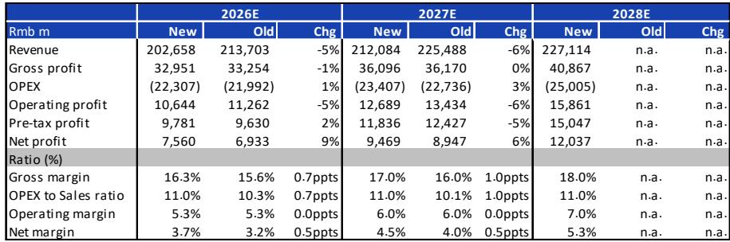
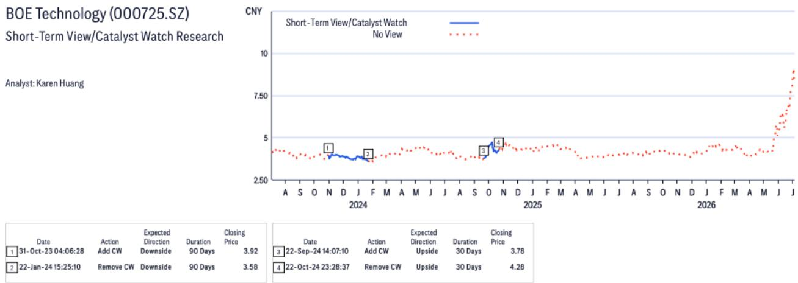
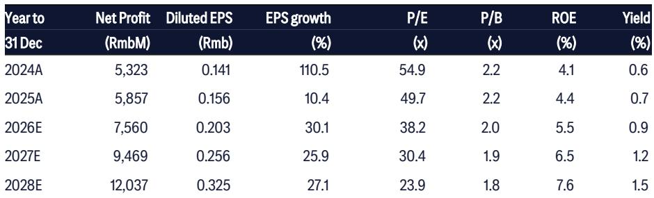

# 显示巨头的下一幕不止于显示：京东方估值逻辑的转变

京东方长期以来与LCD面板紧密相连，这项业务定义了其身份、利润和市场叙事。如今，这一故事正在改变，市场已开始为尚未写就的下一章定价。该公司被某全球投行调整了观点，并非因其核心显示业务恶化，而是因为当前报价已反映了市场对其一系列新兴、高风险技术项目——玻璃基封装基板、光互连和钙钛矿光伏——的预期，这些项目距离商业化规模尚有数年之遥。对观察者而言，关键问题不再是京东方能否继续主导显示制造，而是它能否成功从一家周期性硬件制造商转型为多技术平台公司，以及市场当前的乐观情绪是否与时间线、技术挑战和竞争格局相匹配。

这一观点调整发生在不同寻常的时刻。京东方的核心LCD业务实际上正在改善。行业整合接近完成，电视平均尺寸正朝着管理层认为将在2027年实现供需平衡的关键55英寸门槛攀升，折旧成本也已见顶。这一明显矛盾揭示了核心张力：估值已吸收了显示周期的利好消息，剩余的上行空间取决于尚未大规模验证的技术的成功产业化。观察者现在是在为一种可能无法如期或根本无法实现的未来选择权买单。

本文探讨京东方转型背后的战略逻辑、将决定其轨迹的具体技术项目，以及将定义下一阶段研究讨论的未解问题。目标不是总结报告，而是解读其含义并识别最重要的决策点。

## 显示业务不再是估值驱动因素，但仍是基础

关于京东方的传统观点是，其命运随LCD面板价格起伏，周期性下行不可避免地会打压报价。这一框架正变得不那么相关。报告指出，京东方核心LCD生产线的净利润率超过20%，折旧可能已见顶，在完成OLED Gen-8.6线后资本支出将下降。这些是结构性改善，而非周期性顺风。前五大LCD电视面板制造商的行业集中度已趋平，表明整合阶段基本完成，京东方等领先企业将捕获未来价值的更大份额。

更重要的是，市场的注意力已经转移。新的业务，而非显示利润前景的改善，正成为焦点。这是对报价构成的根本性重新评估。历史上，京东方作为一家显示制造商交易，偶尔有创新溢价。现在，创新溢价正成为主要的估值驱动因素，而显示业务越来越被视为为转型提供资金的稳定现金来源。风险在于，市场可能高估了这些新项目的成功速度和概率，同时低估了随着这些技术成熟而出现的资本需求和竞争反应。

## 玻璃基板项目技术令人印象深刻，但商业化时间线仍是关键不确定性

京东方在玻璃基封装基板方面的进展，从任何标准衡量来看都是显著的。该公司已建成中国大陆首条试验线，交付了第二代样品，并实现了包括20:1的玻璃通孔深宽比、无空洞金属填充和亚2微米线宽在内的技术里程碑。单层基板已通过行业标准可靠性测试，包括1000次温度循环和高温回流焊，室温翘曲仅为40微米。这些不是渐进式改进；它们代表了在可能解决AI和高性能计算应用中传统PCB基板根本局限性的技术方面的真正突破。

然而，从成功的试验线到盈利的量产设施之间的距离是巨大的，京东方尚未跨越这一距离。该公司预计到2027年中期才能达到做出明确量产投资决策的条件。这还有近两年时间，即使做出决策，批量生产、客户认证和成本降低还需要数年。报告承认，未来两年的关键优先事项是良率提升和稳定、可持续的量产能力。这些正是曾使其他先进封装技术商业化尝试受挫的挑战。玻璃基板提供优越的热学和电学性能，但也引入了可能侵蚀良率并推高成本的制造复杂性。

与康宁的合作提供了可信度和技术资源，但也引入了依赖性。京东方正在将康宁的TGV玻璃配方与其自身的大规模制造经验相结合。合作分为三个阶段：系统认证、技术转让和国内市场开发。每个阶段都带有执行风险。如果康宁的玻璃配方需要针对京东方的制造工艺进行额外优化，或者技术转让遇到知识产权或监管障碍，时间线可能会推迟。观察者应思考：市场当前的估值是否已假设了成功的结果？如果量产决策被推迟或初始良率低于预期，下行情景会是什么样子？

## 光互连和钙钛矿光伏提供更长期的选择权

如果说玻璃基板代表一个具有明确时间线的中期机会，那么光互连和钙钛矿光伏则是真正的长期项目。京东方光互连器件仍处于验证阶段，尚未进入量产。该公司开发了响应速度1.8GHz、传输速率3Gbps的微LED光源，并计划在2027年前推出二维多通道演示，随后在2028年推出与1.6T、3.2T和6.4T行业要求相匹配的成熟产品演示。这些是令人印象深刻的技术目标，但距离商业化仍有数年之遥，而且光互连领域的竞争格局拥挤，已有众多在光子学和数据中心基础设施方面拥有深厚经验的成熟参与者。

钙钛矿光伏机会同样长期。京东方预计在2026年底或2027年初做出量产投资决策，业务在2028-2029年发展为主要支柱。与康宁的合作聚焦于无需涂层即可提高组件效率的紫外转换玻璃，解决了历史上限制钙钛矿采用的耐久性问题。但钙钛矿太阳能技术有着突破性进展后商业失望的长期历史。该行业一直在稳定性、可扩展性和相对于硅的成本竞争力方面挣扎。京东方的策略利用其玻璃加工能力而非建设传统太阳能电池制造线，具有差异化，但尚未在大规模上得到验证。

这些项目背后的战略逻辑是清晰的。京东方正在将其在玻璃加工、大规模制造和薄膜沉积方面的核心能力扩展到增长快于显示行业的新市场。问题在于，公司的组织能力、资本配置纪律和风险管理是否足以同时在多个领域执行。历史上不乏试图转型为技术平台但失败的工业企业，原因在于低估了管理具有不同竞争动态、客户群和投资周期的多元化业务的复杂性。

## 报告未完全回答的问题：资本密集度和竞争反应

报告提供了详细的技术进展和战略意图，但留下了几个关键问题未解决。首先是资本密集度。京东方预计在完成OLED Gen-8.6线后资本支出将下降，但新项目——玻璃基板试验线、光互连研发、钙钛矿验证——在产生收入前需要大量投资。报告未提供这些举措的总资本需求或达到规模后的预期投入资本回报率的清晰图景。观察者需要了解京东方能否从运营现金流中为这些投资提供资金，还是需要筹集额外资本，从而可能稀释现有股东。

第二个未解决的问题是竞争反应。京东方并非进入空白市场。在玻璃基封装领域，英特尔、三星和各种基板制造商一直在大力投资。在光互连领域，成熟参与者拥有数十年经验和现有客户关系。在钙钛矿光伏领域，众多初创公司和成熟的太阳能制造商正在竞相商业化竞争技术。报告未说明京东方在制造规模和玻璃加工方面的竞争优势如何转化为这些新市场的可持续护城河。没有清晰的竞争优势，京东方有可能成为其缺乏深厚领域专业知识的行业中的跟风者。

第三个问题是组织执行。京东方同时推进玻璃基板、光互连、钙钛矿光伏、可折叠玻璃、GaN功率器件等一系列创新业务。公司创新收入预计到2026年达到600亿元人民币，约占总收入的30%。管理这个业务组合，每个业务处于不同成熟阶段，需要不同技能、资源和管理关注，是一个巨大的组织挑战。报告未提供关于京东方如何构建其创新组合、如何在竞争优先级之间分配资源或如何管理每个业务所需的人才和文化的细节。

## 评估京东方转型的决策框架

对于试图评估当前估值是否合理的观察者，一个结构化的决策框架比简单的观点调整更有用。该框架应评估三个维度：技术成功的概率、商业化时间线以及每个新业务的潜在市场规模和利润结构。

对于玻璃基板，鉴于京东方已展示的进展，技术成功的概率似乎相对较高，但实现有意义收入贡献的时间线可能在2028年或更晚，市场规模将取决于AI和HPC应用采用玻璃基封装的速度。利润结构不确定，但如果京东方实现管理层强调的层数减少设计优势，可能具有吸引力。

对于光互连，技术成功的概率中等，时间线更长，竞争格局更具挑战性。市场机会很大，由AI数据中心需求驱动，但京东方需要证明其微LED方法相对于现有技术具有显著优势。

对于钙钛矿光伏，鉴于行业历史挑战，技术成功的概率最低，但如果技术能实现商业可行性，潜在市场规模巨大。达到规模的时间线可能在2029年或更晚。

该框架的关键见解是，当前估值似乎假设了所有三个业务相对较高的成功概率，且时间线相对于类似技术的历史模式是乐观的。观察者应通过考虑一个或多个业务未能实现商业规模或时间线推迟两到三年的情景来压力测试其假设。在这些情景下，当前估值可能难以证明合理。

## 应推动下一阶段研究的未决问题

关于京东方最有价值的研究将不聚焦于LCD面板价格或OLED竞争。它将聚焦于决定转型是否成功的具体里程碑。京东方预计何时在其玻璃基板试验线上实现目标良率？触发量产投资决策的关键绩效指标是什么？扩展每个新业务需要多少资本，预期回收期是多少？京东方计划如何管理从以显示为中心的组织向多技术平台的过渡，而不会失去焦点或稀释其核心能力？

这些是报告提出但未完全回答的问题。它们也是将决定京东方是成为真正多元化的技术领导者，还是仍是一家拥有雄心勃勃但未实现愿景的显示制造商的问题。

加入社区阅读完整报告并查看原始图表。

*仅供参考。部分内容可能基于源材料通过AI辅助生成、翻译、总结或编辑，可能存在遗漏或错误。请独立核实。这不构成专业建议。*

仅供参考。部分内容可能基于源材料通过AI辅助生成、翻译、总结或编辑，可能存在遗漏或错误。请独立核实。这不构成专业建议。

