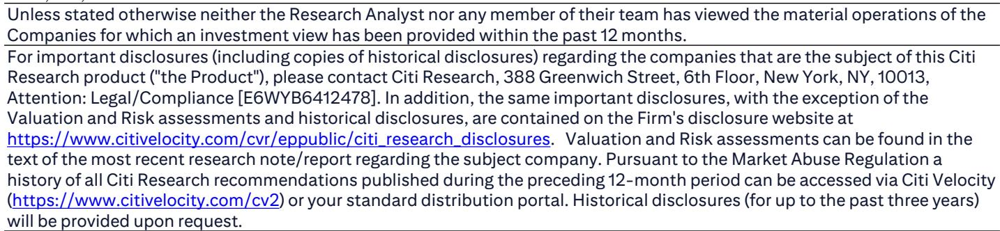
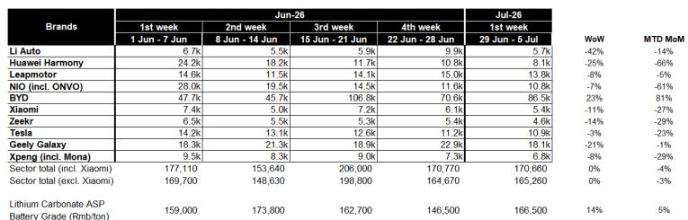

# Citi：不是行业回暖，而是份额重组，Citi看比亚迪如何抢回市场

7月第一周的中国新能源车市订单数据，传递了一个清晰的信号：行业总量在季节性走弱，但头部玩家的份额格局正在剧烈重组。Citi最新周度订单跟踪显示，7月首周（6月29日至7月5日）主要品牌总订单环比下降4%，同比基本持平，符合季节性规律。但真正的看点在于结构——比亚迪的订单份额从6月第一周的27%迅速攀升至7月首周的51%，仅四周时间几乎弹性较高。

> **KC评论：** 份额从27%到51%不是微调，是市场力量的一次集中释放。Citi的经销商调研捕捉到了这一拐点，但完整报告里关于“Great Tang”车型的讨论和订单数据图表，才是理解这一变化驱动力的关键。

## 1. 比亚迪的反弹并非行业共性，大部分品牌在失速

Citi数据清晰呈现了分化格局。7月首周，比亚迪订单环比增长81%，吉利银河仅下滑1%，表现优于行业均值。但其他品牌普遍承压：理想汽车环比下降14%，特斯拉下降23%，小米下降27%，小鹏下降29%，零跑下降5%。蔚来和华为鸿蒙的环比降幅分别达到61%和66%，主要原因是6月初新款M9和ES9上市带来的订单高峰已过。

这意味着，比亚迪的份额扩张并非行业景气度回升的结果，而是在总量持平的背景下，从其他品牌手中直接争取了用户。对于读者而言，真正需要关注的问题是：这种份额转移是可持续的结构性变化，还是短期促销或新车型脉冲带来的阶段性现象？

## 2. 订单数据暴露了大多数新势力的增长瓶颈

Citi报告中一个容易被忽略的信号是：理想、小鹏、小米、特斯拉的订单环比降幅均在两位数以上，且均跑输行业均值。这些品牌并非缺乏产品力或品牌认知，但它们在7月第一周的表现说明，当比亚迪加大产品投放和渠道力度时，竞争对手面临的是存量用户争夺战，而非增量市场扩张。

> **KC评论：** Citi的完整报告还讨论了L2政策对地平线和Xpeng的溢出效应，以及3Q26的增长分化框架。订单数据只是冰山一角，真正值得读的是报告对这些品牌中期增长驱动力的分析。

## 3. 报告尚未完全回答的关键问题：份额转移的可持续性

比亚迪的订单份额从27%跃升至51%，但在4周内完成的如此剧烈的变化，其背后有多少来自一次性因素，比如“Great Tang”车型的集中交付或渠道压货？Citi的数据基于经销商调研，但并未披露订单转化率和交付节奏。如果这部分订单只是提前透支了未来需求，那么后续几周的份额数据可能出现回落。

另一个未解问题是：当华为鸿蒙和蔚来的新款车型脉冲消退后，它们能否在7月中旬重新稳住订单量？这两个品牌在6月第一周曾分别达到24.2k和28.0k的高点，但7月首周已快速回落至8.1k和10.8k。如果后续无法回升，将意味着新车型的生命周期正在缩短。

## 4. 观察框架：关注份额而非总量，关注环比趋势而非单周波动

对于行业研究者而言，这份报告提供了一个更精细的观察框架：与其关注新能源车月度总销量，不如关注周度订单份额的环比变化。比亚迪的份额波动说明，市场正在从“谁卖得多”转向“谁在别人的蛋糕里分得多”。同时，锂价7月首周环比上涨14%至16.65万元/吨，这一成本变量对各家盈利能力的差异化影响，也值得在后续几周持续跟踪。

Citi的这份周度跟踪报告，本质上是一张竞争格局的快照。对于决策者而言，重要的不是单周数据的好坏，而是趋势是否持续。如果比亚迪在未来2-3周内将份额稳定在40%以上，那么行业格局的重塑可能比市场预期的更快到来。

For informational purposes only. Portions may be generated,translated,summarized,or edited with AI assistance based on source materials and may contain omissions or errors. Please verify independently. This is not investment,legal,tax,accounting,or other professional advice.

For informational purposes only. Portions may be generated,translated,summarized,or edited with AI assistance based on source materials and may contain omissions or errors. Please verify independently. This is not investment,legal,tax,accounting,or other professional advice.

