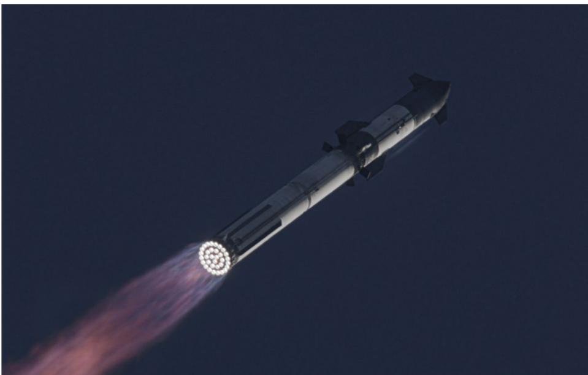
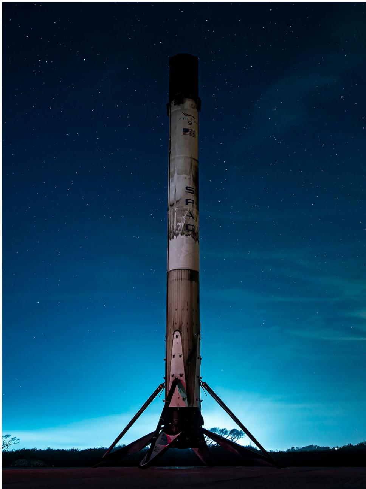
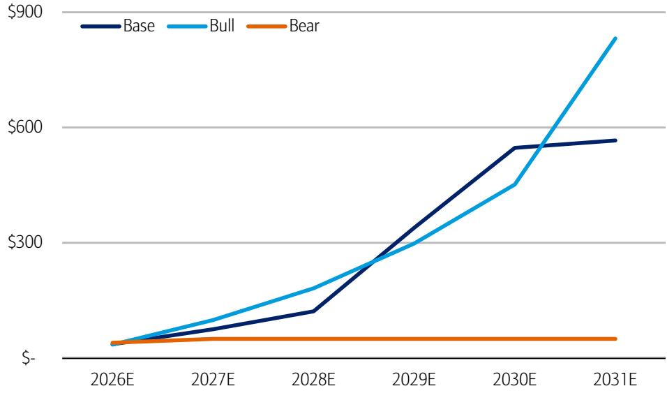

# Space Exploration Technologies Corp.

# Paving the superhighway to the stars; Initiate at Positive, PO of \$235

Initiating Coverage: Positive | PO: 235.00 USD | Price: 162.00 USD

## Launch leadership enables everything else

We initiate coverage of SpaceX (SPCX) with a Positive rating and \$235 PO, derived by a long-term DCF considering base, bear, and bull cases (see inside). SpaceX has evolved from a launch company into the foundational enabler of the space economy and the leading provider of space-based applications as a result. SpaceX's extensive moats on reusable launch and proliferated space applications are in our view laying the foundation for Starship and future applications to drive another paradigm shift in capabilities.

## Monetizing the mass to orbit moat

SpaceX has demonstrated a unique ability to convert launch and manufacturing capabilities into market-leading, recurring applications businesses, notably Starlink. The result is a powerful flywheel, where launch enables space applications, applications generate cash flow, and those cash flows support further infrastructure investment. While not reflected directly in financials given company accounting, Falcon and Starship launch economics are the primary drivers of SpaceX's ability to develop high-margin application layers on orbit.

## It all hinges on the "King of the Cosmos"

The central debate is whether Starship can achieve the reliability, cadence, and economics required to unlock the next phase of growth. Much of SpaceX's long-term opportunity, including Starlink v3 deployment and future compute infrastructure, depend on Starship successfully commercializing full reusability. If achieved, we believe launch costs could decline by an order of magnitude while capacity expands dramatically. If delayed, the timing of many future growth vectors moves materially to the right.

## Orbital compute demonstrates differentiated option value

SpaceX's vision for orbital compute creates substantial upside potential, but is also indicative of broader option value realizable by SpaceX's launch moat, vertical integration, and manufacturing scale. Entry into AI infrastructure and applications markets represent attractive opportunities for SpaceX to apply its leading space positioning within rapidly growing and competitive markets. Other emerging and potential space applications could provide additional value in time, again predicated on the ultimate success of Starship as a means of further expanding space access.

<table><tr><td>Estimates (Dec) (US$)</td><td>2024A</td><td>2025A</td><td>2026E</td><td>2027E</td><td>2028E</td></tr><tr><td>EPS</td><td>0.08</td><td>(1.69)</td><td>(0.02)</td><td>1.37</td><td>3.78</td></tr><tr><td>EPS Change (YoY)</td><td>NA</td><td>NM</td><td>98.8%</td><td>NM</td><td>175.9%</td></tr><tr><td>Consensus EPS (Bloomberg)</td><td></td><td></td><td>(0.99)</td><td>(0.04)</td><td>0.50</td></tr><tr><td>Consensus EPS (Visible Alpha)</td><td></td><td></td><td>(0.51)</td><td>0.15</td><td>0.72</td></tr><tr><td colspan="6">Valuation (Dec)</td></tr><tr><td>P/E</td><td>2,025.0x</td><td>NM</td><td>NM</td><td>118.2x</td><td>42.9x</td></tr><tr><td>EV / EBITDA*</td><td>217.1x</td><td>176.4x</td><td>59.5x</td><td>24.1x</td><td>11.9x</td></tr><tr><td>Free Cash Flow Yield*</td><td>-0.4%</td><td>-1.1%</td><td>-2.7%</td><td>-5.5%</td><td>-6.5%</td></tr><tr><td colspan="6">* For full definitions of iQmethod measures, see page 38.</td></tr></table>

BofA does and seeks to do business with issuers covered in its research reports. As a result, investors should be aware that the firm may have a conflict of interest that could affect the objectivity of this report. Investors should consider this report as only a single factor in making their investment decision.
Refer to important disclosures on page 39 to 41. Analyst Certification on page 37. Price Objective Basis/Risk on page 37.
12991046

## 07 July 2026

Equity

Ronald J. Epstein
Research Analyst
BofAS
+1 646 855 5695
r.epstein@bofa.com

Justin Post
Research Analyst
BofAS
justin.post@bofa.com

Tal Liani
Research Analyst
BofAS
tal.liani@bofa.com

Michael J. Funk
Research Analyst
BofAS
michael.j.funk@bofa.com

## Mariana Perez Mora

Research Analyst
BofAS
+1 646 855 5696
mariana.perezmora@bofa.com

## Alexander Preston

Research Analyst
BofAS
+1 646 855 3599
alexander.preston@bofa.com

## Kevin Niederpruem

Research Analyst
BofAS
kevin.niederpruem@bofa.com

## Stock Data

<table><tr><td>Price</td><td>162.00 USD</td></tr><tr><td>Price Objective</td><td>235.00 USD</td></tr><tr><td>Date Established</td><td>7-Jul-2026</td></tr><tr><td>Investment Opinion</td><td>C-1-9</td></tr><tr><td>52-Week Range</td><td>147.11 USD - 225.64 USD</td></tr><tr><td>Mrkt Val (mn) / Shares Out (mn)</td><td>1,209,092 USD / 7,463.5</td></tr><tr><td>Free Float</td><td>8.6%</td></tr><tr><td>Average Daily Value (mn)</td><td>NA</td></tr><tr><td>BofA Ticker / Exchange</td><td>SPCX / NAS</td></tr><tr><td>Bloomberg / Reuters</td><td>SPCX US / SPCX.OQ</td></tr><tr><td>ROE (2026E)</td><td>-0.2%</td></tr><tr><td>Net Dbt to Eqty (Dec-2025A)</td><td>-7.5%</td></tr></table>

<table><tr><td colspan="2">Stock Data</td></tr><tr><td>Average Daily Volume</td><td>NA</td></tr></table>

## iQprofile Space Exploration Technologies Corp.

iQmethod – Bus Performance*

<table><tr><td>(US$ Millions)</td><td>2024A</td><td>2025A</td><td>2026E</td><td>2027E</td><td>2028E</td></tr><tr><td>Return on Capital Employed</td><td>NA</td><td>-4.4%</td><td>2.5%</td><td>8.2%</td><td>14.3%</td></tr><tr><td>Return on Equity</td><td>6.2%</td><td>-14.7%</td><td>-0.2%</td><td>12.3%</td><td>26.9%</td></tr><tr><td>Operating Margin</td><td>3.3%</td><td>-13.9%</td><td>8.5%</td><td>26.0%</td><td>37.5%</td></tr><tr><td>Free Cash Flow</td><td>(5,387)</td><td>(13,834)</td><td>(32,394)</td><td>(66,908)</td><td>(78,745)</td></tr></table>

## iQmethod – Quality of Earnings*

<table><tr><td>(US$ Millions)</td><td>2024A</td><td>2025A</td><td>2026E</td><td>2027E</td><td>2028E</td></tr><tr><td>Cash Realization Ratio</td><td>7.3x</td><td>NM</td><td>NM</td><td>2.5x</td><td>1.8x</td></tr><tr><td>Asset Replacement Ratio</td><td>2.9x</td><td>3.1x</td><td>3.7x</td><td>4.6x</td><td>4.4x</td></tr><tr><td>Tax Rate</td><td>NM</td><td>NM</td><td>NM</td><td>5.0%</td><td>5.0%</td></tr><tr><td>Net Debt-to-Equity Ratio</td><td>3.4%</td><td>-7.5%</td><td>-35.8%</td><td>12.2%</td><td>46.4%</td></tr><tr><td>Interest Cover</td><td>0.4x</td><td>-1.8x</td><td>2.2x</td><td>6.2x</td><td>8.1x</td></tr></table>

Income Statement Data (Dec)

<table><tr><td>(US$ Millions)</td><td>2024A</td><td>2025A</td><td>2026E</td><td>2027E</td><td>2028E</td></tr><tr><td>Sales</td><td>14,015</td><td>18,674</td><td>40,770</td><td>78,207</td><td>142,785</td></tr><tr><td>% Change</td><td>NA</td><td>33.2%</td><td>118.3%</td><td>91.8%</td><td>82.6%</td></tr><tr><td>Gross Profit</td><td>6,019</td><td>9,223</td><td>25,430</td><td>52,764</td><td>98,130</td></tr><tr><td>% Change</td><td>NA</td><td>53.2%</td><td>175.7%</td><td>107.5%</td><td>86.0%</td></tr><tr><td>EBITDA</td><td>5,350</td><td>6,584</td><td>19,503</td><td>48,142</td><td>97,699</td></tr><tr><td>% Change</td><td>NA</td><td>23.1%</td><td>196.2%</td><td>146.8%</td><td>102.9%</td></tr><tr><td>Net Interest &amp; Other Income</td><td>(224)</td><td>(1,630)</td><td>(3,452)</td><td>(3,299)</td><td>(6,602)</td></tr><tr><td>Net Income (Adjusted)</td><td>796</td><td>(4,945)</td><td>(211)</td><td>17,862</td><td>49,284</td></tr><tr><td>% Change</td><td>NA</td><td>NM</td><td>95.7%</td><td>NM</td><td>175.9%</td></tr></table>

## Free Cash Flow Data (Dec)

<table><tr><td>(US$ Millions)</td><td>2024A</td><td>2025A</td><td>2026E</td><td>2027E</td><td>2028E</td></tr><tr><td>Net Income from Cont Operations (GAAP)</td><td>791</td><td>(4,937)</td><td>(173)</td><td>16,170</td><td>44,621</td></tr><tr><td>Depreciation &amp; Amortization</td><td>3,824</td><td>6,701</td><td>13,037</td><td>23,861</td><td>38,257</td></tr><tr><td>Change in Working Capital</td><td>3,312</td><td>9,633</td><td>17,934</td><td>27,823</td><td>44,127</td></tr><tr><td>Deferred Taxation Charge</td><td>NA</td><td>NA</td><td>NA</td><td>NA</td><td>NA</td></tr><tr><td>Other Adjustments, Net</td><td>(2,151)</td><td>(4,612)</td><td>(14,916)</td><td>(23,861)</td><td>(38,257)</td></tr><tr><td>Capital Expenditure</td><td>(11,163)</td><td>(20,619)</td><td>(48,276)</td><td>(110,900)</td><td>(167,493)</td></tr><tr><td>Free Cash Flow</td><td>-5,387</td><td>-13,834</td><td>-32,394</td><td>-66,908</td><td>-78,745</td></tr><tr><td>% Change</td><td>NA</td><td>-156.8%</td><td>-134.2%</td><td>-106.5%</td><td>-17.7%</td></tr><tr><td>Share / Issue Repurchase</td><td>12,061</td><td>17,514</td><td>89,634</td><td>0</td><td>0</td></tr><tr><td>Cost of Dividends Paid</td><td>0</td><td>0</td><td>0</td><td>0</td><td>0</td></tr><tr><td>Change in Debt</td><td>(77)</td><td>9,131</td><td>28,250</td><td>50,000</td><td>100,000</td></tr></table>

## Balance Sheet Data (Dec)

<table><tr><td>(US$ Millions)</td><td>2024A</td><td>2025A</td><td>2026E</td><td>2027E</td><td>2028E</td></tr><tr><td>Cash &amp; Equivalents</td><td>11,385</td><td>24,747</td><td>102,000</td><td>85,092</td><td>106,347</td></tr><tr><td>Trade Receivables</td><td>NA</td><td>NA</td><td>NA</td><td>NA</td><td>NA</td></tr><tr><td>Other Current Assets</td><td>4,723</td><td>6,205</td><td>41,173</td><td>77,729</td><td>142,550</td></tr><tr><td>Property, Plant &amp; Equipment</td><td>21,147</td><td>42,602</td><td>82,647</td><td>169,687</td><td>298,923</td></tr><tr><td>Other Non-Current Assets</td><td>19,111</td><td>18,384</td><td>65,074</td><td>124,826</td><td>227,900</td></tr><tr><td>Total Assets</td><td>56,366</td><td>91,938</td><td>290,894</td><td>457,334</td><td>775,720</td></tr><tr><td>Short-Term Debt</td><td>0</td><td>0</td><td>0</td><td>0</td><td>0</td></tr><tr><td>Other Current Liabilities</td><td>16,100</td><td>26,477</td><td>103,032</td><td>197,638</td><td>360,836</td></tr><tr><td>Long-Term Debt</td><td>12,262</td><td>21,659</td><td>54,138</td><td>104,138</td><td>204,138</td></tr><tr><td>Other Non-Current Liabilities</td><td>2,200</td><td>2,477</td><td>0</td><td>0</td><td>0</td></tr><tr><td>Total Liabilities</td><td>30,562</td><td>50,613</td><td>157,170</td><td>301,776</td><td>564,974</td></tr><tr><td>Total Equity</td><td>25,804</td><td>41,325</td><td>133,724</td><td>155,558</td><td>210,746</td></tr><tr><td>Total Equity &amp; Liabilities</td><td>56,366</td><td>91,938</td><td>290,894</td><td>457,334</td><td>775,720</td></tr></table>

* For full definitions of IQmethod measures, see page 38.

## Company Sector

Satellite Services

## Company Description

SpaceX is an integrated provider of launch and space systems, communications, and AI with a goal of making human life interplanetary. The company operates under three segments: Space, including launch of its Falcon, Dragon, and Starship vehicles, Connectivity, operating Starlink and Starshield and Mobile connectivity service, and AI, which includes development of data center compute, the company's Grok large language model, and other applications.

## Investment Rationale

SpaceX has evolved from a launch company into the foundational enabler of the space economy and the leading provider of space-based applications as a result. SpaceX's extensive moats on reusable launch and proliferated space applications are in our view laying the foundation for Starship and future applications to drive another paradigm shift in capabilities.

## Quarterly Earnings Estimates

<table><tr><td></td><td>2025</td><td>2026</td></tr><tr><td>Q1</td><td>-0.18A</td><td>-1.10A</td></tr><tr><td>Q2</td><td>-0.34A</td><td>-0.16E</td></tr><tr><td>Q3</td><td>-0.36A</td><td>0.21E</td></tr><tr><td>Q4</td><td>-0.79A</td><td>0.27E</td></tr></table>

## Investment thesis

We initiate coverage of SpaceX (SPCX) with a Positive rating and a PO of \$235. SpaceX is an integrated provider of launch and space systems, communications, and AI with a goal of making human life interplanetary. The company operates under three segments: Space, including launch of its Falcon family of vehicles, Dragon spacecraft, and Starship; Connectivity, operating Starlink and Starshield as well as Mobile connectivity service; and AI, which includes development of data center compute, the company's Grok large language model, and other applications.

Our PO of \$235 is based on an average long-term DCF of base, bull, and bear cases for different revenue and cash generation scenarios between now and 2045. Our DCF factors in an 18% discount rate in the base case, 28% discount rate in the bull case, and 14% discount rate in the bear case and assigns an equal weighting to each case. Our DCF factors in a long-term growth rate of 5% in the base, bull, and bear cases. In our view, the varied discount rates fairly reflect the relative uncertainty associated with each scenario, with base case discount rate in line with the median of the peer group, bull case discount rate in line with the higher growth and higher risk peers, and bear case discount rate in line with more established, lower execution risk peers.

## Upside risks to our PO

Upside risks to our PO are better-than-expected cost cutting and margin expansion, well-integrated M&A activity, market share gains among launch, satellite services, and/or AI applications, and better-than-expected commercialization of the Starship launch vehicle.

## Downside risks to our PO

Downside risks to our PO are production delays, inability to achieve M&A synergies, potential impact to capex / FCF from space systems and/or AI investments, regulatory risks to launch cadence and/or satellite service deployment, and setbacks to Starship and/or satellite program development.

## Investment positives

## (+) Strong moat on reusable launch underpins services businesses

We see SpaceX's launch business as the foundation of its competitive advantage and its most enduring moat against competitors in the space economy. The Falcon family of vehicles has established SpaceX as the global preeminent launch provider and space enabler, flying over 650 launches to date at $99\%+$ mission success and delivering $80\%+$ global mass to orbit in recent years. The combination of proven out reusable hardware (~35 reflights by the most reused Falcon booster), vertical integration, and high launch cadence has enabled material reductions in launch cost to orbit while rapidly scaling activity in space and delivering reliability of orbital access.

While Falcon itself is years ahead of capabilities that can be deployed by competitors, Starship would represent a further paradigm shift for space access when it is successfully commercialized at scale. Full reusability of both booster and upper stage could deliver a further order-of-magnitude decrease in per-kg launch costs while enabling increased flight cadence. Starship's enhanced capabilities and cost effectiveness are integral to planned constellations including next-generation Starlink v3 and Mobile satellites and potential orbital compute platforms. Importantly, despite accounting of launch costs driving visibly low financial performance in the launch segment, access to scaled launch has fundamentally enabled the comparatively better financial performance of Starlink to date, while also supporting third-party commercial, civil, and national security customers.

## Exhibit 1: Starship's increased scale vs. Falcon and full reusability could drive launch costs into hundreds of dollars per kg SpaceX Starship

  
BofA GLOBAL RESEARCH  
Source: SpaceX

Exhibit 2: Falcon's demonstrated booster recovery and reflight capability has driven sea change in launch cadence and cost to orbit
Landed Falcon 9 booster

  
Source: SpaceX  
BofA GLOBAL RESEARCH

## (+) Sticky relationships with US, int'l customers across segments

SpaceX has developed relationships across a diverse set of customers spanning commercial satellite operators, civil space agencies, defense organizations, and enterprise communications customers. Launch customers include commercial operators, NASA, the U.S. Department of Defense, and national security agencies, while Starlink now serves consumer, enterprise, aviation, maritime, mobility, and government markets across more than 160 countries. This diversification reduces dependence on any single customer segment and increases opportunities for cross-selling capabilities over time.

Customer relationships could become increasingly sticky as SpaceX expands beyond launch services into mission-critical connectivity and government applications. For example, Starlink is increasingly embedded into mobility, maritime, enterprise, and defense use cases (through Starshield) where reliability and global coverage are critical. Similarly, government customers are increasingly purchasing integrated capabilities spanning launch, communications, and national-security-focused services. As SpaceX broadens its portfolio, switching costs may increase as customers become reliant on an integrated ecosystem of transportation and communications infrastructure rather than a single standalone product.

## (+) Unparalleled vertical integration enables scale, derisks execution

SpaceX has oriented itself around end-to-end vertical integration as a means of controlling timelines, program ramps, and margins. This extends from the program and subsystem level – where SpaceX has in-housed the majority of its supply chains for launch, satellite buses, value-added payloads, and beyond – to the organization of its segments, where its constellation services are fundamentally enabled by internal launch capacity. This vertically integrated operating model enables rapid product iteration, tighter coordination across business units, and potentially lower total system costs than more fragmented competitors.

The value of this integration is particularly evident in Starlink. SpaceX designs and manufactures satellites, launches them on internally controlled vehicles, operates the communications network, and serves end customers directly. The company does not depend on third-party launch availability to deploy capacity or respond to network demand. This level of control has allowed SpaceX to scale Starlink to approximately 10,000 satellites and over 10 million subscribers in a relatively short timeframe. We believe this integrated model may become increasingly important as the company pursues larger and more complex opportunities such as next-generation satellite architectures and orbital computing infrastructure (see (+) Only end-to-end provider of scaled space-based capabilities incl. compute).

(+) Only end-to-end provider of scaled space-based capabilities incl. compute
We believe SpaceX increasingly occupies a unique position within the space industry as the only company operating at scale across launch, manufacturing, communications infrastructure, orbital operations, and prospective compute deployment. Today the company controls the world's largest active satellite constellation and operates the dominant global launch platform. As Starship expands payload capability and launch frequency, SpaceX is positioned to build increasingly sophisticated infrastructure in orbit while retaining control over the transportation systems required to deploy and maintain it.

This distinction becomes particularly important when considering future opportunities beyond launch and communications. While initiatives like orbital data centers remain early, we believe SpaceX begins from a much stronger position than potential competitors because many of the prerequisite capabilities already exist within the organization. Launch systems, communications networks, satellite operations expertise, manufacturing infrastructure, and global deployment capability have all been developed and proven through existing businesses. In our view, no other company currently combines these capabilities at comparable scale, creating the potential for SpaceX to emerge as the foundational infrastructure provider for future space-based computing and communications applications. Given the attractiveness of the compute market from supply/demand imbalance that seems likely to persist for some time, SpaceX could be well positioned to monetize its internal capabilities through this avenue. As the company seeks to develop and commercialize its own internal AI capabilities including Grok and Cursor, access to scaled end-to-end AI compute could become a key advantage to scaling and ultimately monetizing those platforms and other potential AI applications as well.

(+) Reusable, cost effective launch enables option value for other space apps
Historically, many space-based business models were constrained by launch costs rather than end-market demand. SpaceX's continued reduction in launch costs may expand the universe of economically viable applications in orbit. Beyond existing businesses such as broadband connectivity and government services, low-cost transportation could enable new categories including in-space manufacturing, Earth observation, logistics, data processing, communications infrastructure, and future cislunar applications.

SpaceX has signaled willingness to capture and scale existing small-scale space applications opportunities, a clear example being the recent introduction of its Starfall reentry vehicle. Reentry vehicles supporting in-space manufacturing and synthesis of pharmaceuticals has been an emerging, if still niche, space-based application. While still early in development, Starfall illustrates SpaceX's ability to leverage capabilities originally developed for launch and spacecraft operations to address emerging markets beyond traditional satellite communications. Rather than serving solely as a transportation provider, SpaceX is increasingly building the infrastructure and logistics capabilities required to support commercial activity in orbit, and we think SpaceX could find and compete for other in-space commercial activities over time.

We think investors should view much of SpaceX's long-term value / total addressable market (TAM) through an option value lens. While the economic contribution of many future space markets is uncertain today, SpaceX owns the enabling infrastructure that would be required if such markets develop. As launch costs continue to fall and payload capacity expands, the company's addressable market could increase significantly beyond the opportunities currently reflected in launch and connectivity revenue. Orbital compute is, in our view, the primary reflection of this option value today and represents a meaningful growth driver for SpaceX if developed. However, there could reasonably be other similar avenues for SpaceX to monetize its launch and manufacturing capabilities unlocked by high-throughput, low-variable-cost launch that emerge in coming years.

## Investment negatives

(-) Execution risk – Starship, orbital compute technologies not yet proven

While Falcon has established a strong commercial and operational track record, much of SpaceX's future growth narrative depends on technologies that have not yet achieved comparable maturity. Starship remains under development and serves as a critical dependency for next-generation Starlink deployment, future launch economics, and the company's longer-term orbital infrastructure ambitions. Starship's flight test campaign has not been without setbacks, including loss of the booster on its most recent 12th test flight. Scaled orbital computing platforms are also unproven at present, with open technical questions including the ability of the platforms to dissipate heat, performance of AI chips in the space environment, and others. Delays in technical development, operational readiness, or launch cadence could materially affect the timeline and economics of these initiatives.

## (-) Subject to regulatory risk on launch, satellite services

SpaceX operates in highly regulated industries spanning launch services, telecommunications, spectrum licensing, defense contracting, and international operations. Future growth depends on obtaining launch approvals, maintaining access to spectrum resources, securing operating authorizations across multiple jurisdictions, and complying with evolving national-security requirements.

A key area of risk is Starlink's dependence on spectrum rights and satellite operating authorizations. As the world's largest low Earth orbit (LEO) communications constellation, Starlink requires ongoing access to licensed spectrum to deliver broadband services and expand into new offerings such as direct-to-device connectivity. Spectrum is a finite resource that is increasingly contested among satellite operators, terrestrial wireless providers, and governments. Future FCC decisions regarding spectrum allocation, sharing requirements, interference protections, or constellation authorizations could affect network performance, subscriber growth, and competitive positioning. International expansion also requires country-by-country regulatory approvals, creating additional complexity as Starlink scales globally. While SpaceX has benefited from early deployment advantages, future growth remains subject to evolving regulatory and geopolitical considerations.

Beyond telecommunications, launch operations remain highly dependent on regulatory approvals. The FAA licenses commercial launches and launch sites, including Starship operations from Starbase and other facilities. Starship – and downstream space applications including orbital compute – likely depend on flight cadences well above current levels, potentially into the thousands of launches per year. Any delays associated with launch licensing, environmental reviews, post-flight investigations, range availability, or operating restrictions could slow deployment of next-generation satellites and SpaceX's activities as a whole. Regulatory scrutiny may also increase as SpaceX's strategic importance grows. The company's expanding role in communications, defense, launch, and prospective compute infrastructure may expose it to additional oversight regarding spectrum usage, national security, orbital debris mitigation, space traffic management, environmental impacts, and international operations. Given the degree to which launch, connectivity, and future infrastructure initiatives are interconnected, adverse regulatory outcomes in any one area could have broader implications across the SpaceX platform.

## (-) Significant investment needed to support AI buildout

Deployment of scaled orbital data center compute on orbit – a central piece of SpaceX's TAM and long-term value, could require hundreds of billions of dollars in capital deployment in coming years to realize. This includes multiple substantial programs requiring investment in tandem – development and buildout of the Starship fleet, scaling of satellite production capabilities, and procurement of GWs of AI chips and other compute hardware annually.

Exhibit 3: BofAe AI segment capex exceeds \$560bn by 2031E in base case driven principally by orbital compute, while bull case deployment could require \$830bn of AI capex investment in 2031E BofAe AI segment capex by case, \$ bn  
  
Source: BofA Global Research  
BofA GLOBAL RESEARCH

Given the scale of investment needed, we expect SpaceX to require significant additional capital through the decade. Our base case envisions total additional debt raise of \$690bn between 2027E-2031E (beyond the recently completed \$25bn debt raise), while our bull case sees \$300bn of additional debt capital between 2027E-2030E. Note our bear case does not envision scaled deployment of orbital compute, resulting in the significantly lower AI capex forecast across the period. In the bear and bull cases, we expect SpaceX to reach FCF break even by 2030E; in the base case it could take until 2031E. Access to debt (and potentially equity) markets to support continued investment could be a gating item for SpaceX's pace of development.

## (-) TAM hinges on highly competitive AI applications market

While launch services and connectivity provide tangible and established addressable markets today, a growing portion of the long-term investment narrative appears tied to AI infrastructure, compute platforms, and AI-enabled applications. SpaceX identifies ~93% of its TAM as related to its AI activities, and 84% directly related to monetization of its AI applications, consumer subscriptions, and advertising revenues. The AI applications market differs materially from launch, where SpaceX enjoys strong foundational moats, and instead involves competition with some of the largest and best-capitalized technology companies globally.

Even if SpaceX succeeds in deploying orbital compute infrastructure at scales envisioned in our model, the magnitude of the opportunity will depend on whether customers perceive meaningful performance, cost, energy, or strategic advantages relative to terrestrial alternatives. As a result, long-term revenue expectations increasingly rely on assumptions regarding AI market growth, customer adoption, and competitive differentiation that are inherently more difficult to underwrite than the company's existing launch and connectivity businesses.

## Overview of model case assumptions

We value SpaceX using a long term DCF incorporating base, bear, and bull cases over a forecast period until 2045E. Our forecast cases incorporate various assumptions across Space, Connectivity, and AI segments, as well as varied valuation metrics including discount rate. For reference, we aggregate our primary assumption differences across cases here.

Exhibit 4: Our valuation reflects varied discount rates across cases to reflect relative uncertainty in each case

Key DCF case valuation metrics

<table><tr><td></td><td>Discount Rate</td><td>Long term growth rate (%)</td></tr><tr><td>Base Case</td><td>18%</td><td>5%</td></tr><tr><td>Bear Case</td><td>14%</td><td>5%</td></tr><tr><td>Bull Case</td><td>28%</td><td>5%</td></tr></table>

Source: BofA Global Research  
BofA GLOBAL RESEARCH

Our DCF factors in an 18% discount rate in the base case, 28% discount rate in the bull case, and 14% discount rate in the bear case and assigns an equal-weighted average of each case. Our DCF factors in a long-term growth rate of 5% in the base, bull, and bear cases. In our view, the varied discount rates fairly reflect the relative uncertainty associated with each scenario, with base case discount rate in line with the median of the peer group, bull case discount rate in line with the higher growth and higher risk peers, and bear case discount rate in line with more established, lower execution risk peers.

We drive our cases by making several key assumptions at the segment level reflecting operational performance, technical milestones, and other metrics.

## Space:

\- Base case: initial Starship launches for Starlink in 2027, over 100 launches by 2028, with nearly all initially used for orbital AI + Starlink deployments. Third party launches begin in 2029, ramping to 1 per day by 2040s. Falcon is retired in 2031 as Starship third party launch ramps.

\- Bear case: Starship is delayed, with first internal launches in 2028 and a slower ramp in following years. Reusability is slower to be proven out, with essentially no economic benefit before 2030. Falcon launches continue to grow across the forecast period, satisfying third party demand.

\- Bull case: Starship launches reach 1 per month in 2027, over 1000 by 2029, and end the forecast period at ~10 per hour to support TW-scale orbital AI deployment. First third party launches in 2029 but faster ramp than base case reflects increased demand.

## Connectivity:

\- Base case: Initial Starlink v3 deployments in 2027 aligned with first Starship launches, Mobile deployments take until 2028 to begin. Starlink pricing trends higher than bear case, Starlink ultimately takes ~25% of TAM
