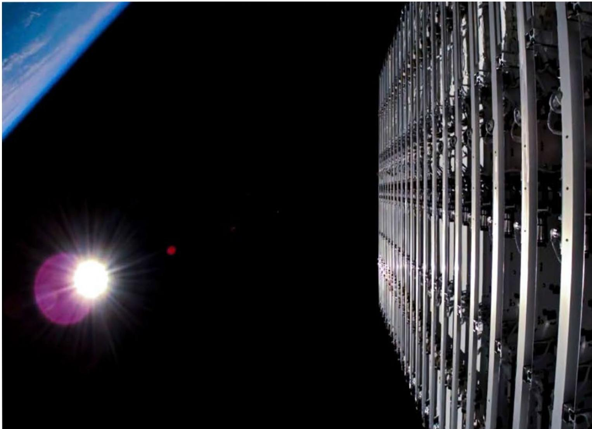
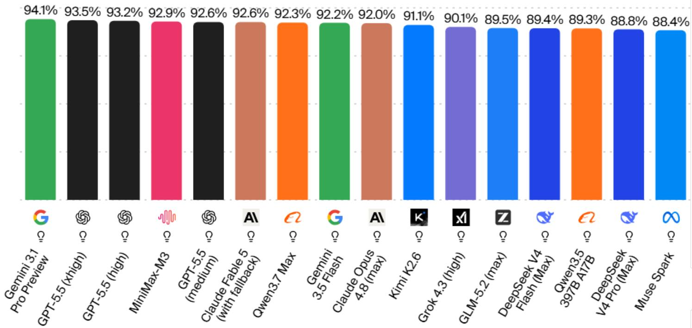
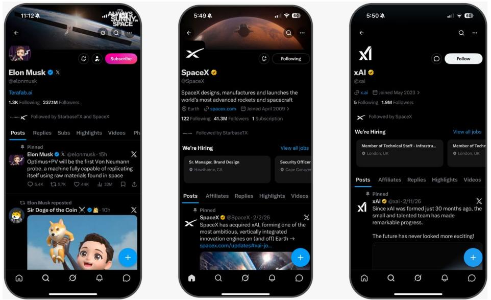

# BofA：SpaceX垂直整合闭环，发射、应用、现金流的飞轮

这家公司已经证明自己能把火箭发射变成一门高利润的应用生意。Starlink就是最好的证据。但BofA在7月发布的这份覆盖报告中，把核心判断放在了更远处：SpaceX的长期价值，几乎全部押注在Starship能否真正实现完全可重复使用。

但更值得关注的是其背后的逻辑链条——SpaceX已经从一个发射服务商，演变为太空宏观环境的基础设施搭建者。而Starship就是这条高速公路的最后一个关键节点。

读者可以重点看报告中的三情景DCF模型，理解BofA如何为这种高度不确定性定价。

## 1. 发射优势是起点，但真正创造价值的是应用层

SpaceX的Falcon系列火箭已经执行了超过650次发射，成功率超过99%。过去几年，这家公司承担了全球80%以上的入轨质量。但BofA指出，发射业务本身在财务上需要继续观察——成本核算方式让这个板块的利润表显得相当单薄。

真正的价值在于，发射能力被转化成了高利润、经常性的应用收入。Starlink就是最典型的例子。SpaceX自己设计卫星、自己发射、自己运营网络、直接服务终端用户。这种端到端的垂直整合，让它在不到十年内建成了约一万颗卫星的星座，拥有了超过一千万用户。

发射与应用之间形成了一个正循环：发射能力支撑应用部署，应用产生现金流，现金流再反哺下一代发射系统。这个飞轮能否继续转动，取决于下一个变量。

## 2. Starship是估值逻辑的“全有或全无”节点

BofA将Starship称为“宇宙之王”。这不是修辞，而是估值模型中最大的单一变量。

如果Starship成功实现完全可重复使用——即第一级和第二级都能回收——发射成本可能下降一个数量级，同时运力大幅提升。这将直接决定Starlink v3的部署节奏、未来的轨道计算基础设施，以及SpaceX进入AI数据中心等新市场的时机。

报告中的财务预测已经体现了这种非线性：2025年营收约187亿美元，到2028年预计跃升至约1430亿美元。同期运营利润率从-13.9%提升至37.5%。这些数字背后隐含的前提，就是Starship的商业化进程符合预期。

如果Starship延迟，几乎所有增长节点都会向右平移。BofA对三种情景使用了不同的折现率——基准情景18%、乐观情景28%、悲观情景14%——这在国际机构覆盖中并不常见，恰恰反映了这家公司未来路径的高度不确定性。

> **KC评论：** 折现率的差异本身就说明了问题。乐观情景用高折现率，意味着即使成功，不确定性也不小；悲观情景用低折现率，反而暗示失败后公司仍有底线价值。这种不对称性值得反复品味。

## 3. 报告尚未完全回答的关键问题

BofA的覆盖报告提供了扎实的框架，但有几个问题仍然悬而未决。

第一，Starship的完全可重复使用在工程上能否达到所需的可靠性和节奏？Falcon 9的复用记录确实亮眼——最活跃的助推器已经飞行了约35次——但Starship的规模和技术复杂度完全不同。

第二，轨道计算这个叙事，目前更像一个看涨期权而非成熟业务。SpaceX在AI基础设施和数据中心领域的布局，仍然需要证明其相对于地面方案的竞争优势。

第三，自由现金流在预测期内持续为负——2028年预计仍有约787亿美元的资本支出。这意味着SpaceX在可预见的未来仍将依赖外部融资，对利率环境和资本市场的敏感度不容忽视。

## 4. 决策者应该关注的三个观察点

对于关注太空宏观环境或基础设施研究的读者，BofA这份报告提供了一个清晰的观察框架。

第一，Starship的测试节奏。每次试飞、每次回收成功或失败，都会直接影响市场对时间线的预期。

第二，Starlink的ARPU（每用户平均收入）和用户增长路径。这是目前最可见的现金流来源，也是验证应用层盈利能力的关键指标。

第三，政府合同的演变。SpaceX已经深度嵌入NASA和国防部的供应链，Starshield等项目的进展将决定其收入结构能否进一步多元化。

BofA的覆盖报告本身就是一个信号：SpaceX已经从“能否成功”的阶段，进入“成功路径如何定价”的阶段。而定价的核心，就是Starship。

For informational purposes only. Portions may be generated,translated,summarized,or edited with AI assistance based on source materials and may contain omissions or errors. Please verify independently. This is not investment,legal,tax,accounting,or other professional advice.

For informational purposes only. Portions may be generated,translated,summarized,or edited with AI assistance based on source materials and may contain omissions or errors. Please verify independently. This is not investment,legal,tax,accounting,or other professional advice.

