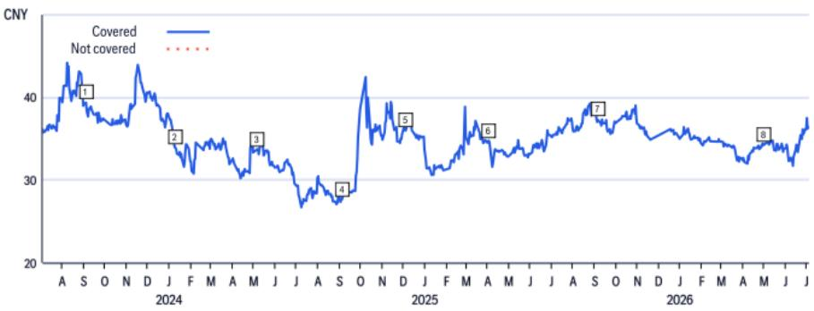
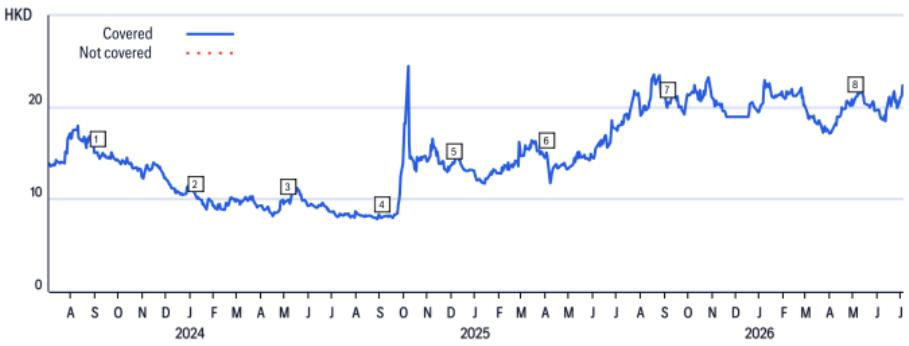
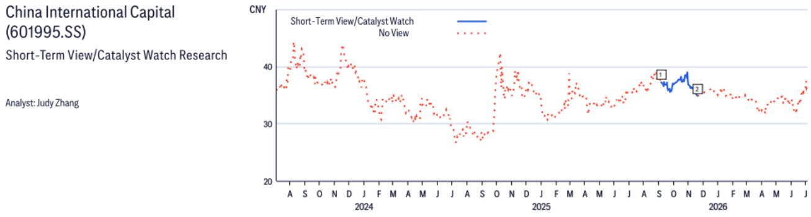
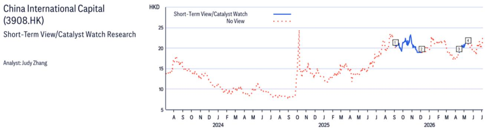

07 Jul 2026 05:06:44 ET | 11 pages

# CICC (3908.HK)

加入30日催化剂观察

方向：正面

持续时间：30天内，预期事件日期为2026年8月31日

催化剂：业绩

我们预计CICC2026年第二季度业绩增长（将于8月31日公布）同比将加速至超过80%（2026年第一季度同比增长为75%），支撑因素包括：i) 自营交易，得益于市场表现（沪深300指数在2026年第二季度环比上涨12%，而2025年第二季度环比上涨1.3%）；ii) 投行业务，CICC在2026年第二季度的A股IPO承销金额达到270亿元人民币（2025年第二季度为4.44亿元人民币）；iii) 经纪佣金，2026年第二季度A股日均成交额强劲，达到2.9万亿元人民币（环比增长12%，同比增长132%）。结合强劲的第二季度业绩，我们认为中国券商将进一步获得重新定价，原因包括：a) 对资本外流的监管审查趋严，这将加速家庭资产向A股市场重新配置，支撑日均成交额和市场表现，并使中国券商作为代理受益；b) 对国家队减持压力的担忧缓解（国家队持有的中国券商股份中已有90%被减持）。CICCH股是我们在中国券商中的首选，其净资产回报率在2026年预计将提升至约10%，当前估值为0.7倍2026年预期市净率。

<table><tr><td colspan="2">买入 / 高风险</td></tr><tr><td colspan="2">催化剂观察：正面</td></tr><tr><td>价格 (2026年7月7日 16:10)</td><td>21.88港元</td></tr><tr><td>目标价</td><td>27.66港元</td></tr><tr><td>预期股价回报率</td><td>26.4%</td></tr><tr><td>预期股息率</td><td>2.6%</td></tr><tr><td>预期总回报</td><td>29.0%</td></tr><tr><td>市值</td><td>105,620百万港元 13,467百万美元</td></tr></table>

张 Judy $^{AC}$ +852-2501-2798
judy1.zhang@citi.com

梁 Calvin
+852-2501-2367
calvin.leung@citi.com

## 业绩摘要

<table><tr><td>截至12月31日年度</td><td>净利润 (百万元人民币)</td><td>摊薄每股收益 (人民币)</td><td>每股收益增长率 (%)</td><td>市盈率 (倍)</td><td>市净率 (倍)</td><td>净资产回报率 (%)</td><td>股息率 (%)</td></tr><tr><td>2024A</td><td>4,998</td><td>1.035</td><td>-9.1</td><td>18.2</td><td>0.8</td><td>4.5</td><td>1.0</td></tr><tr><td>2025A</td><td>9,054</td><td>1.876</td><td>81.1</td><td>10.1</td><td>0.7</td><td>7.6</td><td>1.7</td></tr><tr><td>2026E</td><td>13,346</td><td>2.765</td><td>47.4</td><td>6.8</td><td>0.7</td><td>10.4</td><td>2.5</td></tr><tr><td>2027E</td><td>15,483</td><td>3.207</td><td>16.0</td><td>5.9</td><td>0.6</td><td>10.9</td><td>2.9</td></tr><tr><td>2028E</td><td>17,333</td><td>3.591</td><td>11.9</td><td>5.3</td><td>0.6</td><td>11.0</td><td>3.2</td></tr></table>

来源：由dataCentral提供

## CICC

(3908.HK; 21.88港元; 1H; 2026年7月7日; 16:10)

## 研究策略

我们对CICCH股给予买入/高风险（1H）评级。CICC的关键竞争优势包括在投行业务中宝贵的品牌认知度、强大的机构客户基础、广受认可的研究能力、与国有企业、中小企业和新经济公司的稳固关系，以及强大的海外业务布局，使其能够提供一站式跨境服务。作为中国领先的证券公司，CICC有望受益于积极的长期行业前景，多重有利因素包括：1) 潜在的中概股回归A股/H股市场；2) 中国资本市场改革，更加强调直接融资；3) 注册制IPO体系的全面实施；4) 家庭资产向权益类/基金重新配置；5) A股市场的机构化和国际化趋势；以及6) 衍生品市场的进一步开放等。

## 估值

我们采用三阶段戈登增长模型对CICCH股进行估值，目标价为27.66港元，对应0.90倍2026年预期市净率。我们三阶段戈登增长模型的假设为：(i) 高增长阶段基于我们对2026-2028年的明确预测——在此期间，我们假设平均净资产回报率为5.9%，派息率为15.2%；(ii) 2029-2035年的7年增长阶段——在此期间，我们假设平均净资产回报率为15.8%，派息率为20%；(iii) 终值阶段假设平均净资产回报率为17%，派息率为30%。我们假设所有三个阶段的股权成本均为16.8%。

## 风险

鉴于市场波动性，我们对CICCH股给予高风险评级。可能导致股价未能达到我们目标价的主要下行风险包括：(i) A股市场表现弱于预期，这将拖累中国证券公司的盈利和市场情绪；(ii) 中国经济增长放缓，这将影响社会财富和市场表现；(iii) 金融改革受挫；(iv) 来自国内大型券商、互联网金融参与者、中外合资证券公司和外商独资证券公司的竞争加剧，可能对承销和经纪费率构成压力；以及(v) 在信用事件中，交易对手信用风险高于预期。

## CICC

(601995.SS; 36.28元人民币; 2H; 2026年7月7日; 15:00)

## 估值

我们采用三阶段戈登增长模型对CICCA股进行估值，目标价为41.99元人民币，对应1.50倍2026年预期市净率。我们三阶段戈登增长模型的假设为：(i) 高增长阶段基于我们对2026-2028年的明确预测。在此期间，我们假设平均净资产回报率为5.9%，派息率为15.2%；(ii) 2029-2035年的7年增长阶段。在此期间，我们假设平均净资产回报率为15.8%，派息率为20%；(iii) 终值阶段假设平均净资产回报率为17%，派息率为30%。我们假设所有三个阶段的股权成本均为14.8%。

## 风险

鉴于市场波动性，我们对CICCA股给予高风险评级。可能导致股价偏离我们目标价的主要下行/上行风险包括：(i) A股市场表现弱于/强于预期，这将拖累/加速中国证券公司的盈利和市场情绪；(ii) 中国经济增长放缓/加速，这将影响社会财富和市场表现；(iii) 金融改革受挫；(iv) 来自国内大型券商、互联网金融参与者、中外合资证券公司和外商独资证券公司的竞争加剧/缓和，可能对承销和经纪费率构成压力/提升；以及(v) 在信用事件中，交易对手信用风险高于/低于预期。

如果您有视觉障碍并希望与Citi代表就本文件中图形的细节进行沟通，请致电美国1-888-500-5008（TTY：711），或从美国境外拨打+1-210-677-3788

## 附录A-1

## 分析师认证

主要负责本研究报告准备和内容的研究分析师要么(i)在作者栏中以“AC”标识，要么(ii)以粗体列出，并附有该分析师负责的内容。如果作者栏中指定了多位AC分析师，每位分析师仅就其负责的整个研究报告部分进行认证，但(a)归属于另一位以粗体列出的AC认证分析师的内容，以及(b)仅针对特定发行人的观点（归属于下方该发行人价格图表或评级历史表中标识的另一位AC认证分析师）除外。这些分析师中的每一位均就其负责的报告部分认证：(1)其中表达的观点准确反映了他们个人对每个提及的发行人和证券的看法，并且是独立准备的，包括对Citi环球金融有限公司及其关联公司的看法；(2)研究分析师的薪酬中没有任何部分直接或间接地与本研究报告中该研究分析师表达的具体建议或观点相关。

## 重要披露

CICC (601995.SS)

评级与目标价历史
基础研究

分析师：张 Judy

<table><tr><td></td><td>日期</td><td>评级</td><td>目标价</td><td>收盘价</td></tr><tr><td>1</td><td>2023年9月4日 07:01:21</td><td>2H</td><td>*40.44</td><td>39.37</td></tr><tr><td>2</td><td>2024年1月9日 07:56:25</td><td>2H</td><td>*39.73</td><td>33.96</td></tr><tr><td>3</td><td>2024年5月6日 07:14:54</td><td>2H</td><td>*36.85</td><td>33.74</td></tr></table>

\*表示变更

<table><tr><td></td><td>日期</td><td>评级</td><td>目标价</td><td>收盘价</td></tr><tr><td>4</td><td>2024年9月4日 05:48:50</td><td>2H</td><td>*28.07</td><td>27.67</td></tr><tr><td>5</td><td>2024年12月4日 05:14:02</td><td>2H</td><td>*40.08</td><td>35.98</td></tr><tr><td>6</td><td>2025年4月2日 11:37:13</td><td>2H</td><td>*41.65</td><td>34.77</td></tr></table>

<table><tr><td></td><td>日期</td><td>评级</td><td>目标价</td><td>收盘价</td></tr><tr><td>7</td><td>2025年9月5日 16:32:15</td><td>2H</td><td>*41.91</td><td>37.29</td></tr><tr><td>8</td><td>2026年5月4日 02:01:05</td><td>2H</td><td>*41.99</td><td>34.23</td></tr></table>

以上评级/目标价变更反映美国东部时间

## CICC (3908.HK)

评级与目标价历史
基础研究

分析师：张 Judy

<table><tr><td></td><td>日期</td><td>评级</td><td>目标价</td><td>收盘价</td></tr><tr><td>1</td><td>2023年9月4日 07:01:21</td><td>1H</td><td>*21.70</td><td>15.12</td></tr><tr><td>2</td><td>2024年1月9日 07:56:25</td><td>1H</td><td>*17.48</td><td>10.28</td></tr><tr><td>3</td><td>2024年5月6日 07:14:54</td><td>1H</td><td>*16.54</td><td>9.95</td></tr></table>

\*表示变更

<table><tr><td></td><td>日期</td><td>评级</td><td>目标价</td><td>收盘价</td></tr><tr><td>4</td><td>2024年9月4日 05:48:50</td><td>1H</td><td>*12.60</td><td>8.08</td></tr><tr><td>5</td><td>2024年12月4日 05:14:02</td><td>1H</td><td>*18.00</td><td>13.90</td></tr><tr><td>6</td><td>2025年4月2日 11:37:13</td><td>1H</td><td>*19.43</td><td>15.08</td></tr></table>

<table><tr><td></td><td>日期</td><td>评级</td><td>目标价</td><td>收盘价</td></tr><tr><td>7</td><td>2025年9月5日 16:32:15</td><td>1H</td><td>*27.12</td><td>20.56</td></tr><tr><td>8</td><td>2026年5月4日 02:01:05</td><td>1H</td><td>*27.66</td><td>21.12</td></tr></table>

以上评级/目标价变更反映美国东部时间

<table><tr><td>1</td><td>日期2025年9月5日 12:32:15</td><td>操作添加STV</td><td>预期方向正面</td><td>收盘价90天</td><td>37.29</td><td>2</td><td>日期2025年12月4日 21:04:38</td><td>操作移除STV</td><td>预期方向正面</td><td>收盘价90天</td><td>34.89</td></tr></table>

CW - 催化剂观察, STV - 短期观点  
以上评级/目标价变更反映美国东部时间

<table><tr><td rowspan="2" colspan="2">日期</td><td rowspan="2">操作</td><td rowspan="2">预期方向</td><td colspan="2">收盘价</td><td rowspan="2" colspan="2">日期</td><td rowspan="2">预期方向</td><td rowspan="2" colspan="2">收盘价</td></tr><tr><td>持续时间</td><td>90天</td></tr><tr><td>1</td><td>2025年9月5日 12:32:15</td><td>添加STV</td><td>正面</td><td>90天</td><td>20.56</td><td>3</td><td>2026年4月13日 08:04:33</td><td>添加CW</td><td>正面</td><td>30天</td></tr><tr><td>2</td><td>2025年12月4日 22:34:44</td><td>移除STV</td><td>正面</td><td>90天</td><td>18.96</td><td>4</td><td>2026年5月14日 00:27:45</td><td>移除CW</td><td>正面</td><td>30天</td></tr></table>

CW - 催化剂观察, STV - 短期观点  
以上评级/目标价变更反映美国东部时间

Citi环球金融有限公司或其关联公司已在过去12个月内因向CICC提供投资银行服务而获得报酬。

<table><tr><td>Citi环球金融有限公司或其关联公司预计在未来三个月内将寻求或有意向CICC提供投资银行服务并获取报酬。</td></tr><tr><td>Citi环球金融有限公司或其关联公司在过去12个月内因向CICC提供投资银行服务以外的产品和服务而获得报酬。</td></tr><tr><td>Citi环球金融有限公司或其关联公司目前拥有，或在过去12个月内曾拥有CICC作为投资银行客户。</td></tr><tr><td>Citi环球金融有限公司或其关联公司目前拥有，或在过去12个月内曾拥有CICC作为客户，并提供非投资银行、证券相关服务。</td></tr><tr><td>Citi环球金融有限公司或其关联公司目前拥有，或在过去12个月内曾拥有CICC作为客户，并提供非投资银行、非证券相关服务。</td></tr><tr><td>分析师的薪酬由Citi管理层和Citi高级管理层根据旨在惠及Citi环球金融有限公司及其关联公司（“公司”）读者客户的活动和服务确定。薪酬不与特定交易或建议挂钩。与所有公司员工一样，分析师的薪酬受到公司整体盈利能力的影响，其中包括投资银行、销售和交易以及自营交易收入。股权研究分析师薪酬的一个因素是安排机构客户与所覆盖公司管理团队之间的企业接触活动。通常，当分析师对公司持积极看法时，公司管理层更有可能参与。</td></tr><tr><td>对于产品中推荐的公司并非做市商的金融工具，公司是该等金融工具（及任何基础工具）的流动性提供者，并可能在与该等工具的交易中担任主事人。公司是定期发行与产品中可能推荐的证券挂钩的可交易金融工具的机构。公司定期交易产品中讨论的发行人的证券。公司可能以与产品不一致的方式进行证券交易，并且对于产品所涵盖的证券，将按主事人基础从客户处买入或卖出。</td></tr><tr><td>除非另有说明，研究分析师或其团队任何成员在过去12个月内均未实地考察过已提供投资观点的公司的运营情况。</td></tr></table>

有关本Citi产品（“产品”）所涉公司的重要披露（包括历史披露副本），请联系Citi，地址：388 Greenwich Street, 6th Floor, New York, NY, 10013，收件人：Legal/Compliance [E6WYB6412478]。此外，相同的重大披露（估值和风险评估以及历史披露除外）包含在公司披露网站上，网址为 https://www.citivelocity.com/cvr/eppublic/citi\_research\_disclosures。估值和风险评估可在关于标的公司的最新研究笔记/报告正文中找到。根据市场滥用法规，Citi在过去12个月内发布的所有建议的历史记录可通过CitiVelocity（https://www.citivelocity.com/cv2）或您的标准分发门户访问。历史披露（最多过去三年）将应要求提供。

Citi股权评级分布

<table><tr><td colspan="7">Citi股权评级分布</td></tr><tr><td></td><td colspan="3">12个月评级</td><td colspan="3">催化剂观察</td></tr><tr><td>数据截至2026年7月1日</td><td>买入</td><td>持有</td><td>卖出</td><td>买入</td><td>持有</td><td>卖出</td></tr><tr><td>Citi全球基础覆盖范围（中性=持有）</td><td>61%</td><td>32%</td><td>7%</td><td>36%</td><td>48%</td><td>16%</td></tr><tr><td>各评级类别中属于投资银行客户的公司的百分比</td><td>38%</td><td>42%</td><td>27%</td><td>42%</td><td>37%</td><td>36%</td></tr></table>

Citi基础研究投资评级指南：

Citi股票建议包括投资评级和可选的风险评级以突出高风险股票。风险评级同时考虑价格波动性和基本标准。股票将没有风险评级或被指定为高风险。

投资评级：Citi投资评级为买入、中性、卖出。我们的评级是分析师对预期总回报和风险的预期函数。预期总回报是未来12个月内预测股价升值（或贬值）加上股息回报表现的总和。目标价基于12个月的时间范围。投资评级定义为：买入（1）预期总回报为15%或以上，或高风险股票为25%或以上；卖出（3）为负预期总回报。任何未被指定为买入或卖出的被覆盖股票均为中性（2）。对于评级为中性（2）的股票，如果分析师认为缺乏足够的估值驱动因素和/或投资催化剂来得出正面或负面的投资观点，他们可以在Citi管理层的批准下选择不指定目标价，从而不推导出预期总回报。Citi可能因监管和/或内部政策原因暂停其评级和目标价，并指定“评级暂停”状态。Citi也可能因其他特殊情况（例如缺乏对分析师论点至关重要的信息、交易暂停）影响公司及/或公司证券交易而暂停其评级和目标价，并指定“审核中”状态。在这两种情况下，评级和目标价将在评级历史价格图表中分别显示为“—”和“-”。在2022年4月11日之前，Citi将这两种情况均指定为“审核中”状态，而在2020年11月11日之前，仅在特殊情况下指定。在实际可行的情况下，分析师将尽快发布重新建立评级和投资论点的报告。投资评级由覆盖启动时、投资和/或风险评级变更时或目标价变更时（受有限管理层酌情权限制）按上述范围确定。有时，由于市场价格变动和/或其他短期波动或交易模式，预期总回报可能落在此范围之外。此类临时偏差将被允许，但将受到研究管理层的审查。您购买或出售证券的决定应基于您个人的投资目标，并且仅在评估股票的预期表现和风险后做出。

催化剂观察/短期观点评级披露：

催化剂观察和短期观点上行/下行判断：Citi还可能包括催化剂观察或短期观点上行或下行判断，以表明分析师预期股价在指定30天或90天期间内因一项或多项特定的近期催化剂或影响公司或市场的事件而相对上涨（下跌）。当分析师对股价影响将发生具有高度信心时，将发布催化剂观察；当信心水平中等时，将发布短期观点。催化剂观察或短期观点上行/下行判断将在指定的30/90天期限结束时自动失效。如果股价表现（按市场收盘价计算）超过判断方向的15%，催化剂观察也将自动移除（除非分析师推翻）。分析师也可能在指定期限结束前通过发布的研究笔记移除催化剂观察或短期观点判断。催化剂观察/短期观点上行或下行判断可能与股票的基础股权评级不同，且不影响该评级，后者反映更长期的总相对回报预期。就FINRA评级分布披露规则而言，催化剂观察/短期观点上行判断对应买入建议，催化剂观察/短期观点下行判断对应卖出建议。任何未被指定为催化剂观察上行、催化剂观察下行、短期观点上行或短期观点下行判断的股票被视为催化剂观察/短期观点无观点。就FINRA评级分布披露规则而言，我们在催化剂观察/短期观点上行/下行评级系统的评级分布表中将催化剂观察/短期观点无观点对应为持有。然而，我们重申我们不认为无观点是一项建议。对于所有催化剂观察/短期观点上行/下行判断，存在催化剂和相关的股价变动可能不会如预期实现的风险。

## 研究分析师关联关系/非美国研究分析师披露

本报告作者的雇佣法律实体如下所列（其监管机构进一步列于下文）。编制本报告的非美国研究分析师（即除被标识为由Citi环球金融有限公司雇佣的分析师之外的所有下述研究分析师）未在FINRA注册/具备研究分析师资格。此类研究分析师可能不是成员组织的关联人士（但受雇于成员组织的关联公司），因此可能不受FINRA规则2241关于与标的公司沟通、公开露面以及交易研究分析师账户持有证券的限制。

<table><tr><td>Citi环球金融亚洲有限公司 张 Judy; 梁 Calvin</td></tr><tr><td>其他披露</td></tr><tr><td>建议中提及的任何工具的价格均为该工具主要市场前一交易日的市场收盘价，除非另有说明。</td></tr><tr><td>本研究报告中所作任何建议的完成和首次传播时间均为产品顶部显示的美国东部日期时间。如果产品引用了其他分析师的看法，请参阅价格图表或评级历史表，以了解该看法的完成和首次传播的日期/时间。</td></tr><tr><td>各司法管辖区的法规要求，如果建议与作者先前关于同一金融工具或发行人并在过去12个月内发布的任何建议不同，则应指明变更和先前建议的日期。对于基础覆盖范围，请参阅本披露附录中的价格图表或评级变更历史，或发行人披露摘要，网址为 https://www.citivelocity.com/cvr/eppublic/citi_research_disclosures。</td></tr><tr><td>Citi已实施相关政策，用于识别、考虑和管理因发布或分发投资研究而产生的潜在利益冲突。这些政策的描述可在 https://www.citivelocity.com/cvr/eppublic/citi_research_disclosures 找到。</td></tr><tr><td>过去12个月每个季度末，所有Citi建议中相当于“买入”、“持有”、“卖出”的比例（以及其中在过去12个月内获得Citi投资公司服务的百分比，显示在括号中）如下：2026年第一季度买入33%（63%），持有44%（52%），卖出23%（46%），相对价值0.5%（89%）；2025年第四季度买入33%（63%），持有44%（50%），卖出23%（46%），相对价值0.4%（91%）；2025年第三季度买入33%（61%），持有44%（52%），卖出23%（50%），相对价值0.4%（80%）；2025年第二季度买入33%（63%），持有44%（51%），卖出23%（49%），相对价值0.4%（86%）。为披露除股权以外的建议（其定义可在相应披露部分找到），“买入”指正方向交易思路；“卖出”指负方向交易思路；“相对价值”指任何没有明确方向的交易思路。</td></tr><tr><td>欧洲法规要求在引用证券过往表现时提供5年价格历史。CitiVelocity的图表工具（https://www.citivelocity.com/cv2/#go/CHARTING_3_Equities）提供创建可定制价格图表的功能，包括五年选项。该工具可在CitiVelocity（https://www.citivelocity.com/）任何资产类别菜单下的数据与分析部分找到。如需更多信息，请联系CitiVelocity支持（https://www.citivelocity.com/cv2/go/CLIENT_SUPPORT）。除非另有说明，所有引用价格的来源均为DataCentral，该数据库从LSEG数据与分析获取价格信息。过往表现并非未来结果的保证或可靠指标。预测并非未来表现的保证或可靠指标。</td></tr><tr><td>读者在投资前应始终仔细考虑ETF的投资目标、风险以及费用和开支。适用的ETF招股说明书和关键读者信息文件（如适用）应包含该ETF的此等信息和其他信息。在投资前仔细阅读任何此类招股说明书非常重要。客户可从适用的分销商或授权参与者、ETF上市的交易所和/或适用的ETF发行人的适用网站获取ETF的招股说明书和关键读者信息文件。投资及其任何应计收入的价值可能下跌或上涨。任何过往表现、预测或预报均不表明未来或可能的表现。本文包含的任何关于ETF的信息仅供说明之用，不应被视为出售或招揽购买任何ETF单位的要约，无论是明示还是暗示。所表达的意见是作者的意见，不一定反映ETF发行人、其任何代理人或其关联公司的观点。</td></tr><tr><td>Citi环球金融印度私人有限公司和/或其关联公司可能不时实际或实益拥有标的发行人1%或以上的债务证券。</td></tr><tr><td>请注意，根据经修订的第13959号行政命令（“命令”），美国人被禁止投资于美国政府确定为命令对象的任何公司的证券。本研究无意以任何可能导致违反命令的方式使用或依赖。鼓励读者依靠自己的法律顾问就遵守命令以及由美国财政部外国资产控制办公室管理和执行的其他经济制裁计划提供建议。</td></tr><tr><td>本通讯面向符合以色列《研究交流、投资营销和投资组合管理法》（1995年）（“咨询法”）中定义的“合格客户”的人士。在以色列境内，本通讯不针对零售客户，Citi不会向零售客户或非合格客户提供此类产品或交易。演示者未获得以色列证券管理局（“ISA”）的投资顾问或投资营销许可，本通讯不构成投资或营销建议。本文包含的信息可能涉及ISA未监管的事项。本通讯涉及的任何证券不得向任何以色列人士发行或出售，除非根据以色列《证券法》（1968年）的证券发行豁免及其下的公开发行规则。</td></tr><tr><td>Citi广泛并同时通过公司专有的电子分发平台（例如CitiVelocity和各种全球财富平台）向公司的机构和零售客户分发其研究内容。为方便起见，某些（但非全部）研究内容可能通过第三方聚合器分发。客户可能会在酌情基础上，且仅在此类研究内容已广泛分发后，通过电子邮件收到已发布的研究报告。某些研究仅提供给机构读者以满足监管要求。Citi分析师向客户提供的服务水平和类型可能因多种因素而异，例如客户对接收分析师通讯的频率和方式的个人偏好、客户的风险状况和投资重点及视角（例如市场范围、行业特定、长期、短期等）、与公司的整体客户关系的规模和范围以及法律和监管限制。</td></tr><tr><td>根据Comissão de Valores Mobiliários Resolução 20和ASIC Regulatory Guide 264，Citi需要披露Citi关联公司或业务是否与标的公司有商业关系。考虑到Citi在全球100多个国家经营多项业务，Citi很可能与标的公司有商业关系。</td></tr><tr><td>公司推荐、要约或出售的证券：(i) 不受联邦存款保险公司保险；(ii) 不是任何受保存款机构（包括Citi）的存款或其他义务；以及(iii) 面临投资风险，包括可能损失本金投资金额。产品仅供参考，不构成购买或出售证券的要约或招揽。购买产品中提及的证券的任何决定必须考虑该证券的现有公开信息或任何注册招股说明书。尽管信息来自并基于公司认为可靠的来源，但我们不保证其准确性，并且信息可能不完整和经过浓缩。但请注意，公司已采取一切合理措施确定产品重要披露部分中披露的准确性和完整性。公司的研究部门已获得本产品中提及的标的公司的协助，包括但不限于与标的公司管理层的讨论。公司政策禁止研究分析师向标的公司发送研究草稿。但是，应假定产品的作者已与标的公司进行讨论，以确保在发布前事实准确。关于ESG（环境、社会、治理）因素的陈述和观点通常基于受影响公司的公开声明或其他公开新闻，作者可能未独立核实。ESG因素是读者在做出投资决策时可能考虑的一个因素。所有意见、预测和估计构成作者截至产品日期的判断，并且这些以及产品中包含的任何其他信息如有变更，恕不另行通知。金融工具的价格和可用性也可能随时变更，恕不另行通知。尽管公司内部其他部门向本产品中讨论的公司提供建议，但在此类角色中获得的信息不用于准备产品。尽管Citi未设定预定的发布频率，但如果产品是基础股权或信用研究报告，Citi旨在提供对所覆盖发行人的研究覆盖，包括响应影响发行人的新闻。对于非基础研究报告，Citi可能不会定期更新报告中包含的观点、建议和事实。尽管Citi维持对发行人的覆盖、提出建议或讨论发行人，但Citi可能因法律或政策原因定期被限制引用某些发行人。如果已发布交易思路的组成部分受到限制，则该交易思路将从产品中包含的任何开放交易思路列表中移除。限制解除后，如果分析师继续支持该交易思路，则将其重新列入开放交易思路列表，否则将正式关闭。Citi可能向不同类别的客户提供不同的研究产品和服务（例如，基于长期或短期投资期限），这可能导致不同的结论或建议，可能对证券价格产生与替代研究产品中的建议相反的影响，前提是每个产品与其各自评级系统一致。</td></tr><tr><td>投资非美国证券，包括美国存托凭证，可能涉及某些风险。非美国发行人的证券可能未在美国证券交易委员会注册，也不受其报告要求的约束。关于外国证券的信息可能有限。外国公司通常不受与美国公司相当的统一审计和报告标准、实践和要求的约束。某些外国公司的证券可能流动性较低，其价格可能比可比的美国公司证券更波动。此外，汇率变动可能对美国读者在外国股票上的研究价值及其相应的股息支付产生不利影响。美国存托凭证读者的净股息是使用预扣税率惯例估算的，被认为是准确的，但鼓励读者咨询其税务顾问以获取准确的股息计算。从公司收到产品的读者可能在某些州或其他司法管辖区被禁止从公司购买产品中提及的证券。请咨询您的财务顾问以获取更多详细信息。Citi环球金融有限公司对在美国的产品负责。美国读者因产品中包含的信息而产生的任何订单只能通过Citi环球金融有限公司下达。</td></tr><tr><td>对产品生产负责的Citi法律实体是第一署名作者受雇的法律实体。</td></tr><tr><td>产品在澳大利亚由Citi环球金融澳大利亚有限公司提供。 (ABN 64 003 114 832 and AFSL No. 240992)，ASX集团参与者，受澳大利亚证券和投资委员会监管。Citi中心，2 Park Street, Sydney, NSW 2000。Citi环球金融澳大利亚有限公司不是《1959年银行法》下的授权存款机构，也不受澳大利亚审慎监管局监管。</td></tr><tr><td>产品在巴西由Citi环球金融巴西 - CCTVM SA提供，该公司受CVM - Comissão de Valores Mobiliários（“CVM”）、BACEN - 巴西中央银行、APIMEC - Associação dos Analistas e Profissionais de Investimento do Mercado de Capitais和ANBIMA – Associação Brasileira das Entidades dos Mercados Financeiro e de Capitais监管。地址：Av. Paulista, 1111 - 14º andar(parte) - CEP: 01311920 - São Paulo - SP。</td></tr><tr><td>本产品在智利通过Banchile Corredores de Bolsa S.A.提供，该公司是Citi公司的间接子公司，受Comisión Para El Mercado Financiero监管。地址：Enrique Foster Sur, 20, piso 6, Las Condes, Santiago, Chile。</td></tr><tr><td>哥伦比亚共和国读者披露：本通讯或信息不构成2010年第2555号法令第2.40.1.1.2条或修改、替代或补充该条款的法规意义上的专业研究交流。编制和分发本文所述的研究报告和一般通讯不需要成为哥伦比亚金融监管局监管的实体。</td></tr><tr><td>产品在德国由Citi环球金融欧洲股份公司提供，该公司受欧洲中央银行和德国联邦金融监管局监管。地址：Börsenplatz 9, 60313 Frankfurt am Main, Germany。</td></tr><tr><td>除非另有说明，如果编写本报告的分析师位于香港且报告涉及“证券”（定义见香港法例第571章《证券及期货条例》），则该报告由Citi环球金融亚洲有限公司在香港发布。Citi环球金融亚洲有限公司受香港证券及期货事务监察委员会监管。如果报告由非香港分析师编写，请注意该分析师（及其受雇或认可的法律实体）未在香港获得许可/注册，并且他们不声称如此。请参阅“研究分析师关联关系/非美国研究分析师披露”部分，了解分析师的雇佣实体详情。</td></tr><tr><td>产品在印度由Citi环球金融印度私人有限公司提供，该公司作为研究分析师受印度证券交易委员会监管（SEBI注册号INH000000438）。CGM还积极参与印度的商人银行业务（SEBI注册号INM000010718）和股票经纪业务（SEBI注册号INZ000263033），并已就此向SEBI注册。
