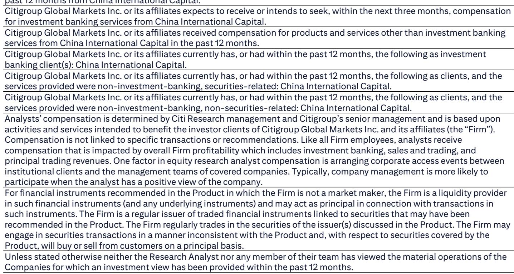
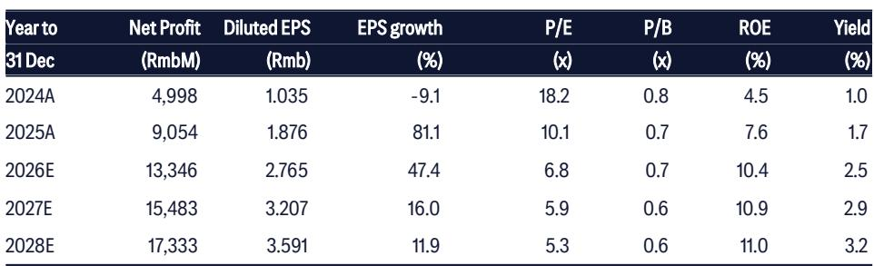

# CICC：盈利拐点重塑中国券商行业格局

CICC的案例并非仅仅关乎单个季度的业绩表现。它涉及一个结构性的重新定价催化剂，该催化剂将三种相互强化的力量结合在一起：引导家庭储蓄进入国内市场的监管框架转变、受益于活跃市场环境的自营交易引擎，以及酝酿多年的投行业务复苏。一份全球研究机构的报告已对CICCH股启动了为期30天的催化剂观察，预计2026年第二季度盈利同比增长超过80%。仅这一数字就足以引起关注。但更深层次的分析问题是，这个季度是否标志着一个多年盈利轨迹的开端，还是一个来得快去得也快的周期性峰值。

时机很重要。该报告将2026年8月31日标记为预期的业绩公布日期。对于为这一事件进行布局的机构观察者而言，问题不在于业绩是否强劲——数据点强烈表明它们将会强劲——而在于市场是否已经消化了这一复苏。以2026年预估市净率0.7倍计算，估值并不算高。但仅凭估值从来都不是一个充分的论点。使CICC在当前水平上具有吸引力的是三个盈利驱动因素的汇合，这些因素不仅相互关联，而且相互强化。

首先，自营交易业务受益于沪深300指数在2026年第二季度环比上涨12%，而去年同期仅为1.3%。对于一家拥有CICC这样资产负债表和交易能力的券商来说，这种差异直接转化为收入。其次，投行部门在第二季度A股IPO承销金额飙升至270亿元人民币，较去年同期的4.44亿元人民币大幅增长。第三，经纪佣金正乘着交易量高涨的浪潮，第二季度日均成交额达到2.9万亿元人民币，同比增长132%。

这些并非孤立的利好因素。它们是该报告识别出但未完全探讨的更广泛市场结构变化的表征。对资本外流监管审查的收紧正在加速家庭资产向A股市场的重新配置。这是一种政策驱动的流动性注入，所有券商都将受益，但CICC凭借其机构客户基础、研究能力和跨境服务平台，有望获得不成比例的份额。

该报告还强调了一个关键但被低估的风险缓解因素：国家队对中资券商的抛售压力已基本消散，其持有的90%股份已被出售。这消除了一个长期压制整个板块估值的重大悬置因素。对于CICC而言，这一供给侧风险的消除，加上基本面的改善，创造了一个在中国金融板块中罕见的估值设定。

## 盈利势头并非幻象，但需要更长的时间跨度来证明当前估值的合理性

报告中概述的盈利轨迹令人瞩目。净利润预计将从2024年的50亿元人民币增至2026年的133亿元人民币，年复合增长率超过60%。股本回报率从2024年的4.5%提升至2026年预估的10.4%，并有望在2028年进一步改善至11.0%。这些数字并非仅仅是周期性反弹所能体现的。它们表明盈利能力的结构性改善，如果得以持续，将证明当前0.7倍市净率之上的重新定价是合理的。

但关键问题在于可持续性。该报告的三阶段戈登增长模型假设在2029年至2035年的七年增长阶段，平均股本回报率为15.8%，在终值阶段为17%。对于任何金融机构来说，这些都是雄心勃勃的假设，更不用说一家在以其波动性和监管不可预测性而闻名的市场中运营的中国券商了。H股隐含的16.8%的股权成本反映了市场对这种不确定性所赋予的风险溢价。

盈利汇总表显示，净利润增速从2025年的81%放缓至2026年的47%，然后到2027年为16%，2028年为12%。这种减速模式是现实的。不太确定的是，如果市场条件正常化，2027年和2028年的盈利相对水平能否维持。该报告的预测假设了一个相对温和的环境：A股市场持续走强、IPO活动持续以及佣金费率稳定。这些因素中的任何一个都可能比模型预期的更快恶化。

## 投行业务复苏是真实的，但其集中度引发疑问

CICC的竞争优势一直在于其投行业务。报告指出，A股IPO承销额从2025年第二季度的4.44亿元人民币跃升至2026年同期的270亿元人民币。这是60倍的增长。隐含的市场份额增长是巨大的。但该报告未完全解决的问题是，这反映的是可持续的项目储备，还是可能不会重复出现的大型交易的集中。

该报告将潜在的中国ADR“回归”上市视为长期利好因素。如果在美国上市的中国公司加速回归国内市场，CICC的跨境能力和监管关系使其能够抓住这一业务的很大一部分份额。但此类上市的时间和数量本质上难以预测。2026年第二季度的激增可能包括几项大型、非经常性的委托，从而抬高了比较基数。

对于观察者而言，重要的不是投行业务是否强劲——它显然是强劲的——而是市场是否正确贴现了这一收入流固有的波动性。该报告的估值模型通过多年平均值平滑了这种波动性，这对于长期框架是合适的。但对于12个月周期的观察者来说，盈利轨迹可能比模型显示的更加不均匀。

## 自营交易引擎是较强大的短期催化剂，但也是最具周期性的

沪深300指数环比上涨12%是第二季度盈利加速的最重要驱动因素。CICC的自营交易账簿直接暴露于市场波动，报告中对市场表现的假设对盈利预测至关重要。市场回报与CICC盈利之间的隐含相关性很高，这意味着该股票实际上是对A股市场的杠杆化押注。

对于看好中国市场的观察者来说，这未必是个问题。该报告关于资本外流监管收紧将推动家庭资产向A股市场重新配置的论点很有说服力。如果家庭将储蓄中哪怕一小部分从银行存款转移到市场，流动性效应就可能维持高交易量并支撑市场估值。CICC作为一家拥有强大零售和机构平台的领先券商，将直接受益。

但风险是对称的。如果市场条件恶化，在好时期推动盈利加速的自营交易收入，在坏时期将导致盈利减速。该报告在其下行情景中承认了这一风险，将弱于预期的A股市场表现列为首要风险。该股票相对于市场的贝塔值可能高于1，这意味着回撤将被放大。

## 报告未完全回答的问题：竞争定位的结构性问题

该报告将日益激烈的竞争确定为一个关键风险，指出了来自国内大型券商、互联网金融平台和外资证券公司的威胁。但它没有提供一个评估CICC在日益拥挤的市场中护城河的框架。投行业务是关系驱动的，CICC的品牌知名度和国企关系是真正的优势。但经纪业务日益商品化，佣金费率压缩是一个持续趋势。自营交易业务则取决于市场条件和从外部难以评估的风险管理能力。

该报告的估值假设CICC能够维持或提高其在所有三条业务线上的市场份额。这是一个合理的基准情景，但并非相对少见可能的结果。在竞争侵蚀承销费和经纪佣金，而市场条件仍然有利的情景下，产生的盈利将远低于报告的预测。该报告没有对此情景进行定量压力测试。

另一个未解决的问题是股息支付率的轨迹。该报告假设高增长阶段的支付率为15.2%，增长阶段增至20%，终值阶段增至30%。这些假设与一家正在将利润再投资于增长的公司是一致的。但如果盈利如预期般加速，股东可能会要求更高的支付率。该报告29%的总回报预期包括2.6%的股息率，这相对温和。更激进的派息政策可能会改变回报计算。

## 评估当前水平下CICC的决策框架

对于考虑持有CICCH股的观察者而言，决策框架应围绕三个问题展开：

第一，你对未来12个月A股市场的看法是什么？如果你认为对资本外流的监管收紧将维持高交易量并支撑市场估值，那么CICC是表达这一观点的高确信度方式。如果你对市场持谨慎或看空态度，该股票对市场波动的敏感性使其成为一项有风险的持有。

第二，你如何评估投行项目储备的可持续性？第二季度IPO承销的激增令人印象深刻，但它可能包括几项大型、非经常性的交易。观察者应关注已公布和待定委托的项目储备，以评估收入流是在扩大还是集中在少数几笔大交易上。

第三，你的预期回报和持有周期是多少？以2026年市净率0.7倍计算，按历史标准衡量，该股票并不昂贵。但16.8%的隐含股权成本表明市场已经贴现了显著风险。如果你的预期回报与该贴现率一致，该股票可能为风险提供足够的补偿。如果你需要更高的安全边际，等待回调可能是谨慎的做法。

该报告的催化剂观察明确是短期的，以业绩公布为中心，为期30天。对于能够围绕该事件进行操作的观察者来说，不对称的回报特征具有吸引力：业绩很可能强劲，如果市场尚未完全消化改善，股票可能会重新定价。对于长期观察者而言，决策取决于结构性论点——家庭资产重新配置、监管改革以及CICC的竞争定位——是否足够强大以克服周期性风险。

## 完整报告揭示了建议背后的分析深度

此处呈现的分析借鉴了原始报告的关键发现，但完整文件包含了严谨决策所必需的更多细节。完整报告包括详细的财务模型，其中包含每条收入线的明确假设、带有敏感性分析的三阶段戈登增长模型，以及风险评估框架。

对于希望查看原始图表和数据的观察者，包括盈利汇总表、估值模型假设和催化剂时间线，完整报告可通过研究平台获取。原始文件中的图表为盈利轨迹、估值历史和催化剂时间线提供了视觉背景，这些在文本中难以复现。

该报告的分析严谨性体现在其对上行和下行风险的处理、明确的建模假设以及对研究论点的清晰阐述。对于认真的观察者而言，阅读完整报告并非可选项——它是做出明智决策的基础。

*仅供参考。部分内容可能基于源材料通过AI辅助生成、翻译、总结或编辑，可能存在遗漏或错误。请独立核实。这不构成专业建议。*

仅供参考。部分内容可能基于源材料通过AI辅助生成、翻译、总结或编辑，可能存在遗漏或错误。请独立核实。这不构成专业建议。

