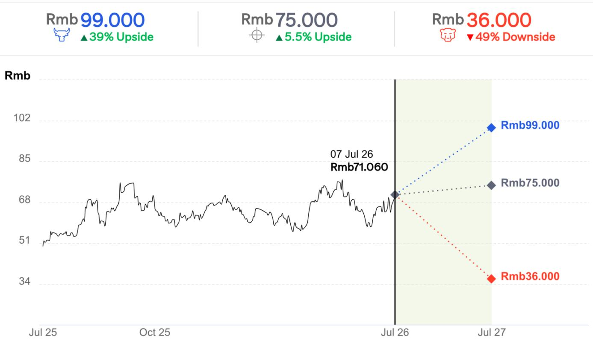
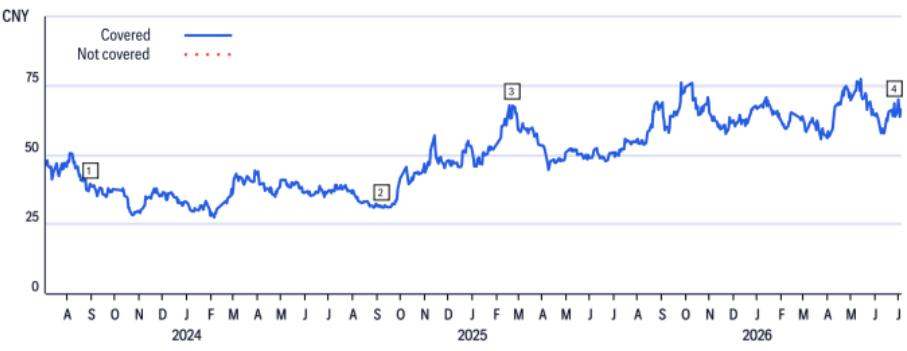

# 关于某公司的研究观察

## 第二季度业绩指引表现突出，或受存储价格调整影响

## 研究观点

某公司公布第二季度净利润指引为20-25亿元（环比增长229%-312%），高于此前市场普遍预期。研究认为，该公司可能受益于第二季度存储价格调整，截至第一季度末公司存货约440亿元，而第一季度营业成本为330亿元。同时，第二季度可能存在部分产品出货，但预计贡献有限。最终结果有待完整财报发布。

<table><tr><td colspan="2">中性</td></tr><tr><td>价格（2026年7月7日15:00）</td><td>71.060元</td></tr><tr><td>目标价</td><td>75.000元</td></tr><tr><td>预期价格回报</td><td>5.5%</td></tr><tr><td>预期股息率</td><td>0.3%</td></tr><tr><td>预期总回报</td><td>5.8%</td></tr><tr><td>总市值</td><td>1,043.50亿元</td></tr></table>

## 情景分析：某公司

  
价差89个百分点
当前价格及预期回报（上行/下行）截至2026年7月7日

## 乐观情景假设

• 国内AI硬件采购预算超出预期

## 基准情景假设

• 国内AI硬件采购预算符合预期

• 该公司在国内AI服务器市场占有50%份额

## 悲观情景假设

• 国内AI硬件采购预算低于预期

## 某公司

## 估值分析

目标价75.0元基于2027年预期市盈率25倍，设定为三年均值。研究认为，市场已充分反映国内AI服务器的贡献。

## 风险因素

主要风险因素包括：1）终端市场需求恢复速度与预期存在差异；2）AI应用推广速度与预期存在差异，影响互联网公司硬件采购预算；3）利润率出现显著变化，导致盈利水平与预期不同；4）相关领域国际关系变化，影响经营环境的稳定性。以上任一风险因素均可能导致股价偏离目标价。

<table><tr><td colspan="2">日期</td><td rowspan="2">评级¹</td><td rowspan="2">目标价*46.00</td><td rowspan="2">收盘价39.13</td></tr><tr><td>1</td><td>2023-08-31 11:39:02</td></tr><tr><td>2</td><td>2024-09-08 21:03:45</td><td>*²</td><td>*34.00</td><td>31.12</td></tr></table>

如有视觉障碍并希望就本文件中的图表细节与相关代表沟通，请致电美国1-888-500-5008（TTY：711），或从美国境外拨打+1-210-677-3788

## 附录A-1

## 分析师认证

主要负责本研究报告编制和内容的研究分析师要么在作者栏中以"AC"标识，要么以粗体列在与该分析师相关的内容旁。若作者栏中指定了多位AC分析师，每位分析师仅对其负责的部分进行认证，不包括（a）以粗体列出的其他AC认证分析师所负责的内容，以及（b）仅针对特定发行人的观点，这些观点归属于下方价格图表或评级历史表中标识的其他AC认证分析师。每位分析师就其负责的报告部分认证：（1）其中表达的观点准确反映了其对相关发行人和证券的个人观点，并以独立方式编制；（2）研究分析师的薪酬从未、现在也不会直接或间接与本研究报告中该分析师提出的具体建议或观点挂钩。

## 重要披露

  
*表示变更  
评级/目标价变化以上述东部时间为准

分析师薪酬由相关管理层根据其为机构客户提供的活动和服务确定，不与特定交易或建议挂钩。与所有员工一样，分析师薪酬受公司整体盈利能力影响。股权研究分析师薪酬的一个因素是安排机构客户与所覆盖公司管理层之间的企业接触活动。

除非另有说明，研究分析师及其团队成员在过去12个月内均未实地考察过所提供投资观点的公司运营情况。

如需了解本产品所涉及公司的重要披露信息（包括历史披露副本），请联系相关机构。此外，除估值和风险评估及历史披露外，相同的重要披露信息可在公司披露网站查阅。估值和风险评估可在最近一期关于该公司的研究报告中找到。根据相关法规，过去12个月内所有建议的历史记录可通过指定平台访问。历史披露信息（最多过去三年）可应要求提供。

<table><tr><td colspan="7">相关股权评级分布</td></tr><tr><td></td><td colspan="3">12个月评级</td><td colspan="3">催化剂观察</td></tr><tr><td>数据截至2026年7月1日</td><td>买入</td><td>持有</td><td>卖出</td><td>买入</td><td>持有</td><td>卖出</td></tr><tr><td>全球基础覆盖（中性=持有）</td><td>61%</td><td>32%</td><td>7%</td><td>36%</td><td>48%</td><td>16%</td></tr><tr><td>各评级类别中属于投行客户的百分比</td><td>38%</td><td>42%</td><td>27%</td><td>42%</td><td>37%</td><td>36%</td></tr></table>

基础研究投资评级指南：

股票推荐包括投资评级和可选的风险评级。风险评级考虑价格波动和基本面标准。股票将没有风险评级或分配高风险评级。

投资评级：投资评级为买入、中性、卖出。评级基于分析师对预期总回报和风险的预期。预期总回报是未来12个月内预测价格变动加股息回报表现的总和。目标价基于12个月时间框架。投资评级定义：买入（1）预期总回报15%或以上（高风险股票为25%或以上）；卖出（3）为负预期总回报。未分配买入或卖出的覆盖股票为中性（2）。对于中性评级的股票，如果分析师认为缺乏足够的估值驱动因素和/或投资催化剂来得出正面或负面投资观点，经管理层批准可选择不分配目标价。可能因监管和/或内部政策原因暂停评级和目标价并分配"评级暂停"状态。也可能因其他特殊情况暂停评级和目标价并分配"待审"状态。在这两种情况下，评级和目标价将在评级历史价格图表中显示为"—"和"-"。投资评级由上述范围在首次覆盖、投资和/或风险评级变更或目标价变更时确定。有时预期总回报可能因市场价格波动和/或其他短期波动而超出这些范围。此类临时偏差将被允许，但需接受研究管理部门的审查。买卖证券的决定应基于个人投资目标，并在评估股票预期表现和风险后做出。

## 催化剂观察/短期观点披露：

催化剂观察和短期观点上行/下行判断：可能包括催化剂观察或短期观点上行或下行判断，表明分析师预期股价在30或90天的指定时期内因一个或多个特定的近期催化剂或事件而相对上涨（下跌）。当分析师对股价影响有较高信心时，将发布催化剂观察；信心水平中等时，将发布短期观点。催化剂观察或短期观点上行/下行判断将在指定的30/90天期限结束时自动失效。如果股价表现（按市场收盘价计算）超过判断方向的15%，催化剂观察也将自动移除。分析师也可以在指定期限结束前通过发布的研究报告移除催化剂观察或短期观点判断。催化剂观察/短期观点上行或下行判断可能与股票的基础股权评级不同，且不影响后者。对于相关评级分布披露规则，催化剂观察/短期观点上行判断对应买入建议，催化剂观察/短期观点下行判断对应卖出建议。未分配催化剂观察上行、催化剂观察下行、短期观点上行或短期观点下行判断的股票被视为催化剂观察/短期观点无观点。对于所有催化剂观察/短期观点上行/下行判断，存在催化剂和相关的股价变动可能不会按预期实现的风险。

## 研究分析师隶属关系/非美国研究分析师披露

本报告作者的雇佣实体如下所列。编制本报告的非美国研究分析师未在FINRA注册/合格为研究分析师。此类研究分析师可能不是成员组织的关联人员（但受雇于成员组织的关联公司），因此可能不受FINRA规则2241关于与主题公司沟通、公开露面和研究分析师账户持有证券交易的限制。

相关亚洲有限公司

## 其他披露

建议中提及的工具的任何价格均为前一交易日主要市场收盘价，除非另有说明。

本研究报告中所作任何建议的完成和首次分发时间均为产品顶部显示的东部日期时间。如果产品引用其他分析师的观点，请参阅价格图表或评级历史表以了解该观点的完成和首次分发日期/时间。

各司法管辖区的法规要求，如果建议与作者在过去12个月内就同一金融工具或发行人发布的任何先前建议不同，应指明变更和先前建议的日期。对于基础覆盖，请参阅本披露附录中的价格图表或评级变更历史，或发行人披露摘要。

已实施识别、考虑和管理因发布或分发投资研究而产生的潜在利益冲突的政策。这些政策的描述可在指定网站查阅。

过去12个月每个季度末所有研究建议中相当于"买入"、"持有"、"卖出"的比例（以及其中在过去12个月获得投行服务的百分比）如下：2026年第一季度买入33%（63%），持有44%（52%），卖出23%（46%），相对价值0.5%（89%）；2025年第四季度买入33%（63%），持有44%（50%），卖出23%（46%），相对价值0.4%（91%）；2025年第三季度买入33%（61%），持有44%（52%），卖出23%（50%），相对价值0.4%（80%）；2025年第二季度买入33%（63%），持有44%（51%），卖出23%（49%），相对价值0.4%（86%）。为披露非股权建议，"买入"表示正向方向性交易想法；"卖出"表示负向方向性交易想法；"相对价值"表示任何没有明确方向的投资策略交易想法。

欧洲法规要求在引用证券过往表现时提供5年价格历史。相关图表工具提供创建可定制价格图表的功能，包括五年选项。所有引用的价格来源，除非另有说明，均为数据中央，其价格信息来自相关数据与分析。过往表现不是未来结果的保证或可靠指标。预测不是未来表现的保证或可靠指标。

读者在投资前应始终仔细考虑ETF的投资目标、风险和费用。适用的招股说明书和关键读者信息文件应包含ETF的此类信息和其他信息。在投资前仔细阅读任何此类招股说明书很重要。客户可从适用的分销商或授权参与者、ETF上市的交易所和/或适用ETF发行人的适用网站获取ETF的招股说明书和关键读者信息文件。研究价值和任何应计收入可能下降或上升。任何过往表现、预测或预报均不表明未来或可能的表现。本文所载任何ETF信息仅供说明之用，不应被视为出售或招揽购买任何ETF单位的要约。

相关印度私人有限公司和/或其关联公司可能不时实际或实益拥有主题发行人债务证券的1%或以上。

请注意，根据相关行政命令，美国人士被禁止投资于美国政府确定为该命令主题的任何公司的证券。本研究不打算以任何可能导致违反该命令的方式使用或依赖。鼓励读者依靠自己的法律顾问就遵守该命令和其他经济制裁计划提供建议。

本通讯面向符合相关法规定义的"合格客户"。在以色列，本通讯不面向零售客户，不会向零售客户或非合格客户提供此类产品或交易。演讲者未获得以色列证券管理局的投资顾问或投资营销人员许可，本通讯不构成投资或营销建议。本文所含信息可能涉及不受以色列证券管理局监管的事项。本通讯主题的任何证券不得向任何以色列人士发售或出售，除非根据相关证券法的证券发售豁免和公开发售规则。

广泛并同时通过专有电子分发平台向其机构和零售客户分发研究内容。为方便起见，某些（但非全部）研究内容可能通过第三方聚合器分发。客户可通过电子邮件按酌情基础接收已发布的研究报告，且仅在此类研究内容已广泛分发之后。某些研究仅提供给机构读者以满足监管要求。分析师向客户提供的服务水平和类型可能因多种因素而异。

根据相关法规，需要披露相关公司或业务是否与主题公司有商业关系。考虑到在100多个国家经营多项业务，很可能与主题公司有商业关系。

所推荐、要约或出售的证券：（i）不受联邦存款保险公司保险；（ii）不是任何受保存款机构（包括相关银行）的存款或其他义务；（iii）受投资风险影响，包括可能损失本金。本产品仅供信息参考，不构成购买或出售证券的要约或招揽。购买本产品中提及证券的任何决定必须考虑该证券的现有公开信息或任何注册招股说明书。尽管信息来自并基于认为可靠的来源，但不保证其准确性，且可能不完整和浓缩。研究部门已获得主题公司的协助，包括但不限于与主题公司管理层的讨论。公司政策禁止研究分析师向主题公司发送研究草案。但应假定本产品作者在发布前已与主题公司讨论以确保事实准确性。关于ESG因素的陈述和观点通常基于受影响公司的公开声明或其他公开新闻，作者可能未独立核实。ESG因素是读者在做出投资决策时可能考虑的一个因素。所有意见、预测和估计构成本产品作者截至日期的判断，如有变更，恕不另行通知。金融工具的价格和可用性也可能随时变更。尽管其他部门向本产品讨论的公司提供建议，但在此类角色中获得的信息不用于编制本产品。如果本产品是基础股权或信用研究报告，则意图提供对覆盖发行人的研究覆盖，包括响应影响发行人的新闻。对于非基础研究报告，可能不会定期更新报告中包含的观点、建议和事实。尽管维持覆盖、提出建议或讨论发行人，但可能因法律或政策原因定期被限制引用某些发行人。如果已发布的交易想法组成部分受到限制，该交易想法将从本产品中包含的任何开放交易想法列表中删除。限制解除后，如果分析师继续支持该交易想法，将重新列入开放交易想法列表，否则将正式关闭。可能向不同类别的客户提供不同的研究产品和服务，可能导致不同的结论或建议，前提是每种产品与其各自的评级系统一致。

投资非美国证券（包括ADR）可能涉及某些风险。非美国发行人的证券可能未在美国证券交易委员会注册，也不受其报告要求的约束。外国证券的信息可能有限。外国公司通常不受与美国公司相当的统一审计和报告标准、实践和要求的约束。某些外国公司的证券可能流动性较低，价格波动性较大。此外，汇率变动可能对美国读者的外国股票研究价值及其相应股息支付产生不利影响。ADR读者的净股息是使用预扣税率惯例估算的，但读者应咨询其税务顾问以获取准确的股息计算。从公司收到本产品的读者在某些州或其他司法管辖区可能被禁止从公司购买本产品中提及的证券。请向您的财务顾问咨询更多详情。相关公司承担在美国的产品责任。美国读者根据本产品所含信息下达的任何订单只能通过相关公司进行。

负责生产本产品的法律实体是第一位作者受雇的法律实体。

本产品在澳大利亚通过相关澳大利亚有限公司提供。该公司不是《1959年银行法》下的授权存款接受机构，也不受澳大利亚审慎监管局监管。
本产品在巴西由相关巴西公司提供，受相关监管机构监管。

本产品在智利通过相关智利证券公司提供，该证券公司的间接子公司受相关监管机构监管。

哥伦比亚共和国读者披露：本通讯或信息不构成专业研究交流。

本产品在德国由相关欧洲股份公司提供，受欧洲中央银行和德国联邦金融监管局监管。

除非另有说明，如果编制本报告的分析师位于香港且涉及"证券"，该报告由相关亚洲有限公司在香港发布。相关亚洲有限公司受香港证券及期货事务监察委员会监管。如果报告由非香港分析师编制，请注意该分析师（及其受雇或认可的法律实体）未在香港注册/持牌。

本产品在印度由相关印度私人有限公司提供，受印度证券交易委员会监管。

本产品在印度尼西亚通过相关印度尼西亚证券公司提供。

本产品在日本由相关日本公司提供，受相关监管机构监管。

本产品在沙特阿拉伯王国根据沙特法律通过相关沙特阿拉伯公司提供，受资本市场管理局监管。

本产品在韩国由相关韩国证券公司提供，受相关监管机构监管。

本产品在马来西亚由相关马来西亚有限公司向其客户提供。

本产品在墨西哥由相关墨西哥证券公司提供。

本产品在波兰由相关波兰经纪公司提供。

本产品在新加坡通过相关新加坡私人有限公司提供。

相关南非有限公司在南非共和国注册成立，受相关监管机构监管。

本产品在中华民国（台湾）通过相关台湾证券有限公司提供。

本产品在泰国通过相关泰国证券公司提供。

土耳其共和国读者披露：本产品在土耳其通过相关银行提供。

在阿联酋，这些材料由相关迪拜国际金融中心分行提供。

本产品在英国由相关有限公司提供。

本产品在美国和加拿大由相关公司提供。

除非另有说明，在欧盟成员国，本产品由相关欧洲股份公司提供。

本产品不得被解释为在任何不允许提供投资服务的司法管辖区提供投资服务。

根据本产品的性质和内容，其中描述的投资受价格和/或价值波动影响，读者可能收回少于最初投资的金额。某些高波动性投资可能遭受突然和大幅的价值下跌，可能等于或超过投资金额。本产品中引用的相关抵押贷款义务的回报表现和平均期限将根据抵押贷款持有人预付抵押贷款的实际利率和当前利率的变化而波动。任何政府机构对相关抵押贷款义务的支持仅适用于其面值，而不适用于任何支付的溢价。本产品中包含的某些投资可能对私人客户产生税务影响，税收水平和基础可能发生变化。如有疑问，读者应寻求税务顾问的建议。本产品不旨在识别特定交易相关的特定市场或其他风险的性质。本产品中的建议是一般性的，不应被解释为个人建议，因为它是在未考虑任何特定读者的目标、财务状况或需求的情况下编制的。因此，读者在根据建议采取行动前，应考虑其目标、财务状况和需求的适当性。在获取任何金融产品之前，客户有责任获取该产品的相关要约文件并在决定是否购买该产品前考虑该文件。

卡萨见解。如果本报告引用卡萨见解数据，卡萨见解由专有信用卡交易数据的选定子集组成。此类数据经过严格的安全协议以保持所有客户信息的机密性和安全性；数据高度聚合和匿名化，以便在报告作者接收或分发给外部方之前从数据中删除所有相对少见的客户可识别信息。此数据应结合其他经济指标和公开信息考虑。此外，由于选择方法或其他限制，所选数据仅代表专有信用卡交易数据的子集，不应被视为过去或未来财务表现的指示或预测。

产品可能从数据中央获取数据。数据中央是专有数据库，包括估计、公司报告数据和来自相关数据与分析的信息。所有引用的价格来源，除非另有说明，均为数据中央。过往表现不是未来结果的保证或可靠指标。预测不是未来表现的保证或可靠指标。研究报告的印刷版和可打印版可能不包括在线版本中包含的所有信息。

本报告中包含的MSCI来源信息是相关公司的专有财产。未经事先书面许可，不得复制、重新分发或用于创建任何金融产品，包括任何指数。此信息按"原样"提供。用户承担使用此信息的全部风险。相关公司及其关联公司和任何参与计算或编制信息的第三方明确否认对此信息的任何保证。相关指数是相关公司及其关联公司的服务标志。归因于相关公司的数据是相关公司的数据。该信息：（1）是相关公司及其内容提供商的专有信息；（2）不得复制或分发；（3）不保证准确、完整或及时。相关公司及其内容提供商不对因使用此信息而产生的任何损害或损失负责。

对第三方的行为不承担任何责任。本产品可能提供网站地址或包含超链接。除非本产品引用网站材料，否则未审查链接网站。同样，除非本产品引用网站材料，否则不对其中包含的数据和信息承担任何责任或作出任何陈述或保证。此类地址或超链接仅供方便和信息参考，链接网站的内容不以任何方式构成本文件的一部分。通过本产品或网站访问此类网站或遵循此类链接的风险由您自行承担，对此类引用网站不承担任何责任。

© 2026 相关公司。相关公司是相关公司的部门。相关商标和服务标志是相关公司及其关联公司的商标和服务标志，并在全球范围内使用和注册。保留所有权利。本报告中的研究数据不应用于（a）确定一种或多种金融产品或工具的价格或到期金额（或估值）和/或（b）衡量或比较金融产品、金融工具组合或集体投资计划的业绩，或定义其资产配置，任何此类使用均严格禁止。任何未经授权使用、复制、重新分发或披露本报告的行为均受法律禁止并将被起诉。本产品所含信息仅供接收者使用，接收者不得进一步分发给任何第三方。

可应要求提供更多信息。
