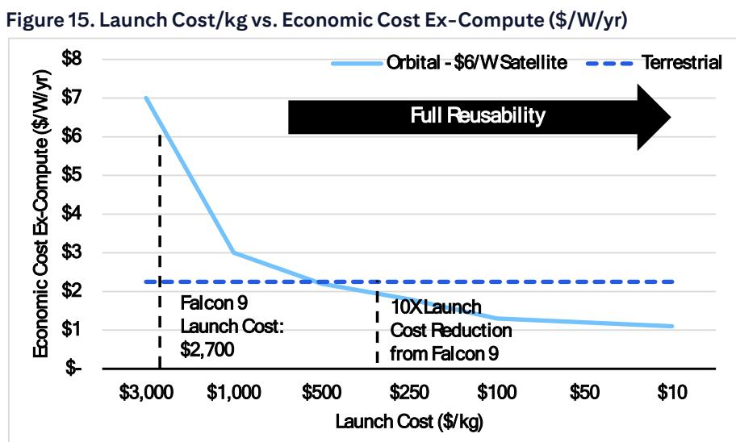
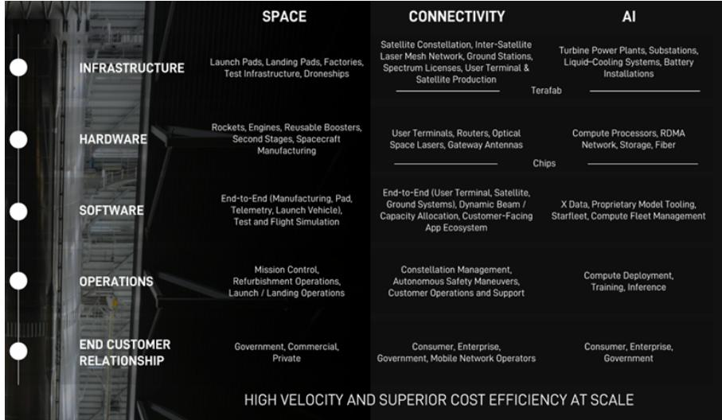
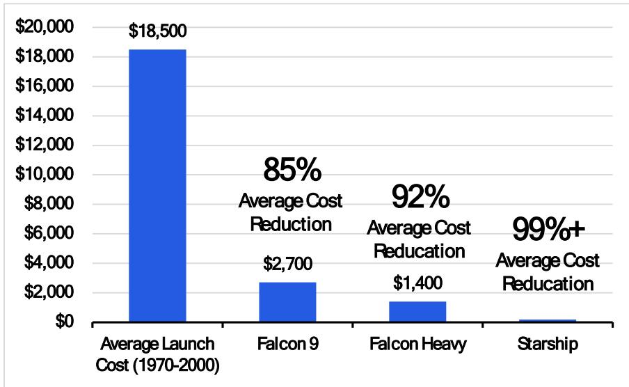

# Citi：被低估的第二曲线，Citi详解SpaceX的AI业务前景

当一家公司的长期估值框架敢于对标“万亿俱乐部”成员，而当前市值已超过2.1万亿美元时，市场真正需要回答的问题不是“它值不值”，而是“它的增长引擎能否以可验证的方式持续运转”。Citi在近期一份长达62页的深度报告中给出了明确判断：SpaceX正处于2-3年催化剂密集期，其核心优势不在于单一业务，而在于用极端垂直整合将发射成本降至无人能及的水平，从而打开连接和人工智能两个万亿级市场。

报告构建了一个清晰的逻辑链条：如果星舰（Starship）的关键工程里程碑在2026-2028年按计划实现，那么公司有能力在2031年实现约1万亿美元营收和约8300亿美元调整后EBITDA。报告将这个长期情景下的每股估值锚定在900美元以上。

## 1. 发射能力是护城河，但真正的变量是星舰的规模化节奏

Citi认为，SpaceX现有的猎鹰9号发射能力已经是市场领先，但真正的结构性优势在于星舰。报告特别强调了几个关键里程碑：2026年下半年星舰开始向轨道运送有效载荷，2026年底前实现用“筷子”捕获星舰第二级，以及2027年发射“数十次”、2028年“数百次”、2031年“数千次”的节奏目标。

这里需要关注的核心不是技术本身，而是成本曲线的陡峭程度。如果星舰实现完全快速复用——即助推器和飞船在24小时内重新飞行——那么每公斤入轨成本将降至现有水平的十分之一甚至更低。这不仅是发射业务的效率提升，更是整个空间基础设施商业模式的底层重构。

> **KC评论：** Citi的逻辑是，当入轨成本下降一个数量级，原本不宏观环境的空间业务（如大规模卫星星座、空间计算）就变成了可盈利的生意。报告中的里程碑清单值得仔细看，尤其是“星舰V4（约200吨载荷型号）的规模化运营”这一条，它直接决定了后续所有市场假设的可行性。

## 2. 连接业务：从宽带到端到端移动服务的跳跃

Starlink已经证明了低轨卫星宽带的市场需求，但Citi的视野更远。报告将连接业务分为三个层次：现有宽带和D2D（设备直连卫星）星座的扩张、全球端到端移动服务的整合、以及对传统无线和宽带市场的冲击。

关键数据点在于，Citi预计SpaceX的连接业务收入将从2025年的约187亿美元增长到2028年的超过1600亿美元。这种增长假设依赖于两个前提：一是更多国家批准Starlink提供宽带和D2D服务，二是Starlink V3卫星的部署。报告没有完全展开的是，各国监管审批的节奏和地缘政治不确定性可能成为最大的变量。

## 3. AI业务：被低估的第二增长曲线，但执行难度最高

这是Citi报告中最大胆的部分。报告将SpaceX的AI业务分为三个子领域：企业AI（包括Grok和Cursor）、轨道AI（在轨计算）、以及AI基础设施。其中，企业AI被视为短期内最可见的增长点，而轨道AI则是长期价值最大的方向。

报告特别提到，下一代Grok（包括Grok 5）在Blackwell集群上训练后，有望在2026年底前缩小与其他前沿模型提供商的差距。同时，Cursor的Composer 3模型发布可能进一步扩大其在AI编程市场的份额。这些判断的隐含假设是，SpaceX能够将发射成本优势转化为计算资源部署的规模优势——这在逻辑上成立，但在执行层面仍有许多未解问题。

> **KC评论：** Citi的AI估值框架值得关注，它把AI业务拆成了广告和基础设施两个子板块，分别用不同的可比公司进行估值。但报告也坦承，Grok“尚未以有意义的方式起飞”，Cursor的收购更多是战略价值而非短期财务贡献。这意味着AI业务在2027年前可能更多是估值故事，而非利润来源。

## 4. 报告尚未完全回答的关键问题：资本支出与自由现金流的缺口

Citi的财务模型显示，SpaceX的资本支出将从2025年的约206亿美元激增至2028年的约1859亿美元，而自由现金流在此期间始终为负，2028年预计为-866亿美元。这意味着公司需要在2026-2028年间持续大规模融资，报告假设的融资现金流（2028年约1197亿美元）能否以合理成本实现，是一个需要持续验证的不确定性。

另一个未完全展开的问题是，当公司同时推进发射、连接和AI三条战线时，管理层的注意力分配和工程资源的瓶颈如何解决。Citi引用公司自己的话——“他们非常擅长交付结果，但不总是准时”——这既是对过去经验的总结，也是对未来不确定性的一种预警。

对于关注这家公司的读者来说，Citi这份报告提供了一个难得的分析框架：它把发射、连接、AI三条业务线拆开估值，同时又将它们统一在“极端垂直整合”这个核心逻辑之下。真正需要持续跟踪的不是报价，而是星舰的发射频率、Starlink的监管进展、以及Grok和Cursor的产品迭代节奏。这些里程碑的兑现顺序和时间点，将决定900美元以上的长期估值是愿景还是现实。

For informational purposes only. Portions may be generated,translated,summarized,or edited with AI assistance based on source materials and may contain omissions or errors. Please verify independently. This is not investment,legal,tax,accounting,or other professional advice.

For informational purposes only. Portions may be generated,translated,summarized,or edited with AI assistance based on source materials and may contain omissions or errors. Please verify independently. This is not investment,legal,tax,accounting,or other professional advice.

