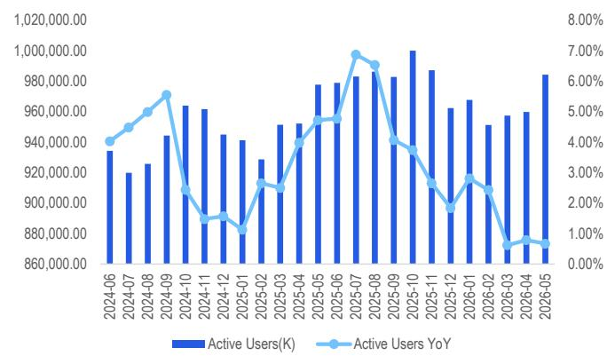
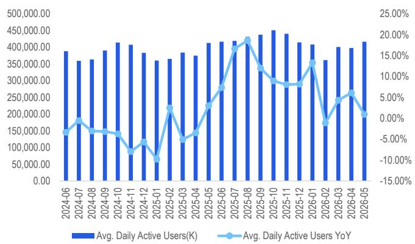
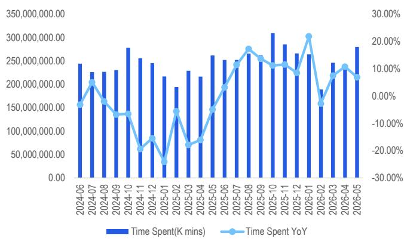
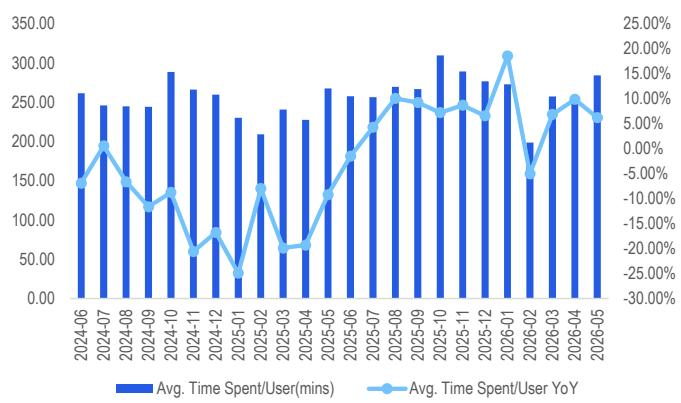

# Alibaba Group Holding (BABA/9988.HK)

## FY1Q27E Preview: Cloud Growth On Higher Margins Intact; CMR Soft

## CITI'S TAKE

On the back of retail sales data in April-May and the 6.18 promotional campaign, we estimate Taobao/Tmall GMV to show a low single-digit decline in the June Q. After factoring contra-revenues impact which could be magnified further this quarter amid 6.18 activities, we forecast CMR to decline by 8.7% yoy vs our expectation of +1% like-for-like growth. With more rational competition, we expect loss from Shangou to narrow and forecast China commerce EBITA to be flattish at Rmb38bn. Due to strong demand, we model Cloud revs to accelerate to 45% yoy with cloud margin improving to 11.5%. Into CY2H27, we expect a stable macro environment with counter-revs impact on CMR persisting for a few quarters while cloud revs to accelerate further and maintain high-level growth with low-teens % margin. Post-revision, our TP is adjusted to US\$192/HK\$191, reflecting lower multiple on AIDC and All Others. Maintain Buy on attractive valuation and AI play.

Estimates revision – For FY1Q27, we adjust revs/non-GAAP net profit by +0.8%/+8% reflecting lower CMR, offset by higher cloud and all other revs. Narrower quick commerce loss and improving cloud margins are likely to support higher yoy profit. For FY27-29E, we adjust our revs/non-GAAP profit by +0.9%/+5%, +0.5%/+6.2% and +0.2%/+6.2%.

FY1Q27E preview – We now model total consolidated revs at Rmb269.8bn (+8.9% YoY) and non-GAAP NP of Rmb27.1bn (10.1% margin) vs Bloomberg consensus of Rmb269.2bn/Rmb24.9bn. We model China Ecommerce Group revs to be Rmb136.9bn. Of which, we model CMR to decline 8.7% yoy to Rmb81.5bn and estimate quick commerce loss of ~Rmb10bn. We forecast cloud revs to rise +45% YoY to Rmb48.4bn and AIDC revs to be Rmb36.4bn (+4.9% YoY). We forecast consolidated adj. EBITA to decline -35.3% YoY to Rmb25.1bn or 9.3% margins and China ecommerce Group EBITA flattish at Rmb38bn or 27.8% margins. We now forecast cloud EBITA to be Rmb5.57bn or 11.5% margin. We model adj. EBITDA of Rmb37.5bn or 13.9% margins vs previous estimate of Rmb33.96bn or 12.7% margin.

Alicia Yap, CFA $^{AC}$ +852-2501-2773
alicia.yap@citi.com

Vicky Wei, CFA
vicky.wei@citi.com

Nelson Cheung
nelson.cheung@citi.com

Business update – Leadership changes at DingTalk, latest agent and cloud products, Shangou UE target, food delivery regulation, 6.18 recap.

<table><tr><td rowspan="2" colspan="6"></td><td rowspan="2" colspan="2">Rating</td><td rowspan="3">Short-Term View</td><td rowspan="2" colspan="2">Target Price</td><td rowspan="2" colspan="4"></td><td colspan="2">Current Fiscal Year</td><td colspan="2">Next Fiscal Year</td></tr><tr><td colspan="2">EPS</td><td colspan="2">EPS</td></tr><tr><td>Company</td><td>Ticker</td><td>Ccy</td><td>Price</td><td>Mkt Cap (M)</td><td>Date &amp; Time</td><td>Old</td><td>New</td><td>Old</td><td>New</td><td>ESPR (%)</td><td>Div Yld (%)</td><td>ETR (%)</td><td>Last Rpt Yr</td><td>Old</td><td>New</td><td>Old</td><td>New</td></tr><tr><td>Alibaba Group Hldg</td><td>9988.HK</td><td>HK$</td><td>107.50</td><td>2,064,679</td><td>08 Jul 16:10</td><td>1</td><td>nc</td><td>-</td><td>207.00</td><td>191.00</td><td>77.7</td><td>1.8</td><td>79.5</td><td>Mar-26</td><td>6.308</td><td>6.624</td><td>8.784</td><td>9.333</td></tr><tr><td>Alibaba Group Hldg</td><td>BABA</td><td>US$</td><td>98.14</td><td>235,613</td><td>07 Jul 16:00</td><td>1</td><td>nc</td><td>-</td><td>208.00</td><td>192.00</td><td>95.6</td><td>2.0</td><td>97.7</td><td>Mar-26</td><td>49.709</td><td>52.195</td><td>69.218</td><td>73.543</td></tr></table>

ESPR = Expected Share Price Return, ETR = Expected Total Return, nc = no change
^Catalyst Watch

Earnings Estimates

<table><tr><td colspan="4"></td><td colspan="4">Last Reported Year</td><td></td><td colspan="4">Current Fiscal Year</td><td></td><td colspan="4">Next Fiscal Year</td><td></td></tr><tr><td>Company Name</td><td>Ticker</td><td>Last Rpt Year</td><td>Currency</td><td>1Q</td><td>2Q</td><td>3Q</td><td>4Q</td><td>FY0</td><td>1Q</td><td>2Q</td><td>3Q</td><td>4Q</td><td>FY1</td><td>1Q</td><td>2Q</td><td>3Q</td><td>4Q</td><td>FY2</td></tr><tr><td>Alibaba Group Hldg</td><td>9988.HK</td><td>Mar-26</td><td>Rmb</td><td>1.844</td><td>0.545</td><td>0.886</td><td>0.107</td><td>3.350</td><td>1.430</td><td>1.448</td><td>2.140</td><td>1.608</td><td>6.624</td><td>-</td><td>-</td><td>-</td><td>-</td><td>9.333</td></tr><tr><td>Old</td><td></td><td>Mar-26</td><td>Rmb</td><td>1.844</td><td>0.545</td><td>0.886</td><td>0.107</td><td>3.350</td><td>1.324</td><td>1.391</td><td>2.086</td><td>1.508</td><td>6.308</td><td>-</td><td>-</td><td>-</td><td>-</td><td>8.784</td></tr><tr><td>Alibaba Group Hldg</td><td>BABA</td><td>Mar-26</td><td>Rmb</td><td>14.749</td><td>4.361</td><td>7.089</td><td>0.853</td><td>26.801</td><td>11.267</td><td>11.407</td><td>16.866</td><td>12.671</td><td>52.195</td><td>-</td><td>-</td><td>-</td><td>-</td><td>73.543</td></tr><tr><td>Old</td><td></td><td>Mar-26</td><td>Rmb</td><td>14.749</td><td>4.361</td><td>7.089</td><td>0.853</td><td>26.801</td><td>10.434</td><td>10.964</td><td>16.441</td><td>11.884</td><td>49.709</td><td>-</td><td>-</td><td>-</td><td>-</td><td>69.218</td></tr><tr><td colspan="19">Source: Citi</td></tr></table>

## Business Update & FY1Q27E Preview

## Leadership changes at Dingtalk & reorg of enterprise AI

According to local news report including Sohu dated June 11, Alibaba announced a management change where the founding leader of DingTalk, Chen Hang would step down as CEO of the business unit and hand over to Chen Yusen. Alibaba also announced DingTalk would move into a new development cycle fully embracing AI. According to the press report in Sohu, Chen Yusen began his career as a hacker and started his own business at 22 right after graduation; at 27, he sold the company he founded to Alibaba Cloud and is now taking over DingTalk. In 2025, he led the development of the AI Agent product MuleRun at Alibaba Cloud.

ThePaper.cn dated June 11 reported that in recent days, Alibaba has been continuously iterating its organizational and management changes, adopting a new formation amid the AI era. Earlier this year, Alibaba successively established new types of organizations such as Alibaba Token Hub (ATH) and Token Foundry to incubate AI innovations through small team structures. This has been followed by a series of innovations like Happy Horse, Happy Oyster, MuleRun, and Qoder emerging rapidly, along with a group of young technical talent distinguishing themselves.

Per another news article (36kr, dated July 3) Alibaba decided to reorganize and consolidate three of its enterprise-level AI Agent products with desktop AI agent tool “QoderWork” as its foundation and integrate the capabilities of “Wukong” (an enterprise collaboration agent incubated by DingTalk) and “MuleRun” (an agent execution engine developed by Chen Yusen and team). This could suggest an important turning point for Ali’s enterprise AI strategy to centralize internal resources and better compete with other desktop agents products like Bytedance’s Coze and Feishu Agent and Tencent’s WorkBuddy.

## AI and cloud computing update

## Launch of HappyHorse-1.1

On Jun 23, Alibaba officially released HappyHorse-1.1 which is available on HappyHorse website, Qwen Cloud and AliCloud Bailian platform.

Compared to 1.0 version, Alibaba stated that HappyHorse-1.1 features better dynamic vision, subject consistency, command instruction, visual quality and audio presentation. HappyHorse-1.1 further improves professional content creation quality, controllability and application efficiency. The 1.1 version also supports 9 reference inputs to video to maintain visual quality for merchandise, brands and characters.

As part of the promotion activity, HappyHorse-1.1 will offer limited sales at 40% discount at Rmb0.54 per second for 720p resolution (vs. standard price of Rmb0.9 per second) and Rmb0.72 per second for 1080p resolution (vs. standard price of Rmb1.2 per second).

According to Artificial Analysis leaderboard as of Jul 2, HappyHorse-1.1 ranked #2 in text to video model (with audio) following ByteDance's Dreamina Seedance 2.0 720p and ahead of its HappyHorse-1.0 version. In terms of image to video model (with audio), HappyHorse-1.1 also came in second following Dreamina Seedance 2.0 720p and ahead of grok-imagine-video-1.5-preview by xAI.

Alibaba Group Holding (9988.HK, BABA): Decoding Alibaba Cloud AI Full Stack & Introduce MaaS Revs Forecast

## Other business updates on AI and cloud computing

We list below some major business updates on AI and cloud computing by AliCloud during the calendar 2Q26:

On Jun 2, AliCloud launched Messages function on MuleRun, its autonomous AI workforce platform. The Messages function represents an enterprise-level AI collaboration instant messaging tool meant to facilitate communication between human employees and AI agents.

On Jun 8, MuleRun further launched Pages with a database function. Based on natural language input by users, users can generate front-end pages, backend access, and web-based applications. The Pages function also supports automatic database and format creation, data visualization and management and independent database isolation.

On Jun 11, AliCloud's Meoo (conversational AI development tool by Alibaba) released CLI features (command line interface). After installation, local AI coding assistants such as Claude Code, Codex, Cursor and deploy Meoo CLI for its capabilities such as database access, user registration, document storage and project releases.

On Jun 16, AliCloud upgraded its desktop AI assistant QoderWork with a ‘consciousness’ feature, covering memory, reflection and skills evolution. The new feature can store conversations, while at the same time automatically summarize and filter repeated messages to improve efficiency for high-frequency missions. Currently QoderWork offers functions including chat, design, presentation and writing platforms, and introduced other expert modules for product, legal, market sectors.

On Jun 17, AliCloud participated in SAP Sapphire conference in Madrid and SAP Now China summit to share latest partnership with SAP, including the launch of three products RISE with SAP (cloud migration for ERP), SAP AI Core (unified AI deployment and management platform) and SAP BDC (business data cloud) on AliCloud platform within 2026. Both companies will also release a new enterprise-level ERP+AI solution based on MuleRun AI Agent.

On Jun 17, AliCloud (Alizila, 18 Jun 26, link) announced the establishment of new data centers in Paris (France) – its third data center region in Europe, and in the Johor area which is its fifth data center in Malaysia. AliCloud also announced expansion of the data centers in Tokyo (Japan) with a fifth data center, and in Mexico with a second availability zone. After expansion, AliCloud will cover 32 regions with 105 availability zones. From a product perspective, AliCloud is scheduled to release a set of agentic AI products in Malaysia and Europe in 2H26, including one-stop agent development platform AgentRun, comprehensive maintenance platform STAROps and ACS Agent Sandbox. AliCloud's Bailian platform will also be available in Japan which opens for Qwen3.7-Plus, HappyHorse, Qwen3.5-Omni and other 3P models.

On Jun 18, AliCloud cited a recent IDC report on China AI software market 2H25 tracking which sized China's large model training and inference public cloud market at Rmb7.938bn in 2025. According to the IDC report, AliCloud was the leading player with $42.2\%$ market share in China large model training and inference public cloud market which grew by $116\%$ yoy, benefiting from high demand for large model training and GPU compute for AliCloud's AI platform PAI in intelligent driving, robotic AI and internet sectors. During the period, AliCloud also accelerated the training of Qwen3.5 MoE model by 3x.

Figure 1. AliCloud Qwen major milestones and achievements in 2026

<table><tr><td>Date</td><td>Event</td><td>Milestones</td></tr><tr><td>1-Apr-26</td><td>Product launch</td><td>Launch of Wan-2.7-Image as unified graphic generation and editing model</td></tr><tr><td>2-Apr-26</td><td>Product launch</td><td>Launch of Qwen3.6-Plus</td></tr><tr><td>10-Apr-26</td><td>Product launch</td><td>Launch of HappyHorse-1.0 as a video model</td></tr><tr><td>15-Apr-26</td><td>Product launch</td><td>Launch of Meoo as an AI development tool</td></tr><tr><td>17-Apr-26</td><td>Open source</td><td>Open-sourced Qwen3.6-35B-A3B</td></tr><tr><td>20-Apr-26</td><td>Product launch</td><td>Launch of Qwen3.6-Max-Preview</td></tr><tr><td>23-Apr-26</td><td>Open source</td><td>Open-sourced Qwen3.6-27B</td></tr><tr><td>23-Apr-26</td><td>Product launch</td><td>Launch of JVS Crew as an enterprise-level agent platform</td></tr><tr><td>30-Apr-26</td><td>Product launch</td><td>Launch of QoderWake as a digital employee and mobile Qoder</td></tr><tr><td>14-May-26</td><td>Product launch</td><td>Launch of Wanxiaozhi 2.0 as an enterprise-level AI website building platform</td></tr><tr><td>15-May-26</td><td>Product launch</td><td>Launch of Qoder 1.0</td></tr><tr><td>20-May-26</td><td>Product launch</td><td>Launch of Qwen3.7-Max</td></tr><tr><td>20-May-26</td><td>Product launch</td><td>Launch of WonderClip as a full-chain AI video creation platform</td></tr><tr><td>1-Jun-26</td><td>Product launch</td><td>Launch of Qwen3.7-Plus</td></tr><tr><td>2-Jun-26</td><td>Product launch</td><td>Launch of MuleRun Messages</td></tr><tr><td>8-Jun-26</td><td>Product launch</td><td>Launch of MuleRun Pages</td></tr><tr><td>11-Jun-26</td><td>Product launch</td><td>Launch of Meoo CLI</td></tr><tr><td>23-Jun-26</td><td>Product launch</td><td>Launch of HappyHorse-1.1</td></tr></table>

© 2026 Citi Inc. No redistribution without Citi's written permission.  
Source: Company Reports, Citi

## Regulatory guidance on food delivery platforms

According to Sina News dated Jul 1 (link), the Beijing Municipal Market Supervision Administration established a formal multi-party dialogue mechanism bringing Meituan, Taobao Shangou, and JD together with restaurant operators, industry associations, workers, consumers, legislators, and policy experts. The goal was to build a permanent channel for negotiation and co-governance across the platform economy, starting with the food delivery and restaurant sector. Platforms have been competing through heavy subsidies, ultra-low pricing, and speed-driven delivery – practices that can squeeze merchant margins, put pressure on delivery riders, and arguably erode long-term health of the ecosystem.

According to the Sina News report, the three platforms agreed to specific business changes across the following five areas:

\- On subsidies, they committed to capping large-scale discounting and setting reasonable per-order discount limits so that promotional spending becomes more targeted.

\- On fees, they agreed to offer rebates and rate discounts to high-quality restaurant merchants, shifting incentives away from pure volume toward quality.

\- On marketing, they committed to ensuring promotional content is truthful and to discourage traffic strategies built solely on hyper competitive pricing, while also reminding merchants to participate in campaigns with realistic expectations.

\- On merchant support, platforms agreed to provide funding and equipment to restaurants adopting transparent kitchen practices, alongside traffic incentives.

\- On delivery management, all three platforms committed to end minute-level speed racing practice of pushing riders to deliver faster and to set reasonable preparation and delivery time windows instead.

## Integration of Shangou, Freshippo & senior reporting update

On June 2, Sina news reported citing TechWeb that Alibaba Group CTO Wu Zeming has joined the Alibaba Partnership, and Hema (Freshippo) CEO Yan Xiaolei is now reporting directly to Alibaba's commerce sector head, Jiang Fan. Wu Zeming's promotion to Alibaba Partnership follows Shangou's aggressive push into food delivery last year.

## Taobao Shangou target in FY2027

On Jun 7, Sina News reported citing 36Kr (see link) that Taobao Shangou held a senior leadership meeting ahead of the Labor Day holiday to set its growth agenda for the coming year. For fiscal year 2027 (April 2026 to March 2027), the business reportedly has two core targets: 1) stabilize its market share in food delivery while achieving unit economics breakeven on a monthly basis within the fiscal year; and 2) accelerate its retail business by scaling "Taobao Convenience Store", Freshippo's front-warehouse model, and converting Tmall Supermarket and Tmall brand orders from long-distance fulfillment to local instant delivery, driving up both order volume and GMV on the retail side. According to 36Kr, Taobao Shangou is currently processing around 60 million orders per day on average, a figure that includes Tmall Supermarket's four-hour delivery orders and Freshippo. While that represents a 30% to 40% decline from the peak volumes seen during last summer's subsidy campaign, the number has since stabilized, suggesting the business has likely found a natural demand floor after pulling back on promotional spending.

Taobao Shangou is aggressively expanding its retail footprint, with its network of third-party instant fulfillment warehouses now exceeding 20,000 locations nationwide. To raise the quality of that network, the company has launched "Taobao Convenience Store", a program that upgrades select warehouses into higher-standard retail hubs, seeded with up to 10,000 SKUs sourced from Taobao, Tmall, and 1688, spanning categories including general merchandise, snacks, beverages, consumer electronics, mother and baby products, and cosmetics. For the new fiscal year, Taobao Shangou has identified four retail categories as its primary focus areas: general daily goods, beauty and cosmetics, alcohol and beverages, and medical devices and equipment.

## AliExpress launched Platform Delivery service

As reported by DoNews (dated 13 Jun, link), AliExpress launched its official local delivery service, "Platform Delivery (平台配服务)," simultaneously across five markets: the United States, Poland, France, Spain, and Mexico, covering Europe, North America, and Latin America in a single rollout. Merchants using the service can ship and deliver locally, cutting average fulfillment time from five days to three. Pricing is reportedly set 10% to 20% below market rates, and the service comes with six operational benefits: exemption from penalties for pickup and delivery delays, non-receipt complaints excluded from performance metrics, automated dispute evidence filing, boosted search ranking, priority placement during major sales events, and early payment release.

Since the soft launch in May 2026, merchants using the service doubled their order volumes during the 6.18 shopping festival, while non-receipt complaint rates dropped 60%, according to the DoNews report. On the first day of 6.18, local warehouse orders in Spain, France, and Poland each crossed 50% of total orders

for the first time overtaking cross-border direct shipments. That is a meaningful threshold, suggesting local fulfillment has moved from a supplementary option to the dominant channel in those markets.

The EU has eliminated its €150 customs duty exemption and added clearance handling fees, while the US and other major markets have tightened low-value parcel tax policies. We believe the platform delivery service should help shorten delivery rate and improve customer satisfaction.

## 6.18 promotions: low-profile marketing this year

As we noted in our 6.18 promotion wrap report (China Internet - 2026 6.18 Preliminary Wrap On BABA, JD & Douyin Metrics), compared to heavy subsidies on Taobao Shangou in 2025 6.18, this year Alibaba has significantly scaled back subsidies on Taobao Shangou. In contrast, this year Tmall invested in brand ads in multiple long-drama including Family Business, The First Jasmine, Zhan Zhao Adventures and Ashes to Crown. Major ads were in the form of pre-streaming ads, ad placements and creative ads.

Tmall also adjusted its celebrity campaign this year by inviting brand endorsement which participated in 2026 6.18 instead of directly sponsoring its own endorsement like last year.

Taobao & Tmall also invited celebrities from popular variety shows Ride the Wind 2026 as its major endorsement. During its official endorsed live-streaming session on Tmall on May 27, the live-streaming session had generated Rmb20mn GMV with over 1mn viewership and over 35mn interactions. These celebrities also participated in world cup showcase on Tmall on Jun 11 that drove meaningful traffic growth on Tmall platform.

## Category performance

According to a third-party tracking All View Cloud (AVC) (link), there was a sequential GMV and order volume growth on Tmall by product categories:

■ 3C: Tmall saw faster sequential growth for mouse and keyboards in terms of sequential GMV and order volume growth. This compares to relatively flattish volume growth for smart watch, sound bar and portable chargers. A flat sequential growth for wireless earphone vs. 7.5% sequential volume growth likely indicate a larger promotional effort during 6.18 period.

Home living: major home living categories saw single digit to teens % sequential decline in order volume and GMV including mattress, blanket, pillow and illumination devices. Intelligent switch is the only category covered AVC that saw mid-single digit growth in sales volume and GMV on Tmall.

■ Outdoor: major categories including bikes, treadmill, spinning also saw decline in sales volume and GMV on Tmall in week of Jun 8-14, while the magnitude of decline in GMV was smaller for bikes and treadmill compared to its order volume decline.

© 2026 Citi Inc. No redistribution without Citi's written permission.
Source: Citi, NBS

Figure 2. Sequential GMV and sales volume growth on Tmall by categories in week of Jun 8-14

<table><tr><td colspan="3">3C</td><td colspan="3">Home living</td><td colspan="3">Outdoor</td></tr><tr><td>Sub-categories</td><td>GMV</td><td>Volume</td><td>Sub-categories</td><td>GMV</td><td>Volume</td><td>Sub-categories</td><td>GMV</td><td>Volume</td></tr><tr><td>Wireless earphone</td><td>-0.1%</td><td>7.5%</td><td>Mattress</td><td>-1.5%</td><td>-5.3%</td><td>Bicycles</td><td>-12.6%</td><td>-16.7%</td></tr><tr><td>Smart watch</td><td>3.7%</td><td>-0.2%</td><td>Blanket</td><td>-22.9%</td><td>-22.3%</td><td>Treadmill</td><td>-2.4%</td><td>-5.0%</td></tr><tr><td>Sound bar</td><td>-5.5%</td><td>-0.7%</td><td>Ceiling light</td><td>-8.8%</td><td>-3.0%</td><td>Spinning</td><td>-4.2%</td><td>-3.9%</td></tr><tr><td>Portable charger</td><td>-0.8%</td><td>-0.3%</td><td>Pillow</td><td>-8.5%</td><td>-7.9%</td><td>Massage chair</td><td>-1.7%</td><td>-0.1%</td></tr><tr><td>Mouse</td><td>14.8%</td><td>7.7%</td><td>Eye-friendly lamp</td><td>-14.1%</td><td>-15.0%</td><td rowspan="4" colspan="3"></td></tr><tr><td>Keyboard</td><td>16.6%</td><td>21.8%</td><td>Shower head</td><td>-4.0%</td><td>-16.0%</td></tr><tr><td rowspan="2" colspan="3"></td><td>Bathroom heater</td><td>0.5%</td><td>-1.7%</td></tr><tr><td>Intelligent switch</td><td>6.3%</td><td>6.6%</td></tr></table>

© 2026 Citi Inc. No redistribution without Citi's written permission.
Source: All View Cloud, Citi

## May' 26 NBS data

Excl. auto (which was -16.1% YoY), total retail sales in May would have increased +1.1% YoY vs +1.8% in April '26. By category, beverage, tobacco & alcohol and apparel +6.1%, +4.8%, and +3.8% YoY, while automobiles, home appliances and decoration materials -16.1%, -15.6% and -13.6% YoY. For YTD May'26 online product sales, food, apparel, and general goods categories grew by +15.5%, +7.2% and +1.6% YoY, vs. 15.6%, +6.8% and +2.6% YoY growth for Apr'26.

We view the +2.6% online product sales growth in May'26, and +3.4% yoy total online retail sales growth as moderate in absolute terms though in line with expectations given a muted 6.18 promotions (0.2%/2.3% growth in Apr'26 data). By category, 1) apparel sales slightly accelerated to +3.8% YoY in May'26 vs +3.6% in Apr'26; 2) home appliances continued to be moderate at -15.6% YoY in May, vs -15.1% YoY in Apr'26, while communication tools slowed to +0.7% YoY in May, vs +6.2% YoY in Apr'26; 3) for cosmetics, growth also moderated to +2.5% YoY in May, decelerating from +4.7% YoY in Apr'26.

Figure 3. YTD yoy growth % of physical goods, food, apparel and appliances

<table><tr><td rowspan="2">YTD yoy growth % of</td><td colspan="7">2025</td><td colspan="4">2026</td></tr><tr><td>Jun</td><td>Jul</td><td>Aug</td><td>Sep</td><td>Oct</td><td>Nov</td><td>Dec</td><td>Jan &amp; Feb</td><td>Mar</td><td>Apr</td><td>May</td></tr><tr><td>Physical goods</td><td>6.0%</td><td>6.3%</td><td>6.4%</td><td>6.5%</td><td>6.3%</td><td>5.7%</td><td>5.2%</td><td>10.3%</td><td>7.5%</td><td>5.7%</td><td>5.0%</td></tr><tr><td>Food</td><td>15.7%</td><td>14.7%</td><td>15.0%</td><td>15.1%</td><td>15.1%</td><td>14.9%</td><td>14.5%</td><td>20.7%</td><td>17.2%</td><td>15.6%</td><td>15.5%</td></tr><tr><td>Apparel</td><td>1.4%</td><td>1.7%</td><td>2.4%</td><td>2.8%</td><td>3.6%</td><td>3.5%</td><td>1.9%</td><td>18.0%</td><td>11.6%</td><td>6.8%</td><td>7.2%</td></tr><tr><td>Appliances</td><td>5.3%</td><td>5.8%</td><td>5.7%</td><td>5.7%</td><td>5.1%</td><td>4.4%</td><td>4.1%</td><td>4.7%</td><td>3.6%</td><td>2.6%</td><td>1.6%</td></tr></table>

## QM updates of Taobao app

As of May 2026, Taobao MAU was 984mn, +1% yoy, and DAU was 417mn, +1% yoy. Time spent was 280mn, +7% yoy, and average time spent per MAU was 284mins, +6% yoy, per Questmobile.

Figure 4. Taobao MAU  
  
Source: Questmobile, Citi  
© 2026 Citi Inc. No redistribution without Citi's written permission.

Figure 5. Taobao DAU  
  
Source: Questmobile, Citi  
© 2026 Citi Inc. No redistribution without Citi's written permission.

Figure 6. Taobao app time spent  
  
© 2026 Citi Inc. No redistribution without Citi's written permission.  
Source: Questmobile, Citi

Figure 7. Taobao app average time spent per MAU  
  
© 2026 Citi Inc. No redistribution without Citi's written permission.  
Source: Questmobile, Citi

## Earnings revisions

For FY1Q27, we adjust revs/non-GAAP net profit by +0.8%/+8% reflecting lower CMR offset by higher cloud and all other revs. Excluding the negative drag from quick commerce, we estimate China commerce EBITA to decline at mid-single digit % yoy reflecting on-going investment in user experience and 88VIP, nevertheless, we expect quick commerce loss to further scale back qoq and forecast roughly flattish outcome at Rmb10bn and improving cloud margins to support improved profit. For FY27-28E, we adjust our revs/non-GAAP profit by +0.9%/+5%, +0.5%/+6.2% and +0.2%/+6.2%.

Figure 8. Earnings revisions

<table><tr><td></td><td colspan="3">Net revenues (Rmb mn)</td><td colspan="3">Non-GAAP Net Profit (Rmb mn)</td><td colspan="3">Non-GAAP Diluted EPADS (Rmb)</td></tr><tr><td>Rmb (mn except per share data)</td><td>Old</td><td>New</td><td>
