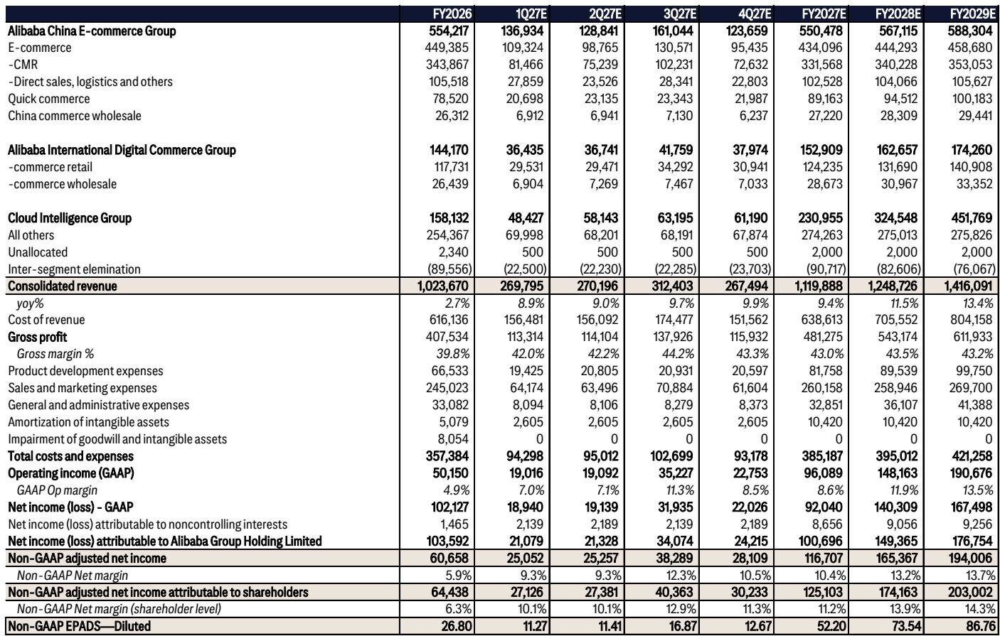
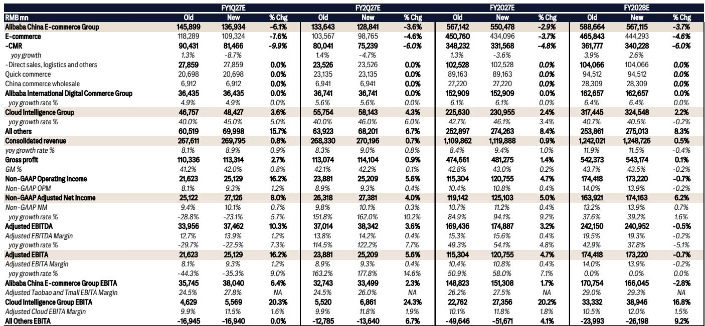
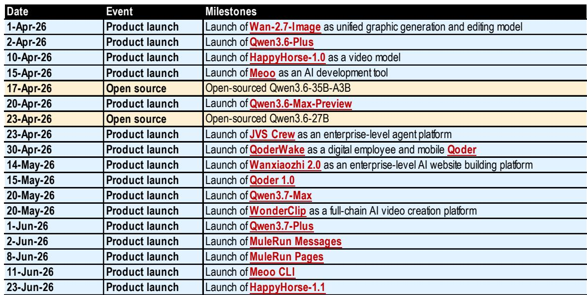

# Alibaba’s Cloud Business Is Now the Story, But Its Core Commerce Problem Has Not Yet Been Solved

Alibaba enters its fiscal first quarter of 2027 at an unusual inflection point. The company’s cloud computing business is accelerating sharply, margins are improving, and the narrative around artificial intelligence is gaining real commercial traction. Yet at the same time, the company’s core commerce operation—still the largest profit engine—is facing a structural headwind that no amount of AI excitement can immediately fix. This tension between a rising high-growth business and a softening core is the central strategic question for observers today.

The current quarter illustrates the trade-off with unusual clarity. According to a recent research report, Alibaba’s total consolidated revenue is expected to grow nearly 9% year-over-year, but the composition of that growth is shifting in ways that matter. Cloud revenue is projected to accelerate to 45% year-over-year growth, with margins improving to 11.5%. Meanwhile, customer management revenue, the primary monetization mechanism for Taobao and Tmall, is forecast to decline by nearly 9% year-over-year. The gap between these two trajectories is not just a quarterly anomaly. It reflects a deeper structural shift in how Alibaba generates value.

The timing matters because the market is currently pricing Alibaba largely as an AI and cloud story. The valuation multiple has expanded on the back of cloud acceleration, AI product launches, and the broader re-rating of Chinese technology stocks. But the commerce business still contributes the overwhelming majority of profit. If that profit engine continues to soften, the cloud business will need to grow much faster and at much higher margins to compensate. The math is not yet settled.

This article examines the key dynamics at play in Alibaba’s current quarter, identifies the unresolved questions that the report leaves open, and provides a decision framework for those trying to assess whether the cloud story can outrun the commerce headwind.

## The Cloud Acceleration Is Real and Structurally Supported, But Margin Trajectory Remains the Critical Unknown

Cloud revenue growth of 45% year-over-year is not a one-quarter phenomenon driven by easy comparisons. The report details a sustained product cycle that includes the launch of HappyHorse-1.1 for video generation, the expansion of the MuleRun autonomous AI workforce platform, the introduction of QoderWork with a “consciousness” feature, and the global expansion of data centers into Paris, Johor, Tokyo, and Mexico. Alibaba Cloud now covers 32 regions with 105 availability zones. This is a business that is investing aggressively and winning share.

The market share data reinforces the point. Alibaba Cloud held a 42.2% share of China’s large model training and inference public cloud market in the second half of 2025, according to an IDC report cited in the analysis. That market grew 116% year-over-year. Alibaba is the dominant player in the fastest-growing segment of Chinese cloud computing. The product pipeline suggests this position is sustainable, with new agentic AI products scheduled for release in Malaysia and Europe in the second half of 2026.

Yet the margin question is more subtle. The report forecasts cloud EBITA margin at 11.5% for the June quarter, up from prior estimates. That is an improvement, but it is still well below the margins that hyperscale cloud businesses in mature markets have achieved. The question is whether 11.5% is a ceiling or a floor. The report does not provide a clear answer, and the reason is structural. Alibaba Cloud is simultaneously investing in data center expansion, AI model development, and enterprise agent platforms. These investments are necessary to sustain growth, but they also suppress margins. The bull case is that as AI workloads scale, utilization rates improve and margins expand. The bear case is that the competitive intensity from ByteDance, Tencent, and others will keep pricing pressure high.

What the report makes clear is that cloud margins are improving, but the pace of improvement will determine whether the cloud business can become a meaningful profit contributor within the next two to three years. Observers should watch not just the revenue growth rate but the incremental margin on each additional dollar of cloud revenue.

## Commerce Revenue Is Under Pressure From Structural Forces That Will Not Resolve Quickly

The softness in customer management revenue is the most important risk in the current setup. The report forecasts CMR to decline 8.7% year-over-year, even as Taobao and Tmall gross merchandise volume is estimated to grow only in the low single digits. The gap between GMV growth and CMR growth is explained by contra-revenue impacts—the fees, rebates, and subsidies that Alibaba provides to merchants, particularly during promotional periods like the 6.18 shopping festival.

This is not a new phenomenon, but it is intensifying. The report notes that contra-revenue impacts are expected to be magnified in the June quarter because of 6.18 activities. The implication is that Alibaba is spending more to retain merchants and stimulate transaction volume, and that spending is directly reducing reported revenue. The core problem is that Alibaba’s commerce ecosystem faces competition not just from other platforms but from a broader shift in consumer behavior toward value-seeking and discount-oriented shopping.

The report also flags regulatory developments that could further constrain commerce profitability. The Beijing Municipal Market Supervision Administration has established a formal multi-party dialogue mechanism involving Meituan, Taobao Shangou, and JD.com, focused on food delivery and restaurant sector practices. Platforms have agreed to cap large-scale discounting, offer fee rebates to high-quality merchants, and end minute-level speed racing in delivery. These commitments are positive for ecosystem health over the long term, but they also limit the ability of platforms to use aggressive subsidies as a competitive weapon. For Alibaba’s quick commerce business, Shangou, this means the path to profitability may be longer than previously expected.

The report estimates Shangou losses at approximately RMB 10 billion in the June quarter. That is a substantial drag on overall profitability. The business is processing around 60 million orders per day, down 30-40% from peak levels during last summer’s subsidy campaign. The stabilization in order volume suggests a natural demand floor, but the unit economics are not yet positive. Shangou’s stated target is to achieve monthly unit economics breakeven within fiscal year 2027. That is an ambitious goal, and the regulatory framework may make it harder to achieve through pricing alone.

## The Enterprise AI Reorganization Signals a Strategic Pivot That Could Reshape Alibaba’s Competitive Position

One of the most interesting developments in the report is the reorganization of Alibaba’s enterprise AI strategy. The company has consolidated three enterprise-level AI agent products—QoderWork, Wukong, and MuleRun—into a single platform under QoderWork. This follows the leadership change at DingTalk, where founding CEO Chen Hang stepped down and was replaced by Chen Yusen, the developer of MuleRun.

This is not a routine management change. It signals that Alibaba is centralizing its enterprise AI resources to compete more effectively with products like ByteDance’s Coze and Feishu Agent, and Tencent’s WorkBuddy. The report notes that Alibaba has also established new organizational structures such as Alibaba Token Hub and Token Foundry to incubate AI innovations through small team structures. The result has been a series of rapid product launches including Happy Horse, Happy Oyster, MuleRun, and Qoder.

The strategic logic is clear. Alibaba is trying to build an enterprise AI ecosystem that integrates communication, workflow automation, and AI agent capabilities. The consolidation under QoderWork suggests that the company sees the desktop AI agent as the primary interface for enterprise users, rather than a standalone collaboration tool like DingTalk. This is a bet on a specific product architecture, and it carries execution risk. The enterprise AI market is still early, and no single platform has achieved dominant market share. Alibaba has the advantage of its cloud infrastructure and existing enterprise customer base, but it is competing against well-funded and technically capable rivals.

What the report does not fully address is how this enterprise AI strategy will monetize. Will it drive incremental cloud consumption, generate standalone software revenue, or serve primarily as a defensive moat to retain enterprise customers? The answer will determine whether this reorganization is a cost center or a profit driver.

## What the Report Does Not Fully Answer: The Sustainability of Cloud Growth and the Path to Commerce Stabilization

Every research report has analytical limits, and this one is no exception. There are two questions that the report raises but does not fully resolve.

First, how sustainable is the cloud revenue acceleration? The 45% growth rate is impressive, but it is partly driven by AI training workloads that may be lumpy. The report cites strong demand from intelligent driving, robotics, and internet sectors, but it does not provide visibility into the pipeline of recurring inference workloads versus one-time training projects. Inference workloads tend to be more stable and higher-margin over time, but they also require a different product mix. If the current growth is disproportionately driven by training, the trajectory could moderate as customers optimize their models and shift to inference.

Second, what is the realistic timeline for commerce stabilization? The report suggests that contra-revenue impacts will persist for several quarters, but it does not model a scenario in which CMR returns to positive growth. The underlying assumption is that Alibaba will continue to invest in merchant incentives to defend market share. But at some point, the trade-off between GMV growth and revenue growth becomes unsustainable. The report does not specify the conditions under which Alibaba would shift strategy—whether that means accepting lower GMV in exchange for higher monetization, or finding new sources of commerce revenue beyond CMR.

These are not criticisms of the analysis. They are the natural open questions that arise from a thoughtful reading of the data. Those who want to make a fully informed decision will need to form their own views on these questions.

## A Decision Framework: Three Scenarios and the Key Metrics to Watch

The report provides enough data to construct a simple decision framework. Observers should evaluate Alibaba based on three scenarios, each with different implications.

Scenario one is that cloud growth sustains above 30% for the next four to six quarters while margins gradually expand toward 15%. In this scenario, commerce revenue stabilizes with CMR returning to low single-digit growth within two quarters. The cloud business becomes a meaningful profit contributor, and the company re-rates upward as the earnings mix shifts toward higher-growth, higher-margin revenue. This is the bull case, and it requires both cloud execution and commerce stabilization.

Scenario two is that cloud growth moderates to the 20-25% range as AI training demand normalizes, but margins improve faster than expected because of scale efficiencies. Commerce revenue remains under pressure, with CMR declining or flat for the next three to four quarters. The company trades in a range as the market waits for commerce to stabilize. This is the base case, and it implies that Alibaba is fairly valued at current levels.

Scenario three is that cloud growth slows to below 20% as competitive intensity from ByteDance and Tencent increases, and margins remain below 10% because of ongoing investment. Commerce revenue continues to decline as contra-revenue impacts persist and market share erodes. In this scenario, the company re-rates downward as the market reprices Alibaba as a mature commerce company with a capital-intensive cloud business. This is the bear case.

The key metrics to watch are cloud revenue growth rate, cloud EBITA margin, CMR growth rate, and Shangou loss trajectory. The report provides estimates for the current quarter, but the trend over the next two quarters will be more important than any single data point.

## The Unresolved Analytical Questions Are Themselves the Thesis

The most valuable research reports do not provide all the answers. They frame the right questions and give readers the tools to answer them. This report does exactly that.

The central question for Alibaba is whether the cloud and AI business can grow fast enough and profitably enough to offset the structural headwinds in commerce. The report provides strong evidence that cloud growth is real and accelerating, but it also shows that commerce headwinds are intensifying. The tension between these two forces is the thesis.

Those who want to go deeper should examine the original charts and data that underpin this analysis. The report includes detailed estimates for each business segment, margin projections, and competitive positioning data that are not fully captured in this article. The full report also contains the specific assumptions behind the revenue and profit forecasts, which are essential for stress-testing the bull and bear cases.

*For informational purposes only. Portions may be generated, translated, summarized, or edited with AI assistance based on source materials and may contain omissions or errors. Please verify independently. This is not professional advice.*

For informational purposes only. Portions may be generated, translated, summarized, or edited with AI assistance based on source materials and may contain omissions or errors. Please verify independently. This is not professional advice.

